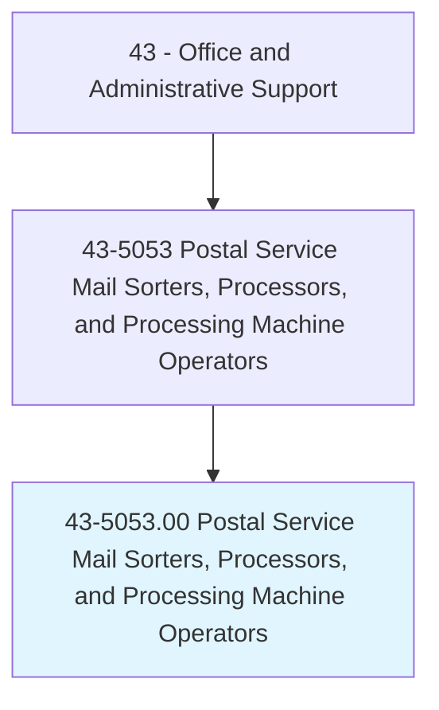
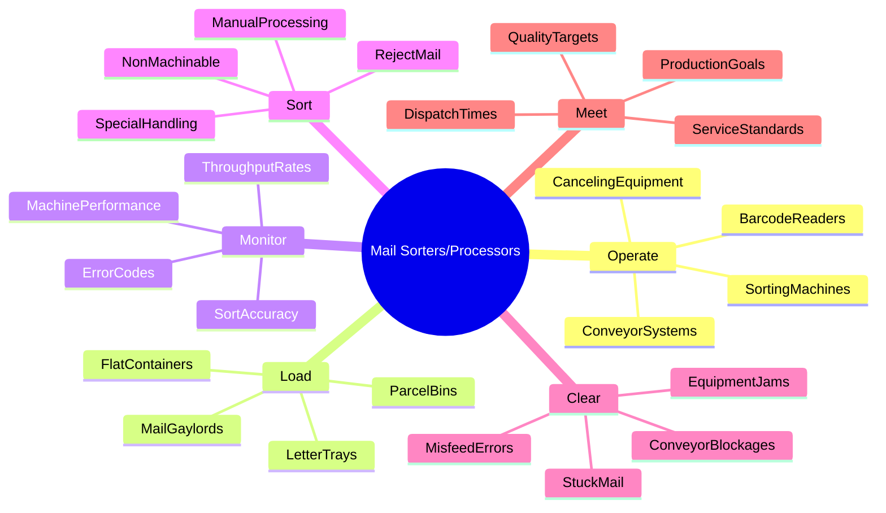
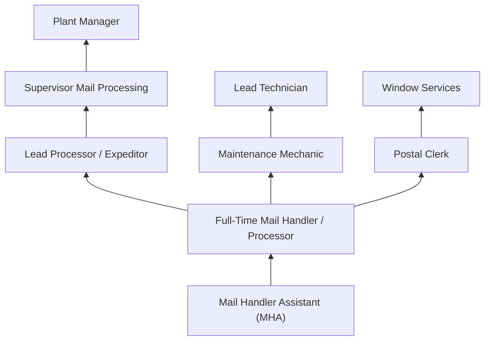
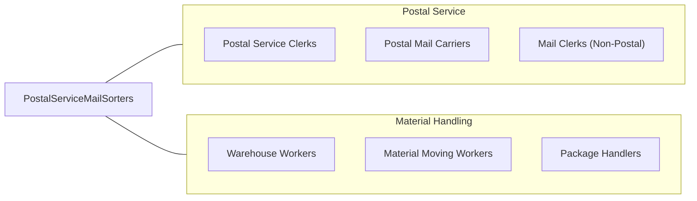

# Postal Service Mail Sorters, Processors, and Processing Machine Operators

> Prepare incoming and outgoing mail for distribution at USPS mail processing plants. Operate mail processing, sorting, and canceling machines. Load, operate, and occasionally adjust automated letter and flat sorting machines.

## Overview

Postal Service Mail Sorters and Processing Machine Operators work in USPS mail processing plants and distribution centers, operating automated sorting equipment that processes millions of pieces of mail daily. They load letters and flats onto sorting machines, monitor equipment operation, clear jams, manually sort items that machines cannot process, and ensure mail meets processing deadlines for timely delivery.

These workers typically work in large processing facilities during evening, night, and early morning shifts, as mail processing operates around the clock to meet next-day delivery standards. They handle letters, flats (large envelopes and magazines), parcels, and packages, using advanced optical character recognition (OCR) and barcode sorting technology.

The occupation has declined as automation has increased processing speed and reduced the labor needed per piece of mail, while overall mail volume has also decreased. However, the growth in package processing has created new demands for parcel sorting and handling operations. The USPS continues to modernize its network with next-generation sorting equipment that requires operators to adapt to new technologies while maintaining the high-speed processing pace essential to postal operations.

## Classification Hierarchy

## Key Statistics

| Metric | Value |
|--------|-------|
| SOC Code | 43-5053.00 |
| Job Zone | 1 (Little or No Preparation) |
| Category | [Office and Administrative Support](/occupations/Administrative/index) |
| Median Annual Salary | $50,800 |
| Employment | ~100,000 |
| Projected Growth | -12% (declining) |
| Core Tasks | 20 |
| Source | O*NET |

## Core Tasks

### operate.SortingEquipment

Mail Sorters operate high-speed automated equipment to process letters, flats, and packages.

**Actions:**
- `operate.DBCS.for.LetterSorting` - Run Delivery Barcode Sorter for letter mail
- `operate.AFCS.to.cancel.Stamps` - Process mail through Advanced Facer Canceler System
- `operate.AFSM.for.FlatsSorting` - Sort large envelopes and magazines on Automated Flats Sorting Machine
- `operate.FSS.to.sequence.Mail` - Use Flats Sequencing System for carrier route order
- `operate.APPS.for.ParcelProcessing` - Process packages through Automated Package Processing System
- `operate.SPSS.for.SmallParcels` - Sort small packages through Small Parcel Sorting System

### load.MailContainers

Mail Sorters prepare and load mail into processing equipment for automated sorting.

**Actions:**
- `load.LetterTrays.onto.Feeders` - Place letter mail into machine input mechanisms
- `load.FlatTubs.into.AFSM` - Feed flats containers into sorting machines
- `stage.Gaylords.for.Processing` - Position large mail containers for machine access
- `prepare.MailVolume.for.Induction` - Orient and align mail for machine feeding
- `transfer.SortedMail.to.Containers` - Move processed mail to output receptacles
- `label.Containers.with.DestinationTags` - Apply routing labels to outbound mail containers

### monitor.MachinePerformance

Mail Sorters continuously observe equipment operation to maintain productivity and quality.

**Actions:**
- `monitor.ThroughputRates.during.Operations` - Track pieces processed per hour
- `watch.ErrorDisplays.for.Malfunctions` - Observe control panels for error codes
- `verify.SortAccuracy.through.Sampling` - Check that mail routes to correct destinations
- `track.RejectRates.for.QualityIssues` - Monitor percentage of mail requiring manual handling
- `observe.FeedMechanisms.for.Jams` - Watch input areas for feeding problems
- `report.EquipmentIssues.to.Maintenance` - Document problems requiring technician attention

### sort.NonMachinableMail

Mail Sorters manually process items that automated equipment cannot handle.

**Actions:**
- `sort.RejectMail.by.Destination` - Manually route items rejected by machines
- `process.NonMachinablePieces.by.Hand` - Handle oddly shaped or damaged mail
- `key.RemoteAddresses.for.OCR` - Enter addresses for items machines cannot read
- `verify.AddressCorrectness.on.Rejects` - Check addresses on problem mail
- `redirect.UndeliverableAsAddressed.mail` - Process mail with address issues
- `handle.SpecialServices.mail.separately` - Process registered, certified, and priority items

### clear.EquipmentJams

Mail Sorters quickly resolve machine stoppages to maintain production flow.

**Actions:**
- `clear.PaperJams.from.Feeders` - Remove stuck mail from input mechanisms
- `extract.MisfedPieces.from.Transport` - Retrieve mail caught in conveyor paths
- `reset.MachineErrors.after.Clearing` - Restart equipment following jam resolution
- `inspect.Mail.for.Damage.afterJam` - Check cleared items for processing damage
- `document.JamFrequency.for.Maintenance` - Report recurring equipment problems
- `minimize.Downtime.through.QuickClearing` - Resolve issues rapidly to meet dispatch

### meet.ProductionDeadlines

Mail Sorters work to ensure mail meets dispatch times for timely delivery.

**Actions:**
- `prioritize.Work.based.on.DispatchSchedule` - Process mail in deadline order
- `coordinate.with.Expeditors.on.Priorities` - Work with leads on production sequencing
- `accelerate.Processing.for.DelayedMail` - Speed up work when behind schedule
- `communicate.Delays.to.Supervisors` - Report issues affecting dispatch times
- `maintain.Pace.throughout.Shift` - Sustain consistent production rate
- `complete.AllMail.before.TruckDeparture` - Finish processing before transportation cutoffs

## Skills & Competencies

### Technical Skills
- **Mail Sorting Machine Operation** - Advanced (DBCS, AFCS, AFSM, FSS, APPS)
- **OCR/Barcode Systems** - Intermediate (Intelligent Mail barcode, address recognition)
- **Manual Sorting** - Advanced (scheme knowledge, case sorting, sequencing)
- **Equipment Troubleshooting** - Intermediate (jam clearing, basic diagnostics)
- **Mail Classification** - Advanced (classes, services, mailability standards)
- **Material Handling Equipment** - Intermediate (forklifts, pallet jacks, conveyors)
- **Remote Encoding** - Intermediate (address keying for unreadable mail)
- **Safety Procedures** - Advanced (lockout/tagout, ergonomics, hazmat awareness)

### Soft Skills
- **Physical Stamina** - Critical (standing, lifting, repetitive motion for extended shifts)
- **Speed and Accuracy** - Critical (high-volume processing with minimal errors)
- **Reliability** - Critical (consistent attendance, meeting dispatch times)
- **Shift Flexibility** - Essential (nights, weekends, holidays, overtime)
- **Teamwork** - Essential (coordinating with tour members on production goals)
- **Stress Tolerance** - Essential (deadline pressure, equipment problems, volume spikes)
- **Adaptability** - Important (new equipment, changing procedures, volume fluctuations)

## Education & Certifications

| Requirement | Details |
|-------------|---------|
| Typical Education | High school diploma or equivalent |
| Postal Exam (474/477) | Required for employment (assessment of abilities) |
| Equipment Training | USPS on-the-job training (2-4 weeks per machine) |
| Background Check | Federal employment requirement (criminal, credit) |
| Drug Screening | Required pre-employment and random testing |
| Physical Examination | Required for physically demanding positions |
| Forklift Certification | Required for material handling positions |
| Safety Training | OSHA, hazmat awareness, ergonomics |

## Career Progression

### Career Pathway Details

| Level | Title | Years Experience | Key Responsibilities |
|-------|-------|------------------|----------------------|
| Entry | Mail Handler Assistant (MHA) | 0-2 years | Loading, manual sorting, basic machine operation |
| Career | Mail Processing Clerk | 2-5 years | All machine operations, scheme knowledge, training |
| Lead | Expeditor / 204-B | 5-10 years | Production coordination, temporary supervision |
| Supervisory | Supervisor Mail Processing | 10+ years | Tour management, staffing, performance oversight |
| Management | Plant Manager | 15+ years | Facility operations, budget, service performance |

## Industry Variations

| Setting | Focus | Unique Aspects |
|---------|-------|----------------|
| P&DC (Processing & Distribution) | Letter and flat sorting | High-speed automation; tight dispatch times; OCR processing; 24/7 operations |
| Network Distribution Centers | Inter-facility transfer | Containerization; transportation coordination; hub operations; cross-docking |
| Parcel Facilities | Package sorting | Growing volume; heavier items; different equipment; e-commerce focus |
| Annex Facilities | Overflow processing | Seasonal surge; temporary operations; flexible staffing; peak season |
| Local Processing | Smaller volume operations | Multiple functions; broader responsibilities; community presence |
| Regional Centers | Consolidated processing | High efficiency; specialized equipment; regional hub role |

### Processing and Distribution Centers (P&DCs)

P&DCs are the backbone of USPS mail processing, handling letters and flats through high-speed automated equipment. Workers operate DBCS, AFCS, and AFSM machines processing thousands of pieces per hour. Operations run three tours around the clock, with the busiest periods in evening and overnight hours when mail must be processed for next-day delivery. These facilities employ hundreds of workers and process millions of pieces daily.

### Network Distribution Centers (NDCs)

NDCs serve as regional hubs for package and container transfer between facilities. Workers focus on loading and unloading trailers, moving containers between processing areas, and coordinating with transportation schedules. The work is physically demanding with significant material handling using forklifts and pallet jacks. These facilities are critical to package logistics and have grown in importance with e-commerce.

### Parcel Processing Facilities

Dedicated parcel facilities have emerged to handle the explosion in package volume driven by online shopping. Workers operate APPS and SPSS equipment, handle oversized packages, and manage the logistics of diverse package types. These facilities often use newer technology and employ workers who specialize in package rather than letter processing.

## Technology & Tools

### Sorting Equipment
- **DBCS** - Delivery Barcode Sorter for letters
- **AFCS** - Advanced Facer Canceler System for mail facing and cancellation
- **AFSM** - Automated Flats Sorting Machine for large envelopes
- **FSS** - Flats Sequencing System for carrier route ordering
- **APPS** - Automated Package Processing System for parcels
- **SPSS** - Small Parcel Sorting System for small packages

### Scanning and Tracking
- **IMb** - Intelligent Mail barcode scanning
- **OCR** - Optical Character Recognition for address reading
- **RIBBS** - Remote Bar Code System for unreadable mail
- **Tracking Scanners** - Package tracking and visibility

### Material Handling
- **Conveyors** - Automated material transport systems
- **Forklifts** - Electric pallet jacks and forklifts
- **Containers** - BMCs, APCs, gaylords, letter trays, flat tubs
- **SPBS** - Small Parcel and Bundle Sorter

### Support Systems
- **MODS** - Mail Operations Data System for production tracking
- **WebEIS** - Employee information systems
- **eRMS** - Electronic Retail Manifest System

## Work Environment

### Physical Setting
- Large industrial processing facilities
- Climate-controlled but noisy environment
- Standing/walking on concrete floors
- Exposure to dust from paper processing
- Machine workstations with repetitive motion demands

### Work Schedule
- 24/7 operations across three tours (Day, Evening, Night)
- Tour 1 (Night): 11 PM - 7:30 AM (typically busiest)
- Tour 2 (Day): 7 AM - 3:30 PM
- Tour 3 (Evening): 3 PM - 11:30 PM (typically busiest)
- Mandatory overtime during peak seasons
- Holiday work required (mail doesn't stop)

### Physical Requirements
- Standing for entire shift (8+ hours)
- Lifting up to 70 lbs repeatedly
- Repetitive reaching, bending, and grasping
- Manual dexterity for machine operation
- Visual acuity for address reading and mail inspection

### Union Representation
- American Postal Workers Union (APWU) for clerks
- National Postal Mail Handlers Union (NPMHU) for mail handlers
- Collective bargaining agreements govern pay and conditions
- Grievance procedures for workplace issues

## Related Occupations

### Related Occupation Comparison

| Occupation | Similarity | Key Difference |
|------------|------------|----------------|
| Postal Service Clerks | High | Customer-facing vs processing focus |
| Postal Mail Carriers | Medium | Delivery vs processing function |
| Mail Clerks (Non-Postal) | Medium | Private sector vs federal employment |
| Warehouse Workers | Medium | General goods vs mail specialization |
| Package Handlers (UPS/FedEx) | High | Similar work, different employer/benefits |

## Industries

- [Federal Government](/industries/PublicAdministration) - Primary Employment (USPS)

## Departments

This occupation typically works in:
- Mail Processing - Sorting operations and machine operation
- Plant Operations - Facility-wide production management
- Transportation - Dispatch coordination and truck loading
- [Maintenance](/departments/Operations) - Equipment support (related function)
- Quality - Service measurement and error resolution

## Performance Metrics

| Metric | Description | Typical Target |
|--------|-------------|----------------|
| Throughput | Pieces processed per hour | Equipment-dependent (20K-40K/hour for letters) |
| Dispatch Compliance | Mail processed before cutoff times | >95% |
| First-Pass Yield | Mail sorted correctly on first pass | >99% |
| Machine Utilization | Equipment uptime during scheduled operation | >90% |
| Safety | Recordable incidents per 200K hours | Zero target |

## Compensation and Benefits

### Pay Structure
- Hourly pay with step increases based on tenure
- Night differential (10%) for Tour 1
- Overtime pay (1.5x) for hours over 8/day or 40/week
- Penalty overtime (2x) for certain scheduling situations
- Holiday pay premiums

### Federal Benefits
- Federal Employees Health Benefits (FEHB)
- Federal Employees Retirement System (FERS)
- Thrift Savings Plan (TSP) with employer match
- Annual leave and sick leave accrual
- Federal holidays (10+ paid holidays)
- Life insurance (FEGLI)
- Job security through union representation

---

*Source: O*NET 43-5053.00 - ONETOccupation*
