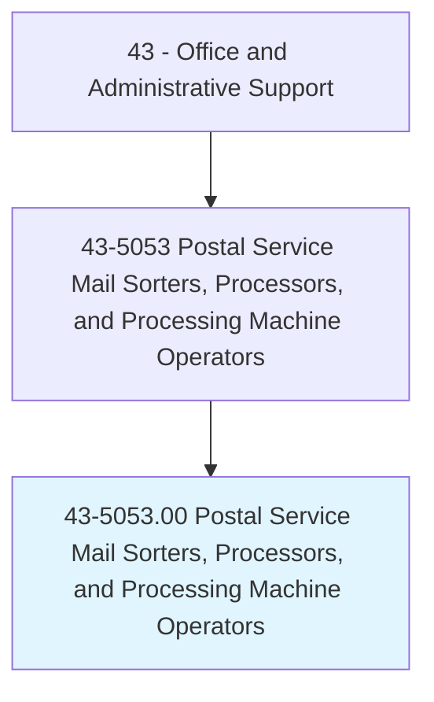
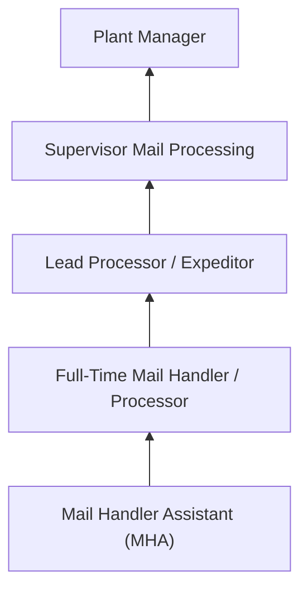

# Postal Service Mail Sorters, Processors, and Processing Machine Operators

> Prepare incoming and outgoing mail for distribution at USPS mail processing plants. Operate mail processing, sorting, and canceling machines. Load, operate, and occasionally adjust automated letter and flat sorting machines.

## Overview

Postal Service Mail Sorters and Processing Machine Operators work in USPS mail processing plants and distribution centers, operating automated sorting equipment that processes millions of pieces of mail daily. They load letters and flats onto sorting machines, monitor equipment operation, clear jams, manually sort items that machines cannot process, and ensure mail meets processing deadlines for timely delivery.

These workers typically work in large processing facilities during evening, night, and early morning shifts, as mail processing operates around the clock to meet next-day delivery standards. They handle letters, flats (large envelopes and magazines), parcels, and packages, using advanced optical character recognition (OCR) and barcode sorting technology.

The occupation has declined as automation has increased processing speed and reduced the labor needed per piece of mail, while overall mail volume has also decreased. However, the growth in package processing has created new demands for parcel sorting and handling operations.

## Classification Hierarchy

## Key Statistics

| Metric | Value |
|--------|-------|
| SOC Code | 43-5053.00 |
| Job Zone | 1 (Little or No Preparation) |
| Category | [Office and Administrative Support](/occupations/Administrative/index) |
| Median Annual Salary | $50,800 |
| Employment | ~100,000 |
| Projected Growth | -12% (declining) |
| Core Tasks | 20 |
| Source | O*NET |

## Core Tasks

Core task data with GraphDL semantic actions for this occupation is maintained in the data pipeline. See [O*NET 43-5053.00](https://www.onetonline.org/link/summary/43-5053.00) for detailed task information.

## Skills & Competencies

### Technical Skills
- **Mail Sorting Machine Operation** - Advanced
- **OCR/Barcode Systems** - Intermediate
- **Manual Sorting** - Advanced
- **Equipment Troubleshooting** - Intermediate
- **Mail Classification** - Advanced

### Soft Skills
- **Physical Stamina** - Critical
- **Speed and Accuracy** - Critical
- **Reliability** - Critical
- **Shift Flexibility** - Essential
- **Teamwork** - Essential

## Education & Certifications

| Requirement | Details |
|-------------|---------|
| Typical Education | High school diploma or less |
| Postal Exam (474/477) | Required for employment |
| Equipment Training | USPS on-the-job training |
| Background Check | Federal employment requirement |
| Drug Screening | Required |

## Career Progression

## Industry Variations

| Setting | Focus | Unique Aspects |
|---------|-------|----------------|
| P&DC (Processing & Distribution) | Letter and flat sorting | High-speed automation; tight dispatch times; OCR processing |
| Network Distribution Centers | Inter-facility transfer | Containerization; transportation coordination; hub operations |
| Parcel Facilities | Package sorting | Growing volume; heavier items; different equipment |
| Annex Facilities | Overflow processing | Seasonal surge; temporary operations; flexible staffing |

## Technology & Tools

- **Sorting Machines** - DBCS, AFCS, AFSM, FSS, APPS
- **Scanning** - Barcode readers, OCR systems
- **Material Handling** - Conveyors, gaylords, BMCs
- **Tracking** - Intelligent Mail Barcode (IMb)

## Related Occupations

## Departments

This occupation typically works in:
- [Mail Processing](/departments/MailProcessing) - Sorting operations
- [Plant Operations](/departments/PlantOps) - Facility management
- [Transportation](/departments/Transportation) - Dispatch coordination
- [Maintenance](/departments/Maintenance) - Equipment support

---

*Source: O*NET 43-5053.00 - ONETOccupation*
