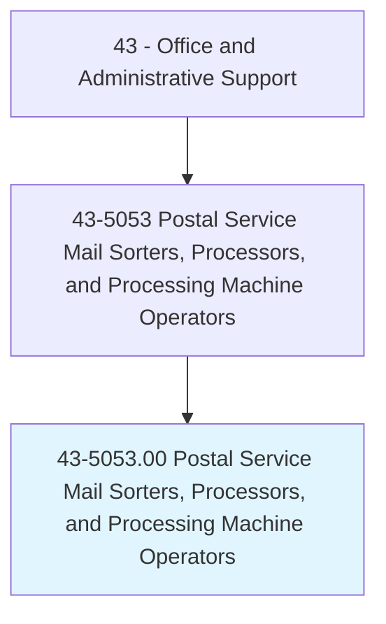
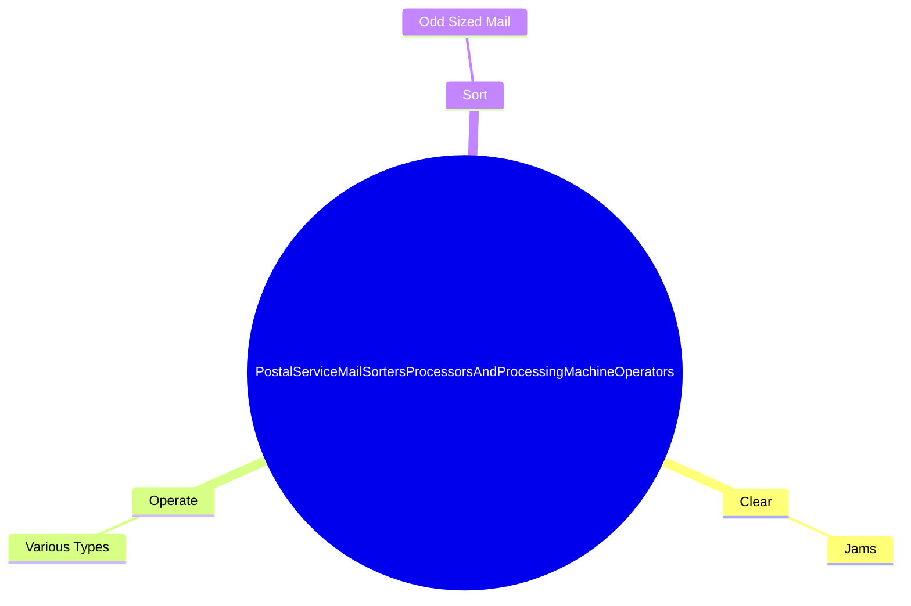

# Postal Service Mail Sorters, Processors, and Processing Machine Operators

> Prepare incoming and outgoing mail for distribution for the United States Postal Service (USPS). Examine, sort, and route mail. Load, operate, and occasionally adjust and repair mail processing, sorting, and canceling machinery. Keep records of shipments, pouches, and sacks, and perform other duties related to mail handling within the postal service. Includes postal service mail sorters and processors employed by USPS contractors.

## Overview

Postal Service Mail Sorters, Processors, and Processing Machine Operators is an occupation within the Office and Administrative Support category. Prepare incoming and outgoing mail for distribution for the United States Postal Service (USPS). Examine, sort, and route mail.

## Classification Hierarchy

## Key Statistics

| Metric | Value |
|--------|-------|
| SOC Code | 43-5053.00 |
| Category | [Office and Administrative Support](/occupations/Administrative) |
| Task Count | 37 |
| Source | O*NET |

## Core Tasks

### clear.Jams

Postal Service Mail Sorters, Processors, and Processing Machine Operators clear jams as part of their core responsibilities.

**Actions:**
- `clear.Jams.in.SortingEquipment`

### operate.VariousTypes

Postal Service Mail Sorters, Processors, and Processing Machine Operators operate various types as part of their core responsibilities.

**Actions:**
- `operate.VariousTypes.of.Equipment`
- `operate.VariousTypes.of.ComputerScanningEquipment`
- `operate.VariousTypes.of.Addressographs`
- `operate.VariousTypes.of.Mimeographs`

### sort.OddSizedMail

Postal Service Mail Sorters, Processors, and Processing Machine Operators sort odd sized mail as part of their core responsibilities.

**Actions:**
- `sort.OddSizedMail.by.Hand`
- `sort.OddSizedMail.by.SortMailOtherWorkersHaveBeenUnable.to.Sort`
- `sort.OddSizedMail.by.SegregateItemsRequiringSpecialHandling`

## Skills & Competencies

### Technical Skills
- **Office Management** - Advanced
- **Data Entry** - Advanced
- **Records Management** - Advanced

### Soft Skills
- **Communication** - Essential
- **Problem Solving** - Essential
- **Critical Thinking** - Important
- **Teamwork** - Important
- **Adaptability** - Important

## Related Occupations

## Industries

This occupation is found across multiple industries. See [Industries](/industries) for sector-specific employment data.

## Career Progression

---

*Source: O*NET 43-5053.00 - ONETOccupation*
