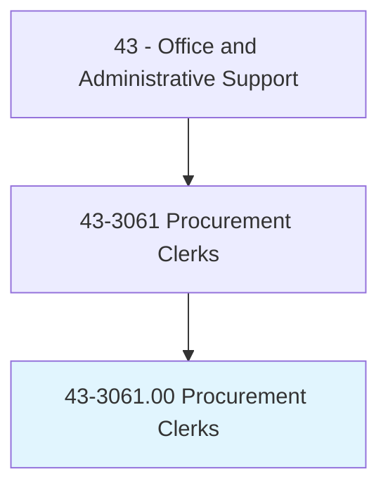
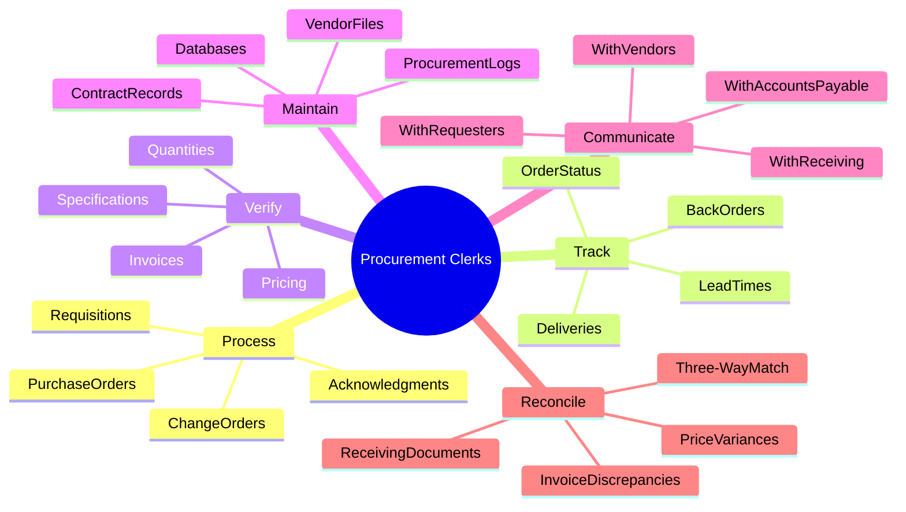
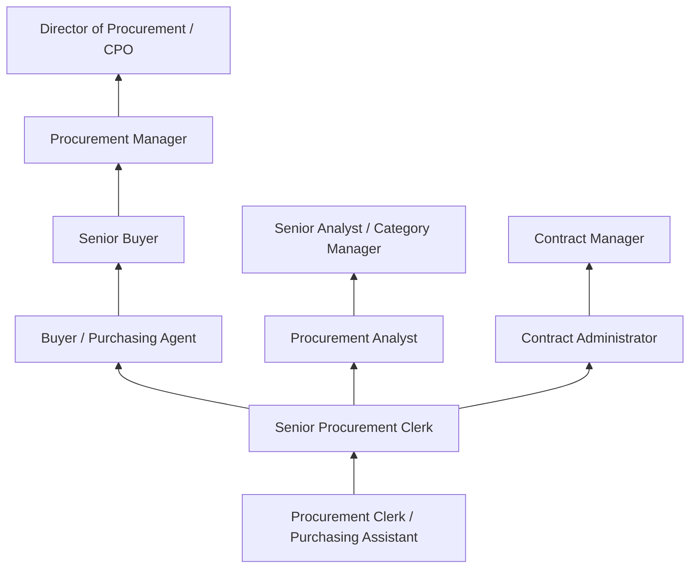
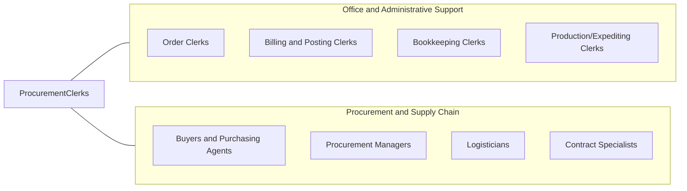

# Procurement Clerks

> Compile information and records to draw up purchase orders for procurement of materials and services.

## Overview

Procurement Clerks support purchasing operations by compiling requisition data, preparing purchase orders, tracking order status, verifying deliveries, and maintaining procurement records. They work with buyers, vendors, and internal departments to ensure that materials, supplies, and services are ordered correctly, delivered on time, and documented properly for payment processing.

Working in manufacturing, government, healthcare, and corporate procurement departments, these clerks handle the administrative aspects of the purchasing cycle. They enter requisitions into procurement systems, obtain price quotes from suppliers, verify quantities and specifications, reconcile invoices against purchase orders and receiving documents, and maintain vendor files and contract documentation.

The role requires knowledge of procurement procedures, basic accounting, and supply chain concepts. While e-procurement systems have automated routine purchasing, clerks remain important for exception handling, vendor communication, and ensuring the accuracy of procurement documentation. The position serves as a critical control point ensuring that purchasing activities comply with organizational policies, contractual requirements, and regulatory standards.

## Classification Hierarchy

## Key Statistics

| Metric | Value |
|--------|-------|
| SOC Code | 43-3061.00 |
| Job Zone | 2 (Some Preparation) |
| Category | [Office and Administrative Support](/occupations/Administrative/index) |
| Median Annual Salary | $44,900 |
| Salary Range | $31,000 - $63,000 |
| 10th Percentile | $31,200 |
| 90th Percentile | $62,800 |
| Employment | ~50,000 |
| Projected Growth | -5% (declining) |
| Core Tasks | 25 |
| Source | O*NET |

## Core Tasks

### process.PurchaseDocuments

Procurement Clerks create and process purchasing documents throughout the procurement cycle.

**Actions:**
- `process.Requisitions.from.Departments` - Review and validate purchase requests
- `create.PurchaseOrders.in.ERPSystem` - Generate formal purchase orders
- `process.ChangeOrders.for.Modifications` - Document changes to existing orders
- `process.Acknowledgments.from.Vendors` - Record vendor confirmation of orders
- `process.Blanket.Orders.for.RecurringPurchases` - Manage standing purchase agreements
- `expedite.RushOrders.for.UrgentNeeds` - Prioritize time-sensitive purchases

### track.OrderStatus

Procurement Clerks monitor orders from placement through delivery.

**Actions:**
- `track.OrderStatus.with.Vendors` - Monitor progress of open orders
- `track.Deliveries.against.PromisedDates` - Compare actual vs expected delivery
- `track.BackOrders.for.Availability` - Monitor items on backorder status
- `track.LeadTimes.for.Planning` - Record and report vendor performance
- `follow.Up.on.OverdueOrders` - Contact vendors about late shipments
- `update.Systems.with.StatusChanges` - Keep procurement records current

### verify.ProcurementData

Procurement Clerks check accuracy of prices, quantities, and specifications.

**Actions:**
- `verify.Pricing.against.Contracts` - Confirm quoted prices match agreements
- `verify.Quantities.against.Requisitions` - Check ordered amounts match requests
- `verify.Specifications.meet.Requirements` - Confirm items match technical needs
- `verify.Invoices.against.PurchaseOrders` - Match invoices to original orders
- `verify.ReceivingReports.against.Orders` - Confirm deliveries match orders
- `verify.VendorTerms.and.Conditions` - Check compliance with contract terms

### maintain.ProcurementRecords

Procurement Clerks organize and preserve purchasing documentation.

**Actions:**
- `maintain.VendorFiles.with.CurrentInformation` - Keep supplier data updated
- `maintain.ContractFiles.for.Reference` - Organize agreements and amendments
- `maintain.PurchaseOrderLogs.for.Tracking` - Record all purchasing activity
- `update.Databases.with.ProcurementData` - Enter information into systems
- `archive.ClosedOrders.per.RetentionPolicy` - Store completed records appropriately
- `maintain.ApprovedVendorLists` - Keep supplier qualification records current

### communicate.WithStakeholders

Procurement Clerks coordinate with internal and external parties on purchasing matters.

**Actions:**
- `communicate.with.Vendors.regarding.Orders` - Discuss pricing, availability, delivery
- `communicate.with.Requesters.on.Status` - Update departments on order progress
- `communicate.with.Receiving.on.Deliveries` - Coordinate incoming shipment information
- `communicate.with.AccountsPayable.on.Invoices` - Resolve billing issues
- `respond.to.Inquiries.about.PurchaseOrders` - Answer questions from stakeholders
- `escalate.Issues.to.Buyers.or.Management` - Report problems requiring intervention

### reconcile.ProcurementTransactions

Procurement Clerks match and resolve discrepancies in purchasing documents.

**Actions:**
- `perform.Three-WayMatch.for.Payment` - Reconcile PO, receiving, and invoice
- `resolve.PriceDiscrepancies.with.Vendors` - Investigate and correct pricing errors
- `resolve.QuantityDiscrepancies.with.Receiving` - Address shipment variances
- `process.Credits.for.Returns` - Document returned goods and credits
- `reconcile.StatementsWith.OpenOrders` - Match vendor statements to records
- `correct.DataErrors.in.ProcurementSystem` - Fix entry mistakes and discrepancies

## Skills & Competencies

### Technical Skills
- **Purchase Order Processing** - Advanced (creation, modification, closure)
- **ERP/Procurement Systems (SAP MM, Oracle)** - Advanced (transaction processing, reporting)
- **Vendor Management** - Intermediate (communication, file maintenance, performance)
- **Invoice Reconciliation** - Advanced (matching, discrepancy resolution)
- **Three-Way Matching** - Advanced (PO, receipt, invoice verification)
- **Contract Basics** - Intermediate (terms, pricing structures, compliance)
- **Microsoft Excel** - Advanced (data analysis, reporting, lookups)
- **Database Management** - Intermediate (data entry, queries, maintenance)

### Soft Skills
- **Accuracy** - Critical (error-free documentation and data entry)
- **Organizational Skills** - Critical (managing multiple orders and vendors)
- **Communication** - Essential (vendor and internal stakeholder coordination)
- **Negotiation Basics** - Important (price and delivery discussions)
- **Attention to Detail** - Critical (catching discrepancies and errors)
- **Problem Solving** - Important (resolving procurement issues)
- **Time Management** - Essential (meeting procurement timelines)
- **Customer Service** - Important (serving internal requesters)

## Education & Certifications

| Requirement | Details |
|-------------|---------|
| Typical Education | High school diploma; associate's degree helpful |
| Preferred Education | Associate's or bachelor's in business, supply chain |
| CPPB (Certified Professional Public Buyer) | NIGP credential for government procurement |
| Procurement Fundamentals | ISM or CIPS introductory coursework |
| ERP System Training | SAP, Oracle, or Coupa procurement modules |
| Microsoft Office Certification | Excel proficiency validation |
| Industry-Specific Training | Sector knowledge (healthcare, manufacturing, etc.) |

## Career Progression

### Career Pathway Details

| Level | Title | Years Experience | Key Responsibilities |
|-------|-------|------------------|----------------------|
| Entry | Procurement Clerk | 0-2 years | PO processing, data entry, basic vendor contact |
| Mid | Senior Procurement Clerk | 2-5 years | Complex transactions, problem resolution, training |
| Professional | Buyer / Purchasing Agent | 5-8 years | Vendor selection, negotiation, strategic sourcing |
| Senior | Senior Buyer / Category Manager | 8-12 years | Category strategies, major vendor relationships |
| Management | Procurement Manager / Director | 12+ years | Department leadership, policy, strategic planning |

### Specialization Paths

| Specialization | Focus Area | Additional Skills Needed |
|----------------|------------|-----------------------------|
| Strategic Sourcing | Supplier selection and negotiation | Negotiation, market analysis, RFP process |
| Contract Management | Agreement administration | Legal basics, compliance, relationship management |
| Procurement Analysis | Data and reporting | Analytics, Excel advanced, reporting tools |
| Category Management | Commodity expertise | Market knowledge, supplier development |

## Industry Variations

| Setting | Focus | Unique Aspects |
|---------|-------|----------------|
| Manufacturing | Raw materials and parts | BOM-driven purchasing; supplier quality; JIT delivery; production urgency |
| Government | Public procurement | Bid processes; compliance requirements; small business set-asides; transparency |
| Healthcare | Medical supplies and equipment | GPO contracts; regulatory requirements; sterilization; expiration tracking |
| Corporate | Indirect procurement | Office supplies; services; facilities; travel; MRO |
| Construction | Project materials | Job costing; delivery scheduling; quantity takeoffs; subcontractor coordination |
| Retail | Merchandise and supplies | Seasonal ordering; inventory turns; vendor-managed inventory |

### Manufacturing Procurement

Manufacturing procurement clerks work with bill of materials (BOM), supporting production schedules with timely material ordering. They understand manufacturing terminology, quality requirements, and the impact of late deliveries on production. Many work with MRP/ERP systems that generate purchase requisitions automatically based on production plans and inventory levels.

### Government Procurement

Government procurement clerks follow strict procurement regulations, small business requirements, and documentation standards. They process requisitions through formal approval workflows, maintain bid documentation, and ensure compliance with FAR (Federal Acquisition Regulation) or state/local procurement codes. Transparency and audit trails are paramount.

### Healthcare Procurement

Healthcare procurement clerks handle medical supplies, equipment, and services with attention to regulatory requirements, product traceability, and patient safety. They work with group purchasing organizations (GPOs), manage consignment inventory, and track lot numbers and expiration dates. HIPAA awareness may be required when procurement activities involve patient information.

### Corporate/Indirect Procurement

Corporate procurement clerks handle indirect purchases including office supplies, professional services, facilities maintenance, and IT equipment. They work with procurement cards (P-cards), catalog ordering systems, and preferred vendor programs designed to streamline routine purchases while maintaining spending controls.

## Technology & Tools

### ERP and Procurement Systems
- **SAP MM** - Materials Management module for procurement
- **Oracle Procurement** - Cloud and on-premise procurement solutions
- **Coupa** - Spend management and procurement platform
- **Ariba** - SAP procurement network and sourcing
- **Jaggaer** - Spend management and supplier collaboration
- **Workday** - Financial and procurement management

### P2P Automation
- **Invoice Processing** - Automated matching and approval
- **Catalog Systems** - Punch-out and hosted catalogs
- **Requisition Workflow** - Automated approval routing
- **Supplier Portals** - Vendor self-service platforms

### Communication and Documentation
- **Email** - Vendor and internal communication
- **Spreadsheets** - Excel for tracking, analysis, reporting
- **Document Management** - SharePoint, file systems for records
- **Communication Platforms** - Teams, Slack for coordination

### Analysis and Reporting
- **Spend Analytics** - Procurement spend reporting tools
- **Dashboards** - KPI tracking and visualization
- **Report Writers** - ERP reporting and data extraction

## Work Environment

### Physical Setting
- Office environment with computer workstation
- Desk-based work with procurement systems access
- Filing and document storage areas
- Occasional warehouse or receiving area visits
- Remote work options in some organizations

### Work Schedule
- Standard business hours (8 AM - 5 PM typical)
- Month-end and quarter-end processing peaks
- Year-end inventory and accrual activities
- Occasional overtime for urgent procurement needs
- Limited travel for vendor meetings or site visits

### Work Characteristics
- High-volume transaction processing
- Deadline-driven work around production/project needs
- Regular vendor and internal customer communication
- Detail-intensive data entry and verification
- Balance of routine processing and problem resolution

## Related Occupations

### Related Occupation Comparison

| Occupation | Similarity | Key Difference |
|------------|------------|----------------|
| Order Clerks | High | Sales orders vs purchase orders |
| Buyers/Purchasing Agents | High | Strategic sourcing vs transaction processing |
| Production Clerks | Medium | Production coordination vs procurement focus |
| Bookkeeping Clerks | Medium | Financial focus vs procurement focus |

## Industries

- [Manufacturing](/industries/Manufacturing) - High Employment
- [Government](/industries/PublicAdministration) - High Employment
- [Healthcare](/industries/Healthcare) - Moderate Employment
- [Education](/industries/Education) - Moderate Employment
- [Construction](/industries/Construction) - Moderate Employment
- [Wholesale Trade](/industries/WholesaleTrade) - Moderate Employment

## Departments

This occupation typically works in:
- [Procurement](/departments/Procurement) - Purchasing operations
- [Supply Chain](/departments/SupplyChain) - Materials management
- [Finance](/departments/Finance) - Accounts payable support
- [Operations](/departments/Operations) - Operational purchasing
- Materials Management - Inventory and materials

## Performance Metrics

| Metric | Description | Typical Target |
|--------|-------------|----------------|
| PO Accuracy | Error rate in purchase orders | <2% error rate |
| Processing Time | Time from requisition to PO | Per SLA (1-2 days typical) |
| Invoice Match Rate | First-time three-way match success | >90% |
| On-Time Delivery | Orders delivered by promised date | >95% |
| Vendor Response | Time to resolve vendor issues | Per urgency level |

## Regulatory and Compliance

### Procurement Compliance
- Organizational procurement policies and thresholds
- Approval authority and delegation rules
- Competitive bidding requirements
- Preferred vendor and contract compliance
- Segregation of duties controls

### Government Procurement (if applicable)
- FAR/DFAR for federal procurement
- State and local procurement codes
- Small business and diversity requirements
- Public disclosure and transparency
- Protest and appeals procedures

### Industry-Specific
- Healthcare regulations (FDA, HIPAA)
- Manufacturing quality standards (ISO, automotive)
- Environmental and sustainability requirements
- Export control and sanctions compliance

---

*Source: O*NET 43-3061.00 - ONETOccupation*
