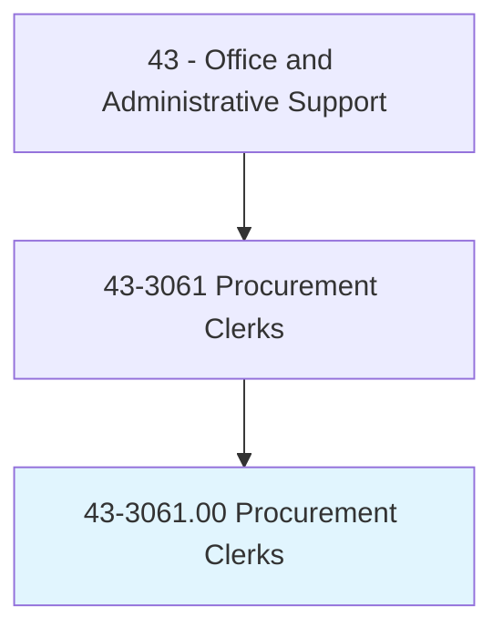
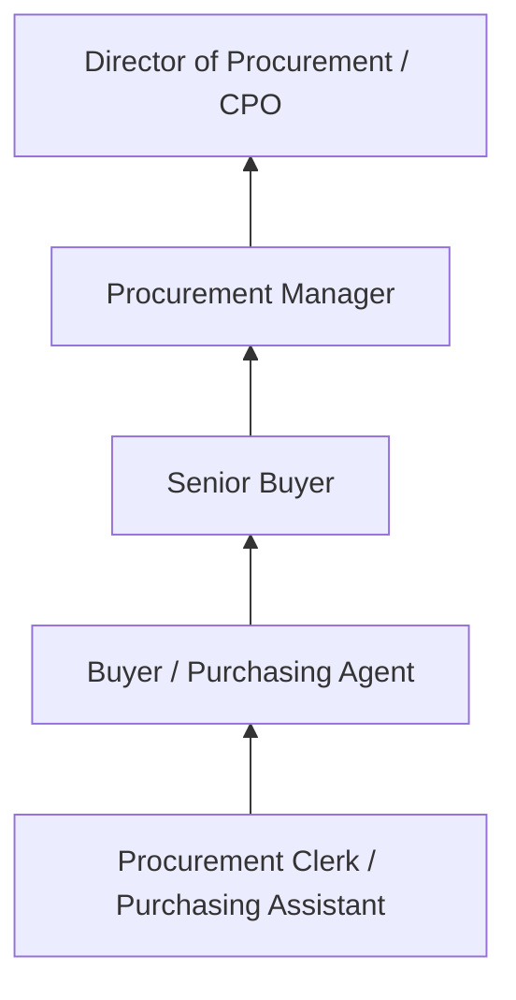
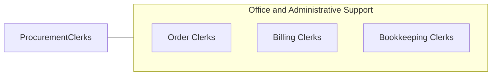

# Procurement Clerks

> Compile information and records to draw up purchase orders for procurement of materials and services.

## Overview

Procurement Clerks support purchasing operations by compiling requisition data, preparing purchase orders, tracking order status, verifying deliveries, and maintaining procurement records. They work with buyers, vendors, and internal departments to ensure that materials, supplies, and services are ordered correctly, delivered on time, and documented properly for payment processing.

Working in manufacturing, government, healthcare, and corporate procurement departments, these clerks handle the administrative aspects of the purchasing cycle. They enter requisitions into procurement systems, obtain price quotes from suppliers, verify quantities and specifications, reconcile invoices against purchase orders and receiving documents, and maintain vendor files and contract documentation.

The role requires knowledge of procurement procedures, basic accounting, and supply chain concepts. While e-procurement systems have automated routine purchasing, clerks remain important for exception handling, vendor communication, and ensuring the accuracy of procurement documentation.

## Classification Hierarchy

## Key Statistics

| Metric | Value |
|--------|-------|
| SOC Code | 43-3061.00 |
| Job Zone | 2 (Some Preparation) |
| Category | [Office and Administrative Support](/occupations/Administrative/index) |
| Median Annual Salary | $44,900 |
| Employment | ~50,000 |
| Projected Growth | -5% (declining) |
| Core Tasks | 25 |
| Source | O*NET |

## Core Tasks

Core task data with GraphDL semantic actions for this occupation is maintained in the data pipeline. See [O*NET 43-3061.00](https://www.onetonline.org/link/summary/43-3061.00) for detailed task information.

## Skills & Competencies

### Technical Skills
- **Purchase Order Processing** - Advanced
- **ERP/Procurement Systems (SAP MM, Oracle)** - Advanced
- **Vendor Management** - Intermediate
- **Invoice Reconciliation** - Advanced
- **Three-Way Matching** - Advanced

### Soft Skills
- **Accuracy** - Critical
- **Organizational Skills** - Critical
- **Communication** - Essential
- **Negotiation Basics** - Important
- **Attention to Detail** - Critical

## Education & Certifications

| Requirement | Details |
|-------------|---------|
| Typical Education | High school diploma; associate's helpful |
| CPPB (Certified Professional Public Buyer) | NIGP credential |
| Procurement Fundamentals | ISM or CIPS coursework |
| ERP System Training | SAP, Oracle procurement modules |

## Career Progression

## Industry Variations

| Setting | Focus | Unique Aspects |
|---------|-------|----------------|
| Manufacturing | Raw materials and parts | BOM-driven purchasing; supplier quality; JIT delivery |
| Government | Public procurement | Bid processes; compliance; small business set-asides |
| Healthcare | Medical supplies and equipment | GPO contracts; regulatory requirements; sterilization needs |
| Corporate | Indirect procurement | Office supplies; services; contract management |

## Technology & Tools

- **ERP** - SAP Ariba, Oracle Procurement, Coupa
- **P2P** - Purchase-to-pay automation platforms
- **Communication** - Email, vendor portals
- **Tracking** - Order tracking, delivery confirmation

## Related Occupations

## Departments

This occupation typically works in:
- [Procurement](/departments/Procurement) - Purchasing operations
- [Supply Chain](/departments/SupplyChain) - Materials management
- [Finance](/departments/Finance) - Accounts payable support
- [Operations](/departments/Operations) - Operational purchasing

---

*Source: O*NET 43-3061.00 - ONETOccupation*
