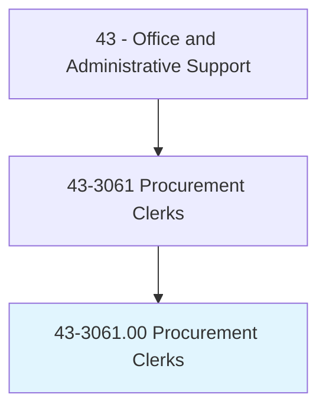
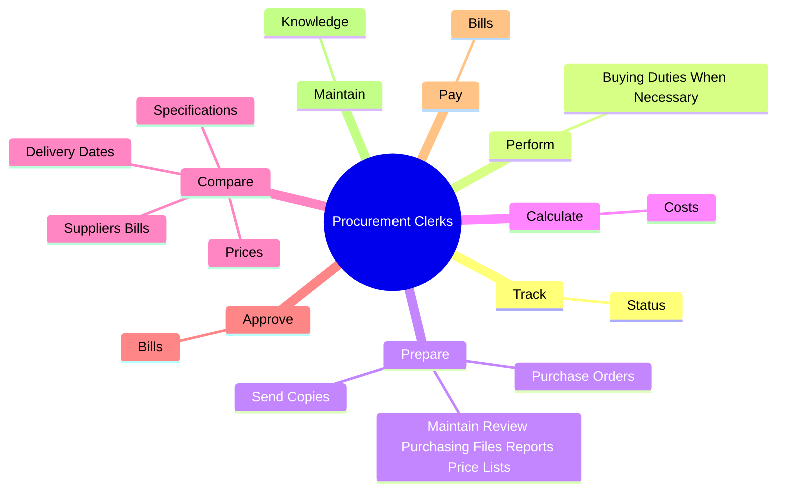
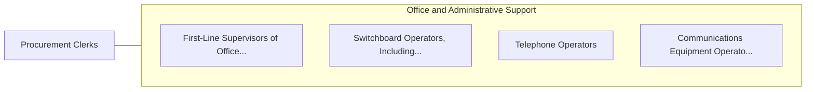

# Procurement Clerks

> Compile information and records to draw up purchase orders for procurement of materials and services.

## Overview

Procurement Clerks is classified under Office and Administrative Support (SOC 43). Compile information and records to draw up purchase orders for procurement of materials and services.

## Classification Hierarchy

## Key Statistics

| Metric | Value |
|--------|-------|
| SOC Code | 43-3061.00 |
| Category | [Office and Administrative Support](/occupations/Administrative) |
| Task Count | 52 |
| Source | O*NET |

## Core Tasks

### track.Status

Procurement Clerks track status as part of their core responsibilities.

**Actions:**
- `track.Status.of.Requisitions`
- `track.Status.of.Contracts`
- `track.Status.of.Orders`

### perform.BuyingDutiesWhenNecessary

Procurement Clerks perform buying duties when necessary as part of their core responsibilities.

**Actions:**
- `perform.BuyingDutiesWhenNecessary`

### prepare.PurchaseOrders

Procurement Clerks prepare purchase orders as part of their core responsibilities.

**Actions:**
- `prepare.PurchaseOrders.to.SuppliersDepartmentsOriginatingRequests`
- `prepare.PurchaseOrders.to.ToDepartmentsOriginatingRequests`
- `prepare.SendCopies.to.SuppliersDepartmentsOriginatingRequests`
- `prepare.SendCopies.to.ToDepartmentsOriginatingRequests`

## Skills & Competencies

### Technical Skills
- **Office Management** - Advanced
- **Data Entry** - Advanced
- **Records Management** - Advanced

### Soft Skills
- **Communication** - Essential
- **Problem Solving** - Essential
- **Critical Thinking** - Important
- **Teamwork** - Important
- **Adaptability** - Important

## Related Occupations

## Industries

This occupation is found across multiple industries. See [Industries](/industries) for sector-specific employment data.

## Career Progression

---

*Source: O*NET 43-3061.00 - ONETOccupation*
