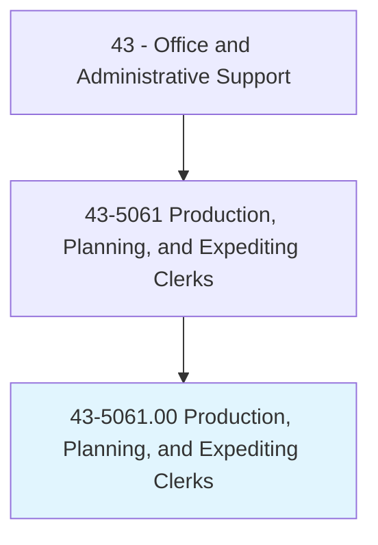
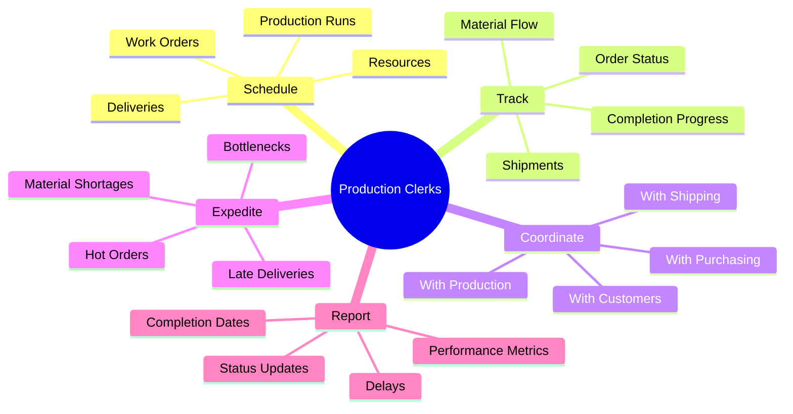
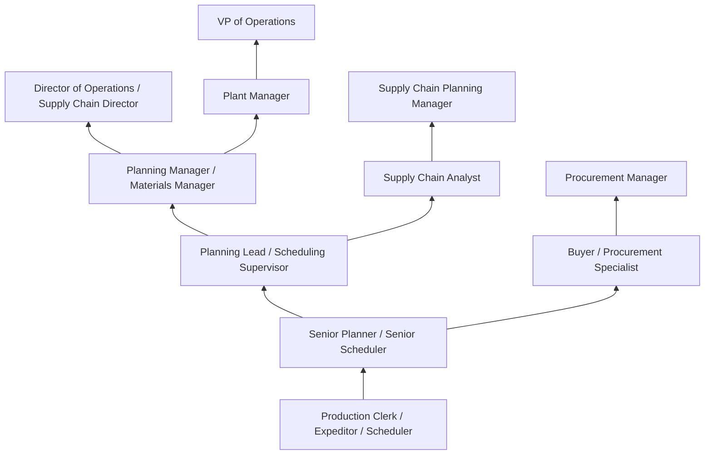
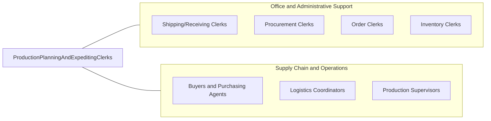

# Production, Planning, and Expediting Clerks

> Coordinate and expedite the flow of work and materials within or between departments of an establishment according to production schedule. Duties include reviewing and distributing production, work, and shipment schedules; conferring with department supervisors to determine progress of work and completion dates.

## Overview

Production, Planning, and Expediting Clerks coordinate the flow of materials, work orders, and production schedules within organizations, serving as the critical information hub that keeps manufacturing, distribution, and project operations running on schedule. They track order progress through production stages, monitor inventory levels against requirements, communicate schedule changes to production teams, expedite delayed orders, identify potential bottlenecks, and ensure that materials arrive when needed for manufacturing, assembly, or shipment.

Working in manufacturing plants, distribution centers, construction companies, and project-based organizations, these clerks connect procurement, production, shipping, and customer service functions. They review production schedules against material availability, distribute work orders to shop floor supervisors, track completion progress against customer requirements, coordinate expedited shipments for hot orders, and escalate delays to management for resolution. Their work directly impacts on-time delivery performance, production efficiency, and customer satisfaction.

The role requires understanding of production processes, inventory management principles, and supply chain logistics. Effective expediting depends on strong communication skills, the ability to prioritize competing demands under pressure, and comprehensive knowledge of the organization's products, vendors, manufacturing capabilities, and customer commitments. As supply chains have become more complex and customer expectations for delivery speed have increased, the expediting function has become increasingly strategic, with clerks using ERP systems and analytics to anticipate problems before they impact customers.

## Classification Hierarchy



## Key Statistics

| Metric | Value |
|--------|-------|
| SOC Code | 43-5061.00 |
| Job Zone | 3 (Medium Preparation) |
| Category | [Office and Administrative Support](/occupations/Administrative/index) |
| Median Annual Salary | $50,500 |
| Salary Range | $35,000 - $72,000 |
| 10th Percentile | $35,500 |
| 90th Percentile | $71,800 |
| Employment | ~370,000 |
| Projected Growth | 2% (slower than average) |
| Annual Openings | ~45,000 |
| Core Tasks | 35 |
| Source | O*NET |

## Core Tasks



### coordinate.ProductionSchedules

Production Clerks coordinate production schedules and work orders.

**Actions:**
- `distribute.WorkOrders.to.Production`
- `schedule.ProductionRuns.based.on.Demand`
- `coordinate.Resources.for.Manufacturing`
- `communicate.Changes.to.ShopFloor`

### expedite.DelayedOrders

Production Clerks expedite orders that are behind schedule.

**Actions:**
- `identify.Delays.in.Production`
- `expedite.Materials.from.Suppliers`
- `coordinate.Overtime.for.CatchUp`
- `escalate.Issues.to.Management`

## Skills & Competencies

### Technical Skills
- **Production Scheduling Systems** - Expert (MRP, APS, scheduling tools)
- **ERP Systems (SAP, Oracle, Epicor)** - Advanced (production modules, transactions)
- **Inventory Management** - Advanced (stock levels, reorder points, MRP)
- **Supply Chain Coordination** - Advanced (vendor communication, logistics)
- **Material Requirements Planning (MRP)** - Advanced (BOM explosion, lead times)
- **Microsoft Excel** - Advanced (tracking, reporting, analysis)
- **Shop Floor Systems** - Intermediate (MES, production tracking)
- **Shipping/Logistics Systems** - Intermediate (carrier coordination)

### Soft Skills
- **Communication** - Critical (production teams, vendors, customers)
- **Problem Solving** - Critical (resolving delays and shortages)
- **Organizational Skills** - Critical (managing multiple orders and priorities)
- **Urgency Management** - Essential (expediting under pressure)
- **Collaboration** - Essential (cross-functional coordination)
- **Attention to Detail** - Essential (tracking accuracy)
- **Negotiation** - Important (vendor expediting)
- **Stress Tolerance** - Important (deadline pressure)

## Education & Certifications

| Requirement | Details |
|-------------|---------|
| Typical Education | High school diploma; associate's or bachelor's preferred |
| Preferred Education | Associate's or bachelor's in supply chain, business, or manufacturing |
| CPIM (Certified in Planning and Inventory Management) | ASCM/APICS credential |
| CSCP (Certified Supply Chain Professional) | ASCM/APICS credential |
| CLTD (Certified in Logistics, Transportation and Distribution) | ASCM/APICS credential |
| Lean/Six Sigma Yellow/Green Belt | Process improvement certification |
| ERP Certification | SAP, Oracle, Epicor system certifications |
| Continuing Education | APICS conferences, supply chain workshops |

## Career Progression



### Career Pathway Details

| Level | Title | Years Experience | Key Responsibilities |
|-------|-------|------------------|----------------------|
| Entry | Production Clerk / Expeditor | 0-2 years | Work order distribution, status tracking, basic expediting |
| Mid | Senior Planner / Scheduler | 2-5 years | Complex scheduling, capacity planning, vendor coordination |
| Lead | Planning Lead / Supervisor | 5-8 years | Team supervision, process improvement, customer interface |
| Management | Planning Manager / Materials Manager | 8-12 years | Department leadership, S&OP, inventory strategy |
| Director | Director of Operations | 12+ years | Multi-site operations, strategic planning, technology |

### Specialization Paths

| Specialization | Focus Area | Additional Skills Needed |
|----------------|------------|-----------------------------|
| Master Scheduling | Capacity and resource planning | Advanced planning, S&OP |
| Materials Management | Inventory and procurement | Buying, supplier management |
| Supply Chain Analytics | Data-driven optimization | Analytics, forecasting, systems |
| Project Planning | Program/project scheduling | Project management, Gantt charts |

## Industry Variations

| Setting | Focus | Unique Aspects |
|---------|-------|----------------|
| Manufacturing | Production scheduling | BOM management; work orders; machine scheduling; capacity constraints |
| Aerospace/Defense | Program scheduling | Long lead times; government contracts; configuration control; compliance |
| Automotive | JIT/JIS production | Sequence delivery; line-side inventory; minute-by-minute scheduling |
| Construction | Project expediting | Material deliveries; subcontractor coordination; permits; site logistics |
| Distribution | Order fulfillment | Pick/pack/ship; inventory replenishment; delivery windows; carrier scheduling |
| Pharmaceuticals | Batch production | Lot tracking; clean room scheduling; validation; regulatory compliance |

### Manufacturing Expediting

Manufacturing expeditors track work orders through production stages, coordinate material availability for production starts, manage shop floor schedules against customer delivery dates, and expedite suppliers when materials are delayed. Understanding of bills of materials, routing sequences, and production capacity is essential for effective prioritization.

### Aerospace and Defense

Aerospace expeditors manage complex programs with long lead times (often 12-24 months), government contract requirements, strict configuration control, and quality documentation. They track hundreds of components across multiple suppliers, manage engineering changes, and coordinate with program managers on milestone deliveries.

### Automotive Supply Chain

Automotive expeditors work in just-in-time (JIT) and just-in-sequence (JIS) environments where late deliveries can shut down assembly lines costing thousands of dollars per minute. Real-time tracking, minute-by-minute scheduling, and immediate escalation of any delays are standard practice. Premium freight decisions must be made quickly.

### Construction Project Expediting

Construction expeditors coordinate material deliveries to job sites, track vendor lead times, manage subcontractor schedules, and ensure that materials arrive when needed for each project phase. Weather delays, permit issues, and site access constraints add complexity. They work closely with project managers and superintendents.

## Technology & Tools

### ERP and Planning Systems
- **SAP PP (Production Planning)** - Enterprise manufacturing
- **Oracle Manufacturing Cloud** - Cloud ERP
- **Epicor** - Mid-market manufacturing ERP
- **Infor LN** - Discrete manufacturing
- **Microsoft Dynamics 365** - Business applications

### Advanced Planning Systems
- **SAP APO/IBP** - Advanced planning and S&OP
- **Oracle ASCP** - Supply chain planning
- **Blue Yonder (JDA)** - Supply chain planning
- **Kinaxis RapidResponse** - Concurrent planning
- **o9 Solutions** - AI-powered planning

### Scheduling Tools
- **Preactor** - Production scheduling
- **PlanetTogether** - Visual scheduling
- **Asprova** - Finite capacity scheduling
- **Microsoft Project** - Project scheduling
- **Gantt Chart Tools** - Visual timeline management

### Communication and Tracking
- **Shop Floor Systems (MES)** - Real-time production tracking
- **Supplier Portals** - Vendor communication
- **Carrier Systems** - Shipment tracking
- **Collaboration Tools** - Teams, email, phone
- **Dashboards** - KPI monitoring

## Related Occupations



### Related Occupation Comparison

| Occupation | Similarity | Key Difference |
|------------|------------|----------------|
| Purchasing Agents | High | Buying vs scheduling focus |
| Logistics Coordinators | High | Transportation vs production focus |
| Production Supervisors | Medium | Management vs coordination role |
| Inventory Clerks | Medium | Stock management vs scheduling |

## Industries

- [Manufacturing](/industries/Manufacturing/index) - High Employment
- [Aerospace and Defense](/industries/Manufacturing/Aerospace) - High Employment
- [Wholesale Trade](/industries/Wholesale) - Moderate Employment
- [Construction](/industries/Construction) - Moderate Employment
- [Retail/Distribution](/industries/Retail) - Moderate Employment
- [Automotive](/industries/Manufacturing/Automotive) - Moderate Employment

## Departments

This occupation typically works in:
- Production Planning - Master scheduling and capacity planning
- [Supply Chain](/departments/SupplyChain) - Material coordination and logistics
- [Manufacturing/Operations](/departments/Operations) - Shop floor support
- Materials Management - Inventory and procurement coordination
- Customer Service - Order status and delivery communication

## Work Environment

### Physical Setting
- Office within manufacturing facility
- Regular visits to shop floor and warehouse
- Desk with computer, phone, radio
- Noise from production environment nearby
- Safety equipment when on shop floor

### Work Schedule
- Standard business hours with overtime during crunch periods
- Some positions require early starts with production
- End-of-month and quarter-end pressure
- On-call for urgent expediting issues
- Shift coverage in 24/7 operations

### Work Characteristics
- Fast-paced with constant interruptions
- Pressure from competing priorities
- Cross-functional communication all day
- Problem-solving under time pressure
- Balance between office and shop floor

### Unique Considerations
- Late material impact on production
- Customer delivery commitments
- Premium freight cost decisions
- Overtime authorization pressure
- Vendor relationship management

## Performance Metrics

### Key Performance Indicators

| Metric | Description | Typical Target |
|--------|-------------|----------------|
| On-Time Delivery | Orders delivered by promised date | >95% |
| Schedule Adherence | Production completed as scheduled | >90% |
| Inventory Accuracy | System vs physical counts | >99% |
| Past Due Orders | Orders beyond committed date | <5% |
| Expedite Costs | Premium freight and overtime | Minimize |
| Material Availability | Materials ready for production | >98% |

### Expediting Effectiveness
- Time to resolve shortages
- Supplier expedite success rate
- Customer communication timeliness
- Problem escalation appropriateness
- Root cause identification

## GraphDL Semantic Structure

```graphdl
Production, Planning, and Expediting Clerks perform:
- coordinate.Schedules.for.Production
- track.Orders.through.Manufacturing
- expedite.Materials.from.Suppliers
- communicate.Status.to.Stakeholders
- distribute.WorkOrders.to.ShopFloor
- resolve.Delays.in.Production
- monitor.Inventory.for.Availability
- report.Progress.to.Management
```

---

*Source: O*NET 43-5061.00 - ONETOccupation*
