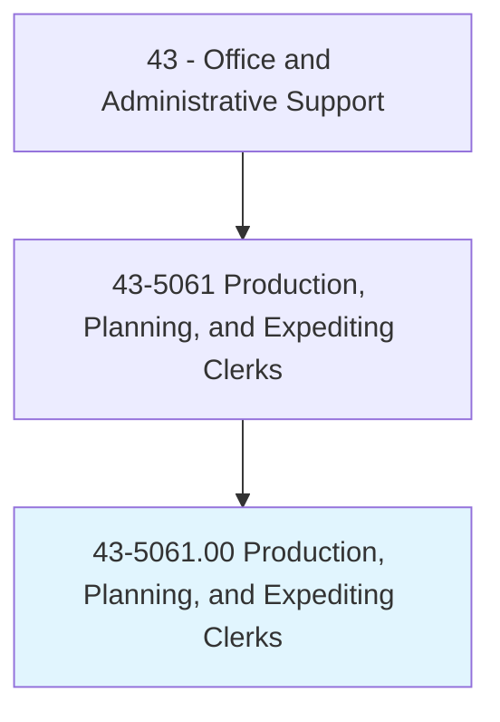
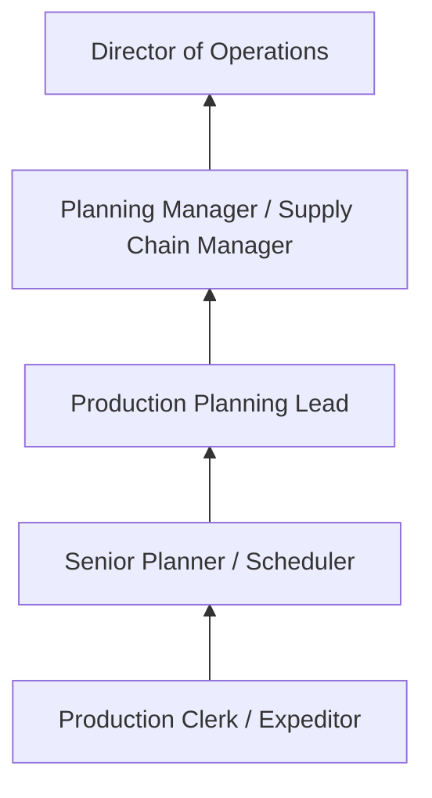

# Production, Planning, and Expediting Clerks

> Coordinate and expedite the flow of work and materials within or between departments of an establishment according to production schedule. Duties include reviewing and distributing production, work, and shipment schedules; conferring with department supervisors to determine progress of work and completion dates.

## Overview

Production, Planning, and Expediting Clerks coordinate the flow of materials, work orders, and production schedules within organizations. They track order progress, monitor inventory levels, communicate schedule changes to production teams, expedite delayed orders, and ensure that materials arrive when needed for manufacturing or assembly operations.

Working in manufacturing plants, distribution centers, and project-based organizations, these clerks serve as the information hub connecting procurement, production, shipping, and customer service. They review production schedules, check material availability, distribute work orders, track completion progress, identify bottlenecks, and escalate delays to supervisors for resolution.

The role requires understanding of production processes, inventory management, and supply chain logistics. Effective expediting depends on strong communication skills, the ability to prioritize competing demands, and knowledge of the organization's products, vendors, and production capabilities.

## Classification Hierarchy

## Key Statistics

| Metric | Value |
|--------|-------|
| SOC Code | 43-5061.00 |
| Job Zone | 3 (Medium Preparation) |
| Category | [Office and Administrative Support](/occupations/Administrative/index) |
| Median Annual Salary | $50,500 |
| Employment | ~370,000 |
| Projected Growth | 2% (slower than average) |
| Core Tasks | 35 |
| Source | O*NET |

## Core Tasks

Core task data with GraphDL semantic actions for this occupation is maintained in the data pipeline. See [O*NET 43-5061.00](https://www.onetonline.org/link/summary/43-5061.00) for detailed task information.

## Skills & Competencies

### Technical Skills
- **Production Scheduling Systems** - Advanced
- **ERP/MRP Systems (SAP, Oracle)** - Advanced
- **Inventory Management** - Advanced
- **Supply Chain Coordination** - Advanced
- **Material Requirements Planning** - Intermediate

### Soft Skills
- **Communication** - Critical
- **Problem Solving** - Critical
- **Organizational Skills** - Critical
- **Urgency Management** - Essential
- **Collaboration** - Essential

## Education & Certifications

| Requirement | Details |
|-------------|---------|
| Typical Education | High school diploma; associate's or bachelor's preferred |
| CPIM (Certified in Planning and Inventory Management) | ASCM/APICS credential |
| CSCP (Certified Supply Chain Professional) | ASCM/APICS credential |
| Lean/Six Sigma Yellow Belt | Process improvement awareness |

## Career Progression

## Industry Variations

| Setting | Focus | Unique Aspects |
|---------|-------|----------------|
| Manufacturing | Production scheduling | BOM management; work orders; machine scheduling; MRP |
| Aerospace/Defense | Program scheduling | Long lead times; government contracts; configuration control |
| Construction | Project expediting | Material deliveries; subcontractor coordination; permits |
| Distribution | Order fulfillment | Pick/pack/ship; inventory replenishment; delivery windows |

## Technology & Tools

- **ERP** - SAP PP, Oracle Manufacturing, Epicor
- **Planning** - Advanced Planning Systems, Gantt charts
- **Communication** - Email, production boards, Kanban
- **Tracking** - Shipment tracking, WMS integration

## Related Occupations

## Departments

This occupation typically works in:
- [Production Planning](/departments/ProductionPlanning) - Schedule management
- [Supply Chain](/departments/SupplyChain) - Material coordination
- [Manufacturing](/departments/Manufacturing) - Shop floor support
- [Operations](/departments/Operations) - Operational efficiency

---

*Source: O*NET 43-5061.00 - ONETOccupation*
