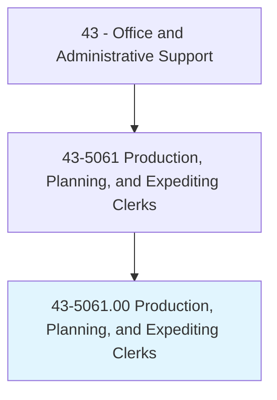
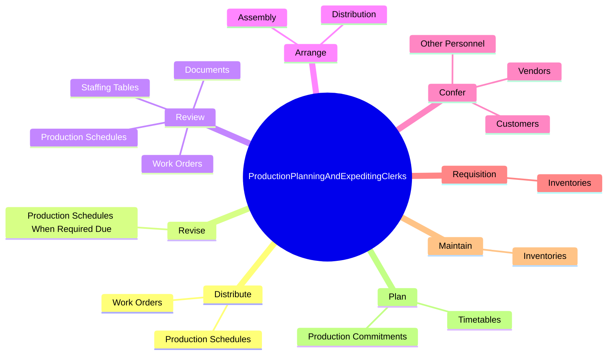

# Production, Planning, and Expediting Clerks

> Coordinate and expedite the flow of work and materials within or between departments of an establishment according to production schedule. Duties include reviewing and distributing production, work, and shipment schedules; conferring with department supervisors to determine progress of work and completion dates; and compiling reports on progress of work, inventory levels, costs, and production problems.

## Overview

Production, Planning, and Expediting Clerks is an occupation within the Office and Administrative Support category. Coordinate and expedite the flow of work and materials within or between departments of an establishment according to production schedule. 

## Classification Hierarchy

## Key Statistics

| Metric | Value |
|--------|-------|
| SOC Code | 43-5061.00 |
| Category | [Office and Administrative Support](/occupations/Administrative/index) |
| Task Count | 134 |
| Source | O*NET |

## Core Tasks

### distribute.ProductionSchedules

Production, Planning, and Expediting Clerks distribute production schedules as part of their core responsibilities.

**Actions:**
- `distribute.ProductionSchedules.to.Departments`
- `distribute.WorkOrders.to.Departments`

### revise.ProductionSchedulesWhenRequiredDue

Production, Planning, and Expediting Clerks revise production schedules when required due as part of their core responsibilities.

**Actions:**
- `revise.ProductionSchedulesWhenRequiredDue.to.design.Changes`
- `revise.ProductionSchedulesWhenRequiredDue.to.Lab`
- `revise.ProductionSchedulesWhenRequiredDue.to.MaterialShortages`
- `revise.ProductionSchedulesWhenRequiredDue.to.Backlogs`

### review.Documents

Production, Planning, and Expediting Clerks review documents as part of their core responsibilities.

**Actions:**
- `review.Documents.to.determine.PersonnelRequirementsMaterialPriorities`
- `review.Documents.to.MaterialsRequirementsMaterialPriorities`
- `review.ProductionSchedules.to.determine.PersonnelRequirementsMaterialPriorities`
- `review.ProductionSchedules.to.MaterialsRequirementsMaterialPriorities`

## Skills & Competencies

### Technical Skills
- **Office Management** - Advanced
- **Data Entry** - Advanced
- **Records Management** - Advanced

### Soft Skills
- **Communication** - Essential
- **Problem Solving** - Essential
- **Critical Thinking** - Important
- **Teamwork** - Important
- **Adaptability** - Important

## Related Occupations

## Industries

This occupation is found across multiple industries. See [Industries](/industries) for sector-specific employment data.

## Career Progression

---

*Source: O*NET 43-5061.00 - ONETOccupation*
