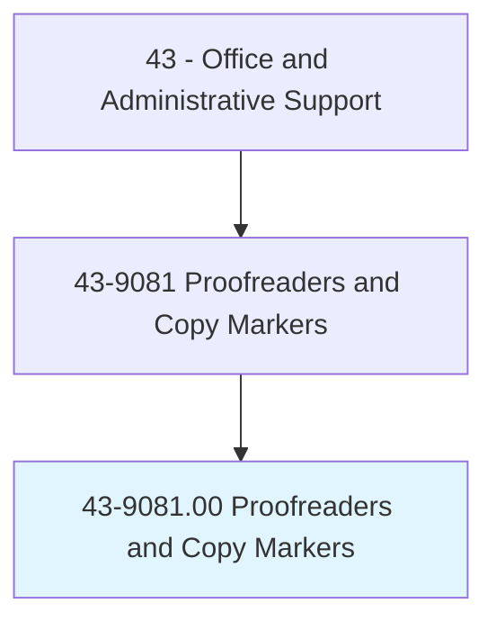
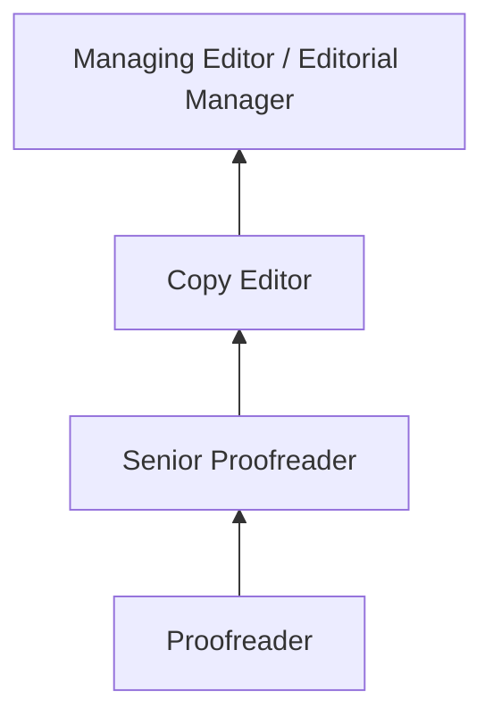
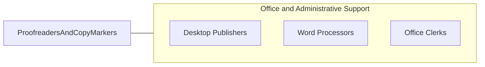

# Proofreaders and Copy Markers

> Read transcript or proof type setup to detect and mark errors. May measure dimensions, spacing, and positioning of page elements to verify conformance to specifications, using printer's ruler.

## Overview

Proofreaders and Copy Markers review written material to identify and correct errors in grammar, spelling, punctuation, formatting, and layout before publication or distribution. They compare proofs against original manuscripts, check typographical accuracy, verify consistency in style and formatting, and mark corrections using standard proofreading symbols or digital annotation tools.

Working in publishing houses, advertising agencies, corporate communications departments, legal firms, and print production facilities, proofreaders serve as the final quality checkpoint before content reaches its audience. They may review books, magazines, marketing materials, legal documents, websites, and corporate communications, ensuring accuracy and adherence to style guides.

The occupation has evolved from traditional print markup to digital proofreading using track changes, PDF annotations, and content management systems. While spell-check and grammar tools have automated basic error detection, skilled proofreaders remain essential for catching contextual errors, formatting inconsistencies, and layout problems that automated tools miss.

## Classification Hierarchy

## Key Statistics

| Metric | Value |
|--------|-------|
| SOC Code | 43-9081.00 |
| Job Zone | 3 (Medium Preparation) |
| Category | [Office and Administrative Support](/occupations/Administrative/index) |
| Median Annual Salary | $41,200 |
| Employment | ~10,000 |
| Projected Growth | -15% (rapidly declining) |
| Core Tasks | 20 |
| Source | O*NET |

## Core Tasks

Core task data with GraphDL semantic actions for this occupation is maintained in the data pipeline. See [O*NET 43-9081.00](https://www.onetonline.org/link/summary/43-9081.00) for detailed task information.

## Skills & Competencies

### Technical Skills
- **Grammar and Punctuation** - Expert
- **Style Guide Application (AP, Chicago, APA)** - Expert
- **Proofreading Marks** - Expert
- **Layout and Typography Verification** - Advanced
- **Digital Annotation Tools** - Advanced

### Soft Skills
- **Attention to Detail** - Critical
- **Concentration** - Critical
- **Accuracy** - Critical
- **Patience** - Essential
- **Critical Thinking** - Essential

## Education & Certifications

| Requirement | Details |
|-------------|---------|
| Typical Education | Associate's or bachelor's degree in English, journalism, or communications |
| Proofreading Certificate | Community college or professional programs |
| Style Guide Proficiency | AP, Chicago Manual, APA, house styles |
| Copy Editing Certification | ACES or EFA credentials |

## Career Progression

## Industry Variations

| Setting | Focus | Unique Aspects |
|---------|-------|----------------|
| Book Publishing | Manuscripts and galleys | Long-form reading; style consistency; author queries |
| Legal | Contracts, briefs, filings | Extreme precision; legal terminology; citation checking |
| Advertising | Marketing copy, campaigns | Brand voice; multiple versions; tight deadlines |
| Corporate | Reports, communications | Executive correspondence; regulatory filings; brand standards |

## Technology & Tools

- **Digital Proofing** - Adobe Acrobat, Track Changes
- **Style References** - AP Stylebook, Chicago Manual online
- **Grammar** - Grammarly, PerfectIt (supplemental)
- **Publishing** - InDesign, content management systems

## Related Occupations

## Departments

This occupation typically works in:
- Editorial - Content quality control
- [Marketing](/departments/Marketing) - Campaign materials review
- [Legal](/departments/Legal) - Document accuracy
- Communications - Corporate messaging

---

*Source: O*NET 43-9081.00 - ONETOccupation*
