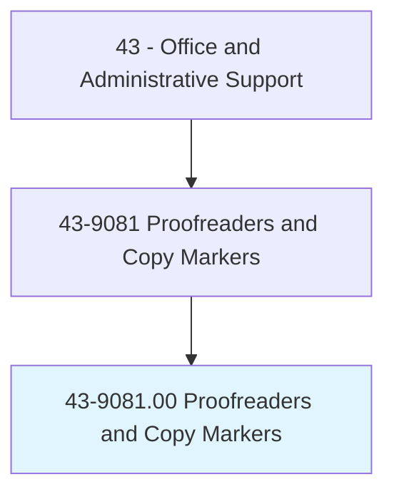
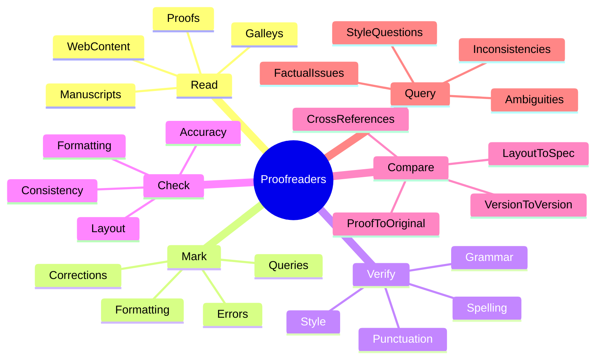
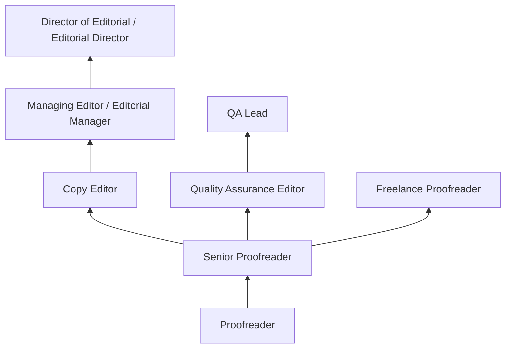
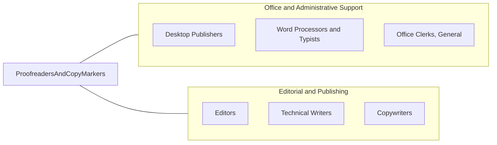

# Proofreaders and Copy Markers

> Read transcript or proof type setup to detect and mark errors. May measure dimensions, spacing, and positioning of page elements to verify conformance to specifications, using printer's ruler.

## Overview

Proofreaders and Copy Markers review written material to identify and correct errors in grammar, spelling, punctuation, formatting, and layout before publication or distribution. They compare proofs against original manuscripts, check typographical accuracy, verify consistency in style and formatting, and mark corrections using standard proofreading symbols or digital annotation tools.

Working in publishing houses, advertising agencies, corporate communications departments, legal firms, and print production facilities, proofreaders serve as the final quality checkpoint before content reaches its audience. They may review books, magazines, marketing materials, legal documents, websites, and corporate communications, ensuring accuracy and adherence to style guides.

The occupation has evolved from traditional print markup to digital proofreading using track changes, PDF annotations, and content management systems. While spell-check and grammar tools have automated basic error detection, skilled proofreaders remain essential for catching contextual errors, formatting inconsistencies, and layout problems that automated tools miss. The human eye and judgment remain critical for maintaining publication quality and brand standards.

## Classification Hierarchy

## Key Statistics

| Metric | Value |
|--------|-------|
| SOC Code | 43-9081.00 |
| Job Zone | 3 (Medium Preparation) |
| Category | [Office and Administrative Support](/occupations/Administrative/index) |
| Median Annual Salary | $41,200 |
| Salary Range | $28,000 - $62,000 |
| 10th Percentile | $28,500 |
| 90th Percentile | $61,500 |
| Employment | ~10,000 |
| Projected Growth | -15% (rapidly declining) |
| Core Tasks | 20 |
| Source | O*NET |

## Core Tasks

### read.ContentForErrors

Proofreaders carefully read content to identify errors and issues.

**Actions:**
- `read.Manuscripts.for.Errors` - Review written content for mistakes
- `read.Proofs.against.Originals` - Compare typeset copy to approved manuscripts
- `read.Galleys.before.FinalPrint` - Check page proofs before printing
- `read.WebContent.for.Accuracy` - Review online content before publication
- `read.Marketing.Materials.for.Quality` - Check advertising and promotional content
- `read.LegalDocuments.for.Precision` - Verify accuracy in legal materials

### mark.CorrectionsAndQueries

Proofreaders indicate needed changes using standard notation or digital tools.

**Actions:**
- `mark.Errors.using.ProofreadingSymbols` - Use standard marks for corrections
- `annotate.PDFs.with.Corrections` - Add digital markup to electronic files
- `use.TrackChanges.for.Revisions` - Mark corrections in word processing documents
- `write.Queries.for.Authors` - Note questions requiring author decision
- `flag.Formatting.Issues.for.Designers` - Identify layout problems for resolution
- `document.Corrections.clearly.for.Implementation` - Ensure changes are understandable

### verify.LanguageAccuracy

Proofreaders check the accuracy of written language elements.

**Actions:**
- `verify.Spelling.against.Dictionaries` - Check word spelling including proper nouns
- `verify.Grammar.for.Correctness` - Ensure grammatical accuracy
- `verify.Punctuation.per.StyleGuide` - Check punctuation usage and consistency
- `verify.Usage.for.CorrectContext` - Confirm words are used properly
- `verify.Names.and.Titles.for.Accuracy` - Check proper nouns and designations
- `verify.Numbers.and.Dates.for.Consistency` - Ensure numerical accuracy

### check.FormattingConsistency

Proofreaders ensure consistent formatting throughout documents.

**Actions:**
- `check.Headings.for.ConsistentStyle` - Verify heading hierarchy and formatting
- `check.Fonts.and.Typography` - Confirm correct typefaces and sizes
- `check.Spacing.and.Alignment` - Verify proper margins and layout
- `check.TableFormatting.for.Consistency` - Ensure tables follow standards
- `check.ListFormatting.for.Uniformity` - Verify bulleted and numbered lists
- `check.PageElements.against.Specifications` - Confirm layout meets requirements

### compare.DocumentVersions

Proofreaders compare different versions to ensure accuracy.

**Actions:**
- `compare.Proofs.to.Manuscripts` - Verify typeset matches approved content
- `compare.Corrections.to.OriginalMarks` - Confirm all changes were made
- `compare.FinalVersion.to.Previous` - Check that only approved changes appear
- `compare.Layout.to.DesignSpecifications` - Verify conformance to design
- `verify.CrossReferences.within.Documents` - Check internal references are accurate
- `compare.Indexes.and.TOC.to.Content` - Ensure navigational elements are correct

### query.AmbiguousContent

Proofreaders flag issues requiring author or editor decision.

**Actions:**
- `query.Ambiguous.Passages.for.Clarity` - Note unclear content for review
- `query.FactualInconsistencies.for.Verification` - Flag potentially incorrect information
- `query.StyleInconsistencies.for.Resolution` - Note departures from style guide
- `query.PotentialLegal.Issues.for.Review` - Flag potentially problematic content
- `communicate.Queries.to.Authors` - Present questions requiring decision
- `follow.Up.on.UnresolvedQueries` - Track query resolution

## Skills & Competencies

### Technical Skills
- **Grammar and Punctuation** - Expert (comprehensive knowledge of language rules)
- **Style Guide Application (AP, Chicago, APA)** - Expert (multiple style guide proficiency)
- **Proofreading Marks** - Expert (standard symbols and conventions)
- **Layout and Typography Verification** - Advanced (design and formatting standards)
- **Digital Annotation Tools** - Advanced (PDF markup, track changes)
- **Reference Verification** - Advanced (citations, cross-references, indexes)
- **Spelling and Vocabulary** - Expert (including specialized terminology)
- **Research Skills** - Intermediate (fact-checking, verification)

### Soft Skills
- **Attention to Detail** - Critical (catching subtle errors)
- **Concentration** - Critical (sustained focus on detailed work)
- **Accuracy** - Critical (error-free output)
- **Patience** - Essential (thorough, methodical review)
- **Critical Thinking** - Essential (identifying problems and inconsistencies)
- **Communication** - Important (clear query writing)
- **Time Management** - Important (meeting publication deadlines)

## Education & Certifications

| Requirement | Details |
|-------------|---------|
| Typical Education | Associate's or bachelor's degree in English, journalism, or communications |
| Preferred Education | Bachelor's degree with strong language background |
| Proofreading Certificate | Community college or professional programs |
| Style Guide Proficiency | AP, Chicago Manual, APA, legal, medical styles |
| Copy Editing Certification | ACES (American Copy Editors Society) or EFA credentials |
| Industry Certification | Publishing, legal, or medical editing credentials |
| Continuing Education | Style guide updates, software training |

## Career Progression

### Career Pathway Details

| Level | Title | Years Experience | Key Responsibilities |
|-------|-------|------------------|----------------------|
| Entry | Proofreader | 0-2 years | Basic proofreading, following guidelines |
| Mid | Senior Proofreader | 2-5 years | Complex materials, training, quality standards |
| Editor | Copy Editor | 5-8 years | Substantive editing, style decisions, author queries |
| Senior | Managing Editor | 8-12 years | Editorial team leadership, quality oversight |
| Director | Editorial Director | 12+ years | Editorial strategy, department management |

### Alternative Career Paths

| Path | Description | Requirements |
|------|-------------|--------------|
| Copy Editing | More substantive editing work | Editing skills, style expertise |
| Content Management | Digital content oversight | CMS knowledge, web publishing |
| Quality Assurance | Document quality systems | Process focus, standards knowledge |
| Freelance | Independent proofreading | Self-marketing, client management |

## Industry Variations

| Setting | Focus | Unique Aspects |
|---------|-------|----------------|
| Book Publishing | Manuscripts and galleys | Long-form reading; style consistency; author queries; multiple passes |
| Legal | Contracts, briefs, filings | Extreme precision; legal terminology; citation checking; liability awareness |
| Advertising | Marketing copy, campaigns | Brand voice; multiple versions; tight deadlines; visual integration |
| Corporate | Reports, communications | Executive correspondence; regulatory filings; brand standards; multilingual |
| Academic | Journals, textbooks | Citation accuracy; specialized terminology; peer review integration |
| Medical | Clinical documents, journals | Medical terminology; regulatory compliance; patient safety implications |

### Book and Magazine Publishing

Publishing proofreaders work on manuscripts, galley proofs, and page proofs through multiple rounds of review. They ensure consistency across long documents, verify front and back matter, check indexes and tables of contents, and maintain house style. Deadlines are driven by publication schedules, with peak workloads around publication dates.

### Legal Proofreading

Legal proofreaders verify contracts, court filings, corporate documents, and regulatory submissions with extreme precision. Errors in legal documents can have significant consequences, making accuracy paramount. They check citations, verify parties and dates, and ensure documents meet court formatting requirements.

### Advertising and Marketing

Advertising proofreaders review campaigns across multiple media and versions, checking brand consistency, legal disclaimers, and promotional accuracy. They work with tight deadlines and multiple stakeholders, verifying content from creative brief through final production. Brand voice and visual-text integration are key concerns.

### Corporate Communications

Corporate proofreaders handle executive communications, annual reports, regulatory filings, and internal documents. They ensure consistency with brand guidelines, verify financial data presentation, and maintain appropriate tone for different audiences. Confidentiality is often required for sensitive materials.

## Technology & Tools

### Digital Proofing Software
- **Adobe Acrobat** - PDF annotation and markup
- **Microsoft Word Track Changes** - Word processing revision tracking
- **InCopy** - Adobe publishing workflow
- **Grammarly / ProWritingAid** - Supplemental grammar checking
- **PerfectIt** - Consistency checking software

### Style References
- **AP Stylebook** - Associated Press style guide (journalism)
- **Chicago Manual of Style** - Academic and book publishing
- **APA Publication Manual** - Academic psychology and social sciences
- **Legal Style Guides** - Bluebook, ALWD for legal citations
- **House Style Guides** - Organization-specific standards

### Publishing Systems
- **InDesign** - Page layout review
- **Content Management Systems** - Web publishing platforms
- **Version Control** - Document tracking systems
- **Workflow Tools** - Editorial workflow management

### Reference Tools
- **Dictionaries** - Merriam-Webster, Oxford, specialized
- **Thesauruses** - Word choice verification
- **Citation Databases** - Reference verification
- **Fact-Checking Resources** - Verification sources

## Work Environment

### Physical Setting
- Office or home office environment
- Computer workstation with large monitor
- Quiet environment for concentration
- Reference materials accessible
- Remote work increasingly common

### Work Schedule
- Standard business hours with deadline flexibility
- Publication deadline-driven workload
- Overtime during production crunch periods
- Freelance schedules may vary widely
- Part-time positions available

### Physical Requirements
- Extended periods of reading and screen work
- Sedentary seated position
- Eye strain from detailed review
- Fine motor skills for markup
- Minimal physical demands otherwise

### Work Characteristics
- High-concentration, solitary work
- Detail-intensive reading
- Deadline pressure at publication times
- Quality-focused output expectations
- Often working with confidential materials

## Related Occupations

### Related Occupation Comparison

| Occupation | Similarity | Key Difference |
|------------|------------|----------------|
| Editors | High | Substantive editing vs error checking |
| Desktop Publishers | Medium | Layout focus vs text focus |
| Technical Writers | Medium | Creating vs checking content |
| Word Processors | Medium | Production vs quality review |

## Industries

- [Publishing](/industries/Information) - Moderate Employment
- [Legal Services](/industries/ProfessionalServices) - Moderate Employment
- [Advertising](/industries/ProfessionalServices) - Moderate Employment
- [Corporate](/industries/Corporate) - Moderate Employment
- [Education](/industries/Education) - Low Employment

## Departments

This occupation typically works in:
- Editorial - Content quality control
- [Marketing](/departments/Marketing) - Campaign materials review
- [Legal](/departments/Legal) - Document accuracy verification
- Communications - Corporate messaging
- Publishing - Production quality

## Performance Metrics

| Metric | Description | Typical Target |
|--------|-------------|----------------|
| Error Detection | Errors caught per page/document | High catch rate |
| Accuracy | Errors missed per reviewed unit | Near-zero miss rate |
| Throughput | Pages or words reviewed per hour | Meet production needs |
| Turnaround | Time from receipt to completion | Meet deadlines |
| Query Quality | Clarity and appropriateness of queries | Valuable, not excessive |

## Occupational Outlook

### Declining Demand
The occupation faces decline due to:
- Automated spell-check and grammar tools
- Reduced print publication volume
- Self-publishing with minimal editing
- Budget pressures on editorial quality

### Continuing Value
Proofreaders remain needed for:
- High-stakes legal and medical documents
- Quality publishing maintaining standards
- Complex formatting and layout
- Contextual errors tools cannot catch

---

*Source: O*NET 43-9081.00 - ONETOccupation*
