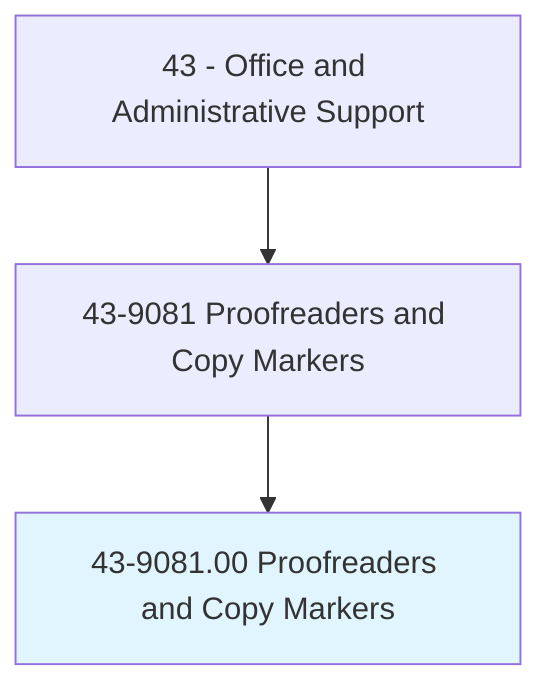
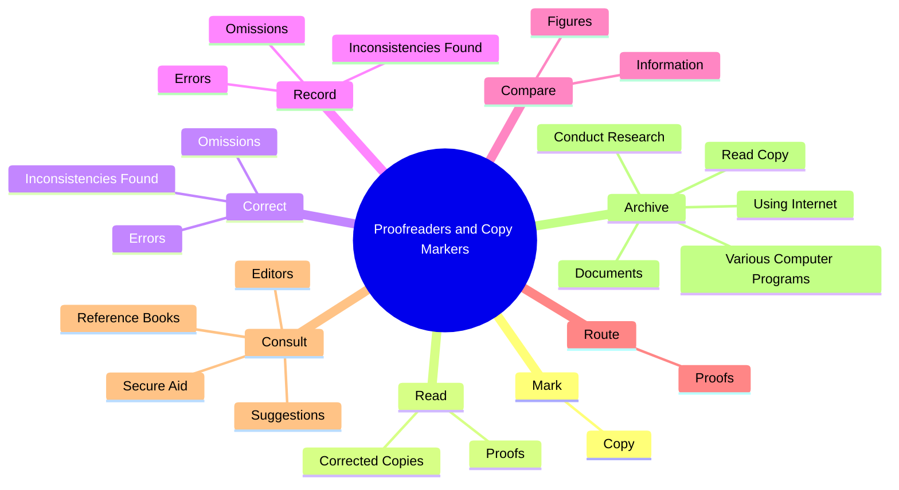
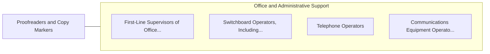

# Proofreaders and Copy Markers

> Read transcript or proof type setup to detect and mark for correction any grammatical, typographical, or compositional errors. Excludes workers whose primary duty is editing copy. Includes proofreaders of braille.

## Overview

Proofreaders and Copy Markers is an occupation within the Office and Administrative Support category. Read transcript or proof type setup to detect and mark for correction any grammatical, typographical, or compositional errors. Excludes workers whose primary duty is editing copy.

## Classification Hierarchy

## Key Statistics

| Metric | Value |
|--------|-------|
| SOC Code | 43-9081.00 |
| Category | [Office and Administrative Support](/occupations/Administrative) |
| Task Count | 82 |
| Source | O*NET |

## Core Tasks

### mark.Copy

Proofreaders and Copy Markers mark copy as part of their core responsibilities.

**Actions:**
- `mark.Copy.to.indicate.ErrorsInType`
- `mark.Copy.to.correct.ErrorsInType`
- `mark.Copy.to.Arrangement`
- `mark.Copy.to.Grammar`

### read.CorrectedCopies

Proofreaders and Copy Markers read corrected copies as part of their core responsibilities.

**Actions:**
- `read.CorrectedCopies.to.ensure.CorrectionsHaveBeenMade`
- `read.Proofs.to.ensure.CorrectionsHaveBeenMade`

### correct.Omissions

Proofreaders and Copy Markers correct omissions as part of their core responsibilities.

**Actions:**
- `correct.Omissions`
- `correct.Errors`
- `correct.InconsistenciesFound`

## Skills & Competencies

### Technical Skills
- **Office Management** - Advanced
- **Data Entry** - Advanced
- **Records Management** - Advanced

### Soft Skills
- **Communication** - Essential
- **Problem Solving** - Essential
- **Critical Thinking** - Important
- **Teamwork** - Important
- **Adaptability** - Important

## Related Occupations

## Industries

This occupation is found across multiple industries. See [Industries](/industries) for sector-specific employment data.

## Career Progression

---

*Source: O*NET 43-9081.00 - ONETOccupation*
