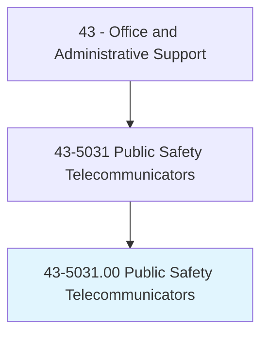
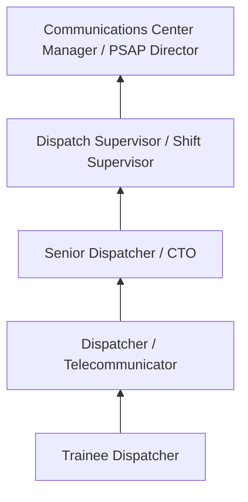
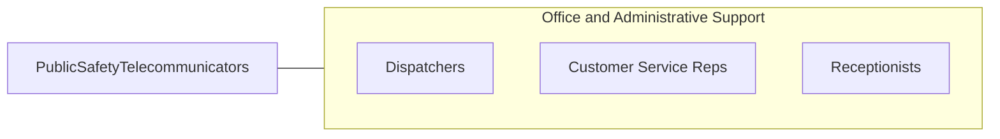

# Public Safety Telecommunicators

> Operate telephone, radio, or other communication systems to receive and communicate requests for emergency assistance at 911 public safety answering points and emergency operations centers. Take information from the public and other sources regarding crimes, threats, disturbances, acts of terrorism, fires, medical emergencies, and other public safety matters.

## Overview

Public Safety Telecommunicators, commonly known as 911 dispatchers, serve as the critical first link in the emergency response chain. They answer emergency and non-emergency calls, assess the nature and severity of situations, dispatch police, fire, and EMS resources, provide pre-arrival instructions to callers (including CPR guidance and first aid), and coordinate multi-agency responses to complex incidents.

Working in public safety answering points (PSAPs), these professionals operate computer-aided dispatch (CAD) systems, multi-line phone systems, and radio communications equipment simultaneously. They must rapidly extract critical information from callers who may be panicked, injured, or in danger, then make split-second decisions about resource allocation and response priority.

The role demands exceptional emotional resilience, as telecommunicators routinely handle calls involving life-threatening emergencies, violent crimes, and traumatic situations. They are increasingly recognized as first responders, with growing attention to the PTSD and stress-related impacts of the profession.

## Classification Hierarchy

## Key Statistics

| Metric | Value |
|--------|-------|
| SOC Code | 43-5031.00 |
| Job Zone | 2 (Some Preparation) |
| Category | [Office and Administrative Support](/occupations/Administrative/index) |
| Median Annual Salary | $46,900 |
| Employment | ~95,000 |
| Projected Growth | 4% (as fast as average) |
| Core Tasks | 35 |
| Source | O*NET |

## Core Tasks

Core task data with GraphDL semantic actions for this occupation is maintained in the data pipeline. See [O*NET 43-5031.00](https://www.onetonline.org/link/summary/43-5031.00) for detailed task information.

## Skills & Competencies

### Technical Skills
- **CAD Systems (Computer-Aided Dispatch)** - Expert
- **Multi-Line Phone Systems** - Expert
- **Radio Communications** - Expert
- **Emergency Medical Dispatch (EMD)** - Advanced
- **GIS/Mapping Systems** - Advanced

### Soft Skills
- **Composure Under Pressure** - Critical
- **Active Listening** - Critical
- **Multi-Tasking** - Critical
- **Decision Making** - Critical
- **Empathy** - Essential
- **Emotional Resilience** - Critical

## Education & Certifications

| Requirement | Details |
|-------------|---------|
| Typical Education | High school diploma |
| EMD Certification | Emergency Medical Dispatch (IAED) |
| CPR Certification | Required |
| APCO RPL | Registered Public-Safety Leader |
| NENA Certification | 911 center operations |
| CritiCall Testing | Pre-employment skills assessment |

## Career Progression

## Industry Variations

| Setting | Focus | Unique Aspects |
|---------|-------|----------------|
| Municipal 911 | All-hazard dispatch | Police, fire, EMS; primary PSAP; highest call volume |
| County/Regional | Multi-jurisdiction | Consolidated dispatch; mutual aid; wider coverage |
| State Police | Highway and state response | Trooper dispatch; highway incidents; statewide coverage |
| Fire/EMS Only | Medical and fire dispatch | EMD protocols; fire station alerting; medical priority dispatch |

## Technology & Tools

- **CAD** - Tyler New World, Hexagon, Motorola CommandCentral
- **Phone** - Intrado Viper, TCS NG911
- **Radio** - P25 digital radio, dispatch consoles
- **Mapping** - GIS, ALI/ANI, RapidSOS

## Related Occupations

## Departments

This occupation typically works in:
- 911 Center / PSAP - Emergency call taking
- Dispatch - Resource dispatching
- Emergency Management - Incident coordination
- Public Safety - Communications operations

---

*Source: O*NET 43-5031.00 - ONETOccupation*
