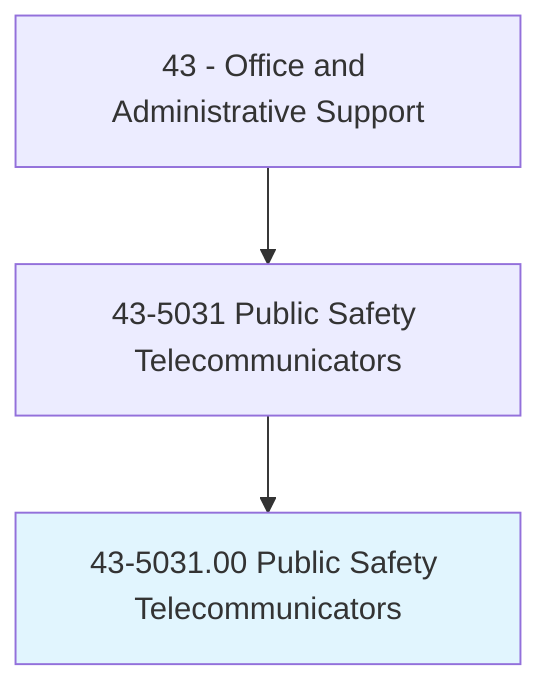
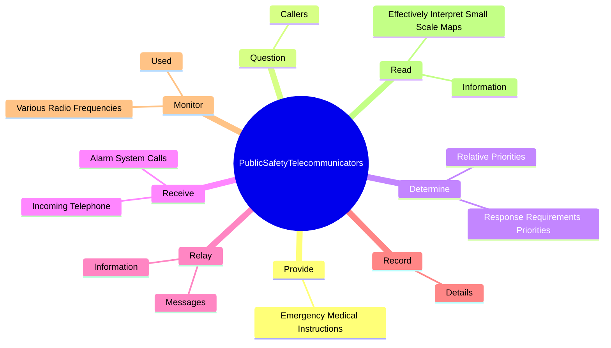
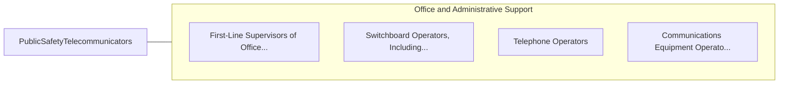

# Public Safety Telecommunicators

> Operate telephone, radio, or other communication systems to receive and communicate requests for emergency assistance at 9-1-1 public safety answering points and emergency operations centers. Take information from the public and other sources regarding crimes, threats, disturbances, acts of terrorism, fires, medical emergencies, and other public safety matters. May coordinate and provide information to law enforcement and emergency response personnel. May access sensitive databases and other information sources as needed. May provide additional instructions to callers based on knowledge of and certification in law enforcement, fire, or emergency medical procedures.

## Overview

Public Safety Telecommunicators is an occupation within the Office and Administrative Support category. Operate telephone, radio, or other communication systems to receive and communicate requests for emergency assistance at 9-1-1 public safety answering points and emergency operations centers. Take information from the public and other sources regarding crimes, threats, disturbances, acts of terrorism, fires, medical emergencies, and other public safety matters.

## Classification Hierarchy

## Key Statistics

| Metric | Value |
|--------|-------|
| SOC Code | 43-5031.00 |
| Category | [Office and Administrative Support](/occupations/Administrative) |
| Task Count | 91 |
| Source | O*NET |

## Core Tasks

### provide.EmergencyMedicalInstructions

Public Safety Telecommunicators provide emergency medical instructions as part of their core responsibilities.

**Actions:**
- `provide.EmergencyMedicalInstructions.to.Callers`

### question.Callers

Public Safety Telecommunicators question callers as part of their core responsibilities.

**Actions:**
- `question.Callers.to.determine.Locations`
- `question.Callers.to.NatureOfProblemsToDetermineTypeOfResponseNeeded`

### determine.ResponseRequirementsPriorities

Public Safety Telecommunicators determine response requirements priorities as part of their core responsibilities.

**Actions:**
- `determine.ResponseRequirementsPriorities.of.Situations`
- `determine.ResponseRequirementsPriorities.of.DispatchUnits.in.AccordanceWithEstablishedProcedures`
- `determine.RelativePriorities.of.Situations`
- `determine.RelativePriorities.of.DispatchUnits.in.AccordanceWithEstablishedProcedures`

## Skills & Competencies

### Technical Skills
- **Office Management** - Advanced
- **Data Entry** - Advanced
- **Records Management** - Advanced

### Soft Skills
- **Communication** - Essential
- **Problem Solving** - Essential
- **Critical Thinking** - Important
- **Teamwork** - Important
- **Adaptability** - Important

## Related Occupations

## Industries

This occupation is found across multiple industries. See [Industries](/industries) for sector-specific employment data.

## Career Progression

---

*Source: O*NET 43-5031.00 - ONETOccupation*
