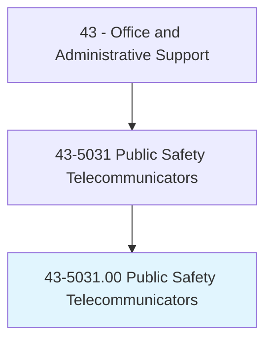
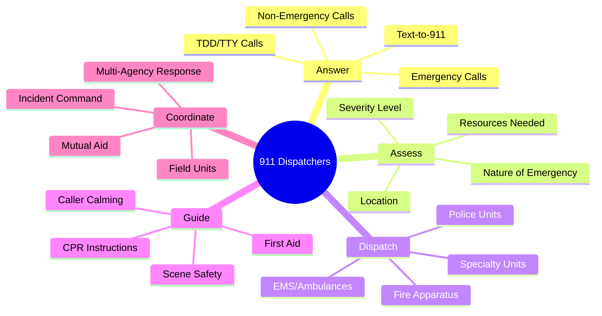
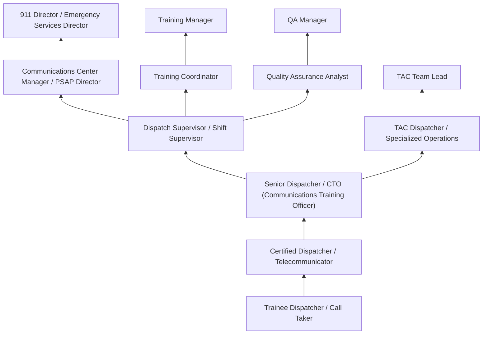
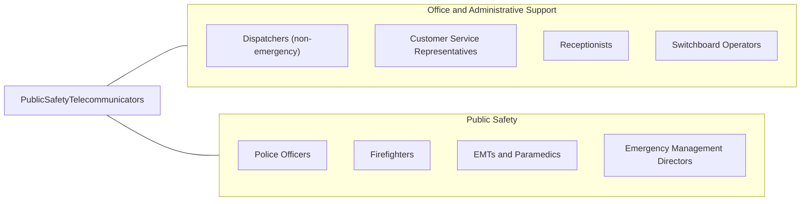

# Public Safety Telecommunicators

> Operate telephone, radio, or other communication systems to receive and communicate requests for emergency assistance at 911 public safety answering points and emergency operations centers. Take information from the public and other sources regarding crimes, threats, disturbances, acts of terrorism, fires, medical emergencies, and other public safety matters.

## Overview

Public Safety Telecommunicators, commonly known as 911 dispatchers or emergency dispatchers, serve as the critical first link in the emergency response chain, often making the difference between life and death through their rapid assessment, resource deployment, and caller guidance. They answer emergency and non-emergency calls, assess the nature and severity of situations using structured protocols, dispatch appropriate police, fire, and emergency medical services (EMS) resources, provide pre-arrival instructions to callers (including CPR guidance, bleeding control, and childbirth assistance), and coordinate multi-agency responses to complex incidents.

Working in public safety answering points (PSAPs) and emergency operations centers, these professionals operate sophisticated computer-aided dispatch (CAD) systems, multi-line phone systems with 911 trunk lines, and radio communications equipment simultaneously. They must rapidly extract critical information from callers who may be panicked, injured, unable to speak clearly, or in active danger, then make split-second decisions about resource allocation, response priority, and inter-agency coordination. A single dispatcher may handle dozens of calls per shift while managing radio traffic for multiple field units.

The role demands exceptional emotional resilience, as telecommunicators routinely handle calls involving life-threatening emergencies, violent crimes, suicides, child abuse, fatal accidents, and traumatic situations. They hear callers take their last breaths, stay on the line during active shooter incidents, and guide untrained citizens through emergency medical procedures. The profession is increasingly recognized as first responders, with growing attention to the post-traumatic stress disorder (PTSD), secondary trauma, and burnout that affect many in the field. Despite these challenges, telecommunicators find profound purpose in saving lives and serving their communities.

## Classification Hierarchy



## Key Statistics

| Metric | Value |
|--------|-------|
| SOC Code | 43-5031.00 |
| Job Zone | 2 (Some Preparation) |
| Category | [Office and Administrative Support](/occupations/Administrative/index) |
| Median Annual Salary | $46,900 |
| Salary Range | $32,000 - $70,000 |
| 10th Percentile | $32,500 |
| 90th Percentile | $69,800 |
| Employment | ~95,000 |
| Projected Growth | 4% (as fast as average) |
| Annual Openings | ~12,000 |
| Core Tasks | 35 |
| Source | O*NET |

## Core Tasks



### answer.EmergencyCalls

Public Safety Telecommunicators receive and process emergency calls.

**Actions:**
- `answer.Calls.within.Standards`
- `assess.Situations.using.Protocols`
- `obtain.Information.from.Callers`
- `determine.Priority.of.Response`

### dispatch.EmergencyServices

Public Safety Telecommunicators dispatch appropriate resources.

**Actions:**
- `dispatch.Units.to.Emergencies`
- `coordinate.Response.across.Agencies`
- `provide.Updates.to.FieldUnits`
- `track.Status.of.Incidents`

## Skills & Competencies

### Technical Skills
- **Computer-Aided Dispatch (CAD) Systems** - Expert (Tyler New World, Hexagon, Motorola)
- **Multi-Line Phone Systems** - Expert (NG911, Intrado, West)
- **Radio Communications** - Expert (P25 digital, dispatch consoles)
- **Emergency Medical Dispatch (EMD)** - Expert (MPDS, FPDS protocols)
- **GIS/Mapping Systems** - Advanced (RapidSOS, location services)
- **NCIC/CJIS Systems** - Advanced (criminal justice databases)
- **Recording Systems** - Advanced (call recording, playback)
- **Typing Speed** - Advanced (50+ WPM while on calls)

### Soft Skills
- **Composure Under Pressure** - Critical (life-or-death decisions)
- **Active Listening** - Critical (extracting information from distressed callers)
- **Multi-Tasking** - Critical (simultaneous calls, radio, CAD)
- **Decision Making** - Critical (rapid resource allocation)
- **Empathy** - Essential (connecting with callers in crisis)
- **Emotional Resilience** - Critical (managing trauma exposure)
- **Clear Communication** - Critical (radio transmissions, caller instructions)
- **Stress Management** - Critical (sustaining performance under pressure)

## Education & Certifications

| Requirement | Details |
|-------------|---------|
| Typical Education | High school diploma |
| Preferred Education | Associate's degree in criminal justice or emergency management |
| EMD Certification | Emergency Medical Dispatch (IAED MPDS) |
| EFD Certification | Emergency Fire Dispatch protocols |
| EPD Certification | Emergency Police Dispatch protocols |
| CPR Certification | Basic CPR for instruction purposes |
| APCO PST1 | Public Safety Telecommunicator 1 certification |
| NENA Standards | NG911 and PSAP operations |
| CritiCall Testing | Pre-employment skills assessment |
| Background Check | Criminal history, drug screening |

## Career Progression



### Career Pathway Details

| Level | Title | Years Experience | Key Responsibilities |
|-------|-------|------------------|----------------------|
| Entry | Trainee / Call Taker | 0-1 years | Supervised call handling, non-emergency, training |
| Certified | Dispatcher / Telecommunicator | 1-3 years | Independent call taking and dispatching |
| Senior | Senior Dispatcher / CTO | 3-6 years | Complex incidents, training new dispatchers |
| Supervisory | Dispatch Supervisor | 6-10 years | Shift oversight, quality review, personnel |
| Management | Communications Center Manager | 10-15 years | PSAP operations, budgets, technology |
| Director | 911 Director | 15+ years | Strategic planning, regional coordination |

### Specialization Paths

| Specialization | Focus Area | Additional Training |
|----------------|------------|--------------------|
| Emergency Medical Dispatch | Medical calls | Advanced EMD, Q/A, instructor certification |
| TAC/SWAT Dispatch | Tactical operations | Specialized protocols, command structure |
| Training and Quality | Staff development | CTO certification, adult education |
| NG911 Technology | Next-gen systems | Technical certifications, project management |

## Industry Variations

| Setting | Focus | Unique Aspects |
|---------|-------|----------------|
| Municipal 911 (Primary PSAP) | All-hazard dispatch | Police, fire, EMS; highest call volume; community first responders |
| County/Regional PSAP | Multi-jurisdiction | Consolidated dispatch; mutual aid; multiple agencies; wider coverage |
| State Police/Highway | Highway and state response | Trooper dispatch; highway incidents; large geographic coverage |
| Fire/EMS Only (Secondary PSAP) | Medical and fire dispatch | EMD protocols; fire station alerting; medical priority dispatch |
| University/Campus | Campus safety | Smaller scale; escort services; building emergencies; student population |
| Tribal 911 | Reservation coverage | Federal coordination; remote areas; cultural considerations |

### Municipal 911 Centers

Municipal PSAPs handle the full range of emergency calls for cities and towns, dispatching police, fire, and EMS resources. Call volumes are highest in urban areas, and dispatchers must know local geography, street addresses, and agency jurisdictions intimately. Many municipal centers operate 24/7/365 with shift rotations covering all hours.

### Regional/Consolidated Centers

Regional PSAPs serve multiple jurisdictions through consolidation agreements, providing dispatch services for several cities, towns, or counties. Dispatchers must master multiple agency protocols, geographic areas, and communication systems. Consolidation improves efficiency but increases complexity.

### State Police Dispatch

State police dispatch centers handle trooper deployment, highway emergencies, and statewide coordination. Geographic coverage is much larger than municipal centers, often encompassing entire regions. Interstate highway incidents, pursuit coordination, and major incident management are common responsibilities.

### Fire/EMS Dispatch

Some jurisdictions separate fire and EMS dispatch into secondary PSAPs that receive calls transferred from primary 911 centers. Dispatchers specialize in medical priority dispatch (using EMD protocols), fire department alerting, and EMS unit management. Medical calls may include providing CPR instructions, controlling bleeding, and assisting with childbirth.

## Technology & Tools

### Computer-Aided Dispatch (CAD)
- **Tyler New World Systems** - Public safety CAD
- **Hexagon Safety & Infrastructure** - I/CAD and HxGN OnCall
- **Motorola CommandCentral** - Enterprise public safety
- **Mark43** - Cloud-based CAD/RMS
- **Zetron** - Radio dispatch integration

### Phone Systems and NG911
- **Intrado Viper** - NG911 call handling
- **West/Intrado** - 911 network services
- **TCS NG911** - Next-gen call delivery
- **Bandwidth** - NG911 services
- **RapidSOS** - Enhanced location and data

### Radio Communications
- **P25 Digital Radio** - Public safety standard
- **Motorola Solutions** - Dispatch consoles, APX radios
- **Harris/L3** - P25 infrastructure
- **Avtec Scout** - Dispatch console systems
- **JPS Communications** - Interoperability

### Mapping and Location
- **ESRI ArcGIS** - GIS mapping for public safety
- **RapidSOS Portal** - Emergency data platform
- **ALI/ANI** - Automatic location/number identification
- **What3words** - Location verification
- **Google/Apple Maps** - Supplemental mapping

## Related Occupations



### Related Occupation Comparison

| Occupation | Similarity | Key Difference |
|------------|------------|----------------|
| Dispatchers (non-emergency) | Medium | Routine vs emergency dispatching |
| Customer Service Representatives | Low | Emergency vs commercial service |
| Police Officers | Medium | Field response vs communications |
| Emergency Management Directors | Medium | Strategy vs operations |

## Industries

- [Government (Local)](/industries/PublicAdministration/LocalGovernment) - Primary Employment
- [Government (State)](/industries/PublicAdministration) - Moderate Employment
- [Government (Federal)](/industries/PublicAdministration) - Low Employment

## Departments

This occupation typically works in:
- 911 Center / PSAP - Primary emergency call taking
- Police Dispatch - Law enforcement dispatching
- Fire/EMS Dispatch - Fire and medical dispatching
- Emergency Management - Incident coordination
- Public Safety Communications - Overall department

## Work Environment

### Physical Setting
- Climate-controlled communications center
- Multi-monitor workstation with CAD, mapping, phone
- Radio console and headset equipment
- Limited natural light (24/7 operations)
- Secure facility with restricted access

### Work Schedule
- 24/7/365 operations
- 8, 10, or 12-hour shifts
- Rotating schedules (days, evenings, nights)
- Mandatory overtime during major incidents
- Holiday and weekend work required
- Shift bidding based on seniority

### Work Characteristics
- High-stress, fast-paced environment
- Sedentary work with mental intensity
- Constant phone and radio activity
- Multi-tasking throughout shift
- Performance monitoring and recording
- Limited break flexibility during busy periods

### Mental Health Considerations
- Cumulative exposure to traumatic calls
- Secondary/vicarious trauma risk
- PTSD rates comparable to field first responders
- Critical incident stress management (CISM)
- Employee assistance programs essential
- Peer support programs increasingly common

## Compensation and Benefits

### Public Sector Benefits

| Benefit | Details |
|---------|---------|
| Health Insurance | Government employee health plans |
| Retirement | Public pension systems (varies by state/locality) |
| Shift Differential | Additional pay for evening/night shifts |
| Overtime | Time-and-a-half for overtime hours |
| Paid Time Off | Vacation, sick leave, personal days |
| Training Pay | Compensation during academy/training |

### First Responder Recognition

Many states have enacted legislation recognizing telecommunicators as first responders, providing:
- Workers compensation for PTSD
- Mental health resources
- Presumptive coverage for work-related illness
- Retirement benefit enhancements

## Performance Standards

### Key Performance Indicators

| Metric | Description | Typical Standard |
|--------|-------------|------------------|
| Answer Time | Seconds to answer 911 | <10 seconds (90%) |
| Call Processing | Time to dispatch | 60-120 seconds |
| EMD Compliance | Protocol adherence | >95% |
| Radio Discipline | Proper communications | Per policy |
| Documentation | Complete CAD entries | 100% required |

### Quality Assurance

- Random call review and scoring
- EMD protocol compliance auditing
- Radio communication monitoring
- CAD entry accuracy review
- Customer service callbacks

## GraphDL Semantic Structure

```graphdl
Public Safety Telecommunicators perform:
- answer.Calls.from.PublicEmergencies
- assess.Situations.using.Protocols
- dispatch.Resources.to.Emergencies
- provide.Instructions.to.Callers
- coordinate.Response.across.Agencies
- track.Units.in.Field
- document.Incidents.in.CAD
- support.FieldPersonnel.via.Radio
```

---

*Source: O*NET 43-5031.00 - ONETOccupation*
