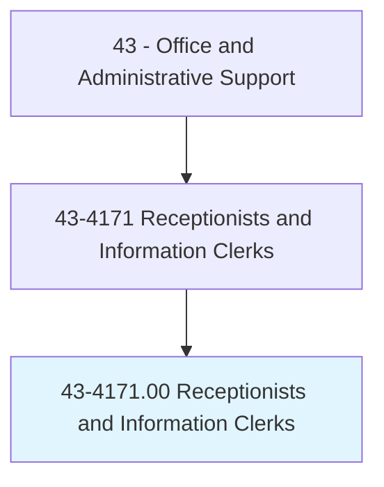
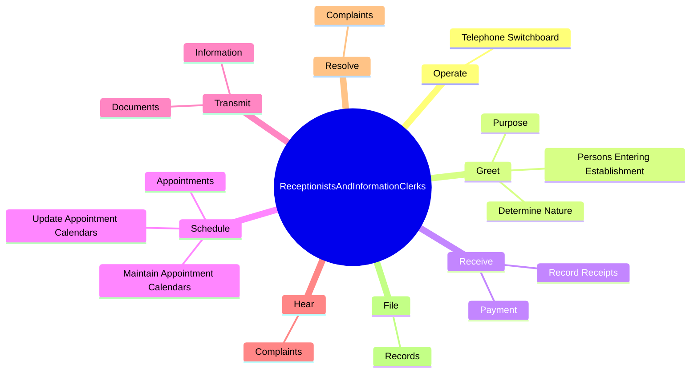
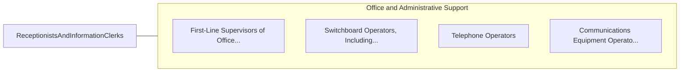

# Receptionists and Information Clerks

> Answer inquiries and provide information to the general public, customers, visitors, and other interested parties regarding activities conducted at establishment and location of departments, offices, and employees within the organization.

## Overview

Receptionists and Information Clerks is classified under Office and Administrative Support (SOC 43). Answer inquiries and provide information to the general public, customers, visitors, and other interested parties regarding activities conducted at establishment and location of departments, offices, and employees within the organization.

## Classification Hierarchy

## Key Statistics

| Metric | Value |
|--------|-------|
| SOC Code | 43-4171.00 |
| Category | [Office and Administrative Support](/occupations/Administrative) |
| Task Count | 104 |
| Source | O*NET |

## Core Tasks

### operate.TelephoneSwitchboard

Receptionists and Information Clerks operate telephone switchboard as part of their core responsibilities.

**Actions:**
- `operate.TelephoneSwitchboard.to.answer`
- `operate.TelephoneSwitchboard.to.screen`
- `operate.TelephoneSwitchboard.to.forward.Calls`
- `operate.TelephoneSwitchboard.to.ProvidingInformation`

### greet.PersonsEnteringEstablishment

Receptionists and Information Clerks greet persons entering establishment as part of their core responsibilities.

**Actions:**
- `greet.PersonsEnteringEstablishment.of.Visit`
- `greet.PersonsEnteringEstablishment.of.Direct`
- `greet.PersonsEnteringEstablishment.of.EscortThemToSpecificDestinations`
- `greet.DetermineNature.of.Visit`

### receive.Payment

Receptionists and Information Clerks receive payment as part of their core responsibilities.

**Actions:**
- `receive.Payment.for.Services`
- `receive.RecordReceipts.for.Services`

## Skills & Competencies

### Technical Skills
- **Office Management** - Advanced
- **Data Entry** - Advanced
- **Records Management** - Advanced

### Soft Skills
- **Communication** - Essential
- **Problem Solving** - Essential
- **Critical Thinking** - Important
- **Teamwork** - Important
- **Adaptability** - Important

## Related Occupations

## Industries

This occupation is found across multiple industries. See [Industries](/industries) for sector-specific employment data.

## Career Progression

---

*Source: O*NET 43-4171.00 - ONETOccupation*
