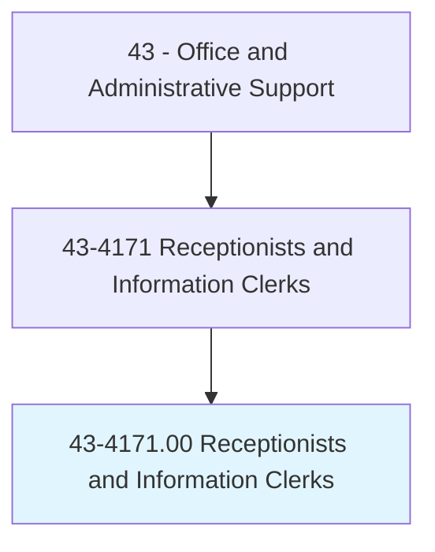
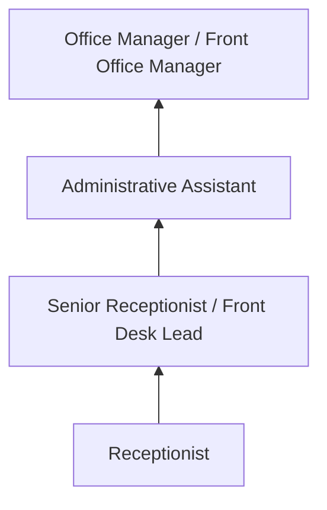
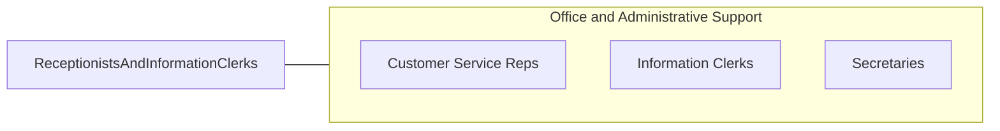

# Receptionists and Information Clerks

> Answer inquiries and provide information to the general public, customers, visitors, and other interested parties regarding activities conducted at establishment and location of departments, offices, and employees within the organization.

## Overview

Receptionists and Information Clerks serve as the first point of contact for organizations, greeting visitors, answering phone calls, directing inquiries, maintaining visitor logs, and providing general information about the organization's services, departments, and personnel. They create the initial impression that shapes how customers, clients, and visitors perceive an organization.

Employed across virtually every industry, receptionists work in corporate lobbies, medical offices, law firms, government buildings, hotels, salons, and any organization that receives visitors or phone calls. Their duties include operating multi-line phone systems, scheduling appointments, sorting and distributing mail, maintaining office supplies, and performing light clerical tasks to support overall office operations.

The role requires a professional demeanor, strong communication skills, and the ability to manage multiple interactions simultaneously while maintaining a welcoming atmosphere. While some receptionist functions have been automated with virtual assistants and self-check-in kiosks, the human element remains valued for personalized service and complex visitor management.

## Classification Hierarchy

## Key Statistics

| Metric | Value |
|--------|-------|
| SOC Code | 43-4171.00 |
| Job Zone | 2 (Some Preparation) |
| Category | [Office and Administrative Support](/occupations/Administrative/index) |
| Median Annual Salary | $33,800 |
| Employment | ~1,000,000 |
| Projected Growth | 2% (slower than average) |
| Core Tasks | 30 |
| Source | O*NET |

## Core Tasks

Core task data with GraphDL semantic actions for this occupation is maintained in the data pipeline. See [O*NET 43-4171.00](https://www.onetonline.org/link/summary/43-4171.00) for detailed task information.

## Skills & Competencies

### Technical Skills
- **Multi-Line Phone Systems** - Advanced
- **Visitor Management Systems** - Advanced
- **Scheduling Software** - Advanced
- **Office Software** - Advanced
- **Data Entry** - Intermediate

### Soft Skills
- **Communication** - Critical
- **Professional Demeanor** - Critical
- **Customer Service** - Critical
- **Multitasking** - Essential
- **Patience** - Essential

## Education & Certifications

| Requirement | Details |
|-------------|---------|
| Typical Education | High school diploma |
| Office Technology Training | Vocational programs |
| Industry-Specific Training | Medical, legal, or corporate protocols |
| First Aid/CPR | Required in some settings |

## Career Progression

## Industry Variations

| Setting | Focus | Unique Aspects |
|---------|-------|----------------|
| Medical Offices | Patient check-in | HIPAA; insurance verification; appointment scheduling |
| Corporate | Visitor management | Security badges; conference room booking; executive support |
| Legal | Client reception | Confidentiality; attorney calendars; court filings |
| Hospitality | Guest services | Concierge duties; reservations; loyalty programs |

## Technology & Tools

- **Phone Systems** - Cisco, Avaya, RingCentral
- **Visitor Management** - Envoy, Proxyclick, SwipedOn
- **Scheduling** - Outlook, Google Calendar, practice management
- **Communication** - Email, intercom, messaging

## Related Occupations

## Departments

This occupation typically works in:
- Front Office - Visitor reception
- Administration - Office support
- Customer Service - Information services
- [Security](/departments/Security) - Visitor management

---

*Source: O*NET 43-4171.00 - ONETOccupation*
