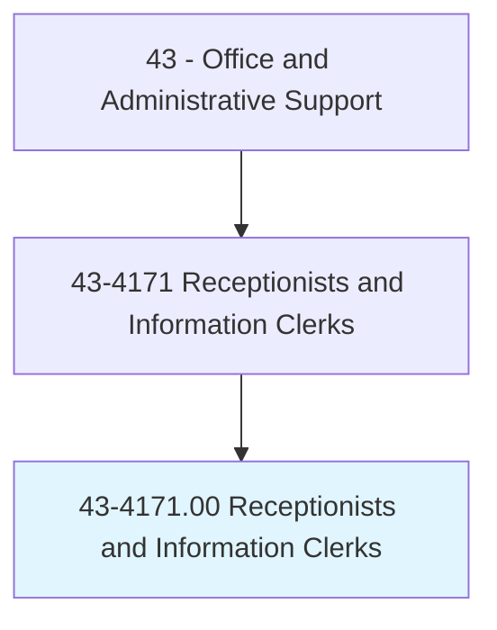
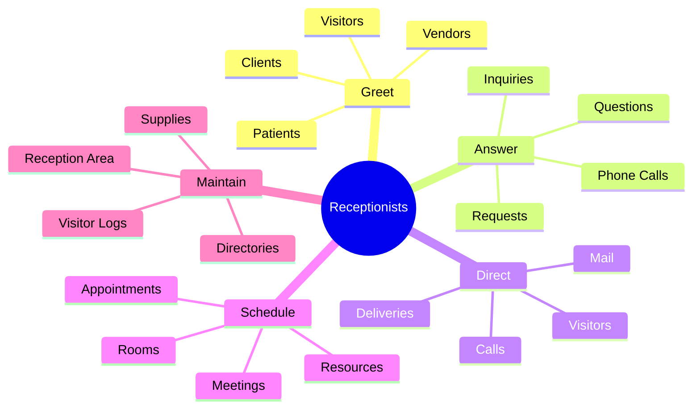
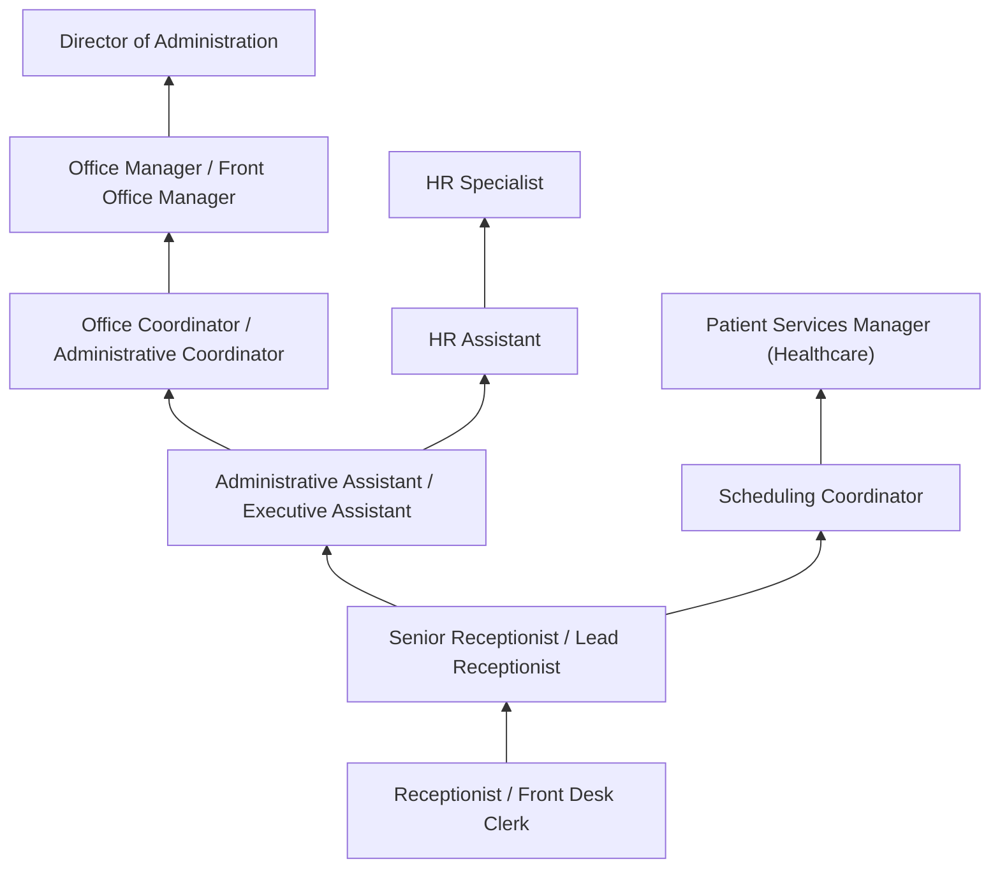
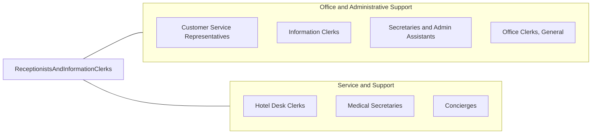

# Receptionists and Information Clerks

> Answer inquiries and provide information to the general public, customers, visitors, and other interested parties regarding activities conducted at establishment and location of departments, offices, and employees within the organization.

## Overview

Receptionists and Information Clerks serve as the first point of contact for organizations, greeting visitors, answering phone calls, directing inquiries, maintaining visitor logs, and providing general information about the organization's services, departments, and personnel. They create the crucial first impression that shapes how customers, clients, patients, and visitors perceive an organization, making professionalism, warmth, and efficiency essential qualities for success in this role.

Employed across virtually every industry, receptionists work in corporate lobbies, medical offices, dental practices, law firms, government buildings, schools, hotels, salons, spas, and any organization that receives visitors or phone calls. Their duties extend beyond greeting and directing to include operating multi-line phone systems, scheduling appointments, managing calendars, sorting and distributing mail, accepting deliveries, maintaining office supplies, coordinating meeting rooms, and performing various clerical tasks that support overall office operations. In smaller organizations, receptionists may serve as the sole administrative support, handling diverse responsibilities from bookkeeping to social media management.

The role requires a professional demeanor, exceptional communication skills, and the ability to manage multiple interactions simultaneously while maintaining a welcoming atmosphere. While some receptionist functions have been supplemented with virtual assistants, self-check-in kiosks, and automated phone systems, the human element remains highly valued for personalized service, complex visitor management, security screening, and situations requiring judgment and empathy. Many organizations view their receptionist as a brand ambassador whose interactions significantly impact customer experience and organizational reputation.

## Classification Hierarchy



## Key Statistics

| Metric | Value |
|--------|-------|
| SOC Code | 43-4171.00 |
| Job Zone | 2 (Some Preparation) |
| Category | [Office and Administrative Support](/occupations/Administrative/index) |
| Median Annual Salary | $33,800 |
| Salary Range | $25,000 - $47,000 |
| 10th Percentile | $25,500 |
| 90th Percentile | $46,800 |
| Employment | ~1,000,000 |
| Projected Growth | 2% (slower than average) |
| Annual Openings | ~142,000 |
| Core Tasks | 30 |
| Source | O*NET |

## Core Tasks



### greet.Visitors

Receptionists welcome visitors and create positive first impressions.

**Actions:**
- `greet.Visitors.at.Reception`
- `direct.Guests.to.Destinations`
- `issue.VisitorBadges.for.Security`
- `notify.Staff.of.Arrivals`

### answer.Communications

Receptionists handle incoming communications and inquiries.

**Actions:**
- `answer.PhoneCalls.professionally`
- `transfer.Calls.to.Departments`
- `take.Messages.for.Staff`
- `provide.Information.to.Callers`

## Skills & Competencies

### Technical Skills
- **Multi-Line Phone Systems** - Expert (Cisco, Avaya, RingCentral operation)
- **Visitor Management Systems** - Advanced (Envoy, Proxyclick, iLobby)
- **Scheduling Software** - Advanced (Outlook, Google Calendar, industry-specific)
- **Microsoft Office Suite** - Advanced (Word, Excel, Outlook, PowerPoint)
- **Data Entry** - Advanced (accurate record-keeping)
- **Office Equipment** - Advanced (copiers, fax, postage, printers)
- **CRM Systems** - Intermediate (Salesforce, HubSpot basics)
- **Video Conferencing** - Intermediate (Zoom, Teams, WebEx support)

### Soft Skills
- **Communication** - Critical (clear, professional verbal and written)
- **Professional Demeanor** - Critical (appearance, attitude, poise)
- **Customer Service** - Critical (creating positive experiences)
- **Multitasking** - Essential (handling simultaneous demands)
- **Patience** - Essential (dealing with difficult situations gracefully)
- **Discretion** - Important (handling confidential information)
- **Adaptability** - Important (responding to varied situations)
- **Memory** - Important (remembering faces, names, procedures)

## Education & Certifications

| Requirement | Details |
|-------------|---------|
| Typical Education | High school diploma |
| Preferred Education | Associate's degree or vocational training |
| Office Technology Training | Vocational or community college programs |
| Industry-Specific Training | Medical, legal, or corporate protocols |
| First Aid/CPR | Required in many medical and corporate settings |
| CAP (Certified Administrative Professional) | IAAP credential for advancement |
| HIPAA Certification | Required for healthcare reception |
| Bilingual Skills | Highly valued in diverse communities |

## Career Progression



### Career Pathway Details

| Level | Title | Years Experience | Key Responsibilities |
|-------|-------|------------------|----------------------|
| Entry | Receptionist / Front Desk Clerk | 0-2 years | Greeting, phones, basic administrative tasks |
| Mid | Senior Receptionist / Lead | 2-4 years | Training, complex tasks, backup supervision |
| Admin | Administrative Assistant | 3-6 years | Executive support, projects, correspondence |
| Coordinator | Office Coordinator | 5-8 years | Facility coordination, vendor management, events |
| Management | Office Manager | 8-12 years | Staff supervision, budgets, operations |
| Director | Director of Administration | 12+ years | Strategic planning, department leadership |

### Industry-Specific Paths

| Industry | Career Path | Additional Requirements |
|----------|-------------|-------------------------|
| Healthcare | Patient Services Coordinator, Practice Manager | Medical terminology, EMR systems |
| Legal | Legal Secretary, Paralegal | Legal terminology, court procedures |
| Corporate | Executive Assistant, Operations Manager | Business acumen, project management |
| Hospitality | Guest Services Manager, Front Office Manager | Hospitality training, service excellence |

## Industry Variations

| Setting | Focus | Unique Aspects |
|---------|-------|----------------|
| Medical Offices | Patient check-in and scheduling | HIPAA compliance; insurance verification; EMR systems; patient flow management |
| Corporate | Visitor management and security | Badge systems; executive support; conference coordination; corporate protocols |
| Legal | Client reception and confidentiality | Attorney calendars; court filings; conflict checks; confidentiality requirements |
| Hospitality | Guest services and concierge | Reservations; local recommendations; loyalty programs; service recovery |
| Dental | Patient scheduling and treatment coordination | Treatment scheduling; insurance processing; recall systems |
| Salon/Spa | Appointment booking and retail | Service menus; retail sales; stylist scheduling; membership programs |

### Medical Office Reception

Medical receptionists manage patient flow from arrival through departure, handling check-in, insurance verification, copay collection, appointment scheduling, and medical record coordination. HIPAA training is mandatory, and receptionists must balance efficiency with empathy when serving patients who may be anxious or unwell. Electronic Medical Record (EMR) systems like Epic, Cerner, or Athenahealth are standard tools.

### Corporate Reception

Corporate receptionists manage lobby security, visitor registration, badge issuance, and professional first impressions for companies. They often support executive teams, coordinate conference rooms, manage catering for meetings, and serve as the hub for facility communications. Security awareness and discretion with corporate information are essential.

### Legal Reception

Legal receptionists handle client intake, attorney scheduling, court filing coordination, and strict confidentiality requirements. They must understand legal terminology, manage conflicts of interest checks for new clients, and maintain detailed records of client communications. Many also support timekeeping and billing functions.

### Healthcare Specialty Reception

Specialty practices (dental, optometry, dermatology, physical therapy) require receptionists with knowledge of specific treatment scheduling, insurance verification for specialty services, and coordination with referring providers. Patient relationship management is particularly important for practices that rely on continuing care relationships.

## Technology & Tools

### Phone Systems
- **Cisco Phone Systems** - Enterprise VoIP
- **Avaya** - Business communication systems
- **RingCentral** - Cloud phone and video
- **8x8** - Unified communications
- **Grasshopper** - Small business virtual phone

### Visitor Management
- **Envoy** - Visitor registration and badges
- **Proxyclick** - Enterprise visitor management
- **iLobby** - Security-focused visitor check-in
- **SwipedOn** - Touchless visitor management
- **Sign In App** - Simple visitor logging

### Scheduling and Calendar
- **Microsoft Outlook** - Enterprise calendar and email
- **Google Workspace** - Calendar and scheduling
- **Calendly** - Appointment scheduling
- **Acuity Scheduling** - Online booking
- **Practice Management Systems** - Industry-specific scheduling

### Office Productivity
- **Microsoft 365** - Word, Excel, PowerPoint, Teams
- **Google Workspace** - Docs, Sheets, Meet
- **Zoom** - Video conferencing support
- **Slack** - Team communication
- **Adobe Acrobat** - PDF management

## Related Occupations



### Related Occupation Comparison

| Occupation | Similarity | Key Difference |
|------------|------------|----------------|
| Customer Service Representatives | High | Phone/channel focus vs in-person greeting |
| Administrative Assistants | High | Executive support vs reception focus |
| Hotel Front Desk Clerks | High | Guest services vs general reception |
| Medical Secretaries | Medium | Healthcare specialty vs general office |

## Industries

- [Healthcare](/industries/Healthcare/index) - High Employment
- [Professional Services](/industries/ProfessionalServices) - High Employment
- [Legal Services](/industries/ProfessionalServices/Legal) - High Employment
- [Finance and Insurance](/industries/Finance) - Moderate Employment
- [Government](/industries/PublicAdministration) - Moderate Employment
- [Education](/industries/Education) - Moderate Employment
- [Hospitality](/industries/Accommodation) - Moderate Employment

## Departments

This occupation typically works in:
- Front Office / Reception - Primary visitor interface
- Administration - General office support
- Customer Service - Information services
- [Human Resources](/departments/HR) - Employee and visitor support
- [Security](/departments/Security) - Visitor management and access control
- Patient Services - Healthcare registration and scheduling

## Work Environment

### Physical Setting
- Front desk or reception area at building entrance
- Professional, well-maintained workspace
- Visible to all visitors and employees
- Seating area with phone, computer, and office supplies
- Climate-controlled, well-lit environment

### Work Schedule
- Typically standard business hours (8am-5pm or 9am-6pm)
- Some positions require evening or weekend coverage
- Medical offices may have extended hours
- Shift coverage for large organizations
- Part-time positions commonly available

### Physical Demands
- Sitting at desk for extended periods
- Standing to greet visitors
- Light lifting of packages and supplies
- Reaching, bending for filing
- Constant visual attention to entrance

### Work Characteristics
- Continuous visitor and phone interaction
- First and last impression responsibility
- Multi-tasking throughout the day
- Professional appearance requirements
- Public-facing, high-visibility role

### Appearance Standards
- Professional attire appropriate to industry
- Grooming and hygiene standards
- Name badges in many settings
- Company dress code compliance
- Conservative accessories and makeup

## Performance Expectations

### Key Performance Indicators

| Metric | Description | Typical Standard |
|--------|-------------|------------------|
| Greeting Time | Visitor acknowledgment | Within 10 seconds of arrival |
| Phone Answer Time | Rings before pickup | 3 rings or less |
| Message Accuracy | Correct information relay | >99% |
| Visitor Satisfaction | Feedback scores | >90% positive |
| Schedule Accuracy | Appointment correctness | >98% |

### Service Standards
- Warm, professional greeting for every visitor
- Accurate direction and information
- Prompt phone response and message delivery
- Clean, organized reception area
- Confidentiality and discretion always

## GraphDL Semantic Structure

```graphdl
Receptionists and Information Clerks perform:
- greet.Visitors.at.Reception
- answer.PhoneCalls.professionally
- direct.Inquiries.to.Departments
- schedule.Appointments.for.Staff
- maintain.VisitorLogs.for.Security
- provide.Information.to.PublicInquiries
- manage.Mail.for.Distribution
- support.Operations.across.Office
```

---

*Source: O*NET 43-4171.00 - ONETOccupation*
