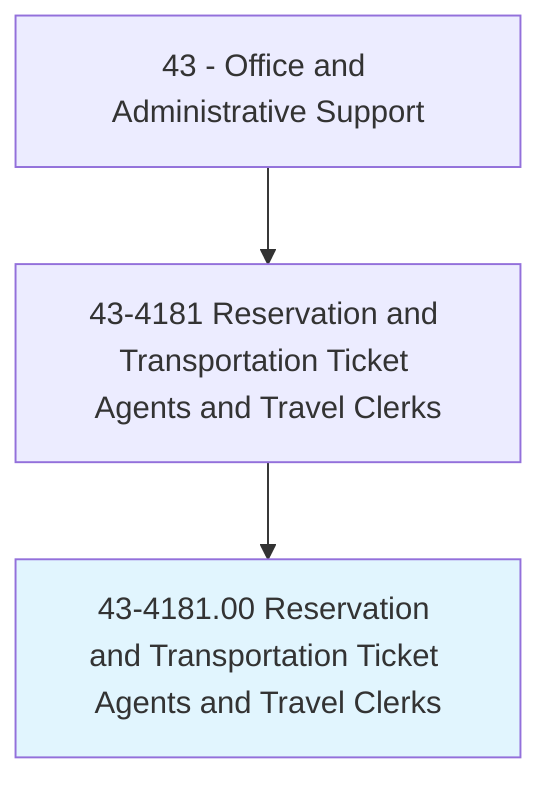
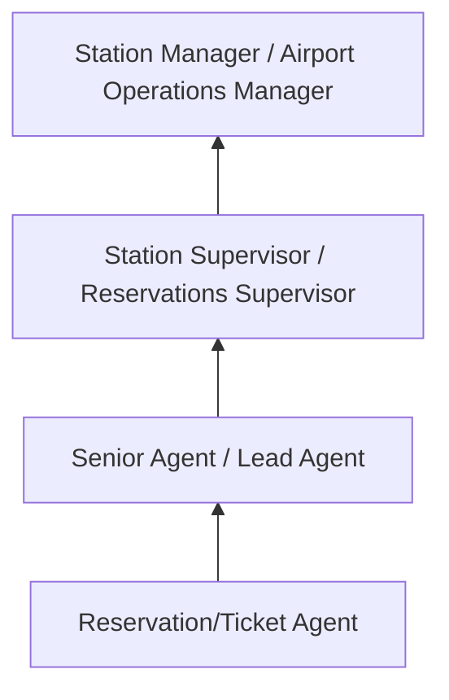
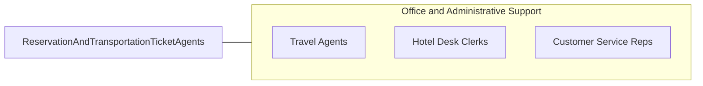

# Reservation and Transportation Ticket Agents and Travel Clerks

> Make and confirm reservations for transportation or lodging, or sell transportation tickets. May check baggage and direct passengers to designated concourse, pier, or track; assist passengers boarding transportation; or open and close travel documents.

## Overview

Reservation and Transportation Ticket Agents work for airlines, railroads, bus companies, cruise lines, hotels, and rental car agencies, booking travel reservations, issuing tickets, checking in passengers, and resolving travel disruptions. They operate reservation systems to search availability, quote fares, process bookings, assign seats, handle upgrades, and manage itinerary changes.

At transportation terminals, ticket agents process check-ins, verify identification and travel documents, tag and route baggage, issue boarding passes, and assist passengers with special needs. They handle rebooking for missed connections, weather cancellations, and equipment changes, often managing frustrated travelers during irregular operations.

The role combines customer service with technical proficiency in complex reservation and ticketing systems. While online booking has reduced routine reservation calls, agents remain essential for complex itineraries, group bookings, disruption management, and airport/station operations that require face-to-face interaction.

## Classification Hierarchy

## Key Statistics

| Metric | Value |
|--------|-------|
| SOC Code | 43-4181.00 |
| Job Zone | 2 (Some Preparation) |
| Category | [Office and Administrative Support](/occupations/Administrative/index) |
| Median Annual Salary | $38,700 |
| Employment | ~140,000 |
| Projected Growth | 3% (slower than average) |
| Core Tasks | 35 |
| Source | O*NET |

## Core Tasks

Core task data with GraphDL semantic actions for this occupation is maintained in the data pipeline. See [O*NET 43-4181.00](https://www.onetonline.org/link/summary/43-4181.00) for detailed task information.

## Skills & Competencies

### Technical Skills
- **Reservation Systems (Sabre, Amadeus, Worldspan)** - Expert
- **Fare Calculation and Ticketing** - Advanced
- **Travel Document Verification** - Advanced
- **Baggage Handling Systems** - Advanced
- **DCS (Departure Control Systems)** - Advanced

### Soft Skills
- **Customer Service** - Critical
- **Problem Solving** - Critical
- **Composure Under Pressure** - Essential
- **Communication** - Critical
- **Multitasking** - Essential

## Education & Certifications

| Requirement | Details |
|-------------|---------|
| Typical Education | High school diploma |
| Airline/Company Training | System-specific (4-8 weeks) |
| TSA Background Check | Required for airport positions |
| Dangerous Goods Awareness | Required for airline agents |
| IATA/UFTAA Diploma | International travel certification |

## Career Progression

## Industry Variations

| Setting | Focus | Unique Aspects |
|---------|-------|----------------|
| Airlines | Flight reservations, check-in | Gate operations; IRROPS; frequent flyer programs |
| Hotels | Room reservations | Revenue management; group blocks; loyalty tiers |
| Rail (Amtrak) | Train reservations, ticketing | Station operations; multi-leg routing; accommodation types |
| Cruise Lines | Voyage bookings | Shore excursions; cabin assignments; embarkation processing |

## Technology & Tools

- **GDS** - Sabre, Amadeus, Travelport/Worldspan
- **DCS** - Departure control and check-in systems
- **CRM** - Loyalty program databases
- **Communication** - Phone, in-person, kiosks

## Related Occupations

## Departments

This occupation typically works in:
- Reservations - Booking and ticketing
- Airport/Station Operations - Check-in and boarding
- Customer Service - Travel support
- Revenue Management - Fare optimization support

---

*Source: O*NET 43-4181.00 - ONETOccupation*
