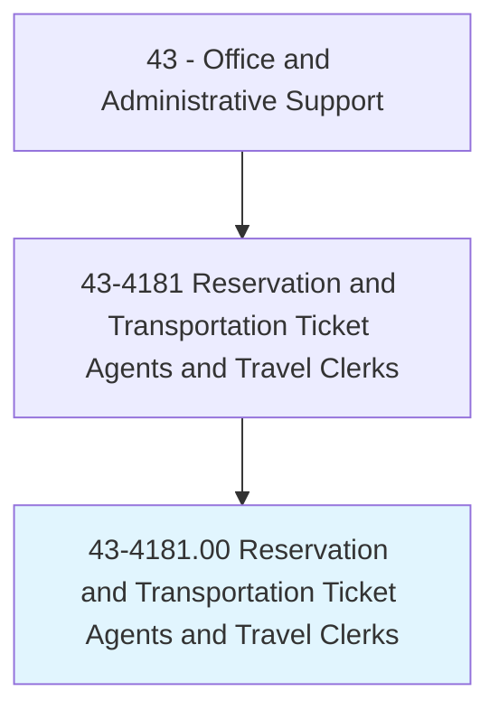
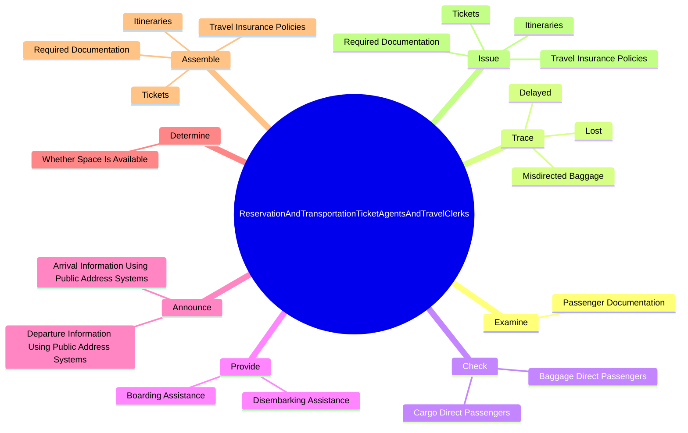
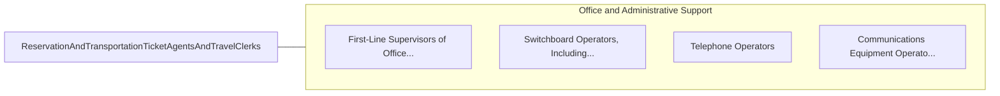

# Reservation and Transportation Ticket Agents and Travel Clerks

> Make and confirm reservations for transportation or lodging, or sell transportation tickets. May check baggage and direct passengers to designated concourse, pier, or track; deliver tickets and contact individuals and groups to inform them of package tours; or provide tourists with travel or transportation information.

## Overview

Reservation and Transportation Ticket Agents and Travel Clerks is an occupation within the Office and Administrative Support category. Make and confirm reservations for transportation or lodging, or sell transportation tickets. 

## Classification Hierarchy

## Key Statistics

| Metric | Value |
|--------|-------|
| SOC Code | 43-4181.00 |
| Category | [Office and Administrative Support](/occupations/Administrative) |
| Task Count | 77 |
| Source | O*NET |

## Core Tasks

### examine.PassengerDocumentation

Reservation and Transportation Ticket Agents and Travel Clerks examine passenger documentation as part of their core responsibilities.

**Actions:**
- `examine.PassengerDocumentation.to.determine.DestinationsAssignBoardingPasses`
- `examine.PassengerDocumentation.to.ToAssignBoardingPasses`

### trace.Lost

Reservation and Transportation Ticket Agents and Travel Clerks trace lost as part of their core responsibilities.

**Actions:**
- `trace.Lost.for.Customers`
- `trace.Delayed.for.Customers`
- `trace.MisdirectedBaggage.for.Customers`

### check.BaggageDirectPassengers

Reservation and Transportation Ticket Agents and Travel Clerks check baggage direct passengers as part of their core responsibilities.

**Actions:**
- `check.BaggageDirectPassengers.to.designated.LocationsForLoading`
- `check.CargoDirectPassengers.to.designated.LocationsForLoading`

## Skills & Competencies

### Technical Skills
- **Office Management** - Advanced
- **Data Entry** - Advanced
- **Records Management** - Advanced

### Soft Skills
- **Communication** - Essential
- **Problem Solving** - Essential
- **Critical Thinking** - Important
- **Teamwork** - Important
- **Adaptability** - Important

## Related Occupations

## Industries

This occupation is found across multiple industries. See [Industries](/industries) for sector-specific employment data.

## Career Progression

---

*Source: O*NET 43-4181.00 - ONETOccupation*
