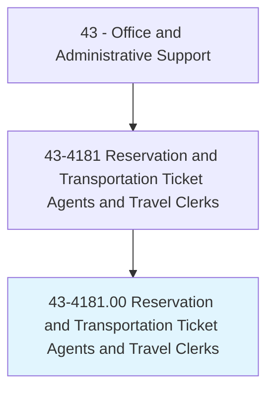
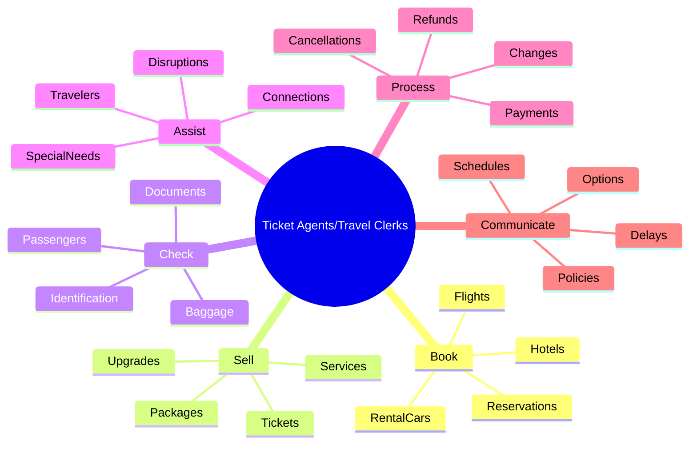
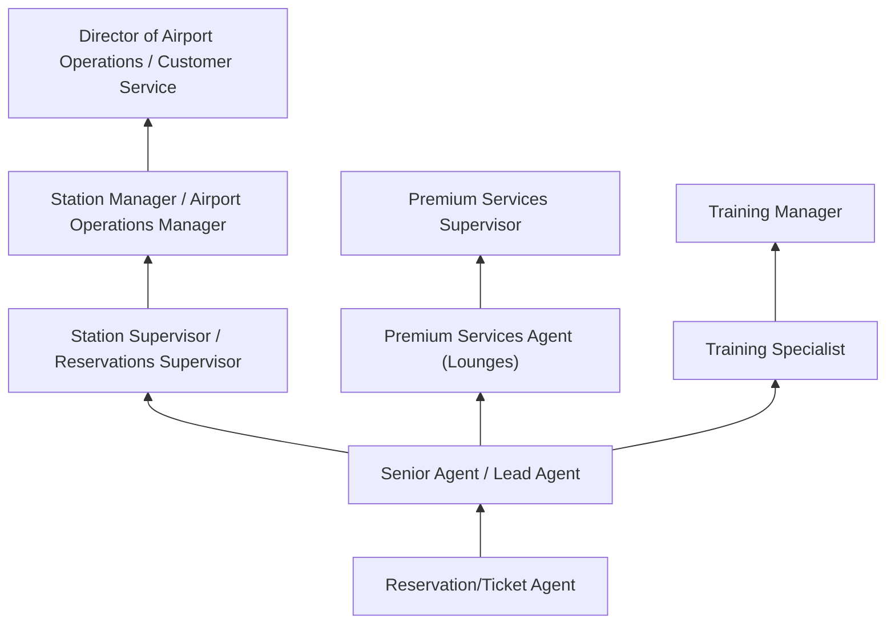
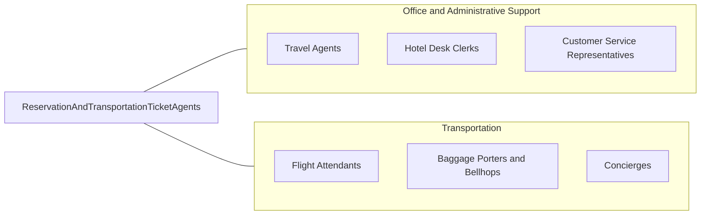

# Reservation and Transportation Ticket Agents and Travel Clerks

> Make and confirm reservations for transportation or lodging, or sell transportation tickets. May check baggage and direct passengers to designated concourse, pier, or track; assist passengers boarding transportation; or open and close travel documents.

## Overview

Reservation and Transportation Ticket Agents work for airlines, railroads, bus companies, cruise lines, hotels, and rental car agencies, booking travel reservations, issuing tickets, checking in passengers, and resolving travel disruptions. They operate reservation systems to search availability, quote fares, process bookings, assign seats, handle upgrades, and manage itinerary changes.

At transportation terminals, ticket agents process check-ins, verify identification and travel documents, tag and route baggage, issue boarding passes, and assist passengers with special needs. They handle rebooking for missed connections, weather cancellations, and equipment changes, often managing frustrated travelers during irregular operations.

The role combines customer service with technical proficiency in complex reservation and ticketing systems. While online booking has reduced routine reservation calls, agents remain essential for complex itineraries, group bookings, disruption management, and airport/station operations that require face-to-face interaction. The growth of loyalty programs and premium services has created new demands for personalized service and customer relationship management.

## Classification Hierarchy

## Key Statistics

| Metric | Value |
|--------|-------|
| SOC Code | 43-4181.00 |
| Job Zone | 2 (Some Preparation) |
| Category | [Office and Administrative Support](/occupations/Administrative/index) |
| Median Annual Salary | $38,700 |
| Salary Range | $26,000 - $56,000 |
| 10th Percentile | $26,500 |
| 90th Percentile | $55,800 |
| Employment | ~140,000 |
| Projected Growth | 3% (slower than average) |
| Core Tasks | 35 |
| Source | O*NET |

## Core Tasks

### book.TravelReservations

Ticket Agents create and confirm travel reservations across transportation modes.

**Actions:**
- `book.FlightReservations.in.GDS` - Create airline bookings in reservation systems
- `book.HotelAccommodations.for.Travelers` - Secure lodging reservations
- `book.RentalCars.at.Destinations` - Arrange ground transportation
- `book.TrainReservations.for.Passengers` - Create rail travel bookings
- `confirm.Reservations.with.Travelers` - Verify booking details with customers
- `modify.Itineraries.for.Changes` - Update existing reservations as needed

### sell.TicketsAndServices

Ticket Agents sell transportation products and ancillary services.

**Actions:**
- `sell.Tickets.at.CounterOrPhone` - Process ticket purchases
- `sell.Upgrades.to.PremiumClasses` - Offer enhanced seating and services
- `sell.AncillaryServices.like.Baggage` - Add extra services to bookings
- `process.Payments.via.CashCardCredit` - Handle financial transactions
- `apply.Discounts.and.PromoCodes` - Process applicable reductions
- `calculate.Fares.for.ComplexItineraries` - Determine pricing for multi-leg trips

### check.PassengersAndBaggage

Ticket Agents process travelers at airports and transportation terminals.

**Actions:**
- `check.Passengers.for.Flights` - Process airport check-in procedures
- `verify.Identification.against.Reservations` - Confirm traveler identity
- `verify.TravelDocuments.for.International` - Check passports and visas
- `tag.Baggage.for.Routing` - Apply labels for luggage handling
- `issue.BoardingPasses.for.Flights` - Provide documents for boarding
- `assign.Seats.based.on.Preferences` - Allocate seating to passengers

### assist.TravelersWithNeeds

Ticket Agents help passengers navigate travel challenges and special requirements.

**Actions:**
- `assist.PassengersWithDisabilities` - Arrange wheelchair and special assistance
- `assist.UnaccompaniedMinors.through.Process` - Handle child travelers
- `assist.Passengers.during.Delays` - Provide support during disruptions
- `rebook.Passengers.after.Cancellations` - Find alternative itineraries
- `coordinate.MissedConnections.for.Travelers` - Arrange rebooking for delays
- `resolve.BaggageIssues.for.Passengers` - Handle lost or delayed luggage

### process.TransactionChanges

Ticket Agents handle modifications, refunds, and cancellations.

**Actions:**
- `process.ItineraryChanges.for.Travelers` - Modify existing bookings
- `process.Refunds.per.FareRules` - Issue refunds when applicable
- `process.Cancellations.with.Credits` - Cancel bookings and apply policies
- `process.Rebookings.for.Disruptions` - Change itineraries due to operational issues
- `apply.ChangeFeesOrWaivers` - Assess or waive modification charges
- `document.Transactions.for.Records` - Maintain accurate booking history

### communicate.TravelInformation

Ticket Agents provide information about schedules, policies, and options.

**Actions:**
- `communicate.Schedules.and.Availability` - Share timing and booking options
- `announce.Delays.and.Cancellations` - Inform passengers of disruptions
- `explain.Policies.on.BaggageAndFees` - Clarify rules and charges
- `provide.DestinationInformation` - Share relevant travel details
- `inform.Passengers.of.GateChanges` - Communicate operational updates
- `answer.Questions.about.Services` - Respond to traveler inquiries

## Skills & Competencies

### Technical Skills
- **Reservation Systems (Sabre, Amadeus, Worldspan)** - Expert (GDS proficiency, complex bookings)
- **Fare Calculation and Ticketing** - Advanced (pricing rules, fare construction)
- **Travel Document Verification** - Advanced (passport, visa, APIS requirements)
- **Baggage Handling Systems** - Advanced (tagging, routing, tracing)
- **DCS (Departure Control Systems)** - Advanced (check-in, boarding)
- **Customer Service Software** - Advanced (CRM, loyalty programs)
- **Payment Processing** - Advanced (multiple payment methods, currency)
- **Irregular Operations Procedures** - Advanced (rebooking, disruption management)

### Soft Skills
- **Customer Service** - Critical (public-facing service excellence)
- **Problem Solving** - Critical (finding solutions during disruptions)
- **Composure Under Pressure** - Essential (handling frustrated travelers)
- **Communication** - Critical (clear, calm explanations)
- **Multitasking** - Essential (multiple passengers and systems)
- **Cultural Sensitivity** - Important (international travelers)
- **Attention to Detail** - Essential (accurate bookings and documents)
- **Patience** - Essential (difficult situations and questions)

## Education & Certifications

| Requirement | Details |
|-------------|---------|
| Typical Education | High school diploma |
| Airline/Company Training | System-specific training (4-8 weeks) |
| TSA Background Check | Required for airport positions (SIDA badge) |
| Dangerous Goods Awareness | Required for airline agents handling cargo |
| IATA/UFTAA Diploma | International travel certification |
| Language Skills | Foreign language proficiency valuable |
| GDS Certification | Sabre, Amadeus, Travelport credentials |

## Career Progression

### Career Pathway Details

| Level | Title | Years Experience | Key Responsibilities |
|-------|-------|------------------|----------------------|
| Entry | Ticket Agent / Reservation Agent | 0-2 years | Basic bookings, check-in, standard service |
| Mid | Senior Agent / Lead | 2-5 years | Complex situations, VIP service, mentoring |
| Supervisory | Station/Reservations Supervisor | 5-10 years | Team leadership, operations coordination |
| Management | Station Manager | 10-15 years | Full station operations, staffing, budgets |
| Director | Director of Operations | 15+ years | Regional oversight, strategy, performance |

### Specialization Paths

| Specialization | Focus Area | Additional Skills Needed |
|----------------|------------|-----------------------------|
| Premium Services | First class, lounges, VIP | High-end service, discretion |
| International | Complex itineraries, documents | Geography, visa requirements, languages |
| Group Sales | Tour operators, corporate | Sales skills, contract knowledge |
| Operations | Irregular operations, dispatch | Operational knowledge, decision-making |

## Industry Variations

| Setting | Focus | Unique Aspects |
|---------|-------|----------------|
| Airlines | Flight reservations, check-in | Gate operations; IRROPS; frequent flyer programs; international |
| Hotels | Room reservations | Revenue management; group blocks; loyalty tiers; amenities |
| Rail (Amtrak) | Train reservations, ticketing | Station operations; multi-leg routing; accommodation types |
| Cruise Lines | Voyage bookings | Shore excursions; cabin assignments; embarkation processing |
| Rental Cars | Vehicle reservations | Fleet management; upselling; damage waivers |
| Tour Operators | Package travel | Itinerary planning; group coordination; destination knowledge |

### Airline Operations

Airline agents work at airports (ticket counters, gates) and reservation centers, handling the full passenger journey from booking through boarding. They manage complex fare rules, frequent flyer programs, and international travel requirements. During irregular operations (IRROPS) from weather or mechanical issues, they become critical for rebooking and customer recovery. The work environment is fast-paced with strict departure schedules.

### Hotel Reservations

Hotel reservation agents book rooms, manage group blocks, and handle guest service requests. They understand revenue management principles, room types, and loyalty programs. Front desk crossover is common, with agents checking guests in and resolving service issues. Peak periods around holidays and events require skill in managing sold-out situations.

### Rail Transportation

Amtrak and commuter rail agents sell tickets, check passengers, and provide station services. They understand complex rail networks, connection timing, and accommodation options (coach, sleeper, roomette). Station operations include platform announcements, boarding assistance, and coordination with train crews.

### Cruise Industry

Cruise reservation agents book voyages, cabins, and shore excursions. They help guests navigate complex cruise options including dining, entertainment, and specialty experiences. Embarkation day processing involves document verification, luggage handling, and muster station coordination.

## Technology & Tools

### Global Distribution Systems (GDS)
- **Sabre** - Major airline and travel GDS
- **Amadeus** - European-based global system
- **Travelport/Worldspan** - Apollo/Galileo/Worldspan systems
- **Direct Connect** - Airline-specific booking systems

### Departure Control Systems (DCS)
- **Check-in Systems** - Passenger processing platforms
- **Gate Reader Systems** - Boarding document verification
- **Baggage Systems** - Automated tag and trace
- **Flight Information** - Real-time schedule displays

### Customer Relationship
- **Loyalty Systems** - Frequent flyer/guest program management
- **CRM Platforms** - Customer history and preferences
- **Service Recovery** - Compensation and voucher systems
- **Communication Tools** - Passenger notification systems

### Communication and Operations
- **Radio/Headset** - Airport operational communication
- **PA Systems** - Announcements to passengers
- **Mobile Devices** - Handheld check-in and information
- **Scheduling Systems** - Staff and flight coordination

## Work Environment

### Physical Setting
- Airport terminals (ticket counters, gates, clubs)
- Reservation call centers
- Train and bus stations
- Cruise terminals
- Hotel front desks

### Work Schedule
- Shift work including nights, weekends, holidays
- 24/7 operations at major hubs
- Variable schedules based on flight times
- Split shifts at some locations
- Overtime during peak travel periods

### Physical Requirements
- Standing for extended periods (airport positions)
- Lifting baggage (up to 50 lbs)
- Walking between gates and locations
- Seated work in call center positions
- Noisy environment at airports

### Work Characteristics
- High customer interaction throughout shift
- Time pressure around departures
- Stress during disruptions and delays
- Seasonal peaks (holidays, summer)
- Need for calm demeanor under pressure

## Related Occupations

### Related Occupation Comparison

| Occupation | Similarity | Key Difference |
|------------|------------|----------------|
| Travel Agents | High | Commission sales vs employee service |
| Hotel Desk Clerks | High | Lodging vs transportation focus |
| Customer Service Reps | Medium | Phone/digital vs in-person service |
| Flight Attendants | Medium | In-flight vs ground operations |

## Industries

- [Air Transportation](/industries/Transportation) - High Employment
- [Hotels and Lodging](/industries/Hospitality) - High Employment
- [Rail Transportation](/industries/Transportation) - Moderate Employment
- [Cruise Lines](/industries/Transportation) - Moderate Employment
- [Car Rental](/industries/Transportation) - Moderate Employment

## Departments

This occupation typically works in:
- Reservations - Booking and ticketing services
- Airport/Station Operations - Check-in and boarding
- Customer Service - Travel support and issue resolution
- Revenue Management - Fare optimization support
- Premium Services - VIP and loyalty customer care

## Performance Metrics

| Metric | Description | Typical Target |
|--------|-------------|----------------|
| Customer Satisfaction | Survey scores and feedback | High ratings target |
| Check-in Time | Average processing time | Under 3 minutes |
| Sales Performance | Revenue from upgrades and services | Meet goals |
| Accuracy | Booking and ticketing errors | Near-zero errors |
| Attendance | Schedule adherence and reliability | High attendance |

## Compensation and Benefits

### Industry Benefits
- Travel benefits (reduced or free travel)
- Hotel discounts and stays
- Airline interline agreements
- Paid training and certification
- Health and retirement benefits
- Shift differential pay
- Overtime opportunities

---

*Source: O*NET 43-4181.00 - ONETOccupation*
