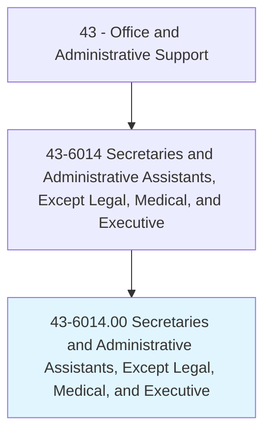
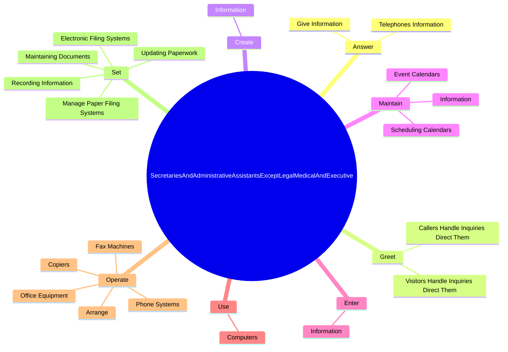
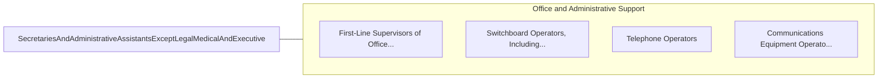

# Secretaries and Administrative Assistants, Except Legal, Medical, and Executive

> Perform routine administrative functions such as drafting correspondence, scheduling appointments, organizing and maintaining paper and electronic files, or providing information to callers.

## Overview

Secretaries and Administrative Assistants, Except Legal, Medical, and Executive is classified under Office and Administrative Support (SOC 43). Perform routine administrative functions such as drafting correspondence, scheduling appointments, organizing and maintaining paper and electronic files, or providing information to callers.

## Classification Hierarchy

## Key Statistics

| Metric | Value |
|--------|-------|
| SOC Code | 43-6014.00 |
| Category | [Office and Administrative Support](/occupations/Administrative) |
| Task Count | 123 |
| Source | O*NET |

## Core Tasks

### answer.TelephonesInformation

Secretaries and Administrative Assistants, Except Legal, Medical, and Executive answer telephones information as part of their core responsibilities.

**Actions:**
- `answer.TelephonesInformation.to.Callers`
- `answer.TelephonesInformation.to.take.Messages`
- `answer.TelephonesInformation.to.transfer.CallsToAppropriateIndividuals`
- `answer.GiveInformation.to.Callers`

### greet.VisitorsHandleInquiriesDirectThem

Secretaries and Administrative Assistants, Except Legal, Medical, and Executive greet visitors handle inquiries direct them as part of their core responsibilities.

**Actions:**
- `greet.VisitorsHandleInquiriesDirectThem.to.appropriate.PersonsAccordingToNeeds`
- `greet.CallersHandleInquiriesDirectThem.to.appropriate.PersonsAccordingToNeeds`

### create.Information

Secretaries and Administrative Assistants, Except Legal, Medical, and Executive create information as part of their core responsibilities.

**Actions:**
- `create.Information.into.Databases`

## Skills & Competencies

### Technical Skills
- **Office Management** - Advanced
- **Data Entry** - Advanced
- **Records Management** - Advanced

### Soft Skills
- **Communication** - Essential
- **Problem Solving** - Essential
- **Critical Thinking** - Important
- **Teamwork** - Important
- **Adaptability** - Important

## Related Occupations

## Industries

This occupation is found across multiple industries. See [Industries](/industries) for sector-specific employment data.

## Career Progression

---

*Source: O*NET 43-6014.00 - ONETOccupation*
