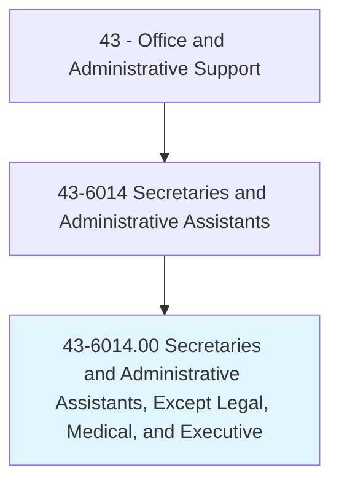
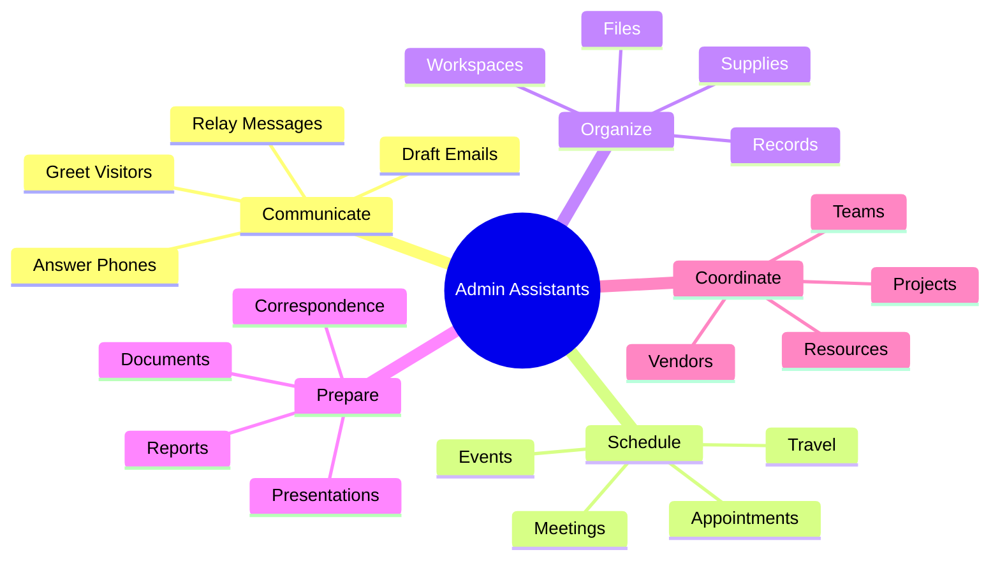
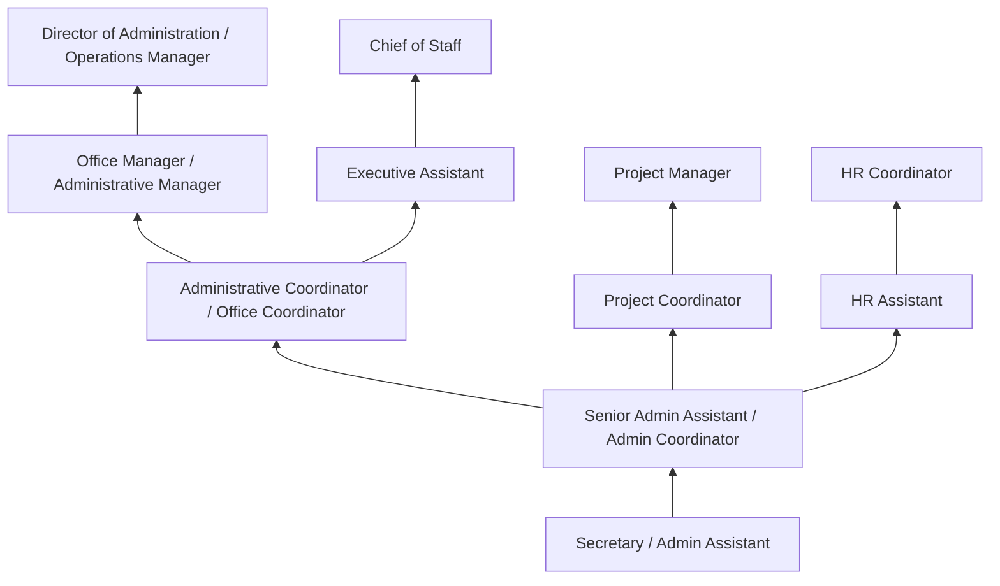
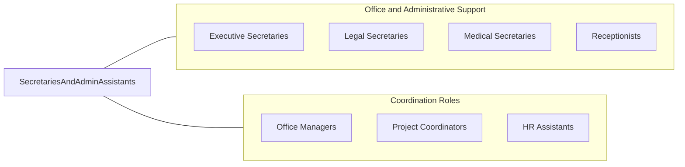

# Secretaries and Administrative Assistants, Except Legal, Medical, and Executive

> Perform routine administrative functions such as drafting correspondence, scheduling appointments, organizing and maintaining paper and electronic files, or providing information to callers.

## Overview

Secretaries and Administrative Assistants provide essential administrative support across all types of organizations, handling correspondence, scheduling, filing, data entry, meeting coordination, and general office management tasks. This is the largest and broadest category of administrative support workers, encompassing positions that support departments, teams, managers, and entire organizational units outside of specialized legal, medical, or executive contexts.

Working in every industry sector from manufacturing to education, government to nonprofit, these professionals manage calendars, prepare documents and presentations, coordinate travel arrangements, process expense reports, maintain office supplies, handle incoming communications, and serve as information hubs for their departments. They ensure that the day-to-day operations of offices run smoothly by handling the organizational, clerical, and coordination tasks that enable others to focus on their primary responsibilities.

The role has evolved significantly from traditional typing, shorthand, and filing toward technology-enabled office management, project coordination, and administrative problem-solving. Modern administrative assistants use sophisticated productivity software suites, collaboration platforms, enterprise systems, and virtual meeting tools. Many take on responsibilities that blend clerical support with event coordination, basic project management, social media management, and data analysis. The flexibility and breadth of the role make it both a valuable entry point into organizations and a career path with opportunities for specialization and advancement.

## Classification Hierarchy



## Key Statistics

| Metric | Value |
|--------|-------|
| SOC Code | 43-6014.00 |
| Job Zone | 2 (Some Preparation) |
| Category | [Office and Administrative Support](/occupations/Administrative/index) |
| Median Annual Salary | $41,000 |
| Salary Range | $29,000 - $58,000 |
| 10th Percentile | $29,500 |
| 90th Percentile | $57,800 |
| Employment | ~1,600,000 |
| Projected Growth | -10% (declining) |
| Annual Openings | ~175,000 |
| Core Tasks | 40 |
| Source | O*NET |

## Core Tasks



### manage.Communications

Administrative Assistants handle incoming and outgoing communications.

**Actions:**
- `answer.PhoneCalls.for.Department`
- `draft.Correspondence.for.Managers`
- `distribute.Information.to.Staff`
- `respond.To.Inquiries.professionally`

### coordinate.OfficeOperations

Administrative Assistants coordinate daily office activities.

**Actions:**
- `schedule.Meetings.for.Teams`
- `organize.Files.and.Records`
- `maintain.Supplies.for.Office`
- `coordinate.Events.and.Activities`

## Skills & Competencies

### Technical Skills
- **Microsoft Office / Google Workspace** - Expert (Word, Excel, PowerPoint, Outlook)
- **Calendar and Scheduling Management** - Advanced (Outlook, Google Calendar, scheduling tools)
- **Document Preparation** - Advanced (formatting, templates, mail merge)
- **Filing and Records Management** - Advanced (physical and electronic systems)
- **Travel and Expense Processing** - Advanced (booking, reconciliation)
- **Meeting Technology** - Advanced (Zoom, Teams, WebEx coordination)
- **Data Entry** - Advanced (accuracy and speed)
- **Database Management** - Intermediate (CRM, contact management)

### Soft Skills
- **Organizational Skills** - Critical (managing multiple priorities)
- **Communication** - Critical (verbal and written clarity)
- **Discretion** - Essential (handling confidential information)
- **Multitasking** - Essential (juggling competing demands)
- **Adaptability** - Essential (changing priorities and requests)
- **Initiative** - Important (anticipating needs)
- **Interpersonal Skills** - Important (working with all levels)
- **Problem Solving** - Important (finding solutions)

## Education & Certifications

| Requirement | Details |
|-------------|---------|
| Typical Education | High school diploma; some college preferred |
| Preferred Education | Associate's degree in office administration |
| CAP (Certified Administrative Professional) | IAAP professional credential |
| MOS (Microsoft Office Specialist) | Software proficiency certification |
| Organizational Management Certificate | Community college programs |
| Google Workspace Certification | Cloud productivity certification |
| Project Management Basics | Helpful for coordination roles |
| Industry-Specific Training | Sector-specific knowledge |

## Career Progression



### Career Pathway Details

| Level | Title | Years Experience | Key Responsibilities |
|-------|-------|------------------|----------------------|
| Entry | Secretary / Admin Assistant | 0-2 years | Basic clerical, phone coverage, filing, scheduling |
| Mid | Senior Admin Assistant | 2-4 years | Multiple managers, complex scheduling, projects |
| Coordinator | Administrative Coordinator | 4-6 years | Department coordination, vendor management, events |
| Management | Office Manager | 6-10 years | Office operations, staff supervision, budgets |
| Director | Director of Administration | 10+ years | Strategic planning, facilities, organizational leadership |

### Specialization Paths

| Specialization | Focus Area | Additional Skills Needed |
|----------------|------------|-----------------------------|
| Executive Assistant | C-suite support | Strategic thinking, high confidentiality |
| Project Coordinator | Project support | PM methodology, tracking, reporting |
| HR Assistant | Human resources | HR knowledge, confidentiality, systems |
| Marketing Coordinator | Marketing support | Creative tools, social media, events |
| Event Coordinator | Meeting/event planning | Logistics, vendor management, budgets |

## Industry Variations

| Setting | Focus | Unique Aspects |
|---------|-------|----------------|
| Corporate | Department support | Multiple managers; meeting coordination; presentations; corporate culture |
| Education | School/department admin | Academic calendars; student records; faculty support; enrollment |
| Government | Public administration | Civil service; procedural compliance; constituent services; security |
| Nonprofit | Program support | Grant administration; donor records; event planning; volunteer coordination |
| Healthcare (Admin) | Non-clinical support | HIPAA awareness; scheduling systems; patient-adjacent work |
| Manufacturing | Production office support | Shop floor coordination; safety documentation; shift scheduling |

### Corporate Administrative Support

Corporate administrative assistants support departments, teams, or managers in business environments. They coordinate meetings across time zones, prepare presentations for leadership, manage expense reports, arrange travel, and serve as communication hubs. Understanding corporate culture, hierarchy, and confidentiality is essential.

### Educational Institution Support

School and university administrative assistants handle academic calendars, student records, faculty scheduling, event coordination, and parent/student communication. They understand academic terminology, enrollment processes, and compliance requirements specific to educational settings.

### Government Administrative Support

Government administrative assistants work within civil service systems with specific procedures, documentation requirements, and public accountability. They handle constituent inquiries, process official documents, and support public officials or agency functions while adhering to government regulations and transparency requirements.

### Nonprofit Administrative Support

Nonprofit administrative assistants often take on broader responsibilities including donor database management, grant documentation, volunteer coordination, and event support. Resource constraints in nonprofits mean administrative staff frequently wear multiple hats and contribute directly to mission delivery.

## Technology & Tools

### Productivity Suites
- **Microsoft 365** - Word, Excel, PowerPoint, Outlook
- **Google Workspace** - Docs, Sheets, Slides, Gmail
- **Apple iWork** - Pages, Numbers, Keynote
- **LibreOffice** - Open-source alternative

### Collaboration and Communication
- **Microsoft Teams** - Chat, meetings, collaboration
- **Slack** - Team messaging
- **Zoom** - Video conferencing
- **WebEx** - Enterprise meetings
- **Asana/Monday.com** - Project coordination

### Scheduling and Calendar
- **Microsoft Outlook** - Calendar and email
- **Google Calendar** - Scheduling
- **Calendly** - Appointment scheduling
- **Doodle** - Meeting polls
- **When2meet** - Group scheduling

### Document and File Management
- **SharePoint** - Enterprise document management
- **OneDrive / Google Drive** - Cloud storage
- **Dropbox** - File sharing
- **Box** - Enterprise content management
- **Adobe Acrobat** - PDF management

### Administrative Tools
- **Concur** - Travel and expense management
- **Certify** - Expense reporting
- **DocuSign** - Electronic signatures
- **Eventbrite** - Event management
- **SurveyMonkey** - Survey creation

## Related Occupations



### Related Occupation Comparison

| Occupation | Similarity | Key Difference |
|------------|------------|----------------|
| Executive Secretaries | High | C-suite support vs general support |
| Legal Secretaries | High | Legal specialty vs general office |
| Medical Secretaries | High | Healthcare specialty vs general office |
| Office Managers | Medium | Operations management vs support role |

## Industries

- [Professional Services](/industries/ProfessionalServices) - High Employment
- [Healthcare (Non-clinical)](/industries/Healthcare/index) - High Employment
- [Education](/industries/Education) - High Employment
- [Government](/industries/PublicAdministration) - High Employment
- [Manufacturing](/industries/Manufacturing/index) - Moderate Employment
- [Finance](/industries/Finance) - Moderate Employment
- [Nonprofit](/industries/ProfessionalServices) - Moderate Employment

## Departments

This occupation typically works in:
- Administration - General office operations
- [Operations](/departments/Operations) - Department support
- [Human Resources](/departments/HR) - Administrative functions
- [Finance](/departments/Finance) - Department coordination
- [Marketing](/departments/Marketing) - Marketing support
- [Sales](/departments/Sales) - Sales administration

## Work Environment

### Physical Setting
- Office environment (cubicle, desk, open plan)
- Computer workstation with phone
- Access to copiers, printers, supplies
- Professional or business casual dress
- Increasingly hybrid or remote options

### Work Schedule
- Standard Monday-Friday business hours
- Some positions require overtime during busy periods
- Occasional evening/weekend for events
- Predictable schedule for most positions
- Part-time positions commonly available

### Work Characteristics
- Multi-tasking throughout the day
- Frequent interruptions and changing priorities
- Service-oriented supporting others
- Computer-intensive work
- Phone and email communication

### Physical Demands
- Primarily sedentary desk work
- Light lifting of supplies and materials
- Extended computer use
- Walking to deliver items or attend meetings
- Ergonomic considerations important

## Performance Expectations

### Key Performance Indicators

| Metric | Description | Typical Standard |
|--------|-------------|------------------|
| Task Completion | On-time task delivery | >95% |
| Communication | Response time to requests | Within 4 hours |
| Accuracy | Error-free documents | >98% |
| Calendar Management | Scheduling accuracy | No double-bookings |
| Confidentiality | Information protection | 100% compliance |

### Quality Standards
- Professional communication at all times
- Accurate and complete documentation
- Timely follow-up on requests
- Proactive problem identification
- Positive collaboration with all levels

## GraphDL Semantic Structure

```graphdl
Secretaries and Administrative Assistants perform:
- schedule.Meetings.for.Managers
- prepare.Documents.and.Correspondence
- organize.Files.for.Departments
- coordinate.Travel.for.Staff
- answer.Communications.professionally
- maintain.Calendars.for.Scheduling
- process.Expenses.for.Reimbursement
- support.Operations.across.Functions
```

---

*Source: O*NET 43-6014.00 - ONETOccupation*
