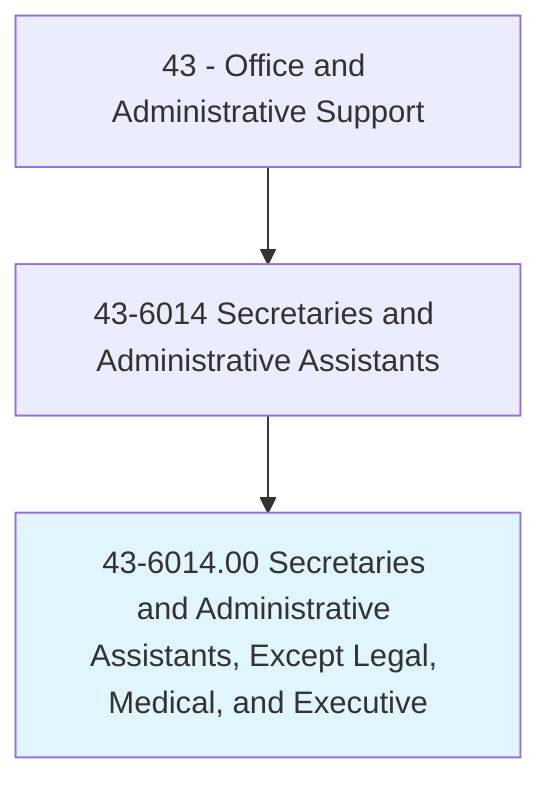
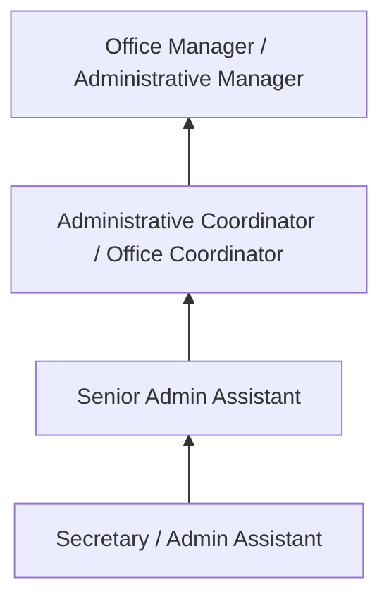
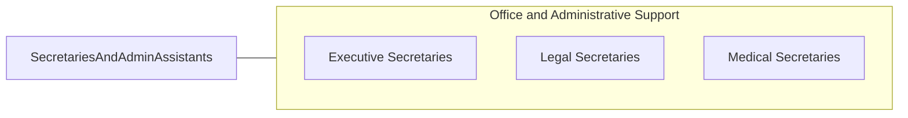

# Secretaries and Administrative Assistants, Except Legal, Medical, and Executive

> Perform routine administrative functions such as drafting correspondence, scheduling appointments, organizing and maintaining paper and electronic files, or providing information to callers.

## Overview

Secretaries and Administrative Assistants provide general administrative support across all types of organizations, handling correspondence, scheduling, filing, data entry, meeting coordination, and office management tasks. This is the broadest category of secretarial workers, excluding those specialized in legal, medical, or executive support.

Working in every industry sector, these professionals manage calendars, prepare documents and presentations, coordinate travel arrangements, process expense reports, maintain office supplies, and serve as communication hubs for their departments. They support managers, teams, or entire departments with the organizational and clerical tasks that keep operations running smoothly.

The role has evolved significantly from traditional typing and shorthand toward technology-enabled office management, project coordination, and administrative problem-solving. Modern administrative assistants use productivity software suites, collaboration platforms, and enterprise systems, often taking on responsibilities that blend clerical support with basic project management and event coordination.

## Classification Hierarchy

## Key Statistics

| Metric | Value |
|--------|-------|
| SOC Code | 43-6014.00 |
| Job Zone | 2 (Some Preparation) |
| Category | [Office and Administrative Support](/occupations/Administrative/index) |
| Median Annual Salary | $41,000 |
| Employment | ~1,600,000 |
| Projected Growth | -10% (declining) |
| Core Tasks | 40 |
| Source | O*NET |

## Core Tasks

Core task data with GraphDL semantic actions for this occupation is maintained in the data pipeline. See [O*NET 43-6014.00](https://www.onetonline.org/link/summary/43-6014.00) for detailed task information.

## Skills & Competencies

### Technical Skills
- **Microsoft Office / Google Workspace** - Advanced
- **Calendar and Scheduling Management** - Advanced
- **Document Preparation** - Advanced
- **Filing and Records Management** - Advanced
- **Travel and Expense Processing** - Intermediate

### Soft Skills
- **Organizational Skills** - Critical
- **Communication** - Critical
- **Discretion** - Essential
- **Multitasking** - Essential
- **Adaptability** - Essential

## Education & Certifications

| Requirement | Details |
|-------------|---------|
| Typical Education | High school diploma; some college preferred |
| CAP (Certified Administrative Professional) | IAAP credential |
| MOS (Microsoft Office Specialist) | Software proficiency |
| Organizational Management Certificate | Community college programs |

## Career Progression

## Industry Variations

| Setting | Focus | Unique Aspects |
|---------|-------|----------------|
| Corporate | Department support | Multiple managers; meeting coordination; presentations |
| Education | School/department admin | Academic calendars; student records; faculty support |
| Government | Public administration | Civil service; procedural compliance; constituent services |
| Nonprofit | Program support | Grant administration; donor records; event planning |

## Technology & Tools

- **Office** - Microsoft 365, Google Workspace
- **Collaboration** - Teams, Slack, Zoom
- **Scheduling** - Outlook, Google Calendar, Calendly
- **Document Management** - SharePoint, OneDrive, Dropbox

## Related Occupations

## Departments

This occupation typically works in:
- Administration - Office operations
- [Operations](/departments/Operations) - Department support
- [Human Resources](/departments/HR) - Administrative functions
- [Finance](/departments/Finance) - Department coordination

---

*Source: O*NET 43-6014.00 - ONETOccupation*
