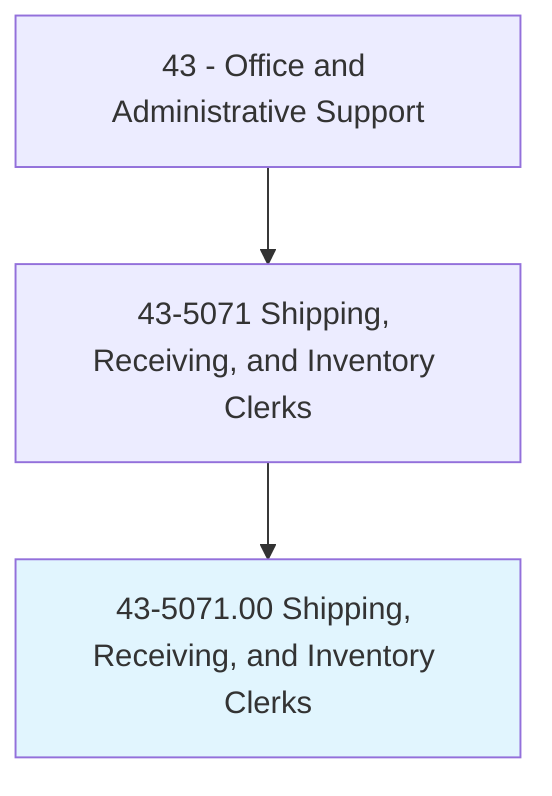
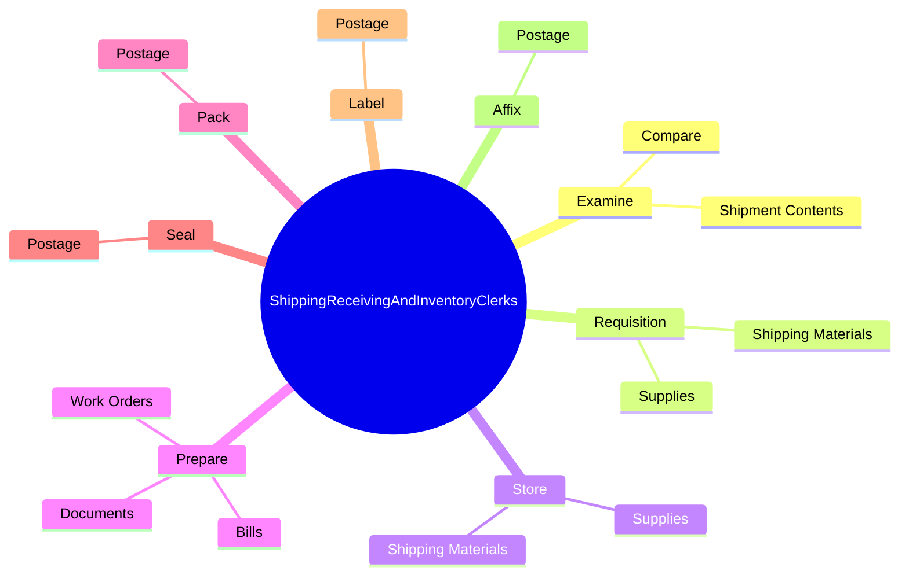
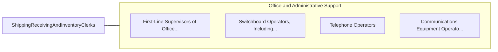

# Shipping, Receiving, and Inventory Clerks

> Verify and maintain records on incoming and outgoing shipments involving inventory. Duties include verifying and recording incoming merchandise or material and arranging for the transportation of products. May prepare items for shipment.

## Overview

Shipping, Receiving, and Inventory Clerks is an occupation within the Office and Administrative Support category. Verify and maintain records on incoming and outgoing shipments involving inventory. Duties include verifying and recording incoming merchandise or material and arranging for the transportation of products.

## Classification Hierarchy

## Key Statistics

| Metric | Value |
|--------|-------|
| SOC Code | 43-5071.00 |
| Category | [Office and Administrative Support](/occupations/Administrative) |
| Task Count | 80 |
| Source | O*NET |

## Core Tasks

### examine.ShipmentContents

Shipping, Receiving, and Inventory Clerks examine shipment contents as part of their core responsibilities.

**Actions:**
- `examine.ShipmentContents.with.Records`
- `examine.ShipmentContents.with.Manifests`
- `examine.ShipmentContents.with.Invoices`
- `examine.ShipmentContents.with.Orders`

### requisition.ShippingMaterials

Shipping, Receiving, and Inventory Clerks requisition shipping materials as part of their core responsibilities.

**Actions:**
- `requisition.ShippingMaterials.to.maintain.InventoryOfStock`
- `requisition.Supplies.to.maintain.InventoryOfStock`

### store.ShippingMaterials

Shipping, Receiving, and Inventory Clerks store shipping materials as part of their core responsibilities.

**Actions:**
- `store.ShippingMaterials.to.maintain.InventoryOfStock`
- `store.Supplies.to.maintain.InventoryOfStock`

## Skills & Competencies

### Technical Skills
- **Office Management** - Advanced
- **Data Entry** - Advanced
- **Records Management** - Advanced

### Soft Skills
- **Communication** - Essential
- **Problem Solving** - Essential
- **Critical Thinking** - Important
- **Teamwork** - Important
- **Adaptability** - Important

## Related Occupations

## Industries

This occupation is found across multiple industries. See [Industries](/industries) for sector-specific employment data.

## Career Progression

---

*Source: O*NET 43-5071.00 - ONETOccupation*
