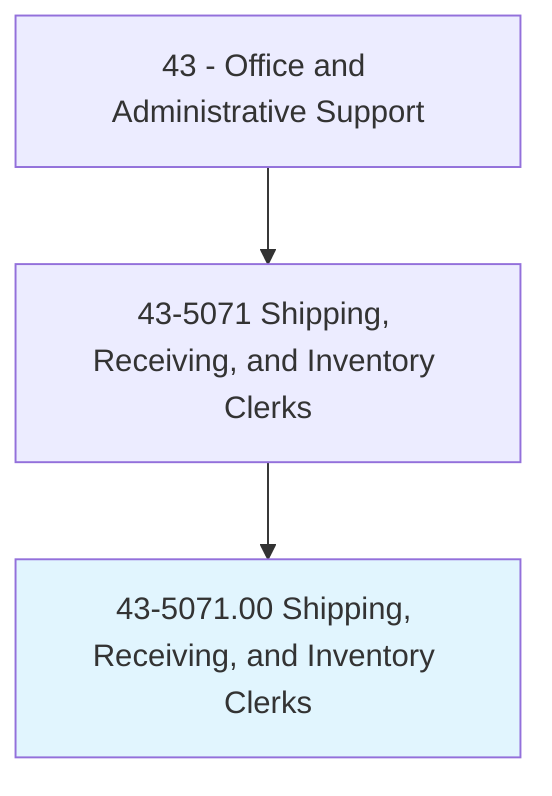
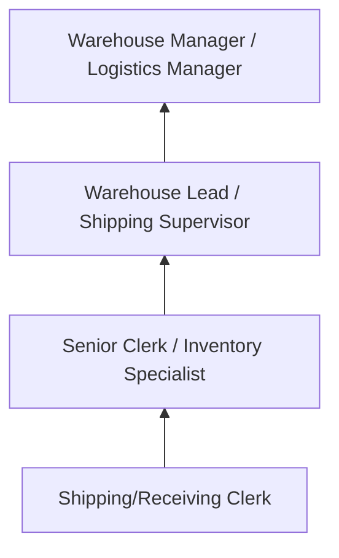
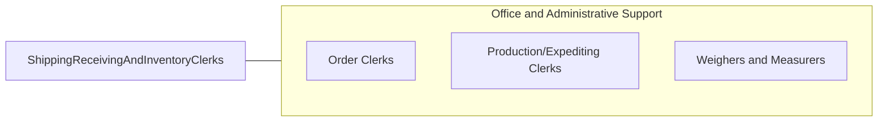

# Shipping, Receiving, and Inventory Clerks

> Verify and maintain records on incoming and outgoing shipments involving inventory. Duties include verifying and recording incoming merchandise or material and arranging for the transportation of products. May prepare items for shipment.

## Overview

Shipping, Receiving, and Inventory Clerks manage the flow of goods into and out of organizations, verifying shipments against purchase orders and packing lists, inspecting items for damage, recording inventory transactions, preparing outgoing shipments, and maintaining accurate stock records. They serve as the gatekeepers of physical inventory, ensuring accountability from dock to stock.

Working in warehouses, distribution centers, manufacturing plants, and retail stockrooms, these clerks unload deliveries, check quantities and conditions, route items to appropriate storage locations, pick and pack outgoing orders, prepare shipping documentation including bills of lading and customs forms, and coordinate with carriers for pickup and delivery scheduling.

The role requires physical capability for lifting and moving goods, attention to detail for accurate counting and documentation, and familiarity with warehouse management systems and barcode/RFID scanning technology. While automation has transformed large-scale distribution, clerks remain essential for quality verification, exception handling, and inventory accuracy.

## Classification Hierarchy

## Key Statistics

| Metric | Value |
|--------|-------|
| SOC Code | 43-5071.00 |
| Job Zone | 2 (Some Preparation) |
| Category | [Office and Administrative Support](/occupations/Administrative/index) |
| Median Annual Salary | $38,200 |
| Employment | ~620,000 |
| Projected Growth | -3% (declining) |
| Core Tasks | 35 |
| Source | O*NET |

## Core Tasks

Core task data with GraphDL semantic actions for this occupation is maintained in the data pipeline. See [O*NET 43-5071.00](https://www.onetonline.org/link/summary/43-5071.00) for detailed task information.

## Skills & Competencies

### Technical Skills
- **Warehouse Management Systems (WMS)** - Advanced
- **Barcode/RFID Scanning** - Advanced
- **Shipping Documentation** - Advanced
- **Inventory Control** - Advanced
- **Forklift Operation** - Intermediate

### Soft Skills
- **Attention to Detail** - Critical
- **Physical Stamina** - Critical
- **Organizational Skills** - Critical
- **Accuracy** - Critical
- **Time Management** - Essential

## Education & Certifications

| Requirement | Details |
|-------------|---------|
| Typical Education | High school diploma |
| Forklift Certification | OSHA compliance |
| Hazmat Handling | DOT/IATA for hazardous materials |
| APICS/ASCM Basics | Inventory management fundamentals |

## Career Progression

## Industry Variations

| Setting | Focus | Unique Aspects |
|---------|-------|----------------|
| Manufacturing | Raw materials and finished goods | BOM verification; production feeding; quality holds |
| E-Commerce/Distribution | Order fulfillment | High volume; pick/pack/ship; returns processing |
| Retail | Store replenishment | Planogram compliance; backroom management; transfers |
| Healthcare | Medical supplies | Temperature control; lot tracking; expiration management |

## Technology & Tools

- **WMS** - SAP EWM, Manhattan, Blue Yonder
- **Scanning** - Barcode guns, RFID readers, mobile devices
- **Shipping** - FedEx/UPS/USPS software, TMS
- **Equipment** - Forklifts, pallet jacks, conveyor systems

## Related Occupations

## Departments

This occupation typically works in:
- [Warehouse](/departments/Warehouse) - Receiving and shipping
- [Inventory Control](/departments/InventoryControl) - Stock management
- [Supply Chain](/departments/SupplyChain) - Logistics coordination
- [Operations](/departments/Operations) - Fulfillment support

---

*Source: O*NET 43-5071.00 - ONETOccupation*
