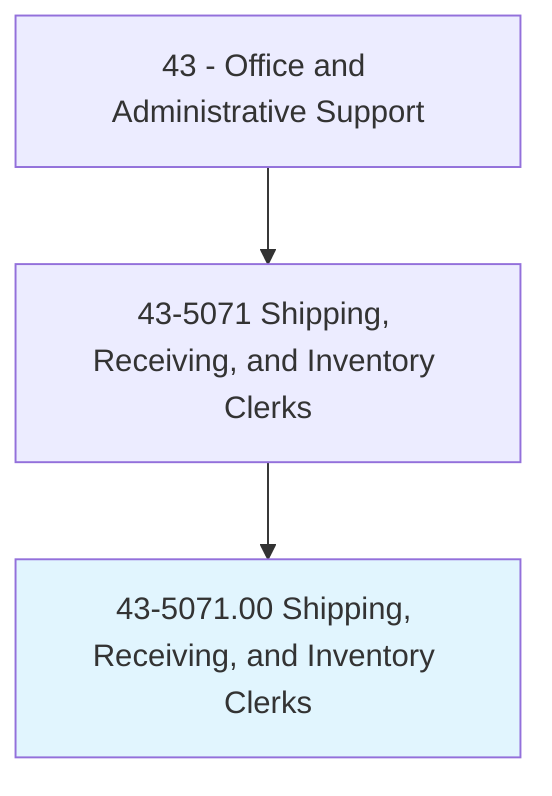
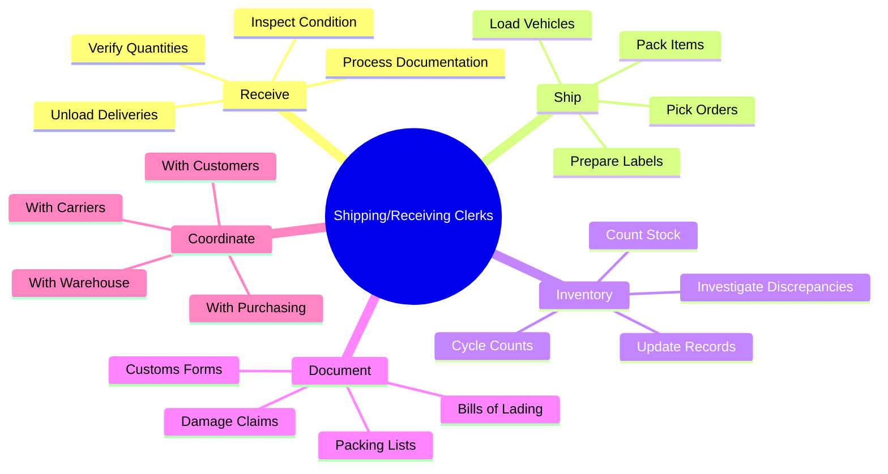
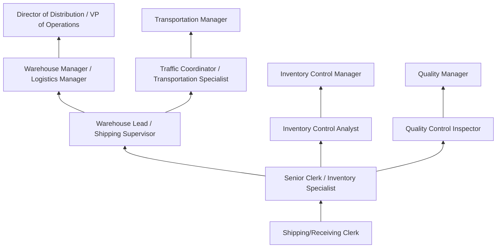
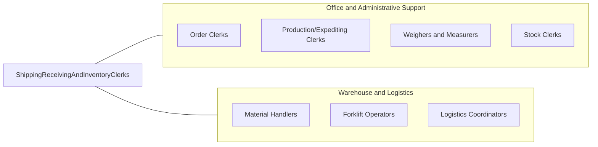

# Shipping, Receiving, and Inventory Clerks

> Verify and maintain records on incoming and outgoing shipments involving inventory. Duties include verifying and recording incoming merchandise or material and arranging for the transportation of products. May prepare items for shipment.

## Overview

Shipping, Receiving, and Inventory Clerks manage the flow of goods into and out of organizations, serving as the gatekeepers of physical inventory and the documentation that tracks it. They verify incoming shipments against purchase orders and packing lists, inspect items for damage or discrepancies, record inventory transactions in warehouse management systems, prepare outgoing shipments with proper packaging and documentation, and maintain accurate stock records that enable efficient operations and financial accountability.

Working in warehouses, distribution centers, manufacturing plants, retail stockrooms, and virtually any organization that handles physical goods, these clerks perform essential logistics functions. On the receiving side, they unload deliveries from trucks and containers, check quantities and conditions against documentation, route items to appropriate storage locations, and initiate processes to resolve discrepancies with suppliers. On the shipping side, they pick and pack outgoing orders, prepare bills of lading, shipping labels, and customs documentation, schedule carrier pickups, and load vehicles for departure.

The role requires physical capability for lifting and moving goods (typically up to 50 pounds), attention to detail for accurate counting and documentation, and proficiency with warehouse management systems, barcode scanners, and RFID technology. While large-scale distribution has seen significant automation with conveyors, sortation systems, and robotic picking, clerks remain essential for quality verification, exception handling, inventory accuracy, and the judgment calls that technology cannot make. E-commerce growth has dramatically increased shipping volumes while raising customer expectations for speed and accuracy.

## Classification Hierarchy



## Key Statistics

| Metric | Value |
|--------|-------|
| SOC Code | 43-5071.00 |
| Job Zone | 2 (Some Preparation) |
| Category | [Office and Administrative Support](/occupations/Administrative/index) |
| Median Annual Salary | $38,200 |
| Salary Range | $28,000 - $54,000 |
| 10th Percentile | $28,500 |
| 90th Percentile | $53,800 |
| Employment | ~620,000 |
| Projected Growth | -3% (declining) |
| Annual Openings | ~85,000 |
| Core Tasks | 35 |
| Source | O*NET |

## Core Tasks



### receive.IncomingShipments

Shipping/Receiving Clerks process incoming deliveries.

**Actions:**
- `receive.Shipments.at.Dock`
- `verify.Quantities.against.PurchaseOrders`
- `inspect.Items.for.Damage`
- `route.Inventory.to.Storage`

### ship.OutgoingOrders

Shipping/Receiving Clerks prepare and ship outgoing orders.

**Actions:**
- `pick.Items.from.Inventory`
- `pack.Orders.for.Shipment`
- `prepare.Documentation.for.Carriers`
- `load.Vehicles.for.Departure`

## Skills & Competencies

### Technical Skills
- **Warehouse Management Systems (WMS)** - Expert (SAP EWM, Manhattan, Blue Yonder)
- **Barcode/RFID Scanning** - Expert (handheld devices, fixed readers)
- **Shipping Documentation** - Advanced (BOL, customs, hazmat)
- **Inventory Control Methods** - Advanced (FIFO, LIFO, cycle counting)
- **Forklift Operation** - Advanced (sit-down, stand-up, pallet jacks)
- **Carrier Systems** - Advanced (FedEx, UPS, LTL carriers)
- **Microsoft Excel** - Intermediate (tracking, reporting)
- **ERP Systems** - Intermediate (SAP, Oracle inventory modules)

### Soft Skills
- **Attention to Detail** - Critical (accurate counts, documentation)
- **Physical Stamina** - Critical (lifting, standing, walking)
- **Organizational Skills** - Critical (managing shipments and inventory)
- **Accuracy** - Critical (zero tolerance for shipping errors)
- **Time Management** - Essential (meeting shipping deadlines)
- **Problem Solving** - Essential (resolving discrepancies)
- **Communication** - Important (coordination with teams)
- **Safety Awareness** - Critical (warehouse hazards)

## Education & Certifications

| Requirement | Details |
|-------------|---------|
| Typical Education | High school diploma |
| Forklift Certification | OSHA compliance (required for many positions) |
| Hazmat Handling | DOT/IATA certification for hazardous materials |
| APICS/ASCM Basics | CSCP or CPIM foundations |
| WMS Certification | System-specific training |
| Six Sigma Yellow Belt | Process improvement fundamentals |
| OSHA 10-Hour | Warehouse safety certification |
| Continuing Education | System updates, safety refreshers |

## Career Progression



### Career Pathway Details

| Level | Title | Years Experience | Key Responsibilities |
|-------|-------|------------------|----------------------|
| Entry | Shipping/Receiving Clerk | 0-1 years | Basic receiving, shipping, scanning, documentation |
| Mid | Senior Clerk / Inventory Specialist | 1-3 years | Complex shipments, inventory accuracy, training |
| Lead | Warehouse Lead / Supervisor | 3-5 years | Team coordination, scheduling, quality oversight |
| Management | Warehouse Manager | 5-10 years | Department operations, budgets, carrier negotiations |
| Director | Director of Distribution | 10-15 years | Multi-facility operations, strategy, technology decisions |

### Specialization Paths

| Specialization | Focus Area | Additional Skills Needed |
|----------------|------------|-----------------------------|
| Inventory Control | Stock accuracy, analysis | Analytics, cycle counting, auditing |
| Transportation/Traffic | Carrier management | Routing, rate negotiation, TMS |
| Quality Assurance | Inspection, compliance | Quality standards, documentation |
| Hazmat/Compliance | Regulated materials | DOT, IATA, EPA regulations |

## Industry Variations

| Setting | Focus | Unique Aspects |
|---------|-------|----------------|
| Manufacturing | Raw materials and finished goods | BOM verification; production feeding; quality holds; JIT delivery |
| E-Commerce/Distribution | Order fulfillment | High volume; pick/pack/ship; returns processing; same-day shipping |
| Retail | Store replenishment | Planogram compliance; backroom management; store transfers; seasonal surges |
| Healthcare | Medical supplies and pharmaceuticals | Temperature control; lot tracking; expiration management; FDA compliance |
| Food and Beverage | Perishable goods | Cold chain; FIFO strict; food safety; short shelf life |
| Automotive | Parts and components | JIT/JIS delivery; sequence tracking; quality requirements |

### Manufacturing Shipping/Receiving

Manufacturing clerks handle raw material receiving that feeds production lines, managing just-in-time deliveries, quality inspection holds, and material shortages that can stop production. On the shipping side, they prepare finished goods for customer delivery, often managing complex international shipments with customs documentation. Understanding of bills of materials and production schedules is valuable.

### E-Commerce Fulfillment

E-commerce distribution centers operate at high speed with demanding accuracy requirements. Clerks pick individual items from vast inventories, pack orders for parcel shipping, and process high volumes of returns. Peak seasons (Black Friday, holiday) create surge hiring needs. Automation assistance (conveyors, pick-to-light, voice picking) supplements manual work.

### Healthcare/Pharmaceutical

Healthcare shipping and receiving requires strict lot tracking, temperature monitoring for cold chain products, expiration date management, and compliance with FDA, DEA, and state pharmacy board regulations. Controlled substances require additional documentation and security. Traceability is essential for recalls and patient safety.

### Food Service Distribution

Food distribution clerks manage perishable inventory with strict FIFO rotation, temperature-controlled receiving and storage, and food safety compliance (HACCP, SQF). Delivery windows are tight for restaurant and retail customers, and damage or temperature excursions can result in total product loss.

## Technology & Tools

### Warehouse Management Systems
- **SAP Extended Warehouse Management (EWM)** - Enterprise WMS
- **Manhattan Associates** - Distribution and fulfillment
- **Blue Yonder (JDA)** - Supply chain planning and execution
- **Oracle WMS Cloud** - Cloud-based warehouse management
- **NetSuite WMS** - Mid-market inventory management

### Scanning and Tracking
- **Barcode Scanners** - Zebra, Honeywell handheld devices
- **RFID Readers** - Fixed and mobile RFID technology
- **Mobile Computers** - Warehouse mobile devices
- **GPS Tracking** - Shipment location tracking
- **IoT Sensors** - Temperature, humidity monitoring

### Shipping Systems
- **FedEx Ship Manager** - FedEx integration
- **UPS WorldShip** - UPS shipping software
- **Multi-Carrier TMS** - ShipStation, Shippo, EasyPost
- **LTL Carrier Portals** - Less-than-truckload booking
- **Customs/Trade** - AES, ACE export/import systems

### Material Handling Equipment
- **Forklifts** - Sit-down, stand-up, reach trucks
- **Pallet Jacks** - Manual and electric
- **Conveyor Systems** - Automated material flow
- **Dock Equipment** - Dock levelers, seals, doors
- **Stretch Wrappers** - Pallet wrapping machines

## Related Occupations



### Related Occupation Comparison

| Occupation | Similarity | Key Difference |
|------------|------------|----------------|
| Stock Clerks and Order Fillers | High | Stocking focus vs shipping/receiving |
| Material Handlers | High | Movement-focused vs documentation |
| Order Clerks | Medium | Order entry vs physical fulfillment |
| Logistics Coordinators | Medium | Planning vs execution |

## Industries

- [Wholesale Trade](/industries/Wholesale) - High Employment
- [Retail Trade](/industries/Retail) - High Employment
- [Manufacturing](/industries/Manufacturing/index) - High Employment
- [Transportation and Warehousing](/industries/Transportation) - High Employment
- [Healthcare](/industries/Healthcare/index) - Moderate Employment
- [Food and Beverage](/industries/Manufacturing/Food) - Moderate Employment

## Departments

This occupation typically works in:
- Warehouse Operations - Receiving, shipping, storage
- Inventory Control - Stock management and accuracy
- [Supply Chain](/departments/SupplyChain) - Logistics coordination
- [Operations](/departments/Operations) - Fulfillment and distribution
- Purchasing - Vendor receiving coordination
- Quality Control - Inspection and compliance

## Work Environment

### Physical Setting
- Warehouse, distribution center, or stockroom
- Loading docks for truck receiving and shipping
- Climate varies (ambient, refrigerated, frozen)
- Industrial setting with forklifts and conveyors
- Standing and walking throughout shift

### Work Schedule
- Shift work common (day, evening, overnight)
- Peak seasons require overtime (holiday, back-to-school)
- Some weekend work depending on operations
- Monday-Friday standard for some facilities
- E-commerce may operate 24/7

### Physical Demands
- Lifting packages up to 50+ pounds regularly
- Standing and walking for entire shift
- Bending, reaching, climbing ladders
- Pushing and pulling carts and equipment
- Operating material handling equipment

### Work Characteristics
- Fast-paced during shipping deadlines
- Repetitive tasks with accuracy requirements
- Team coordination with warehouse staff
- Deadline pressure for carrier cutoffs
- Performance metrics tracked closely

### Safety Considerations
- Forklift and pedestrian traffic
- Lifting injuries and ergonomics
- Slip, trip, and fall hazards
- Dock safety (truck movement, plate edges)
- Temperature extremes in cold storage

## Performance Metrics

### Key Performance Indicators

| Metric | Description | Typical Standard |
|--------|-------------|------------------|
| Receiving Accuracy | Items correctly received | >99.5% |
| Shipping Accuracy | Orders shipped correctly | >99.8% |
| Inventory Accuracy | Physical vs system count | >99% |
| On-Time Shipment | Orders shipped by cutoff | >98% |
| Damage Rate | Items damaged in handling | <0.1% |
| Productivity | Units processed per hour | Varies by operation |

### Inventory Management Standards

- Cycle counting frequency and accuracy
- Shrinkage and loss prevention
- FIFO/FEFO compliance
- Location accuracy
- Put-away timeliness

## GraphDL Semantic Structure

```graphdl
Shipping, Receiving, and Inventory Clerks perform:
- receive.Shipments.at.Dock
- verify.Quantities.against.Documentation
- inspect.Items.for.Damage
- update.Inventory.in.Systems
- pick.Orders.from.Stock
- pack.Items.for.Shipment
- prepare.Documentation.for.Carriers
- maintain.Accuracy.of.Records
```

---

*Source: O*NET 43-5071.00 - ONETOccupation*
