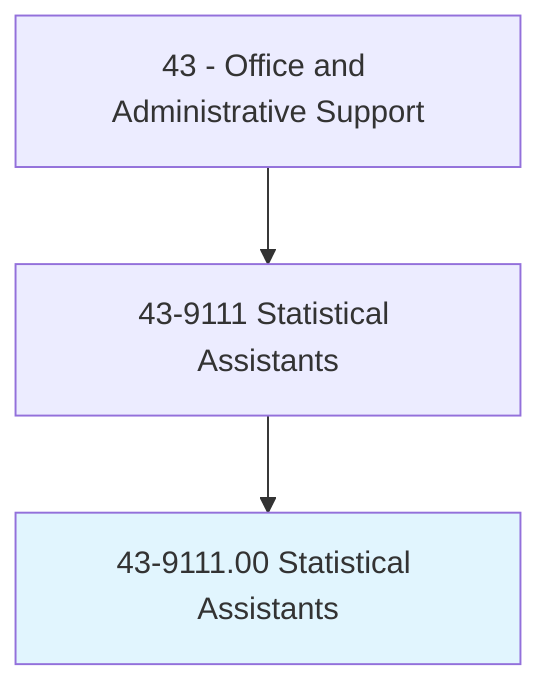
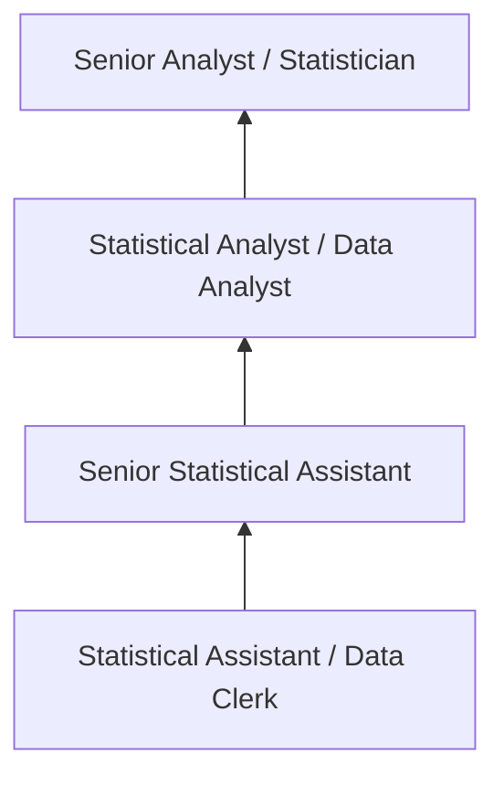
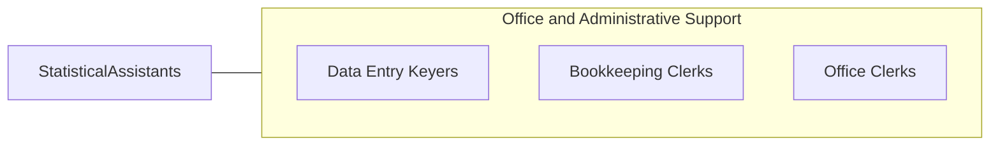

# Statistical Assistants

> Compile and compute data according to statistical formulas for use in statistical studies. May perform actuarial computations and compile charts and graphs for use by actuaries. Includes actuarial clerks.

## Overview

Statistical Assistants compile, organize, and compute data for statistical analysis, supporting statisticians, actuaries, researchers, and analysts. They gather data from surveys, records, and databases, enter information into statistical software, perform routine calculations, verify data accuracy, and prepare charts, tables, and reports that present statistical findings.

Working in insurance companies, government agencies, research institutions, and corporate analytics departments, these assistants handle the data preparation and routine computational work that supports advanced statistical analysis. They maintain databases, code survey responses, check data for errors and outliers, and format output for presentations and publications.

The role bridges clerical data handling and analytical work, requiring both administrative precision and basic understanding of statistical concepts, mathematical computations, and data visualization. As data analytics has grown, the position has evolved to include more work with spreadsheets, databases, and statistical software packages.

## Classification Hierarchy

## Key Statistics

| Metric | Value |
|--------|-------|
| SOC Code | 43-9111.00 |
| Job Zone | 3 (Medium Preparation) |
| Category | [Office and Administrative Support](/occupations/Administrative/index) |
| Median Annual Salary | $47,800 |
| Employment | ~14,000 |
| Projected Growth | -5% (declining) |
| Core Tasks | 20 |
| Source | O*NET |

## Core Tasks

Core task data with GraphDL semantic actions for this occupation is maintained in the data pipeline. See [O*NET 43-9111.00](https://www.onetonline.org/link/summary/43-9111.00) for detailed task information.

## Skills & Competencies

### Technical Skills
- **Spreadsheet Analysis (Excel Advanced)** - Expert
- **Statistical Software (SAS, SPSS, R basics)** - Intermediate
- **Data Entry and Verification** - Advanced
- **Database Management** - Advanced
- **Data Visualization** - Intermediate

### Soft Skills
- **Accuracy** - Critical
- **Attention to Detail** - Critical
- **Mathematical Aptitude** - Essential
- **Organizational Skills** - Essential
- **Analytical Thinking** - Essential

## Education & Certifications

| Requirement | Details |
|-------------|---------|
| Typical Education | Associate's degree; bachelor's in statistics or math preferred |
| Excel Certification | MOS Expert level |
| SAS Base Certification | For SAS-heavy environments |
| Actuarial Exam P/1 | For actuarial clerk positions |

## Career Progression

## Industry Variations

| Setting | Focus | Unique Aspects |
|---------|-------|----------------|
| Insurance/Actuarial | Actuarial computations | Mortality tables; loss ratios; premium calculations |
| Government | Census and survey data | Large datasets; public data; standardized coding |
| Research | Academic/clinical data | Research protocols; IRB compliance; publication standards |
| Corporate | Business analytics | KPI tracking; report generation; dashboard support |

## Technology & Tools

- **Spreadsheets** - Excel (advanced functions, pivot tables)
- **Statistics** - SAS, SPSS, R, Stata
- **Databases** - Access, SQL basics
- **Visualization** - Tableau, Power BI, charts/graphs

## Related Occupations

## Departments

This occupation typically works in:
- Analytics - Data analysis support
- Actuarial - Insurance computations
- [Research](/departments/Research) - Data compilation
- [Finance](/departments/Finance) - Financial reporting

---

*Source: O*NET 43-9111.00 - ONETOccupation*
