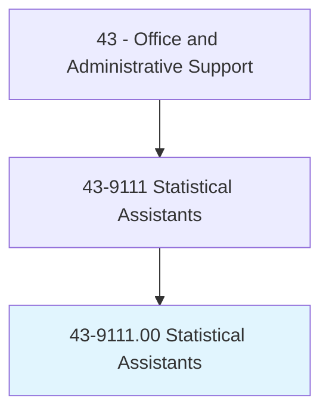
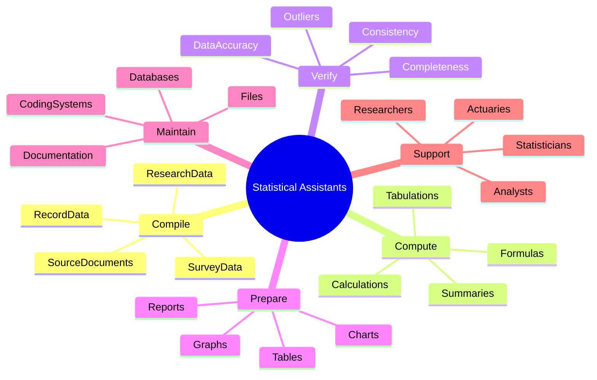
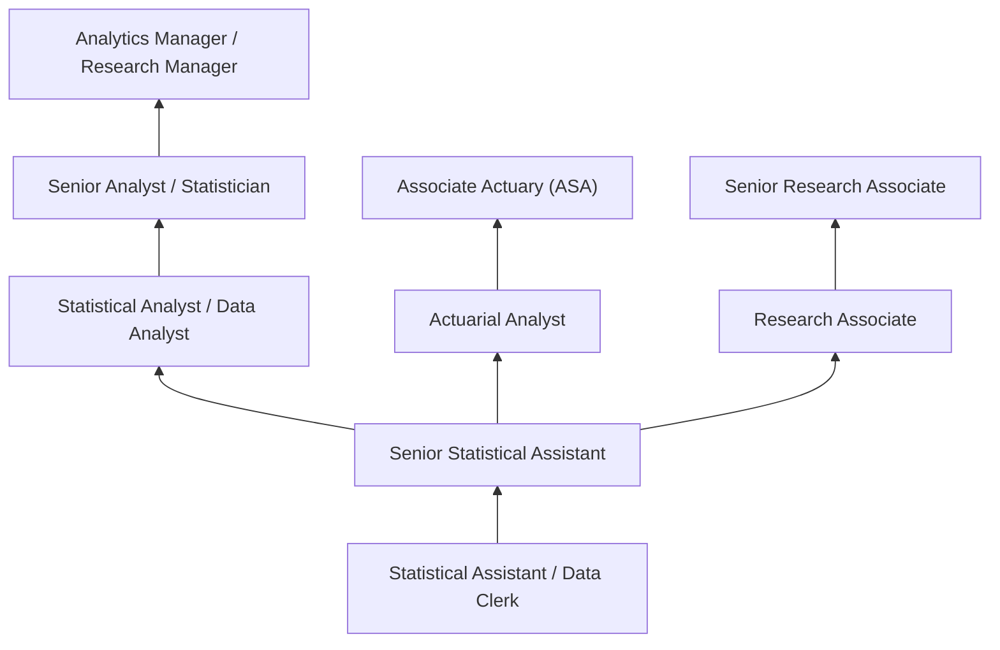
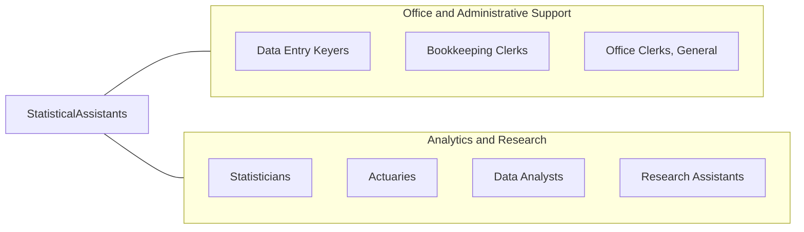

# Statistical Assistants

> Compile and compute data according to statistical formulas for use in statistical studies. May perform actuarial computations and compile charts and graphs for use by actuaries. Includes actuarial clerks.

## Overview

Statistical Assistants compile, organize, and compute data for statistical analysis, supporting statisticians, actuaries, researchers, and analysts. They gather data from surveys, records, and databases, enter information into statistical software, perform routine calculations, verify data accuracy, and prepare charts, tables, and reports that present statistical findings.

Working in insurance companies, government agencies, research institutions, and corporate analytics departments, these assistants handle the data preparation and routine computational work that supports advanced statistical analysis. They maintain databases, code survey responses, check data for errors and outliers, and format output for presentations and publications.

The role bridges clerical data handling and analytical work, requiring both administrative precision and basic understanding of statistical concepts, mathematical computations, and data visualization. As data analytics has grown in importance, the position has evolved to include more work with spreadsheets, databases, and statistical software packages. Statistical assistants contribute to research quality by ensuring data integrity and providing accurate computational support.

## Classification Hierarchy

## Key Statistics

| Metric | Value |
|--------|-------|
| SOC Code | 43-9111.00 |
| Job Zone | 3 (Medium Preparation) |
| Category | [Office and Administrative Support](/occupations/Administrative/index) |
| Median Annual Salary | $47,800 |
| Salary Range | $32,000 - $70,000 |
| 10th Percentile | $32,500 |
| 90th Percentile | $69,800 |
| Employment | ~14,000 |
| Projected Growth | -5% (declining) |
| Core Tasks | 20 |
| Source | O*NET |

## Core Tasks

### compile.StatisticalData

Statistical Assistants gather and organize data from various sources for analysis.

**Actions:**
- `compile.SurveyData.from.Questionnaires` - Collect and organize survey responses
- `compile.RecordData.from.SourceDocuments` - Extract data from administrative records
- `compile.ResearchData.from.Studies` - Assemble data from research projects
- `code.Responses.according.to.CodingSchemes` - Apply coding systems to raw data
- `enter.Data.into.Databases` - Input information into statistical systems
- `organize.Data.for.AnalyticalProcessing` - Structure data for statistical analysis

### compute.StatisticalCalculations

Statistical Assistants perform routine calculations and apply statistical formulas.

**Actions:**
- `calculate.Sums.and.Averages` - Compute basic descriptive statistics
- `apply.Formulas.to.Datasets` - Execute standard statistical calculations
- `compute.Percentages.and.Ratios` - Calculate proportions and rates
- `tabulate.Frequencies.and.Distributions` - Create frequency tables and distributions
- `calculate.ActuarialValues.for.Insurance` - Perform insurance-related computations
- `verify.Calculations.for.Accuracy` - Double-check computational results

### verify.DataQuality

Statistical Assistants check data for accuracy, completeness, and consistency.

**Actions:**
- `verify.DataAccuracy.against.SourceDocuments` - Compare entered data to originals
- `check.Completeness.of.Datasets` - Identify missing data and gaps
- `identify.Outliers.and.Anomalies` - Flag unusual values for review
- `validate.Coding.against.Standards` - Ensure proper code application
- `reconcile.Discrepancies.in.Data` - Resolve inconsistencies between sources
- `clean.Data.by.CorrectingErrors` - Fix identified data problems

### prepare.StatisticalOutput

Statistical Assistants create visual and tabular presentations of statistical findings.

**Actions:**
- `prepare.Charts.and.Graphs` - Create visual representations of data
- `format.Tables.for.Reports` - Design clear, readable data tables
- `generate.Reports.with.Findings` - Compile analytical summaries
- `create.Dashboards.for.Monitoring` - Build visual tracking displays
- `format.Output.for.Publications` - Prepare materials for formal publication
- `present.Data.in.Clear.Formats` - Organize information for understanding

### maintain.DataSystems

Statistical Assistants manage databases and data management systems.

**Actions:**
- `maintain.Databases.with.CurrentData` - Keep information systems updated
- `update.Records.as.NewData.Arrives` - Incorporate new information promptly
- `backup.Data.for.Security` - Protect data through regular backups
- `document.DataSources.and.Methods` - Record data provenance and procedures
- `maintain.CodingManuals.for.Reference` - Keep coding documentation current
- `archive.Completed.Studies` - Store finished research materials properly

### support.AnalyticalStaff

Statistical Assistants provide support to statisticians, actuaries, and researchers.

**Actions:**
- `assist.Statisticians.with.DataPreparation` - Ready data for advanced analysis
- `support.Actuaries.with.Computations` - Perform actuarial calculations
- `help.Researchers.with.DataCollection` - Gather information for studies
- `respond.to.DataRequests.from.Analysts` - Provide requested information
- `coordinate.with.Teams.on.Projects` - Collaborate on research efforts
- `learn.NewMethods.as.Requirements.Change` - Adapt to evolving analytical needs

## Skills & Competencies

### Technical Skills
- **Spreadsheet Analysis (Excel Advanced)** - Expert (formulas, pivot tables, charts, macros)
- **Statistical Software (SAS, SPSS, R basics)** - Intermediate (data entry, basic procedures)
- **Data Entry and Verification** - Advanced (accurate, efficient input)
- **Database Management** - Advanced (Access, SQL basics, data maintenance)
- **Data Visualization** - Intermediate (charts, graphs, dashboards)
- **Mathematical Computations** - Advanced (calculations, formulas, verification)
- **Survey Processing** - Intermediate (coding, tabulation, analysis)
- **Office Software** - Advanced (Word, PowerPoint for reporting)

### Soft Skills
- **Accuracy** - Critical (error-free data entry and calculations)
- **Attention to Detail** - Critical (catching errors, verifying data)
- **Mathematical Aptitude** - Essential (numerical comfort, computational skills)
- **Organizational Skills** - Essential (managing data and files systematically)
- **Analytical Thinking** - Essential (understanding data patterns and issues)
- **Reliability** - Critical (consistent quality, meeting deadlines)
- **Learning Orientation** - Important (adapting to new tools and methods)

## Education & Certifications

| Requirement | Details |
|-------------|---------|
| Typical Education | Associate's degree; bachelor's in statistics or math preferred |
| Preferred Fields | Statistics, mathematics, economics, business |
| Excel Certification | MOS Expert level for advanced spreadsheet work |
| SAS Base Certification | For SAS-heavy environments |
| Actuarial Exam P/1 | For actuarial clerk positions (probability) |
| R Programming | For environments using R |
| SQL Training | Database query skills |

## Career Progression

### Career Pathway Details

| Level | Title | Years Experience | Key Responsibilities |
|-------|-------|------------------|----------------------|
| Entry | Statistical Assistant / Data Clerk | 0-2 years | Data entry, basic calculations, verification |
| Mid | Senior Statistical Assistant | 2-5 years | Complex data work, quality control, training |
| Analyst | Statistical/Data Analyst | 5-8 years | Independent analysis, reporting, methodology |
| Senior | Senior Analyst / Statistician | 8-12 years | Advanced analysis, study design, leadership |
| Management | Analytics Manager | 12+ years | Team leadership, strategy, stakeholder management |

### Alternative Career Paths

| Path | Description | Requirements |
|------|-------------|--------------|
| Actuarial | Insurance mathematics | Actuarial exams, analytical skills |
| Data Science | Advanced analytics | Programming, machine learning, statistics |
| Market Research | Consumer insights | Research methods, survey design |
| Business Intelligence | Corporate analytics | BI tools, business acumen |

## Industry Variations

| Setting | Focus | Unique Aspects |
|---------|-------|----------------|
| Insurance/Actuarial | Actuarial computations | Mortality tables; loss ratios; premium calculations; reserving |
| Government | Census and survey data | Large datasets; public data; standardized coding; FOIA |
| Research | Academic/clinical data | Research protocols; IRB compliance; publication standards |
| Corporate | Business analytics | KPI tracking; report generation; dashboard support |
| Healthcare | Clinical and health data | HIPAA; clinical coding; outcomes research |
| Market Research | Consumer data | Survey data; weighting; sampling; reporting |

### Insurance and Actuarial

Actuarial clerks support credentialed actuaries with mortality and morbidity calculations, premium computations, loss reserve estimates, and regulatory filings. They work with life tables, loss triangles, and financial projections, requiring precision and understanding of insurance mathematics. Many use specialized actuarial software alongside Excel.

### Government Statistical Work

Government statistical assistants work on large-scale surveys, census operations, and administrative data compilation. They follow strict protocols for data quality, confidentiality, and standardized coding. Work supports policy decisions and public information, with attention to sampling methodology and estimation procedures.

### Research Support

Research statistical assistants support academic, clinical, or scientific research with data collection, coding, entry, and preliminary analysis. They understand research protocols, IRB requirements, and publication standards. Clinical research assistants may work with patient data under HIPAA regulations.

### Corporate Analytics

Corporate statistical assistants support business intelligence and analytics functions, compiling data for KPI tracking, financial reporting, and management dashboards. They work with sales data, operational metrics, and customer information, translating raw data into business insights.

## Technology & Tools

### Spreadsheet and Analysis Software
- **Microsoft Excel** - Advanced (formulas, pivot tables, charts, macros, Power Query)
- **Google Sheets** - Cloud-based spreadsheet collaboration
- **SAS** - Statistical analysis and data management
- **SPSS** - Statistical Package for Social Sciences
- **R** - Statistical programming and visualization
- **Stata** - Statistical analysis software

### Database and Data Management
- **Microsoft Access** - Desktop database management
- **SQL** - Database querying (MySQL, SQL Server, PostgreSQL)
- **Qualtrics** - Survey data collection and analysis
- **REDCap** - Research data capture (clinical)

### Visualization and Reporting
- **Tableau** - Data visualization and dashboards
- **Power BI** - Microsoft business intelligence
- **Excel Charts** - Basic visualization
- **PowerPoint** - Presentation of findings
- **Word** - Report writing and documentation

### Specialized Tools
- **Actuarial Software** - Specialized insurance applications
- **Statistical Packages** - Specialized analysis tools
- **Survey Tools** - Qualtrics, SurveyMonkey
- **Data Cleaning** - OpenRefine, Excel cleanup

## Work Environment

### Physical Setting
- Office environment with computer workstation
- Desk-based analytical work
- Quiet environment for concentration
- Collaboration spaces for team projects
- Remote work options in many settings

### Work Schedule
- Standard business hours (8 AM - 5 PM typical)
- Project deadline pressure at times
- Quarterly and annual reporting peaks
- Research project timelines
- Generally predictable schedule

### Work Characteristics
- Detail-intensive data work
- Extended periods of computer use
- Combination of independent and collaborative work
- Project-based assignments
- Learning new tools and methods

## Related Occupations

### Related Occupation Comparison

| Occupation | Similarity | Key Difference |
|------------|------------|----------------|
| Data Entry Keyers | Medium | Input only vs analytical support |
| Data Analysts | High | Support role vs independent analysis |
| Statisticians | High | Computational support vs methodology design |
| Actuaries | High | Assistant role vs professional certification |

## Industries

- [Insurance and Finance](/industries/Finance) - High Employment
- [Government](/industries/PublicAdministration) - High Employment
- [Healthcare and Research](/industries/Healthcare) - Moderate Employment
- [Professional Services](/industries/ProfessionalServices) - Moderate Employment
- [Education](/industries/Education) - Moderate Employment
- [Market Research](/industries/Information) - Moderate Employment

## Departments

This occupation typically works in:
- Analytics - Data analysis support
- Actuarial - Insurance computations
- [Research](/departments/Research) - Data compilation and support
- [Finance](/departments/Finance) - Financial reporting support
- Business Intelligence - Dashboard and reporting
- Quality Assurance - Data quality functions

## Performance Metrics

| Metric | Description | Typical Target |
|--------|-------------|----------------|
| Data Accuracy | Error rate in entered/calculated data | <1% error rate |
| Timeliness | Meeting data delivery deadlines | On-time delivery |
| Completeness | Percentage of data properly coded/entered | >99% complete |
| Quality | Supervisor assessment of work quality | Meets standards |
| Productivity | Volume of data processed | Meets expectations |

## Professional Development

### Continuing Education
- Statistics coursework (community college, online)
- Excel and software certifications
- Actuarial exam preparation (for actuarial path)
- Data analytics bootcamps
- Industry-specific training

### Professional Organizations
- **American Statistical Association (ASA)** - Statistics profession
- **Society of Actuaries (SOA)** - Actuarial profession
- **Market Research Association** - Research industry
- **HIMSS** - Healthcare informatics

---

*Source: O*NET 43-9111.00 - ONETOccupation*
