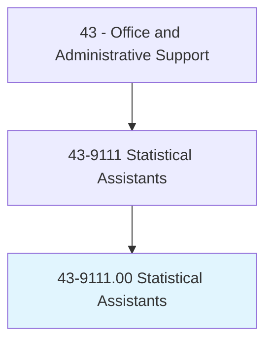
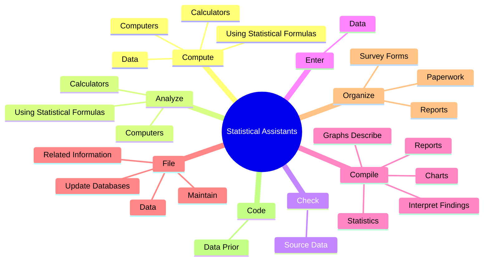
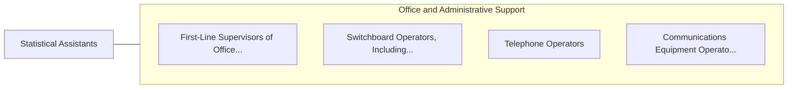

# Statistical Assistants

> Compile and compute data according to statistical formulas for use in statistical studies. May perform actuarial computations and compile charts and graphs for use by actuaries. Includes actuarial clerks.

## Overview

Statistical Assistants is an occupation within the Office and Administrative Support category. Compile and compute data according to statistical formulas for use in statistical studies. May perform actuarial computations and compile charts and graphs for use by actuaries.

## Classification Hierarchy

## Key Statistics

| Metric | Value |
|--------|-------|
| SOC Code | 43-9111.00 |
| Category | [Office and Administrative Support](/occupations/Administrative/index) |
| Task Count | 41 |
| Source | O*NET |

## Core Tasks

### compute.Data

Statistical Assistants compute data as part of their core responsibilities.

**Actions:**
- `compute.Data`
- `compute.UsingStatisticalFormulas`
- `compute.Computers`
- `compute.Calculators`

### analyze.UsingStatisticalFormulas

Statistical Assistants analyze using statistical formulas as part of their core responsibilities.

**Actions:**
- `analyze.UsingStatisticalFormulas`
- `analyze.Computers`
- `analyze.Calculators`

### check.SourceData

Statistical Assistants check source data as part of their core responsibilities.

**Actions:**
- `check.SourceData.to.verify.Completeness`
- `check.SourceData.to.Accuracy`

## Skills & Competencies

### Technical Skills
- **Office Management** - Advanced
- **Data Entry** - Advanced
- **Records Management** - Advanced

### Soft Skills
- **Communication** - Essential
- **Problem Solving** - Essential
- **Critical Thinking** - Important
- **Teamwork** - Important
- **Adaptability** - Important

## Related Occupations

## Industries

This occupation is found across multiple industries. See [Industries](/industries) for sector-specific employment data.

## Career Progression

---

*Source: O*NET 43-9111.00 - ONETOccupation*
