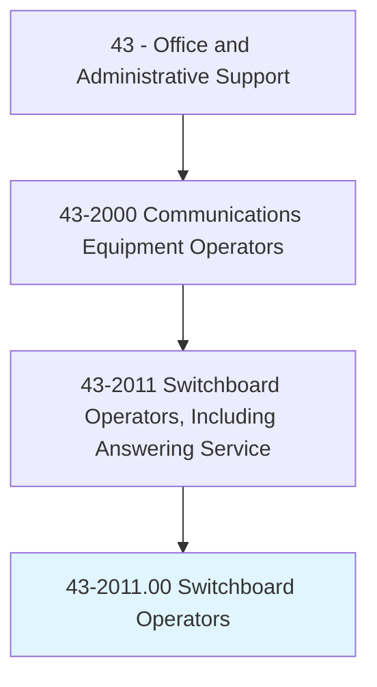
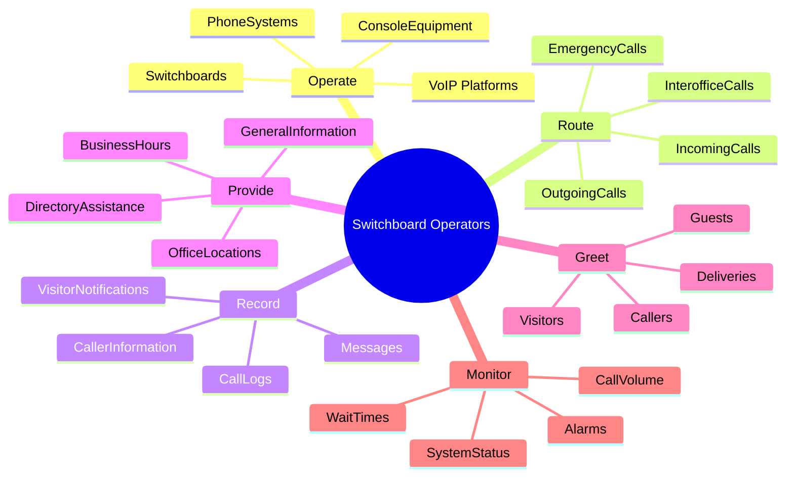
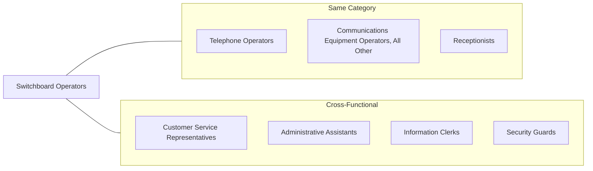
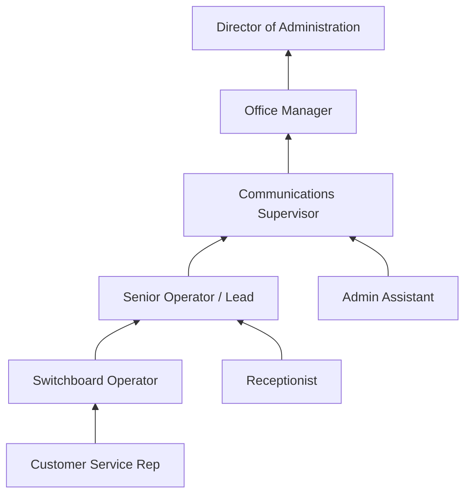

# Switchboard Operators, Including Answering Service

> Operate telephone business systems equipment or switchboards to relay incoming, outgoing, and interoffice calls. May supply information to callers and record messages.

## Overview

Switchboard Operators serve as the voice and first point of contact for organizations, managing the flow of telephone communications across businesses of all sizes. They operate multi-line phone systems to route calls to appropriate departments or individuals, take messages, provide basic information to callers, and ensure smooth internal and external communications. While traditional switchboard roles have evolved with technology, these professionals remain essential in healthcare facilities, hotels, corporate offices, and answering services where personalized call handling and human judgment are valued over automated systems.

## Classification Hierarchy

## Key Statistics

| Metric | Value |
|--------|-------|
| SOC Code | 43-2011.00 |
| Job Zone | 2 (Some Preparation) |
| Category | [Office and Administrative Support](/occupations/Administrative) |
| Core Tasks | 10+ |
| Source | O*NET |

## Core Tasks

### operate.PhoneSystems

Switchboard Operators manage telephone equipment to facilitate communications across the organization.

**Actions:**
- `operate.PhoneSystems.to.route.Calls` - Use multi-line systems to direct calls appropriately
- `operate.Switchboards.to.connect.Parties` - Establish connections between callers and recipients
- `operate.VoIPPlatforms.to.manage.Communications` - Handle digital phone system interfaces
- `operate.ConsoleEquipment.to.monitor.Lines` - Track active calls and available extensions

### route.IncomingCalls

Switchboard Operators direct incoming calls to the correct recipients within the organization.

**Actions:**
- `route.IncomingCalls.to.Departments` - Transfer calls to appropriate business units
- `route.IncomingCalls.to.Individuals` - Connect callers with specific personnel
- `route.EmergencyCalls.to.Security` - Immediately direct urgent calls to safety personnel
- `route.InterofficeCalls.between.Locations` - Facilitate calls between different office sites

### record.Messages

Switchboard Operators document caller information when recipients are unavailable.

**Actions:**
- `record.Messages.for.Recipients` - Take detailed messages for callback
- `record.CallerInformation.for.Records` - Document caller names, numbers, and purposes
- `record.CallLogs.for.Reporting` - Maintain call activity documentation
- `record.VisitorNotifications.for.Staff` - Alert employees of arriving visitors

### provide.DirectoryAssistance

Switchboard Operators supply information to callers seeking organizational contacts.

**Actions:**
- `provide.DirectoryAssistance.to.Callers` - Look up and share contact information
- `provide.GeneralInformation.about.Organization` - Answer basic company questions
- `provide.OfficeLocations.to.Visitors` - Give directions to physical locations
- `provide.BusinessHours.to.Inquirers` - Share operating schedule information

### greet.Callers

Switchboard Operators create positive first impressions through professional call handling.

**Actions:**
- `greet.Callers.with.Professionalism` - Answer calls with appropriate company greeting
- `greet.Visitors.at.Reception` - Welcome in-person guests when serving dual role
- `greet.Guests.with.Hospitality` - Provide welcoming experience in hospitality settings
- `greet.Deliveries.for.Processing` - Accept and document incoming packages

## Skills & Competencies

### Technical Skills
- **Multi-Line Phone Systems** - Expert
- **VoIP and Unified Communications** - Proficient
- **Computer Data Entry** - Proficient
- **Office Software** - Intermediate
- **Directory Systems** - Proficient

### Soft Skills
- **Communication** - Critical
- **Customer Service** - Critical
- **Active Listening** - Essential
- **Patience** - Essential
- **Multitasking** - Essential

## Related Occupations

## Industries

- [Healthcare and Social Assistance](/industries/Healthcare) - High Employment
- [Accommodation and Food Services](/industries/Hospitality) - High Employment
- [Professional, Scientific, and Technical Services](/industries/ProfessionalServices) - Moderate Employment
- [Government](/industries/Government) - Moderate Employment
- [Administrative and Support Services](/industries/AdminSupport) - Moderate Employment
- [Educational Services](/industries/Education) - Moderate Employment

## Industry Variations

### Healthcare Settings
Hospital switchboard operators handle high call volumes with life-critical urgency. They manage emergency codes, page physicians, coordinate with nursing stations, and may operate after-hours answering services. Knowledge of medical terminology and department structures is essential.

### Hotels and Hospitality
Hotel operators provide guest services including wake-up calls, local information, restaurant reservations, and room service orders. They often work 24/7 shifts and must maintain the service quality standards of the property.

### Answering Services
Commercial answering service operators handle calls for multiple client businesses, each with different scripts and procedures. They must quickly switch contexts and accurately relay messages while maintaining professional representation.

### Corporate Offices
Corporate switchboard operators often combine reception duties with call handling, greeting visitors, managing meeting room schedules, and supporting general administrative functions.

### Government Facilities
Government operators may handle sensitive calls, manage security protocols, and navigate complex organizational structures to route calls correctly within large bureaucracies.

## Career Progression

## Education & Training

| Requirement | Details |
|-------------|---------|
| Typical Education | High school diploma or equivalent |
| Work Experience | None required |
| On-the-Job Training | Short-term (few days to 1 month) |
| Common Certifications | Customer service certifications optional |

## Tools & Technology

### Phone Systems
- Multi-line business phone systems
- VoIP and cloud-based phone platforms (RingCentral, Cisco)
- PBX (Private Branch Exchange) systems
- Unified communications platforms (Microsoft Teams, Zoom)
- Automated call distribution (ACD) systems

### Support Tools
- Electronic directory and contact databases
- Visitor management systems
- Building security and access systems
- Message management software
- Paging and intercom systems

## Work Environment

### Physical Setting
- Front desk or dedicated switchboard stations
- Typically seated positions with headset equipment
- Climate-controlled office environments
- May require 24/7 shift coverage

### Work Schedule
- Full-time and part-time positions available
- Shift work common in 24-hour operations
- Weekend and holiday coverage often required
- Peak call volume periods require staffing flexibility

## Performance Metrics

| Metric | Description |
|--------|-------------|
| Answer Speed | Time to answer incoming calls |
| Call Transfer Accuracy | Correct routing to destinations |
| Message Accuracy | Completeness and correctness of recorded messages |
| Customer Satisfaction | Caller feedback and ratings |
| Call Abandonment Rate | Percentage of callers who hang up before connection |

## Technology Evolution

The switchboard operator role has evolved significantly with technology:

While automation has reduced the number of switchboard positions, skilled operators remain essential where:
- Complex call routing requires human judgment
- Personalized service enhances customer experience
- Emergency situations demand immediate human response
- Organizational complexity exceeds automated system capabilities

## Departments

This occupation typically works in:
- [Reception](/departments/Reception)
- [Communications](/departments/Communications)
- [Administrative Services](/departments/Administrative)
- [Customer Service](/departments/CustomerService)

## Related Processes

- [Communications Management](/processes/Communications)
- [Customer Service](/processes/CustomerService)
- [Visitor Management](/processes/VisitorManagement)
- [Emergency Response](/processes/EmergencyResponse)

---

*Source: O*NET 43-2011.00 - ONETOccupation*
