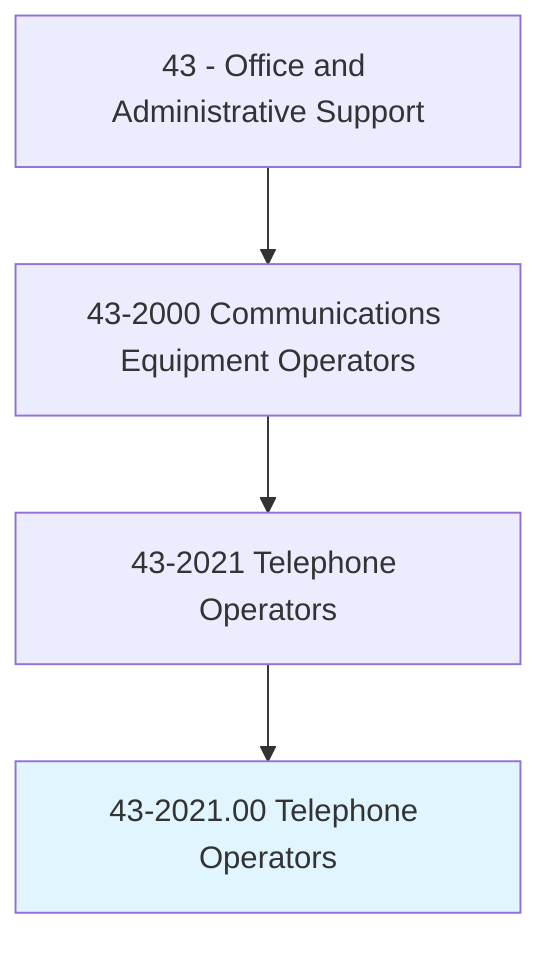
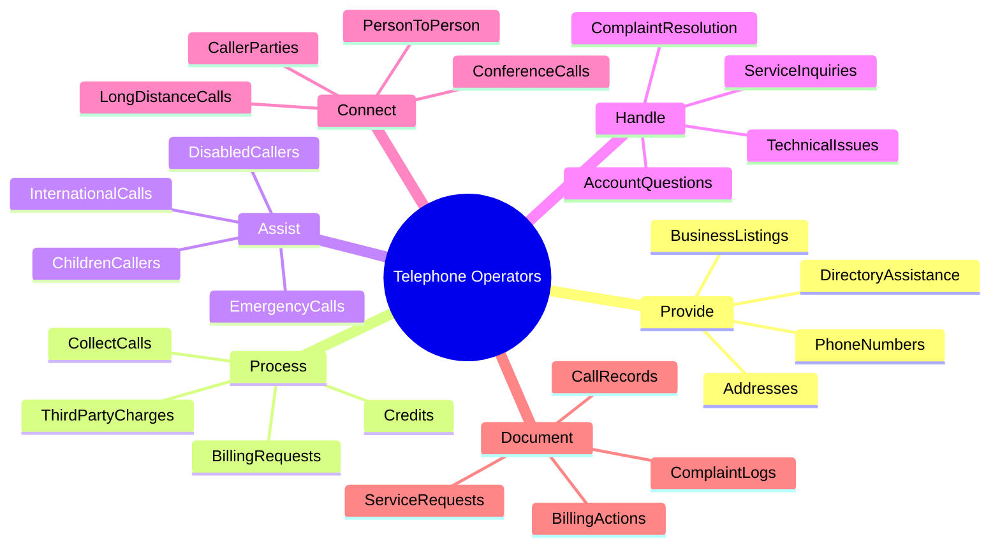
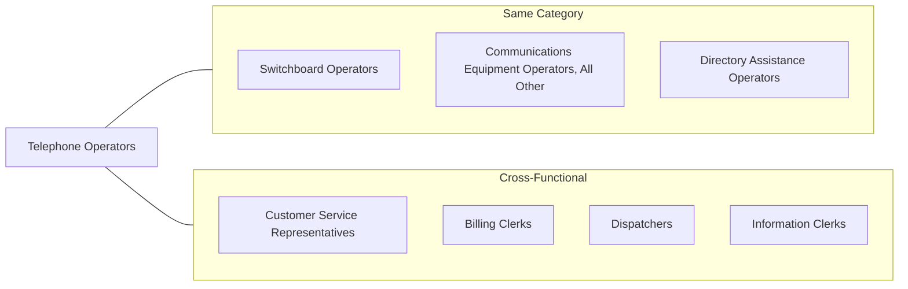
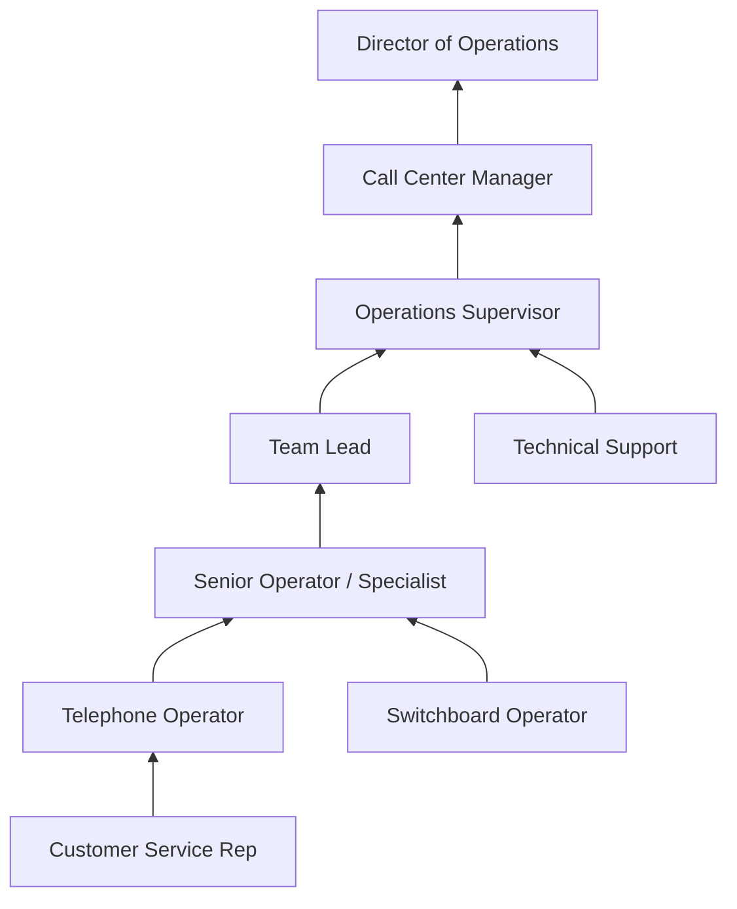
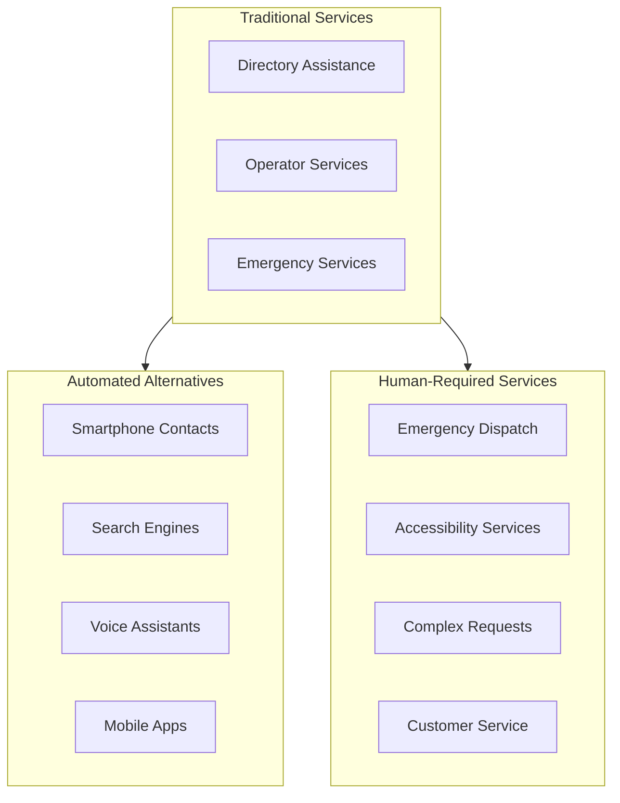

# Telephone Operators

> Provide information by accessing alphabetical, geographical, or other directories. Assist customers with special billing requests, such as charges to a third party and credits or refunds for incorrectly dialed numbers or bad connections. May handle emergency calls and assist children or people with physical disabilities to make telephone calls.

## Overview

Telephone Operators provide specialized assistance to callers requiring services beyond standard direct-dial capabilities. They access directories to provide phone numbers and addresses, handle operator-assisted calls such as collect calls and third-party billing, process billing inquiries and credits, and provide critical support for emergency situations. These professionals serve as the human interface for telecommunications services, assisting callers who need help completing calls, locating information, or resolving service issues. While technology has automated many directory services, telephone operators remain important for complex requests, accessibility services, and emergency call handling.

## Classification Hierarchy

## Key Statistics

| Metric | Value |
|--------|-------|
| SOC Code | 43-2021.00 |
| Job Zone | 2 (Some Preparation) |
| Category | [Office and Administrative Support](/occupations/Administrative/index) |
| Core Tasks | 12+ |
| Source | O*NET |

## Core Tasks

### provide.DirectoryAssistance

Telephone Operators help callers locate phone numbers and addresses through directory lookup services.

**Actions:**
- `provide.DirectoryAssistance.for.Callers` - Search directories to find requested phone numbers
- `provide.PhoneNumbers.from.Directories` - Retrieve and communicate contact information
- `provide.Addresses.for.Businesses` - Look up physical location information
- `provide.BusinessListings.by.Category` - Help callers find businesses by type or service

### process.BillingRequests

Telephone Operators handle special billing arrangements and resolve billing issues.

**Actions:**
- `process.BillingRequests.for.Customers` - Handle non-standard billing arrangements
- `process.CollectCalls.between.Parties` - Facilitate calls billed to the receiving party
- `process.ThirdPartyCharges.as.Requested` - Set up billing to alternate accounts
- `process.Credits.for.ServiceIssues` - Apply refunds for wrong numbers or bad connections

### assist.EmergencyCalls

Telephone Operators provide critical support during emergency situations.

**Actions:**
- `assist.EmergencyCalls.with.Routing` - Connect emergency callers to appropriate services
- `assist.DisabledCallers.with.Accessibility` - Provide specialized services for people with disabilities
- `assist.ChildrenCallers.with.Calls` - Help young callers complete their communications
- `assist.InternationalCalls.with.Connections` - Facilitate complex international dialing

### handle.ServiceInquiries

Telephone Operators address customer questions about telecommunications services.

**Actions:**
- `handle.ServiceInquiries.from.Customers` - Answer questions about calling procedures
- `handle.ComplaintResolution.for.Issues` - Address service problems and complaints
- `handle.TechnicalIssues.through.Troubleshooting` - Help resolve connection problems
- `handle.AccountQuestions.about.Billing` - Explain charges and account details

### connect.CallerParties

Telephone Operators establish connections for operator-assisted calls.

**Actions:**
- `connect.CallerParties.through.Operator` - Complete calls requiring operator assistance
- `connect.LongDistanceCalls.manually` - Establish connections for long-distance services
- `connect.PersonToPerson.Calls` - Set up calls for specific individuals
- `connect.ConferenceCalls.for.Groups` - Establish multi-party call connections

## Skills & Competencies

### Technical Skills
- **Directory Databases** - Expert
- **Telecommunications Systems** - Advanced
- **Billing Software** - Proficient
- **Computer Navigation** - Proficient
- **Data Entry** - Proficient

### Soft Skills
- **Customer Service** - Critical
- **Communication** - Critical
- **Problem Solving** - Essential
- **Patience** - Essential
- **Empathy** - Essential

## Related Occupations

## Industries

- [Telecommunications](/industries/Information/Telecommunications/index) - High Employment
- [Information Services](/industries/Information/InformationServices) - Moderate Employment
- [Administrative and Support Services](/industries/AdminSupport) - Moderate Employment
- [Healthcare and Social Assistance](/industries/Healthcare/index) - Low Employment
- [Government](/industries/Government) - Low Employment

## Industry Variations

### Telecommunications Companies
Telecom operators handle the highest volume of directory assistance and operator-assisted calls. They work for phone companies providing 411 services, collect call processing, and customer service support.

### Emergency Services
Specialized operators work in 911 centers and emergency dispatch, requiring additional training in crisis response, geographic information systems, and emergency protocols.

### Directory Assistance Services
Dedicated directory assistance operations focus on fast, accurate information retrieval from large databases, often serving multiple telecommunications providers.

### Relay Services
Telecommunications Relay Service (TRS) operators facilitate calls for deaf, hard-of-hearing, or speech-impaired individuals, using TTY/TDD devices, captioned telephone services, or video relay.

### International Services
International operators assist with overseas calls, navigating country codes, time zones, and connection procedures for global communications.

## Career Progression

## Education & Training

| Requirement | Details |
|-------------|---------|
| Typical Education | High school diploma or equivalent |
| Work Experience | None required |
| On-the-Job Training | Short-term (1-3 months) |
| Common Certifications | Customer service training, emergency services certifications for specialized roles |

## Tools & Technology

### Directory Systems
- Electronic directory databases
- Address verification systems
- Geographic information systems (GIS)
- Business listing databases
- National and international directory services

### Telecommunications Equipment
- Operator console systems
- Headset and audio equipment
- Call management software
- Billing and rating systems
- Recording and quality monitoring systems

### Accessibility Tools
- TTY/TDD relay equipment
- Video relay service (VRS) systems
- Captioned telephone systems
- Speech recognition software
- Braille displays for visually impaired operators

## Work Environment

### Physical Setting
- Call center or operator service center
- Seated workstation with headset
- Multiple monitors for information access
- Climate-controlled indoor environment

### Work Schedule
- 24/7 operations in many settings
- Rotating shifts including evenings, weekends, holidays
- Peak volume periods require additional staffing
- Part-time positions available

## Special Service Types

### Directory Assistance (411)
Fast-paced information retrieval with strict average handling time requirements. Operators search databases for residential, business, and government listings.

### Operator Services (0)
Handle collect calls, calling card calls, third-party billing, and person-to-person calls requiring verification before completion.

### Emergency Services
Support 911 and emergency call routing, requiring calm demeanor and quick decision-making in crisis situations.

### Accessibility Services
Telecommunications Relay Services (TRS) for individuals with hearing or speech disabilities:
- TTY/TDD Relay
- Voice Carry Over (VCO)
- Hearing Carry Over (HCO)
- Speech-to-Speech Relay
- Video Relay Service (VRS)
- Internet Protocol (IP) Relay
- Captioned Telephone Service (CTS)

## Performance Metrics

| Metric | Description |
|--------|-------------|
| Average Handle Time | Speed of call completion |
| Accuracy Rate | Correct information provided |
| Customer Satisfaction | Caller feedback scores |
| Calls Per Hour | Productivity measurement |
| Quality Score | Adherence to service standards |
| First Call Resolution | Issues resolved without callback |

## Technology Impact

The telephone operator profession has been significantly impacted by automation and smartphone technology. However, human operators remain essential for:
- Emergency call handling and dispatch
- Accessibility services for disabled individuals
- Complex billing situations
- Customer service escalations
- International and technical call assistance

## Departments

This occupation typically works in:
- [Customer Service](/departments/CustomerService)
- [Call Center Operations](/departments/CallCenter)
- [Emergency Services](/departments/Emergency)
- [Telecommunications](/departments/Telecom)

## Related Processes

- [Customer Service](/processes/CustomerService)
- [Telecommunications Operations](/processes/TelecomOperations)
- [Emergency Response](/processes/EmergencyResponse)
- [Billing and Collections](/processes/BillingCollections)

---

*Source: O*NET 43-2021.00 - ONETOccupation*
