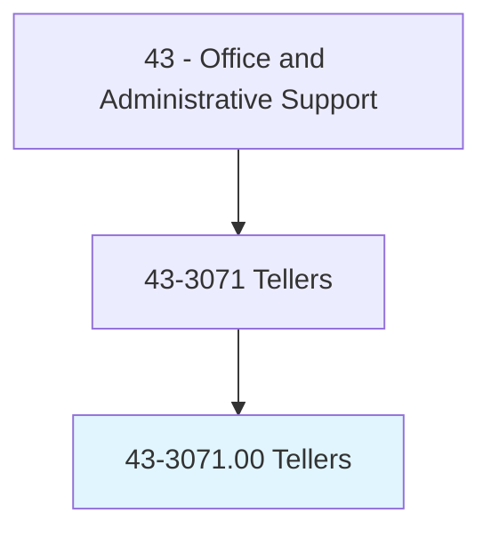
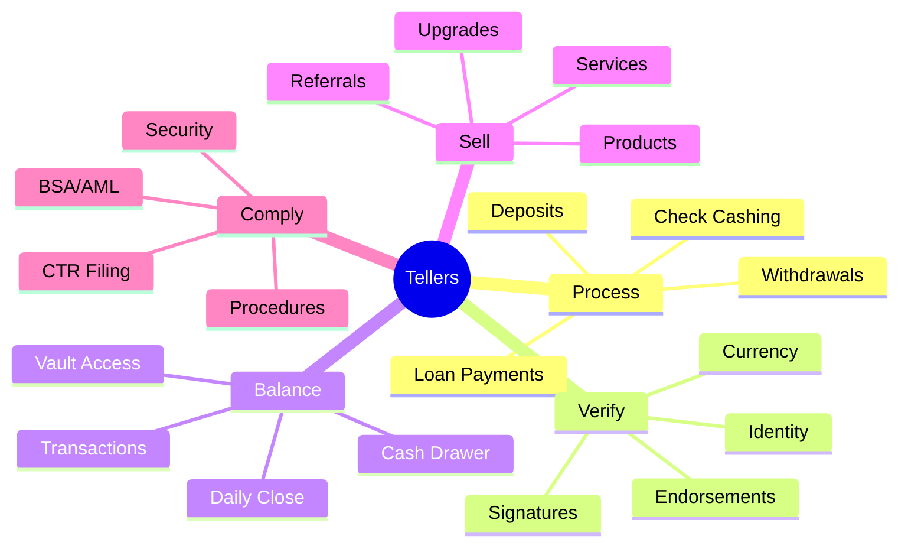
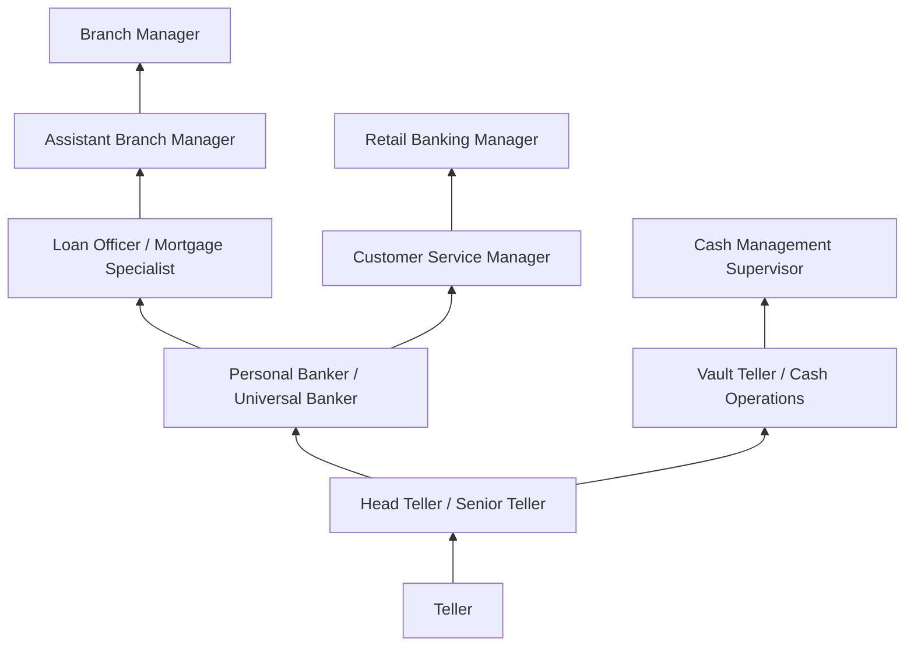
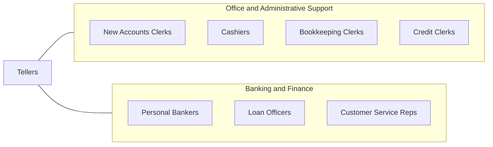

# Tellers

> Receive and pay out money. Keep records of money and negotiable instruments involved in a financial institution's various transactions.

## Overview

Tellers conduct routine financial transactions at banks and credit unions, including processing deposits, withdrawals, loan payments, check cashing, money orders, and cashier's checks. They verify customer identity, count currency, balance cash drawers, and maintain accurate transaction records. Tellers serve as the most visible and frequently contacted employees in retail banking.

Working at teller windows in bank branches, these professionals handle hundreds of transactions daily while maintaining accuracy, security, and compliance with banking regulations. They verify endorsements, detect counterfeit currency, identify suspicious activity for Bank Secrecy Act reporting, and cross-sell banking products when appropriate. Cash handling requires meticulous attention to detail since discrepancies must be identified and resolved before shift end.

The occupation has declined as ATMs, mobile banking, and digital payments have reduced branch transaction volume. However, tellers remain important for complex transactions, customer relationship building, and serving populations that prefer in-person banking. Many banks have evolved the teller role toward universal banking, combining transactions with advisory and account services, creating a more consultative position that builds deeper customer relationships.

## Classification Hierarchy



## Key Statistics

| Metric | Value |
|--------|-------|
| SOC Code | 43-3071.00 |
| Job Zone | 2 (Some Preparation) |
| Category | [Office and Administrative Support](/occupations/Administrative/index) |
| Median Annual Salary | $36,300 |
| Salary Range | $28,000 - $48,000 |
| 10th Percentile | $28,500 |
| 90th Percentile | $47,800 |
| Employment | ~430,000 |
| Projected Growth | -12% (declining) |
| Annual Openings | ~45,000 |
| Core Tasks | 30 |
| Source | O*NET |

## Core Tasks



### process.Transactions

Tellers process financial transactions for customers.

**Actions:**
- `process.Deposits.for.Customers`
- `process.Withdrawals.from.Accounts`
- `cash.Checks.for.Accountholders`
- `issue.MoneyOrders.to.Customers`

### verify.CustomerIdentity

Tellers verify customer identity and transaction legitimacy.

**Actions:**
- `verify.Identity.using.Identification`
- `verify.Endorsements.on.Checks`
- `detect.Counterfeit.Currency`
- `authenticate.Signatures.against.Records`

## Skills & Competencies

### Technical Skills
- **Cash Handling** - Expert (counting, balancing, vault procedures)
- **Core Banking Systems** - Expert (FIS, Fiserv, Jack Henry platforms)
- **Counterfeit Detection** - Advanced (security features, detection equipment)
- **BSA/AML Compliance** - Advanced (CTR, SAR, suspicious activity)
- **Banking Products Knowledge** - Advanced (accounts, loans, services)
- **Math and Calculation** - Advanced (accurate transactions)
- **Customer Identification** - Advanced (CIP, ID verification)
- **Cross-Selling** - Intermediate (referrals, product promotion)

### Soft Skills
- **Accuracy** - Critical (error-free transactions)
- **Customer Service** - Critical (friendly, professional interaction)
- **Trustworthiness** - Critical (handling cash and sensitive information)
- **Speed** - Essential (efficient transaction processing)
- **Communication** - Essential (clear explanation, listening)
- **Attention to Detail** - Critical (catching errors, discrepancies)
- **Integrity** - Critical (ethical handling of funds)
- **Stress Tolerance** - Important (busy periods, balancing)

## Education & Certifications

| Requirement | Details |
|-------------|---------|
| Typical Education | High school diploma |
| Preferred Education | Some college or associate's degree |
| ABA Teller Training | American Bankers Association certification |
| BSA/AML Training | Annual compliance training required |
| Cash Handling Certification | Bank-specific training programs |
| Fidelity Bonding | Required for employment |
| Product Training | Ongoing product and service training |
| Background Check | Comprehensive financial and criminal check |

## Career Progression



### Career Pathway Details

| Level | Title | Years Experience | Key Responsibilities |
|-------|-------|------------------|----------------------|
| Entry | Teller | 0-2 years | Basic transactions, cash handling, customer service |
| Mid | Senior Teller / Head Teller | 2-4 years | Complex transactions, vault duties, team support |
| Specialist | Personal Banker / Universal Banker | 3-5 years | Account opening, product sales, advisory services |
| Management | Assistant Branch Manager | 5-8 years | Operations oversight, team supervision, sales management |
| Management | Branch Manager | 8-12 years | Full branch responsibility, P&L, community relations |

### Transition to Universal Banking

Many banks have transitioned to "universal banker" models where former tellers handle both transactions and account services, requiring additional training in:
- Account opening and maintenance
- Product sales and referrals
- Basic lending and credit
- Financial advisory services
- Digital banking assistance

## Industry Variations

| Setting | Focus | Unique Aspects |
|---------|-------|----------------|
| Commercial Banks | Full-service transactions | High volume; diverse products; technology integration; national brand standards |
| Credit Unions | Member services | Member-owned; community focus; personalized service; profit-sharing |
| Savings Institutions | Deposit transactions | Savings focus; CD processing; mortgage payments; traditional banking |
| Universal Banking | Expanded role | Transactions plus advisory; pod/platform model; consultative sales |
| Retail Banking Kiosks | Limited service | High-traffic locations; basic transactions; extended hours |
| Private Banking | High-net-worth service | Personalized attention; complex transactions; relationship focus |

### Commercial Bank Tellers

Large commercial banks emphasize efficiency and technology integration. Tellers work with advanced systems, handle high transaction volumes, and receive training on extensive product lines. Career paths lead to personal banking, lending, and management roles within large organizational structures.

### Credit Union Tellers

Credit unions emphasize member service and community relationships. Tellers often know members personally, provide more personalized service, and participate in member events. The cooperative structure creates different cultural dynamics than for-profit banks.

### Universal Banker Model

Many banks have evolved beyond traditional teller windows to universal banker pods where associates handle both transactions and account services. This model requires broader skills but offers more variety and customer engagement. Tellers transitioning to universal roles receive additional training in sales and advisory services.

## Technology & Tools

### Core Banking Systems
- **FIS** - Integrated Financial Solutions platforms
- **Fiserv** - DNA, Signature, Precision
- **Jack Henry** - SilverLake, CIF 20/20
- **Temenos** - T24, Transact

### Cash Handling Equipment
- **Currency Counters** - High-speed counting machines
- **Cash Recyclers** - Automated dispensing and deposit
- **Counterfeit Detectors** - UV, magnetic ink, watermark verification
- **Coin Counters** - Bulk coin processing

### Security and Compliance
- **Surveillance** - Video monitoring, transaction cameras
- **BSA/AML Tools** - CTR filing, suspicious activity monitoring
- **Identity Verification** - ID scanners, CIP documentation
- **Dye Packs/Bait Money** - Robbery deterrence

### Customer Engagement
- **CRM Systems** - Customer relationship management
- **Queue Management** - Wait time and flow optimization
- **Digital Displays** - Product promotion
- **Appointment Scheduling** - Customer appointment systems

## Related Occupations



### Related Occupation Comparison

| Occupation | Similarity | Key Difference |
|------------|------------|----------------|
| Cashiers | High | General retail vs banking specialization |
| Personal Bankers | High | Sales/advisory vs transaction focus |
| New Accounts Clerks | Medium | Account opening vs transactions |
| Credit Clerks | Medium | Credit analysis vs cash handling |

## Industries

- [Commercial Banking](/industries/Finance/Banking) - High Employment
- [Credit Unions](/industries/Finance/CreditUnions) - High Employment
- [Savings Institutions](/industries/Finance/SavingsInstitutions) - Moderate Employment
- [Check Cashing Services](/industries/Finance) - Low Employment

## Departments

This occupation typically works in:
- Branch Operations - Teller line and transaction processing
- Retail Banking - Customer-facing services
- Cash Management - Vault operations and cash handling
- Compliance - BSA/AML monitoring and reporting
- Customer Service - Client assistance and problem resolution

## Work Environment

### Physical Setting
- Bank branch lobby and teller line
- Standing at teller window or workstation
- Secure vault access areas
- Climate-controlled environment
- Professional dress required

### Work Schedule
- Bank operating hours (typically 9am-5pm)
- Some Saturday hours required
- Extended hours at grocery store or retail branches
- Holiday schedule follows bank holidays
- Some part-time positions available

### Physical Demands
- Standing for extended periods at teller window
- Repetitive hand movements (counting, typing)
- Lifting coin bags and cash drawers
- Visual focus on documents and screens
- Minimal walking

### Work Characteristics
- High customer interaction throughout shift
- Repetitive but accuracy-critical tasks
- Daily cash balancing requirements
- Pressure during busy periods
- Security awareness at all times

### Unique Considerations
- Target for robbery (security training required)
- Fidelity bonding requirements
- Background and credit checks for employment
- Confidentiality of customer information
- Zero tolerance for cash discrepancies

## Compliance and Security

### Bank Secrecy Act / AML Requirements

| Requirement | Threshold | Teller Responsibility |
|-------------|-----------|----------------------|
| Currency Transaction Report (CTR) | $10,000+ in cash | Complete CTR form |
| Suspicious Activity | Unusual transactions | Report to supervisor, SAR |
| Customer Identification (CIP) | New accounts/transactions | Verify ID, document |
| OFAC Screening | Certain transactions | System check compliance |

### Security Procedures
- Robbery response training
- Dual control for vault access
- Camera awareness
- Suspicious behavior reporting
- Dye pack and bait money handling

## Performance Metrics

### Key Performance Indicators (KPIs)

| Metric | Description | Typical Target |
|--------|-------------|----------------|
| Transaction Accuracy | Error-free processing | >99.5% |
| Cash Differences | Drawer balancing | <$25/month |
| Wait Time | Customer queue time | <5 minutes |
| Referrals | Product cross-sells | Varies by bank |
| Customer Satisfaction | Survey scores | >90% positive |

## GraphDL Semantic Structure

```graphdl
Tellers perform:
- process.Transactions.for.Customers
- verify.Identity.of.Customers
- count.Currency.for.Accuracy
- balance.Drawer.at.ShiftEnd
- detect.Counterfeit.Bills
- cross-sell.Products.to.Customers
- file.CTRs.for.LargeTransactions
- maintain.Security.in.Branch
```

---

*Source: O*NET 43-3071.00 - ONETOccupation*
