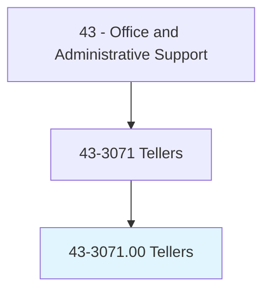
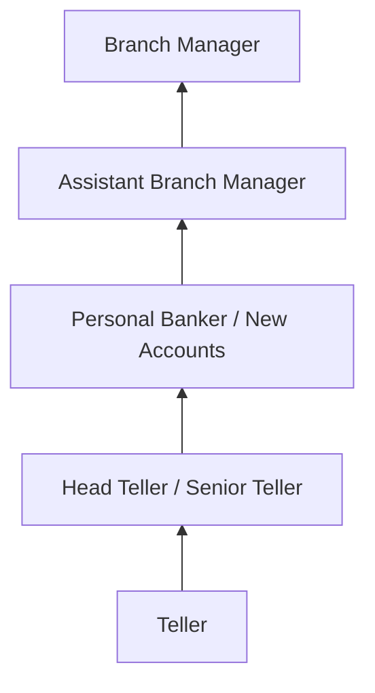
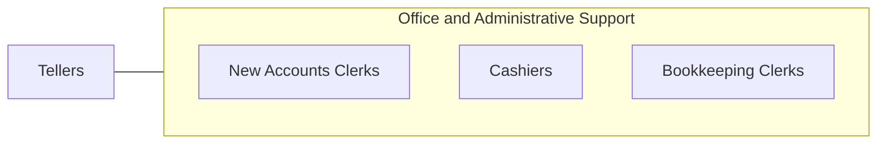

# Tellers

> Receive and pay out money. Keep records of money and negotiable instruments involved in a financial institution's various transactions.

## Overview

Tellers conduct routine financial transactions at banks and credit unions, including processing deposits, withdrawals, loan payments, check cashing, money orders, and cashier's checks. They verify customer identity, count currency, balance cash drawers, and maintain accurate transaction records. Tellers serve as the most visible and frequently contacted employees in retail banking.

Working at teller windows in bank branches, these professionals handle hundreds of transactions daily while maintaining accuracy, security, and compliance with banking regulations. They verify endorsements, detect counterfeit currency, identify suspicious activity for Bank Secrecy Act reporting, and cross-sell banking products when appropriate. Cash handling requires meticulous attention to detail since discrepancies must be identified and resolved.

The occupation has declined as ATMs, mobile banking, and digital payments have reduced branch transaction volume. However, tellers remain important for complex transactions, customer relationship building, and serving populations that prefer in-person banking. Many banks have evolved the teller role toward universal banking, combining transactions with advisory and account services.

## Classification Hierarchy

## Key Statistics

| Metric | Value |
|--------|-------|
| SOC Code | 43-3071.00 |
| Job Zone | 2 (Some Preparation) |
| Category | [Office and Administrative Support](/occupations/Administrative/index) |
| Median Annual Salary | $36,300 |
| Employment | ~430,000 |
| Projected Growth | -12% (declining) |
| Core Tasks | 30 |
| Source | O*NET |

## Core Tasks

Core task data with GraphDL semantic actions for this occupation is maintained in the data pipeline. See [O*NET 43-3071.00](https://www.onetonline.org/link/summary/43-3071.00) for detailed task information.

## Skills & Competencies

### Technical Skills
- **Cash Handling** - Expert
- **Core Banking Systems** - Advanced
- **Counterfeit Detection** - Advanced
- **BSA/AML Compliance** - Intermediate
- **Banking Products Knowledge** - Intermediate

### Soft Skills
- **Accuracy** - Critical
- **Customer Service** - Critical
- **Trustworthiness** - Critical
- **Speed** - Essential
- **Communication** - Essential
- **Attention to Detail** - Critical

## Education & Certifications

| Requirement | Details |
|-------------|---------|
| Typical Education | High school diploma |
| ABA Teller Training | American Bankers Association |
| BSA/AML Training | Required annually |
| Cash Handling Certification | Bank-specific programs |
| Bonding | Fidelity bond required |

## Career Progression

## Industry Variations

| Setting | Focus | Unique Aspects |
|---------|-------|----------------|
| Commercial Banks | Full-service transactions | High volume; diverse products; technology integration |
| Credit Unions | Member services | Member-owned; community focus; personalized service |
| Savings Institutions | Deposit transactions | Savings focus; CD processing; mortgage payments |
| Universal Banking | Expanded role | Transactions plus advisory; pod/platform model; consultative |

## Technology & Tools

- **Core Banking** - FIS, Fiserv, Jack Henry teller platforms
- **Cash Handling** - Currency counters, recyclers, counterfeit detectors
- **Security** - Surveillance, dye packs, bait money
- **CRM** - Customer relationship tools for referrals

## Related Occupations

## Departments

This occupation typically works in:
- [Branch Operations](/departments/BranchOps) - Teller line
- [Retail Banking](/departments/RetailBanking) - Customer transactions
- [Cash Management](/departments/CashMgmt) - Vault and cash operations
- [Compliance](/departments/Compliance) - BSA/AML monitoring

---

*Source: O*NET 43-3071.00 - ONETOccupation*
