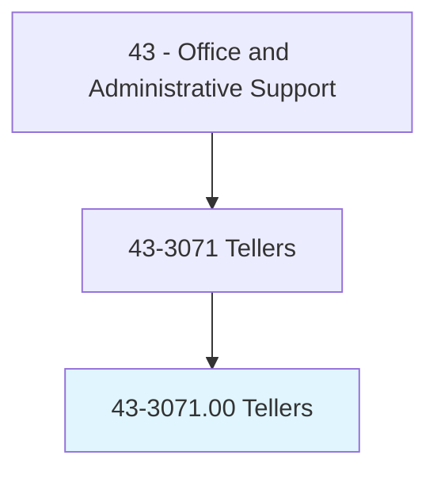
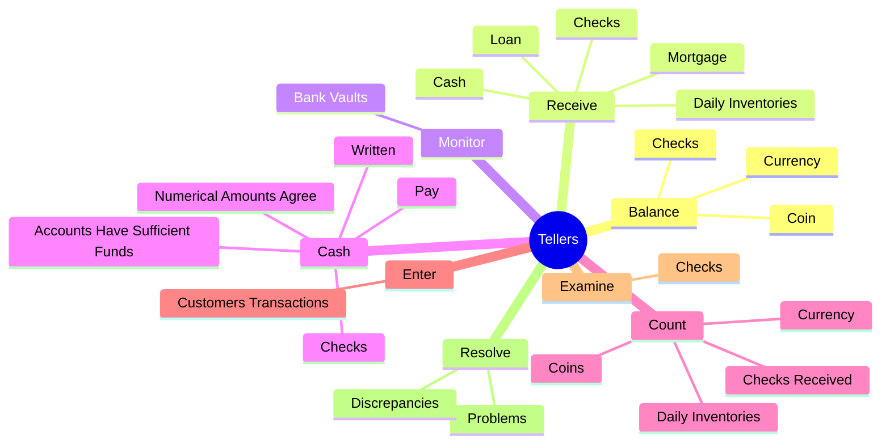
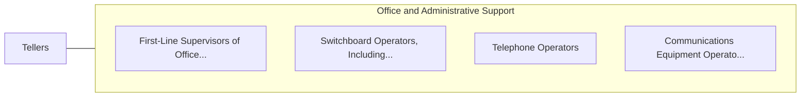

# Tellers

> Receive and pay out money. Keep records of money and negotiable instruments involved in a financial institution's various transactions.

## Overview

Tellers is an occupation within the Office and Administrative Support category. Receive and pay out money. 

## Classification Hierarchy

## Key Statistics

| Metric | Value |
|--------|-------|
| SOC Code | 43-3071.00 |
| Category | [Office and Administrative Support](/occupations/Administrative) |
| Task Count | 144 |
| Source | O*NET |

## Core Tasks

### balance.Currency

Tellers balance currency as part of their core responsibilities.

**Actions:**
- `balance.Currency.in.CashDrawers.at.EndsOfShifts`
- `balance.Currency.in.CalculateDailyTransactions`
- `balance.Currency.in.UsingComputers`
- `balance.Currency.in.Calculators`

### receive.Checks

Tellers receive checks as part of their core responsibilities.

**Actions:**
- `receive.Checks.for.Deposit`
- `receive.Checks.for.VerifyAmounts`
- `receive.Checks.for.CheckAccuracy.of.DepositSlips`
- `receive.Cash.for.Deposit`

### monitor.BankVaults

Tellers monitor bank vaults as part of their core responsibilities.

**Actions:**
- `monitor.BankVaults.to.ensure.CashBalancesAreCorrect`

## Skills & Competencies

### Technical Skills
- **Office Management** - Advanced
- **Data Entry** - Advanced
- **Records Management** - Advanced

### Soft Skills
- **Communication** - Essential
- **Problem Solving** - Essential
- **Critical Thinking** - Important
- **Teamwork** - Important
- **Adaptability** - Important

## Related Occupations

## Industries

This occupation is found across multiple industries. See [Industries](/industries) for sector-specific employment data.

## Career Progression

---

*Source: O*NET 43-3071.00 - ONETOccupation*
