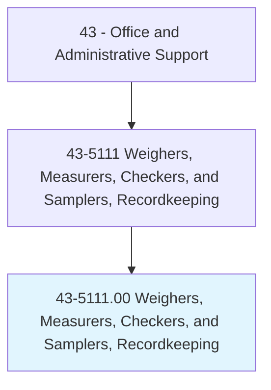
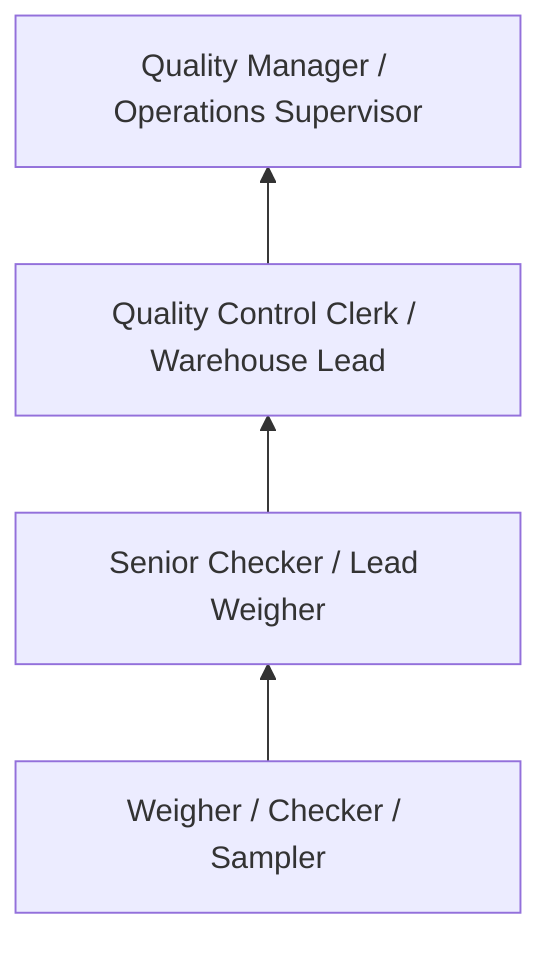
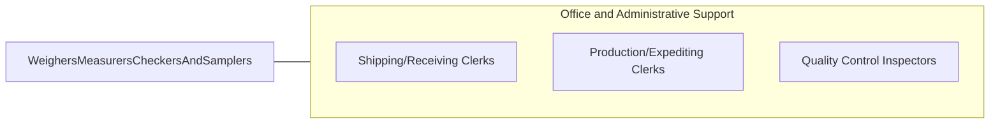

# Weighers, Measurers, Checkers, and Samplers, Recordkeeping

> Weigh, measure, and check materials, supplies, and equipment for the purpose of keeping relevant records. Duties are primarily clerical by nature.

## Overview

Weighers, Measurers, Checkers, and Samplers perform clerical functions related to verifying the quantity, weight, dimensions, and quality of materials, supplies, and products. They use scales, gauges, measuring instruments, and sampling techniques to verify that goods meet specifications, then record their findings for inventory, billing, quality control, and regulatory compliance purposes.

Working in manufacturing, warehousing, agriculture, mining, transportation, and government inspection agencies, these workers verify incoming materials, check outgoing shipments, weigh trucks and railcars, sample products for quality testing, and maintain records that support accurate billing and regulatory reporting. Their documentation ensures accountability throughout the supply chain.

The role combines physical measurement skills with clerical recordkeeping, requiring accuracy in both data collection and documentation. While automated weighing and measuring systems have reduced manual operations, workers remain needed for quality verification, sampling procedures, and situations requiring human judgment.

## Classification Hierarchy

## Key Statistics

| Metric | Value |
|--------|-------|
| SOC Code | 43-5111.00 |
| Job Zone | 2 (Some Preparation) |
| Category | [Office and Administrative Support](/occupations/Administrative/index) |
| Median Annual Salary | $37,500 |
| Employment | ~60,000 |
| Projected Growth | -5% (declining) |
| Core Tasks | 25 |
| Source | O*NET |

## Core Tasks

Core task data with GraphDL semantic actions for this occupation is maintained in the data pipeline. See [O*NET 43-5111.00](https://www.onetonline.org/link/summary/43-5111.00) for detailed task information.

## Skills & Competencies

### Technical Skills
- **Weighing and Measuring Equipment** - Advanced
- **Sampling Procedures** - Advanced
- **Quality Verification** - Advanced
- **Records and Documentation** - Advanced
- **Calibration Basics** - Intermediate

### Soft Skills
- **Accuracy** - Critical
- **Attention to Detail** - Critical
- **Reliability** - Critical
- **Mathematical Aptitude** - Essential
- **Integrity** - Critical

## Education & Certifications

| Requirement | Details |
|-------------|---------|
| Typical Education | High school diploma |
| Weights and Measures Certification | State-specific licensing |
| Quality Inspection Training | Industry-specific |
| OSHA Safety Training | Workplace safety |

## Career Progression

## Industry Variations

| Setting | Focus | Unique Aspects |
|---------|-------|----------------|
| Agriculture | Grain and livestock weighing | Certified scales; moisture testing; grade determination |
| Manufacturing | Material and product verification | Incoming inspection; in-process checks; lot sampling |
| Transportation | Truck and rail weighing | Weigh stations; DOT compliance; load limits |
| Mining/Quarrying | Aggregate and mineral measurement | Tonnage records; quality grading; environmental sampling |

## Technology & Tools

- **Scales** - Platform scales, truck scales, precision balances
- **Measuring** - Calipers, gauges, moisture meters
- **Recording** - Weigh tickets, electronic logs, databases
- **Sampling** - Probes, containers, testing equipment

## Related Occupations

## Departments

This occupation typically works in:
- Quality Control - Inspection and verification
- Warehouse - Receiving and shipping
- [Operations](/departments/Operations) - Production support
- Compliance - Regulatory measurement

---

*Source: O*NET 43-5111.00 - ONETOccupation*
