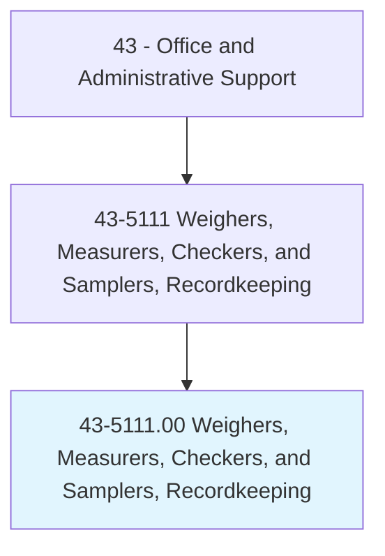
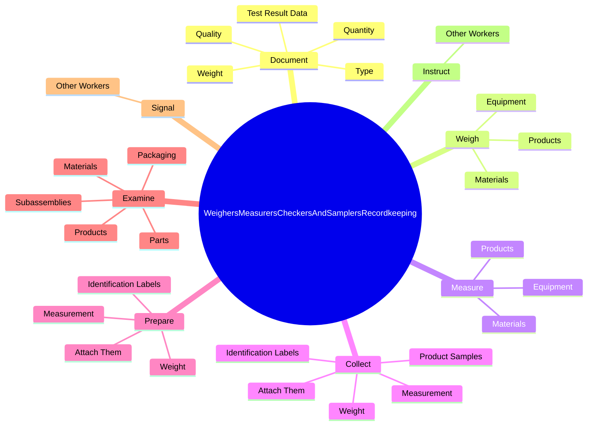
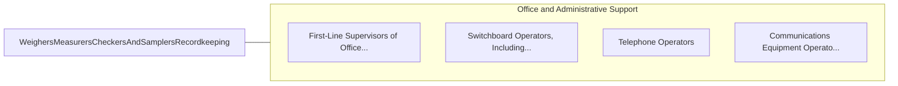

# Weighers, Measurers, Checkers, and Samplers, Recordkeeping

> Weigh, measure, and check materials, supplies, and equipment for the purpose of keeping relevant records. Duties are primarily clerical by nature. Includes workers who collect and keep record of samples of products or materials.

## Overview

Weighers, Measurers, Checkers, and Samplers, Recordkeeping is an occupation within the Office and Administrative Support category. Weigh, measure, and check materials, supplies, and equipment for the purpose of keeping relevant records. Duties are primarily clerical by nature.

## Classification Hierarchy

## Key Statistics

| Metric | Value |
|--------|-------|
| SOC Code | 43-5111.00 |
| Category | [Office and Administrative Support](/occupations/Administrative/index) |
| Task Count | 186 |
| Source | O*NET |

## Core Tasks

### document.Quantity

Weighers, Measurers, Checkers, and Samplers, Recordkeeping document quantity as part of their core responsibilities.

**Actions:**
- `document.Quantity.of.Materials`
- `document.Quantity.of.Products.to.maintain.Shipping`
- `document.Quantity.of.Receiving`
- `document.Quantity.of.ProductionRecords`

### weigh.Materials

Weighers, Measurers, Checkers, and Samplers, Recordkeeping weigh materials as part of their core responsibilities.

**Actions:**
- `weigh.Materials.to.maintain.RelevantRecords`
- `weigh.Materials.to.UsingVolumeMeters`
- `weigh.Materials.to.scales`
- `weigh.Materials.to.rules`

### measure.Materials

Weighers, Measurers, Checkers, and Samplers, Recordkeeping measure materials as part of their core responsibilities.

**Actions:**
- `measure.Materials.to.maintain.RelevantRecords`
- `measure.Materials.to.UsingVolumeMeters`
- `measure.Materials.to.scales`
- `measure.Materials.to.rules`

## Skills & Competencies

### Technical Skills
- **Office Management** - Advanced
- **Data Entry** - Advanced
- **Records Management** - Advanced

### Soft Skills
- **Communication** - Essential
- **Problem Solving** - Essential
- **Critical Thinking** - Important
- **Teamwork** - Important
- **Adaptability** - Important

## Related Occupations

## Industries

This occupation is found across multiple industries. See [Industries](/industries) for sector-specific employment data.

## Career Progression

---

*Source: O*NET 43-5111.00 - ONETOccupation*
