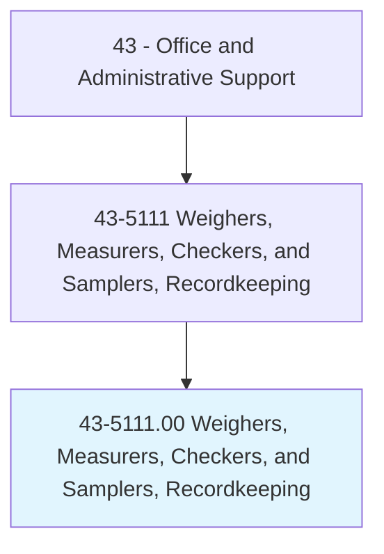
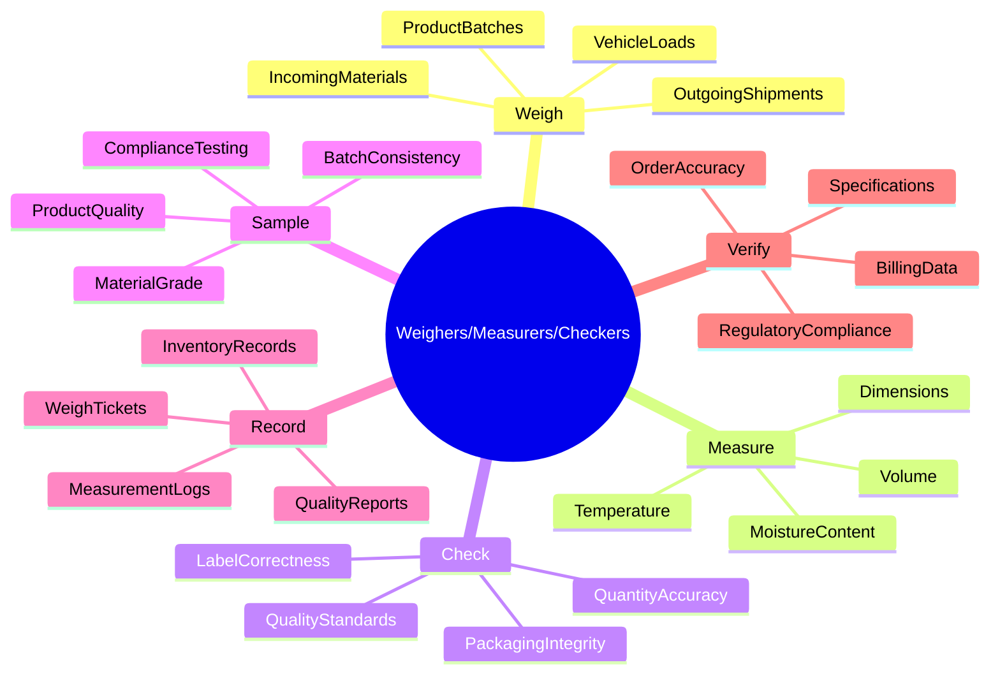
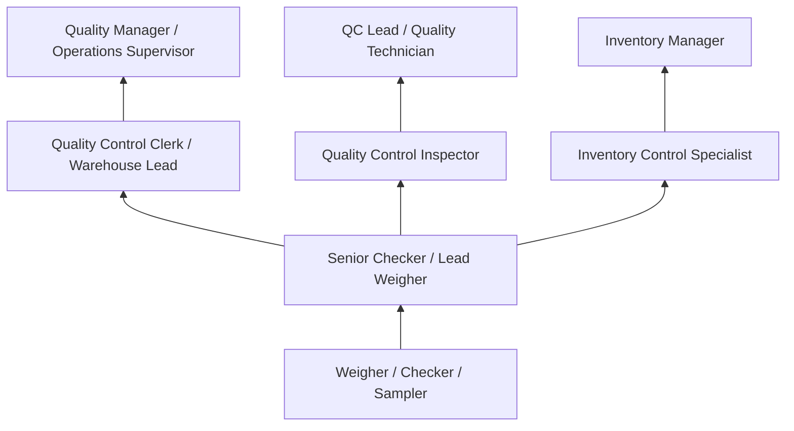
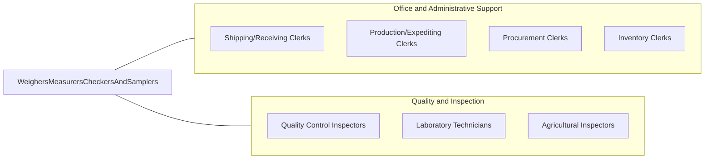

# Weighers, Measurers, Checkers, and Samplers, Recordkeeping

> Weigh, measure, and check materials, supplies, and equipment for the purpose of keeping relevant records. Duties are primarily clerical by nature.

## Overview

Weighers, Measurers, Checkers, and Samplers perform clerical functions related to verifying the quantity, weight, dimensions, and quality of materials, supplies, and products. They use scales, gauges, measuring instruments, and sampling techniques to verify that goods meet specifications, then record their findings for inventory, billing, quality control, and regulatory compliance purposes.

Working in manufacturing, warehousing, agriculture, mining, transportation, and government inspection agencies, these workers verify incoming materials, check outgoing shipments, weigh trucks and railcars, sample products for quality testing, and maintain records that support accurate billing and regulatory reporting. Their documentation ensures accountability throughout the supply chain.

The role combines physical measurement skills with clerical recordkeeping, requiring accuracy in both data collection and documentation. While automated weighing and measuring systems have reduced manual operations, workers remain needed for quality verification, sampling procedures, and situations requiring human judgment. The position serves as a critical checkpoint ensuring that quantities match orders, weights comply with regulations, and products meet quality standards.

## Classification Hierarchy

## Key Statistics

| Metric | Value |
|--------|-------|
| SOC Code | 43-5111.00 |
| Job Zone | 2 (Some Preparation) |
| Category | [Office and Administrative Support](/occupations/Administrative/index) |
| Median Annual Salary | $37,500 |
| Employment | ~60,000 |
| Projected Growth | -5% (declining) |
| Core Tasks | 25 |
| Source | O*NET |

## Core Tasks

### weigh.MaterialsAndProducts

Weighers use scales and measuring devices to determine the weight of materials, products, and shipments.

**Actions:**
- `weigh.IncomingMaterials.on.PlatformScales` - Measure weight of received goods
- `weigh.OutgoingShipments.for.BillingAccuracy` - Verify shipment weights before dispatch
- `weigh.Trucks.at.WeighStations` - Record gross and tare weights for load calculation
- `weigh.ProductBatches.for.QualityControl` - Measure production lot weights
- `weigh.Samples.for.LaboratoryTesting` - Prepare precise sample weights for analysis
- `calibrate.Scales.to.ensure.Accuracy` - Verify scale accuracy and adjust as needed

### measure.PhysicalProperties

Weighers use various instruments to measure dimensions, volume, temperature, and other physical properties.

**Actions:**
- `measure.Dimensions.with.Calipers` - Check length, width, height specifications
- `measure.Volume.using.GaugingDevices` - Determine liquid or bulk material quantities
- `measure.Temperature.for.StorageCompliance` - Verify temperature requirements are met
- `measure.MoistureContent.with.Meters` - Test moisture levels in agricultural products
- `measure.Density.for.ProductSpecifications` - Calculate density for material verification
- `measure.Thickness.using.Micrometers` - Check material thickness against standards

### check.QuantityAndQuality

Weighers verify that materials and products meet quantity and quality specifications.

**Actions:**
- `check.Quantities.against.PurchaseOrders` - Verify received amounts match orders
- `check.Quality.against.Specifications` - Inspect for visual defects and compliance
- `check.Packaging.for.Integrity` - Examine containers for damage or tampering
- `check.Labels.for.Accuracy` - Verify labeling matches contents and regulations
- `check.Lot.Numbers.for.Traceability` - Confirm batch tracking information
- `check.Expiration.Dates.for.Compliance` - Verify product dating requirements

### sample.ForQualityTesting

Weighers collect representative samples for laboratory analysis and quality verification.

**Actions:**
- `collect.Samples.from.IncomingShipments` - Gather test specimens from received materials
- `sample.ProductionBatches.for.QualityAssurance` - Select items for in-process testing
- `sample.BulkMaterials.using.Probes` - Extract samples from grain, chemicals, or minerals
- `prepare.Samples.for.LaboratorySubmission` - Package and label specimens for testing
- `document.SamplingProcedures.for.Compliance` - Record sampling methods and locations
- `retain.SampleArchives.for.QualityRecords` - Maintain reference samples per requirements

### record.MeasurementData

Weighers document all weighing, measuring, and inspection activities for business and regulatory purposes.

**Actions:**
- `record.WeighTickets.for.Billing` - Document weights for invoicing and payment
- `enter.MeasurementData.into.Systems` - Input readings into databases and ERP systems
- `complete.InspectionReports.for.QualityRecords` - Document inspection findings
- `maintain.CalibrationLogs.for.Compliance` - Track equipment calibration history
- `file.ReceivingDocuments.for.AuditTrails` - Organize records for future reference
- `generate.Reports.for.ManagementReview` - Compile measurement statistics and trends

### verify.ComplianceRequirements

Weighers ensure that measurements and records meet regulatory and contractual requirements.

**Actions:**
- `verify.DOTCompliance.for.VehicleWeights` - Ensure trucks meet legal weight limits
- `verify.ContractSpecifications.for.Materials` - Confirm materials meet purchase agreement terms
- `verify.RegulatoryStandards.for.Products` - Check compliance with industry regulations
- `verify.BillingAccuracy.before.Invoicing` - Confirm measurement data matches billing
- `verify.InventoryRecords.against.PhysicalCounts` - Reconcile system records with actual stock
- `verify.CertificationRequirements.for.Shipments` - Ensure required documentation is complete

## Skills & Competencies

### Technical Skills
- **Weighing and Measuring Equipment** - Advanced (platform scales, truck scales, precision balances)
- **Sampling Procedures** - Advanced (representative sampling, probe techniques, chain of custody)
- **Quality Verification** - Advanced (visual inspection, specification checking, defect identification)
- **Records and Documentation** - Advanced (weigh tickets, reports, databases, compliance records)
- **Calibration Basics** - Intermediate (scale verification, adjustment procedures, calibration schedules)
- **Data Entry and Systems** - Intermediate (ERP systems, spreadsheets, inventory management)
- **Mathematics** - Intermediate (calculations, conversions, averages, tolerances)
- **Regulatory Knowledge** - Intermediate (DOT weight limits, industry standards, quality requirements)

### Soft Skills
- **Accuracy** - Critical (precise measurements and recording)
- **Attention to Detail** - Critical (catching discrepancies, verifying specifications)
- **Reliability** - Critical (consistent procedures, trustworthy records)
- **Mathematical Aptitude** - Essential (calculations, conversions, reconciliations)
- **Integrity** - Critical (honest reporting, resistance to pressure)
- **Communication** - Important (reporting issues, coordinating with drivers/vendors)
- **Physical Stamina** - Important (standing, lifting samples, outdoor work)

## Education & Certifications

| Requirement | Details |
|-------------|---------|
| Typical Education | High school diploma |
| Weights and Measures Certification | State-specific licensing for commercial weighing |
| Quality Inspection Training | Industry-specific (ISO, food safety, manufacturing) |
| OSHA Safety Training | Workplace safety, hazmat awareness |
| Forklift/Equipment Operation | Certification for material handling equipment |
| Calibration Training | Equipment-specific calibration procedures |
| Industry Certifications | ASQ, food safety, agricultural grading credentials |

## Career Progression

### Career Pathway Details

| Level | Title | Years Experience | Key Responsibilities |
|-------|-------|------------------|----------------------|
| Entry | Weigher / Checker | 0-2 years | Basic weighing, measuring, recording, data entry |
| Mid | Senior Checker / Lead | 2-5 years | Complex measurements, training, quality issues |
| Lead | Quality Clerk / Warehouse Lead | 5-8 years | Team coordination, quality oversight, reporting |
| Management | Quality/Operations Manager | 8+ years | Department operations, compliance, process improvement |

## Industry Variations

| Setting | Focus | Unique Aspects |
|---------|-------|----------------|
| Agriculture | Grain and livestock weighing | Certified scales; moisture testing; grade determination; seasonal peaks |
| Manufacturing | Material and product verification | Incoming inspection; in-process checks; lot sampling; SPC |
| Transportation | Truck and rail weighing | Weigh stations; DOT compliance; load limits; bridge formulas |
| Mining/Quarrying | Aggregate and mineral measurement | Tonnage records; quality grading; environmental sampling; dust control |
| Food Processing | Ingredient and product verification | FSMA compliance; allergen control; batch records; traceability |
| Warehousing | Receiving and shipping verification | Order accuracy; damage inspection; inventory reconciliation |

### Agricultural Weighing

Agricultural weighers operate grain elevators, livestock markets, and processing facilities, weighing crops, animals, and feed materials. They must understand moisture content testing, grade determination, and seasonal volume fluctuations. Certified scale operators are required for commercial transactions, and accuracy directly impacts farmer payments and commodity trading. Work often occurs outdoors with exposure to dust, weather, and seasonal peaks during harvest.

### Manufacturing Quality Control

Manufacturing checkers verify incoming raw materials, in-process components, and finished products against specifications. They work within quality management systems (ISO 9001, automotive quality standards) and may perform statistical sampling and measurement. Precision is critical as their findings trigger acceptance, rejection, or rework decisions affecting production schedules and costs.

### Transportation Weighing

Weigh station operators and truck scalers verify vehicle weights for DOT compliance and billing accuracy. They operate certified truck scales, calculate gross/tare/net weights, and issue weigh tickets used for freight billing. Knowledge of weight regulations, bridge formulas, and permit requirements is essential. Many positions involve shift work at 24-hour facilities or seasonal operations.

### Mining and Aggregate Operations

Mining and quarry weighers measure extracted materials for production tracking, sales billing, and regulatory reporting. They operate truck scales, sample materials for quality grading, and maintain records for environmental compliance. Work environments include exposure to dust, heavy equipment, and outdoor conditions in industrial settings.

## Technology & Tools

### Weighing Equipment
- **Platform Scales** - Floor scales for pallets and materials
- **Truck Scales** - In-ground or portable scales for vehicle weighing
- **Precision Balances** - Laboratory and analytical balances for samples
- **Counting Scales** - Part counting by weight calculation
- **Crane Scales** - Suspended scales for overhead weighing
- **Checkweighers** - In-line production weight verification

### Measuring Instruments
- **Calipers and Micrometers** - Dimensional measurement
- **Moisture Meters** - Grain, wood, and material moisture
- **Temperature Probes** - Product and storage temperature
- **Volume Gauges** - Tank and container measurement
- **Thickness Gauges** - Material thickness verification

### Recording Systems
- **Weigh Ticket Printers** - Automated weight documentation
- **Scale Management Software** - Weight data capture and reporting
- **ERP Integration** - Connection to inventory and billing systems
- **Spreadsheets** - Excel for calculations and record keeping
- **Quality Systems** - QMS software for inspection records

### Sampling Equipment
- **Grain Probes** - Sampling bulk agricultural products
- **Sample Containers** - Collection and storage vessels
- **Sample Dividers** - Obtaining representative portions
- **Chain of Custody Forms** - Sample tracking documentation

## Work Environment

### Physical Setting
- Warehouses and receiving docks
- Manufacturing floors and inspection stations
- Outdoor weigh stations and scales
- Grain elevators and agricultural facilities
- Mining and quarry operations
- Temperature-controlled storage facilities

### Work Schedule
- Standard business hours in most settings
- Shift work at 24-hour operations
- Seasonal peaks (harvest, shipping seasons)
- Weekend and holiday work at continuous operations
- Outdoor work in various weather conditions

### Physical Requirements
- Standing for extended periods
- Lifting samples and materials (up to 50 lbs)
- Climbing ladders and platforms for sampling
- Outdoor exposure to weather and dust
- Manual dexterity for precision measurement

## Related Occupations

### Related Occupation Comparison

| Occupation | Similarity | Key Difference |
|------------|------------|----------------|
| Shipping/Receiving Clerks | High | Broader logistics vs measurement focus |
| Quality Control Inspectors | High | Technical inspection vs clerical emphasis |
| Production Clerks | Medium | Scheduling focus vs measurement focus |
| Laboratory Technicians | Medium | Scientific testing vs field measurement |

## Industries

- [Manufacturing](/industries/Manufacturing) - High Employment
- [Wholesale Trade](/industries/WholesaleTrade) - High Employment
- [Agriculture](/industries/Agriculture) - Moderate Employment
- [Mining and Quarrying](/industries/Mining) - Moderate Employment
- [Transportation and Warehousing](/industries/Transportation) - High Employment
- [Government](/industries/PublicAdministration) - Moderate Employment (regulatory inspection)

## Departments

This occupation typically works in:
- Quality Control - Inspection and verification
- Warehouse/Receiving - Incoming material check
- Shipping - Outgoing verification and documentation
- [Operations](/departments/Operations) - Production support
- Compliance - Regulatory measurement and reporting
- [Procurement](/departments/Procurement) - Material receiving verification

## Performance Metrics

| Metric | Description | Typical Target |
|--------|-------------|----------------|
| Measurement Accuracy | Variance from calibrated standards | Within tolerance |
| Recording Accuracy | Error rate in documentation | <1% error rate |
| Throughput | Items/shipments processed per day | Meet volume requirements |
| Discrepancy Detection | Rate of catching quantity/quality issues | High detection rate |
| Compliance Rate | Adherence to procedures and regulations | 100% |

## Regulatory Compliance

### Weights and Measures
- State weights and measures laws and inspections
- Scale certification and calibration requirements
- Commercial weighing accuracy standards
- Weigh ticket documentation requirements

### Transportation
- DOT weight limits and bridge formulas
- Overweight permit requirements
- Load securement verification
- Hazmat weight and documentation

### Industry-Specific
- FDA/FSMA food safety requirements
- OSHA workplace safety standards
- Environmental sampling protocols
- Agricultural grading standards

---

*Source: O*NET 43-5111.00 - ONETOccupation*
