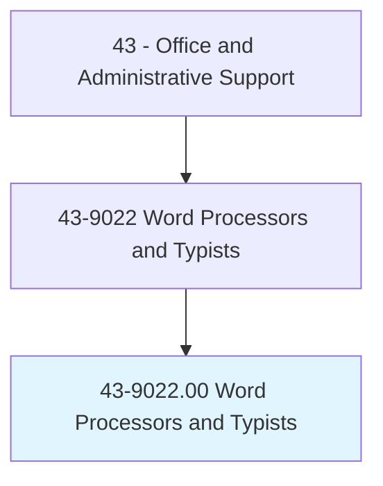
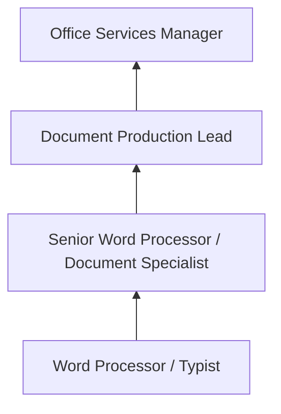

# Word Processors and Typists

> Use word processor, computer, or typewriter to type letters, reports, forms, or other material from rough draft, corrected copy, or voice recording. May perform other clerical duties as assigned.

## Overview

Word Processors and Typists produce documents from rough drafts, dictation, handwritten notes, and voice recordings using word processing software and, in some legacy settings, typewriters. They format documents according to organizational standards, proofread their work for accuracy, and may create templates, merge data for mass mailings, and maintain document libraries.

Working in corporate offices, legal firms, medical facilities, government agencies, and transcription services, these professionals produce correspondence, reports, contracts, forms, manuscripts, and other written materials. Legal and medical settings particularly rely on skilled typists for specialized document production requiring knowledge of technical terminology and formatting conventions.

The occupation has declined dramatically as word processing has become a universal office skill rather than a specialized function. Remaining positions tend to involve high-volume production typing, specialized formatting requirements, or transcription from audio recordings. Voice recognition technology has further reduced demand, though human typists remain necessary for accuracy-critical and highly formatted documents.

## Classification Hierarchy

## Key Statistics

| Metric | Value |
|--------|-------|
| SOC Code | 43-9022.00 |
| Job Zone | 2 (Some Preparation) |
| Category | [Office and Administrative Support](/occupations/Administrative/index) |
| Median Annual Salary | $39,200 |
| Employment | ~30,000 |
| Projected Growth | -25% (rapidly declining) |
| Core Tasks | 20 |
| Source | O*NET |

## Core Tasks

Core task data with GraphDL semantic actions for this occupation is maintained in the data pipeline. See [O*NET 43-9022.00](https://www.onetonline.org/link/summary/43-9022.00) for detailed task information.

## Skills & Competencies

### Technical Skills
- **Word Processing (Microsoft Word)** - Expert
- **Typing Speed and Accuracy** - Expert (65+ WPM)
- **Document Formatting** - Expert
- **Transcription** - Advanced
- **Template Creation** - Advanced

### Soft Skills
- **Accuracy** - Critical
- **Attention to Detail** - Critical
- **Speed** - Critical
- **Concentration** - Essential
- **Discretion** - Essential

## Education & Certifications

| Requirement | Details |
|-------------|---------|
| Typical Education | High school diploma |
| Typing Proficiency | 65+ WPM with high accuracy |
| MOS Word Certification | Microsoft Office Specialist |
| Transcription Training | Audio transcription skills |

## Career Progression

## Industry Variations

| Setting | Focus | Unique Aspects |
|---------|-------|----------------|
| Legal | Legal documents, briefs | Table of authorities; legal formatting; court rules |
| Medical | Medical reports, transcription | Medical terminology; HIPAA; clinical documentation |
| Government | Official correspondence, regulations | Style manuals; classified documents; Federal Register |
| Corporate | Reports, presentations | Brand templates; executive correspondence; mass mailings |

## Technology & Tools

- **Word Processing** - Microsoft Word, Google Docs
- **Transcription** - Express Scribe, foot pedals, Dragon
- **Formatting** - Adobe Acrobat, desktop publishing
- **Dictation** - Digital recording, speech recognition

## Related Occupations

## Departments

This occupation typically works in:
- [Document Production](/departments/DocProduction) - Typing and formatting
- [Legal](/departments/Legal) - Legal document preparation
- [Administration](/departments/Administration) - Office support
- [Medical Records](/departments/MedicalRecords) - Clinical transcription

---

*Source: O*NET 43-9022.00 - ONETOccupation*
