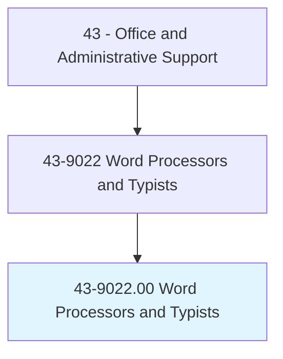
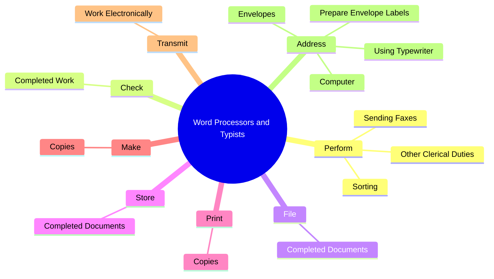
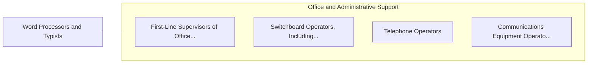

# Word Processors and Typists

> Use word processor, computer, or typewriter to type letters, reports, forms, or other material from rough draft, corrected copy, or voice recording. May perform other clerical duties as assigned.

## Overview

Word Processors and Typists is an occupation within the Office and Administrative Support category. Use word processor, computer, or typewriter to type letters, reports, forms, or other material from rough draft, corrected copy, or voice recording. 

## Classification Hierarchy

## Key Statistics

| Metric | Value |
|--------|-------|
| SOC Code | 43-9022.00 |
| Category | [Office and Administrative Support](/occupations/Administrative/index) |
| Task Count | 114 |
| Source | O*NET |

## Core Tasks

### perform.OtherClericalDuties

Word Processors and Typists perform other clerical duties as part of their core responsibilities.

**Actions:**
- `perform.OtherClericalDuties`
- `perform.Sorting`
- `perform.SendingFaxes`

### check.CompletedWork

Word Processors and Typists check completed work as part of their core responsibilities.

**Actions:**
- `check.CompletedWork.for.Spelling`
- `check.CompletedWork.for.Grammar`
- `check.CompletedWork.for.Punctuation`
- `check.CompletedWork.for.Format`

### file.CompletedDocuments

Word Processors and Typists file completed documents as part of their core responsibilities.

**Actions:**
- `file.CompletedDocuments.on.ComputerHardDrive`
- `file.CompletedDocuments.on.Disk`
- `file.CompletedDocuments.on.MaintainComputerFilingSystem.to.Store`
- `file.CompletedDocuments.on.Retrieve`

## Skills & Competencies

### Technical Skills
- **Office Management** - Advanced
- **Data Entry** - Advanced
- **Records Management** - Advanced

### Soft Skills
- **Communication** - Essential
- **Problem Solving** - Essential
- **Critical Thinking** - Important
- **Teamwork** - Important
- **Adaptability** - Important

## Related Occupations

## Industries

This occupation is found across multiple industries. See [Industries](/industries) for sector-specific employment data.

## Career Progression

---

*Source: O*NET 43-9022.00 - ONETOccupation*
