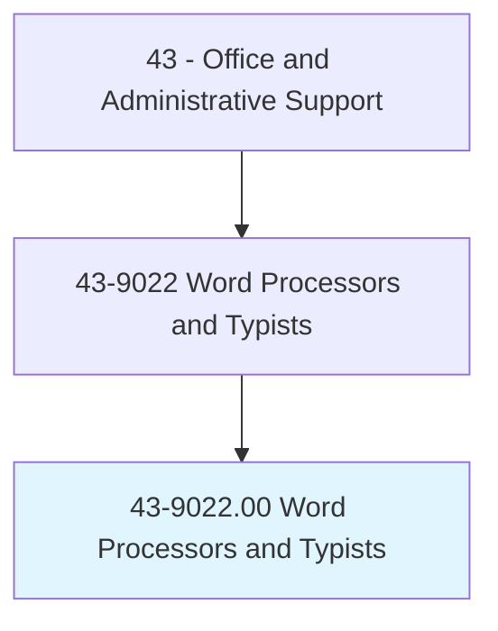
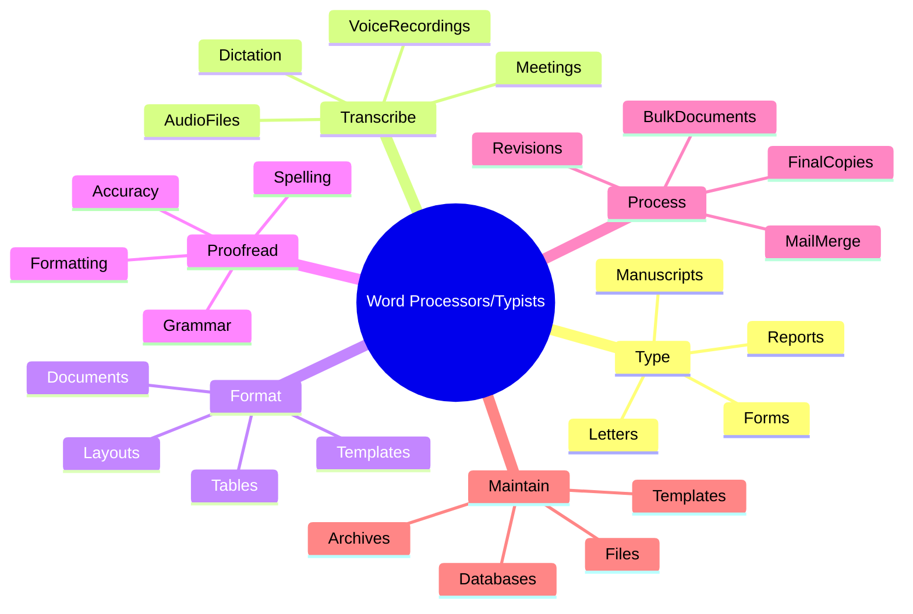
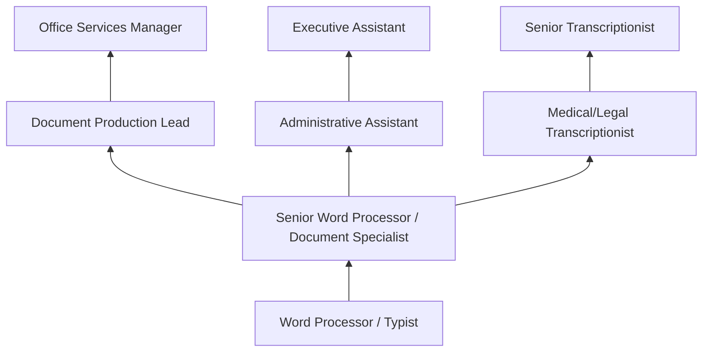
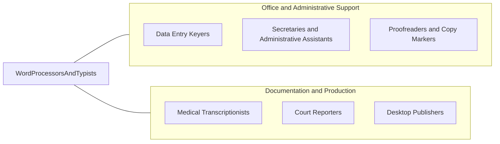

# Word Processors and Typists

> Use word processor, computer, or typewriter to type letters, reports, forms, or other material from rough draft, corrected copy, or voice recording. May perform other clerical duties as assigned.

## Overview

Word Processors and Typists produce documents from rough drafts, dictation, handwritten notes, and voice recordings using word processing software and, in some legacy settings, typewriters. They format documents according to organizational standards, proofread their work for accuracy, and may create templates, merge data for mass mailings, and maintain document libraries.

Working in corporate offices, legal firms, medical facilities, government agencies, and transcription services, these professionals produce correspondence, reports, contracts, forms, manuscripts, and other written materials. Legal and medical settings particularly rely on skilled typists for specialized document production requiring knowledge of technical terminology and formatting conventions.

The occupation has declined dramatically as word processing has become a universal office skill rather than a specialized function. Remaining positions tend to involve high-volume production typing, specialized formatting requirements, or transcription from audio recordings. Voice recognition technology has further reduced demand, though human typists remain necessary for accuracy-critical and highly formatted documents where human judgment and attention to detail exceed automated capabilities.

## Classification Hierarchy

## Key Statistics

| Metric | Value |
|--------|-------|
| SOC Code | 43-9022.00 |
| Job Zone | 2 (Some Preparation) |
| Category | [Office and Administrative Support](/occupations/Administrative/index) |
| Median Annual Salary | $39,200 |
| Salary Range | $27,000 - $58,000 |
| 10th Percentile | $27,500 |
| 90th Percentile | $57,800 |
| Employment | ~30,000 |
| Projected Growth | -25% (rapidly declining) |
| Core Tasks | 20 |
| Source | O*NET |

## Core Tasks

### type.BusinessDocuments

Word Processors produce various types of business documents from source materials.

**Actions:**
- `type.Letters.from.RoughDrafts` - Create correspondence from handwritten or draft copy
- `type.Reports.from.MarkupCopy` - Produce formatted reports from author markup
- `type.Forms.with.FieldData` - Complete form templates with provided information
- `type.Manuscripts.from.AuthorMaterials` - Prepare book and article manuscripts
- `type.Contracts.with.PreciseFormatting` - Create legal agreements with exact specifications
- `type.Minutes.from.MeetingNotes` - Document meeting proceedings

### transcribe.AudioContent

Word Processors convert spoken content into written documents.

**Actions:**
- `transcribe.Dictation.from.Recordings` - Convert voice recordings to text
- `transcribe.VoiceMail.for.Documentation` - Document verbal communications
- `transcribe.MeetingRecordings.to.Minutes` - Create written records of meetings
- `transcribe.Interviews.for.Research` - Document interview content verbatim
- `transcribe.LegalProceedings.for.Records` - Create transcripts of legal recordings
- `transcribe.MedicalDictation.for.PatientRecords` - Document clinical notes

### format.Documents

Word Processors apply formatting standards and create professional document layouts.

**Actions:**
- `format.Documents.per.StyleGuides` - Apply organizational formatting standards
- `create.Templates.for.RepeatedUse` - Build reusable document templates
- `format.Tables.and.Charts` - Create properly formatted data presentations
- `apply.Headers.and.Footers` - Add document identification and pagination
- `format.Bibliographies.and.Citations` - Style references per citation requirements
- `create.TableOfContents.automatically` - Generate navigational elements

### proofread.TypedMaterials

Word Processors check their work for errors and accuracy.

**Actions:**
- `proofread.Spelling.using.Tools` - Check for spelling errors
- `proofread.Grammar.for.Correctness` - Verify grammatical accuracy
- `verify.Formatting.against.Standards` - Confirm adherence to style requirements
- `check.Accuracy.against.SourceMaterials` - Compare typed copy to originals
- `correct.Errors.before.Finalizing` - Fix identified problems
- `review.Final.Copy.for.Quality` - Ensure document meets standards

### process.BulkDocuments

Word Processors handle high-volume and repetitive document production.

**Actions:**
- `process.MailMerge.for.MassMailings` - Create personalized bulk documents
- `produce.FormLetters.with.Variables` - Generate customized standard letters
- `process.Revisions.from.Authors` - Incorporate changes to existing documents
- `prepare.Final.Copies.for.Distribution` - Create distribution-ready documents
- `convert.Documents.between.Formats` - Transform files between applications
- `batch.Process.SimilarDocuments` - Handle multiple similar items efficiently

### maintain.DocumentSystems

Word Processors organize and preserve document resources.

**Actions:**
- `maintain.Files.in.OrganizedSystems` - Keep documents logically organized
- `maintain.Templates.for.CurrentUse` - Update and manage template libraries
- `archive.Completed.Documents` - Store finished materials appropriately
- `backup.WorkProducts.regularly` - Protect work through regular backups
- `catalog.Documents.for.Retrieval` - Index materials for easy finding
- `purge.Outdated.Materials.perPolicy` - Remove obsolete documents

## Skills & Competencies

### Technical Skills
- **Word Processing (Microsoft Word)** - Expert (advanced formatting, styles, templates, macros)
- **Typing Speed and Accuracy** - Expert (65+ WPM with 98%+ accuracy)
- **Document Formatting** - Expert (professional layouts, styles, standards)
- **Transcription** - Advanced (audio to text, accuracy, terminology)
- **Template Creation** - Advanced (reusable document structures)
- **Mail Merge** - Advanced (data integration, bulk production)
- **Proofreading** - Advanced (error detection, correction)
- **Office Software** - Advanced (Excel, PowerPoint integration)

### Soft Skills
- **Accuracy** - Critical (error-free document production)
- **Attention to Detail** - Critical (formatting, spelling, consistency)
- **Speed** - Critical (meeting production deadlines)
- **Concentration** - Essential (extended focus on detailed work)
- **Discretion** - Essential (handling confidential materials)
- **Reliability** - Critical (consistent quality and output)
- **Learning Orientation** - Important (new software and procedures)

## Education & Certifications

| Requirement | Details |
|-------------|---------|
| Typical Education | High school diploma |
| Typing Proficiency | 65+ WPM with high accuracy (testing required) |
| MOS Word Certification | Microsoft Office Specialist credential |
| Transcription Training | Audio transcription skills |
| Industry Terminology | Legal, medical, or technical vocabulary |
| Continuing Education | Software updates, new tools |

## Career Progression

### Career Pathway Details

| Level | Title | Years Experience | Key Responsibilities |
|-------|-------|------------------|----------------------|
| Entry | Word Processor / Typist | 0-2 years | Basic document production, transcription |
| Mid | Senior Word Processor | 2-5 years | Complex documents, templates, training |
| Lead | Document Production Lead | 5-8 years | Quality oversight, workflow, supervision |
| Management | Office Services Manager | 8+ years | Department management, technology decisions |

### Alternative Career Paths

| Path | Description | Requirements |
|------|-------------|--------------|
| Administrative Assistant | Broader administrative support | Administrative skills, office knowledge |
| Medical Transcription | Healthcare documentation | Medical terminology, certification |
| Legal Transcription | Court and legal documentation | Legal terminology, accuracy |
| Executive Support | Executive-level assistance | Discretion, advanced skills |

## Industry Variations

| Setting | Focus | Unique Aspects |
|---------|-------|----------------|
| Legal | Legal documents, briefs | Table of authorities; legal formatting; court rules; terminology |
| Medical | Medical reports, transcription | Medical terminology; HIPAA; clinical documentation; templates |
| Government | Official correspondence, regulations | Style manuals; classified documents; Federal Register format |
| Corporate | Reports, presentations | Brand templates; executive correspondence; mass mailings |
| Academic | Manuscripts, research | Citation styles; academic formatting; thesis requirements |
| Court Reporting | Legal transcripts | Verbatim accuracy; speaker identification; legal standards |

### Legal Document Production

Legal word processors produce briefs, contracts, pleadings, and correspondence using precise legal formatting. They understand table of authorities, citation formats, court filing requirements, and legal terminology. Accuracy is paramount as documents have legal significance and must meet court standards.

### Medical Transcription

Medical transcriptionists convert physician dictation into patient records, reports, and correspondence. They know medical terminology, anatomy, pharmacology, and clinical documentation standards. HIPAA compliance is essential, and many work remotely using digital dictation systems.

### Government Document Services

Government word processors produce official correspondence, regulations, and reports following strict style guidelines. They may handle classified materials requiring security clearances and must understand government formatting standards and approval processes.

### Corporate Communications

Corporate word processors handle executive correspondence, board materials, investor documents, and marketing materials. They work with brand guidelines, create presentation materials, and produce high-volume communications like annual mailings and form letters.

## Technology & Tools

### Word Processing Software
- **Microsoft Word** - Primary word processing application (advanced features)
- **Google Docs** - Cloud-based document creation
- **LibreOffice Writer** - Open-source alternative
- **Specialized Legal/Medical Software** - Industry-specific applications

### Transcription Equipment
- **Transcription Software** - Express Scribe, InqScribe
- **Foot Pedals** - Audio playback control
- **Headsets** - Quality audio for transcription
- **Dragon NaturallySpeaking** - Speech recognition (supplemental)

### Document Management
- **Adobe Acrobat** - PDF creation and editing
- **Document Management Systems** - iManage, NetDocuments
- **Template Libraries** - Organizational document templates
- **Style Guides** - AP, Chicago, legal citations

### Production Tools
- **Mail Merge** - Word, Outlook, specialized software
- **Batch Processing** - Document automation tools
- **Conversion Tools** - Format conversion utilities
- **Quality Check** - Spelling and grammar tools

## Work Environment

### Physical Setting
- Office environment with computer workstation
- Quiet workspace for concentration and transcription
- Ergonomic setup for extended typing
- Headphone use for transcription work
- Remote work common for transcription

### Work Schedule
- Standard business hours in most settings
- Deadline-driven work with production quotas
- Overtime during peak periods
- Shift work in 24-hour operations
- Flexible hours for remote transcription

### Physical Requirements
- Extended periods of keyboard work
- Repetitive hand and finger motions
- Sedentary seated position
- Eye strain from screen work
- Ergonomic considerations important

### Work Characteristics
- High-concentration, detail-focused work
- Production-oriented with output expectations
- Often working independently
- Handling confidential materials
- Quality standards for accuracy

## Related Occupations

### Related Occupation Comparison

| Occupation | Similarity | Key Difference |
|------------|------------|----------------|
| Data Entry Keyers | Medium | Data vs document focus |
| Secretaries | Medium | Typing is one of broader duties |
| Proofreaders | Medium | Checking vs creating documents |
| Medical Transcriptionists | High | Healthcare specialization |

## Industries

- [Legal Services](/industries/ProfessionalServices) - Moderate Employment
- [Healthcare](/industries/Healthcare) - Moderate Employment
- [Government](/industries/PublicAdministration) - Moderate Employment
- [Administrative Services](/industries/ProfessionalServices) - Moderate Employment
- [Education](/industries/Education) - Low Employment

## Departments

This occupation typically works in:
- Document Production - Typing and formatting services
- [Legal](/departments/Legal) - Legal document preparation
- Administration - Office support services
- Medical Records - Clinical transcription
- Communications - Correspondence production

## Performance Metrics

| Metric | Description | Typical Target |
|--------|-------------|----------------|
| Typing Speed | Words per minute | 65+ WPM standard |
| Accuracy Rate | Error-free production | 98%+ accuracy |
| Production Volume | Pages or documents per day | Meet quotas |
| Turnaround Time | Time from receipt to completion | Per SLA |
| Quality Score | Supervisor review assessment | High quality |

## Occupational Outlook

### Declining Demand
The occupation faces significant decline as:
- Word processing has become a universal skill
- Voice recognition technology improves
- Self-service document creation increases
- Automation handles routine production

### Remaining Opportunities
Positions persist in:
- High-volume production environments
- Specialized transcription (medical, legal)
- Complex formatting requirements
- Organizations with high documentation needs

---

*Source: O*NET 43-9022.00 - ONETOccupation*
