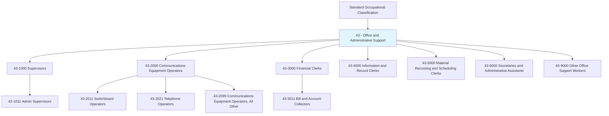
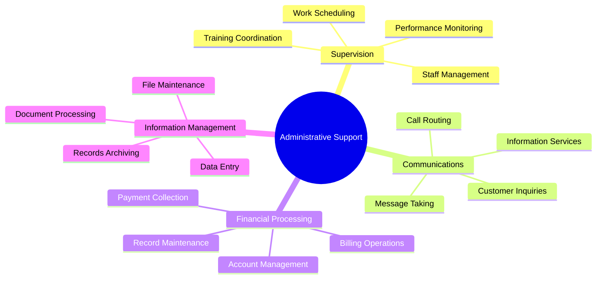
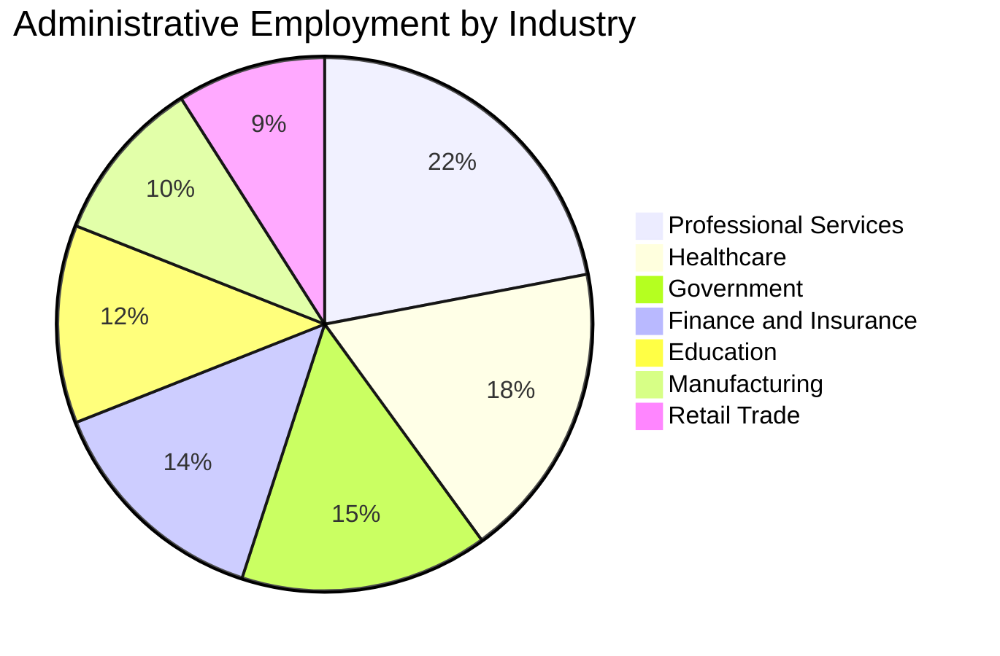
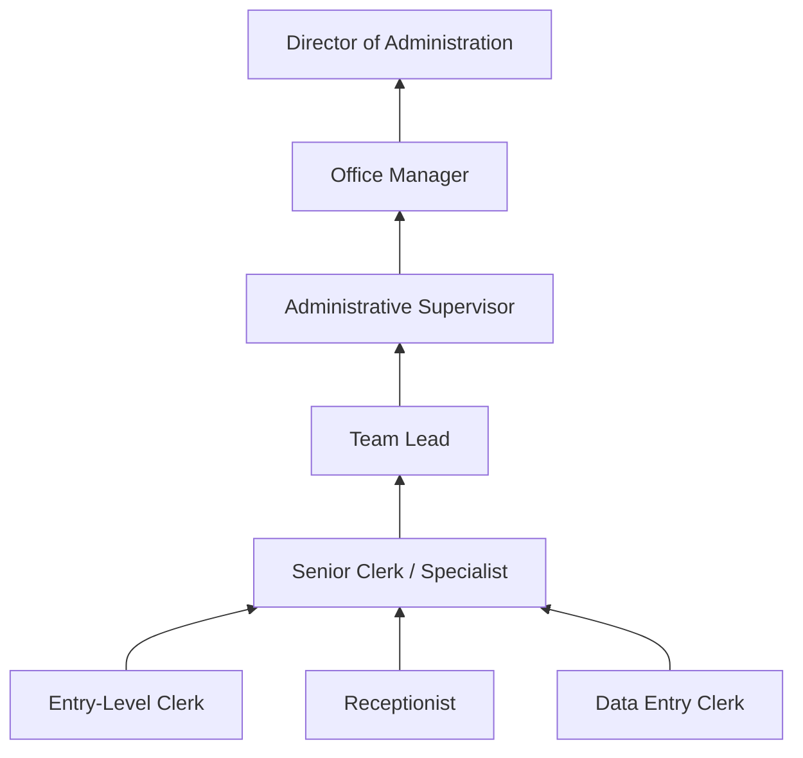

# Office and Administrative Support

> SOC Category 43 - Office and Administrative Support Occupations

## Overview

Office and Administrative Support occupations encompass roles that perform clerical duties, manage communications, maintain records, and provide essential support functions that enable organizations to operate efficiently. These professionals serve as the operational backbone of businesses across all industries, handling everything from front-desk reception to complex data management and financial record-keeping. The category represents one of the largest employment sectors in the economy, with positions ranging from entry-level clerks to experienced supervisors managing administrative teams.

## Classification Hierarchy

## Key Statistics

| Metric | Value |
|--------|-------|
| SOC Code | 43-xxxx |
| Total Occupations | 50+ |
| Employment Level | Very High |
| Category Type | Major Occupation Group |

## Occupation Groups

### 43-1000 Supervisors of Office and Administrative Support Workers

First-line supervisors who directly oversee clerical and administrative staff, ensuring work quality and productivity.

- [First-Line Supervisors of Office and Administrative Support Workers](./AdminSupervisors.mdx)

### 43-2000 Communications Equipment Operators

Professionals who operate telephone systems, switchboards, and other communications equipment.

- [Switchboard Operators, Including Answering Service](./SwitchboardOperators.mdx)
- [Telephone Operators](./TelephoneOperators.mdx)
- [Communications Equipment Operators, All Other](./CommunicationsEquipmentOperators.mdx)

### 43-3000 Financial Clerks

Workers who handle financial transactions, maintain accounts, and manage billing.

- [Bill and Account Collectors](./BillAndAccountCollectors.mdx)

## Core Function Areas

## Skills Framework

### Technical Competencies
- **Office Software** - Proficiency in productivity suites and specialized applications
- **Communications Systems** - Operation of phone systems and digital communication tools
- **Data Management** - Handling databases, spreadsheets, and record systems
- **Financial Processing** - Understanding of billing, accounts, and payment systems

### Interpersonal Skills
- **Customer Service** - Professional interaction with internal and external stakeholders
- **Communication** - Clear verbal and written expression
- **Organization** - Managing multiple tasks and maintaining accurate records
- **Problem Solving** - Addressing routine issues and escalating complex matters

## Industry Distribution

## Career Pathways

## Related Categories

- [Management Occupations](/occupations/Management) - Leadership roles that administrative staff support
- [Business and Financial Operations](/occupations/BusinessAndFinancial) - Specialized financial roles
- [Computer and Mathematical](/occupations/Technology) - IT support roles

## Education and Training

| Level | Typical Requirements |
|-------|---------------------|
| Entry Level | High school diploma or equivalent |
| Specialized Roles | Some college or vocational training |
| Supervisory | Associate's degree preferred |
| Management | Bachelor's degree often required |

---

*Source: O*NET SOC Category 43 - Office and Administrative Support Occupations*
