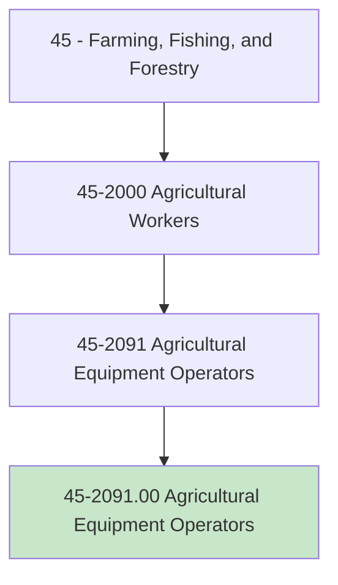
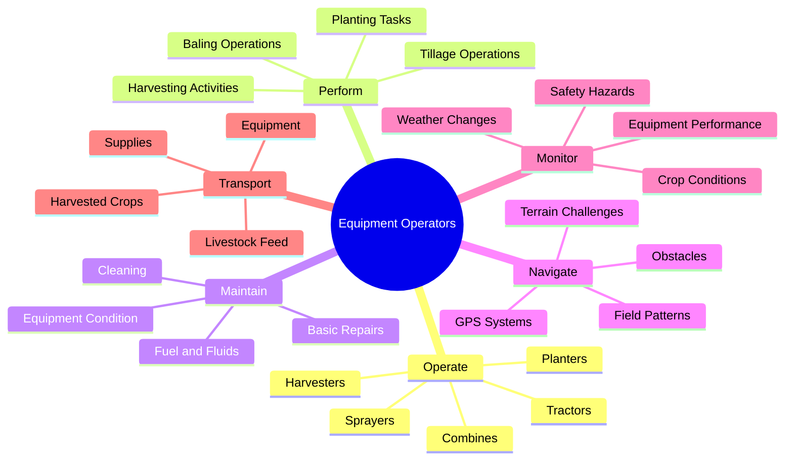
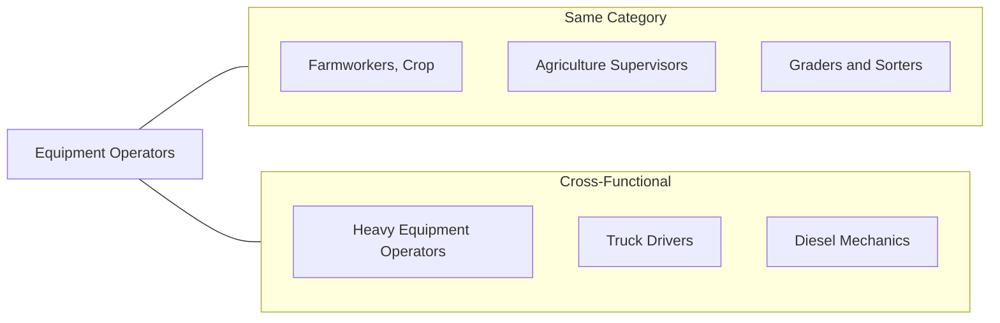
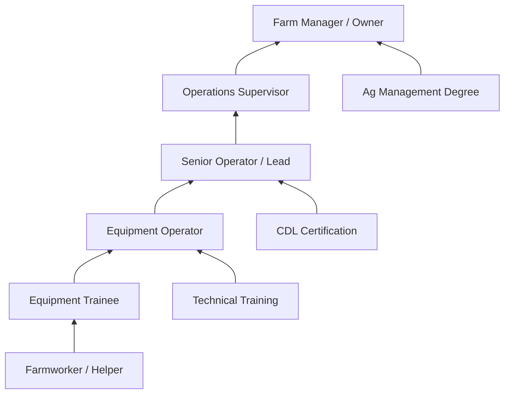

# Agricultural Equipment Operators

> Drive and control equipment to support agricultural activities such as tilling soil; planting, cultivating, and harvesting crops; feeding and herding livestock; or removing animal waste. May perform tasks such as crop baling or hay bucking. May operate stationary equipment to perform post-harvest tasks such as husking, shelling, threshing, and ginning.

## Overview

Agricultural Equipment Operators are skilled workers who operate the machinery essential to modern farming and agricultural production. They drive tractors, combines, harvesters, and other specialized equipment to prepare soil, plant crops, apply treatments, and harvest agricultural products. This occupation requires technical proficiency in operating complex machinery, understanding of agricultural processes, and the ability to work safely in challenging outdoor conditions. Equipment operators are crucial to farm productivity, enabling large-scale agricultural operations that would be impossible with manual labor alone.

## Classification Hierarchy

## Key Statistics

| Metric | Value |
|--------|-------|
| SOC Code | 45-2091.00 |
| Job Zone | 2 (Some Preparation) |
| Category | [Farming, Fishing, and Forestry](/occupations/Agriculture) |
| Core Tasks | 15+ |
| Source | O*NET |

## Core Tasks

### operate.AgriculturalEquipment

Equipment Operators drive and control various types of farm machinery to accomplish agricultural tasks.

**Actions:**
- `operate.Tractors.to.perform.FieldOperations` - Drive tractors for pulling implements and general farm work
- `operate.Combines.to.harvest.GrainCrops` - Run combine harvesters for efficient grain collection
- `operate.Harvesters.to.collect.SpecialtyCrops` - Use specialty harvesters for fruits, vegetables, or cotton
- `operate.Planters.to.sow.Seeds` - Run precision planting equipment for crop establishment
- `operate.Sprayers.to.apply.Treatments` - Use spray equipment for fertilizers and pesticides

### perform.FieldOperations

Equipment Operators execute the core agricultural tasks that support crop production.

**Actions:**
- `perform.TillageOperations.to.prepare.Soil` - Plow, disk, and cultivate fields for planting
- `perform.PlantingTasks.with.Precision.to.establish.Crops` - Seed fields at proper depth and spacing
- `perform.HarvestingActivities.efficiently.to.collect.Crops` - Gather mature crops at optimal timing
- `perform.BalingOperations.to.package.Hay` - Create hay or straw bales for storage or sale
- `perform.PostHarvestProcessing.to.prepare.Products` - Run equipment for husking, shelling, or threshing

### maintain.Equipment

Equipment Operators keep machinery in proper working condition through regular maintenance.

**Actions:**
- `maintain.EquipmentCondition.through.Inspection.to.ensure.Reliability` - Perform daily equipment checks
- `maintain.FuelAndFluids.at.ProperLevels.to.prevent.Damage` - Monitor and replenish oils, coolants, and fuel
- `maintain.Equipment.through.BasicRepairs.to.minimize.Downtime` - Fix minor issues in the field
- `maintain.Equipment.through.Cleaning.to.extend.LifeSpan` - Remove debris and crop residue after use

### navigate.FieldPatterns

Equipment Operators control equipment paths through fields for efficient coverage.

**Actions:**
- `navigate.FieldPatterns.for.EfficientCoverage.to.minimize.Overlap` - Follow optimal driving patterns
- `navigate.using.GPSSystems.for.Precision.to.improve.Accuracy` - Use auto-steer and guidance technology
- `navigate.TerrainChallenges.safely.to.protect.Equipment` - Handle hills, wet spots, and rough ground
- `navigate.around.Obstacles.to.prevent.Damage` - Avoid rocks, ditches, and other hazards

### monitor.OperationalConditions

Equipment Operators observe equipment, crops, and environment during operations.

**Actions:**
- `monitor.EquipmentPerformance.during.Operation.to.detect.Problems` - Watch gauges and indicators
- `monitor.CropConditions.while.Working.to.adjust.Settings` - Observe crop flow and quality
- `monitor.WeatherChanges.to.plan.Activities` - Track conditions affecting field work
- `monitor.SafetyHazards.constantly.to.prevent.Accidents` - Stay alert for people, animals, and obstacles

## Skills & Competencies

### Technical Skills
- **Equipment Operation** - Expert
- **Mechanical Aptitude** - Advanced
- **Precision Agriculture Technology** - Advanced
- **Equipment Maintenance** - Proficient
- **GPS/Guidance Systems** - Proficient
- **Safety Procedures** - Proficient

### Soft Skills
- **Attention to Detail** - Critical
- **Problem Solving** - Essential
- **Physical Stamina** - Essential
- **Independence** - Important
- **Adaptability** - Important

## Related Occupations

## Industries

- [Crop Production](/industries/CropProduction) - Highest Employment
- [Support Activities for Crop Production](/industries/CropSupport) - High Employment
- [Animal Production](/industries/AnimalProduction) - Moderate Employment
- [Vegetable and Melon Farming](/industries/VegetableFarming) - High Employment
- [Grain Farming](/industries/GrainFarming) - High Employment

## Industry Variations

### Grain Farming
Operators run large-scale equipment including high-horsepower tractors, wide planters, and combines. Work is highly seasonal with intense activity during planting and harvest. Heavy use of precision agriculture technology.

### Vegetable and Produce Farming
Focus on specialized equipment for planting, cultivation, and harvest of specific crops. May involve more manual adjustment and smaller equipment for delicate crops.

### Dairy and Livestock Operations
Equipment operation includes feed mixing and distribution, manure handling, and hay/silage equipment. Work is more year-round compared to crop farming.

### Vineyard and Orchard Operations
Specialization in narrow tractors and specialized equipment for row crops, spraying, and harvest assistance. Requires maneuvering in tight spaces.

### Cotton Farming
Operation of cotton pickers, module builders, and gin equipment. Seasonal work concentrated in fall harvest.

### Custom Farm Work
Operators who contract their services across multiple farms, often owning or operating high-value equipment. Requires flexibility and travel.

## Career Progression

## Education & Training

| Requirement | Details |
|-------------|---------|
| Typical Education | High school diploma or GED; vocational training helpful |
| Work Experience | Some prior farm experience preferred |
| On-the-Job Training | Moderate - equipment-specific training required |
| Common Certifications | Commercial Driver's License (CDL), Pesticide Applicator License, Equipment Certifications |

## Departments

This occupation typically works in:
- [Field Operations](/departments/FieldOperations)
- [Farm Operations](/departments/FarmOperations)
- [Production](/departments/Production)
- [Equipment Services](/departments/EquipmentServices)

## Work Environment

- **Physical Demands**: Moderate; sitting for long periods, climbing in/out of equipment
- **Work Setting**: Outdoors in fields; exposure to dust, noise, weather extremes
- **Schedule**: Variable and seasonal; very long hours during planting and harvest
- **Hazards**: Moving equipment, dust, chemicals, noise, heat/cold

## Equipment Types

Agricultural Equipment Operators may work with:

### Field Equipment
- Tractors (compact to large-frame)
- Combines and grain harvesters
- Cotton pickers
- Hay balers (round and square)
- Forage harvesters

### Tillage Equipment
- Plows (moldboard, chisel, disc)
- Cultivators and harrows
- Subsoilers
- Rollers and packers

### Planting Equipment
- Grain drills
- Row crop planters
- Air seeders
- Transplanters

### Application Equipment
- Sprayers (field and orchard)
- Fertilizer spreaders
- Manure spreaders
- Anhydrous ammonia applicators

### Post-Harvest Equipment
- Grain carts and augers
- Grain dryers
- Cotton module builders
- Huskers and shellers

## Technology & Tools

- GPS auto-steer and guidance systems
- Yield monitors and mapping
- Variable rate application controllers
- Telematics and fleet management
- Mobile apps for farm management
- Basic hand tools for adjustments
- Grease guns and maintenance equipment

## Seasonal Patterns

| Season | Primary Activities |
|--------|-------------------|
| Spring | Tillage, planting, fertilizer application |
| Summer | Cultivation, spraying, irrigation, hay harvest |
| Fall | Primary harvest season, fall tillage |
| Winter | Equipment maintenance, limited field work |

## Safety Considerations

- Rollover protection systems (ROPS)
- Seat belt use
- Power take-off (PTO) safety
- Chemical handling procedures
- Traffic safety on public roads
- Heat illness prevention
- Hearing protection

---

*Source: O*NET 45-2091.00 - ONETOccupation*
