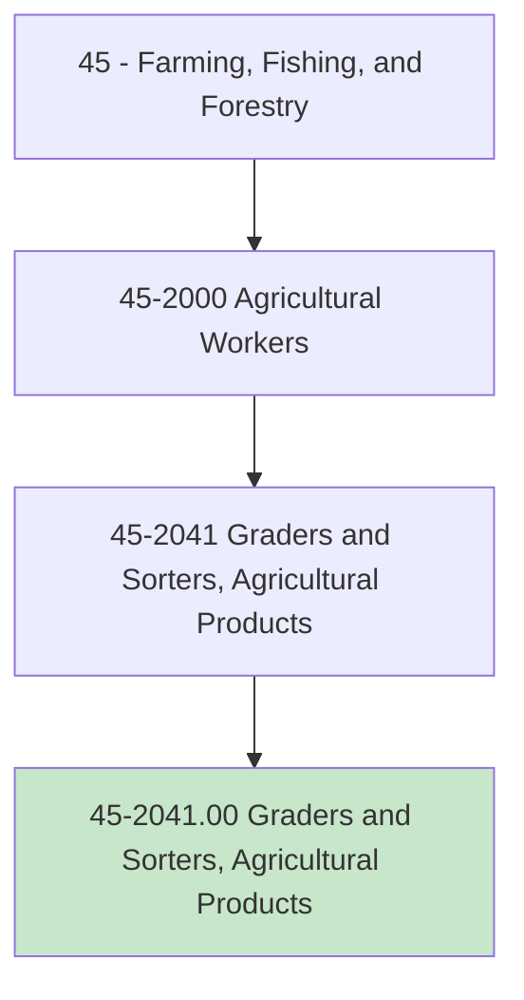
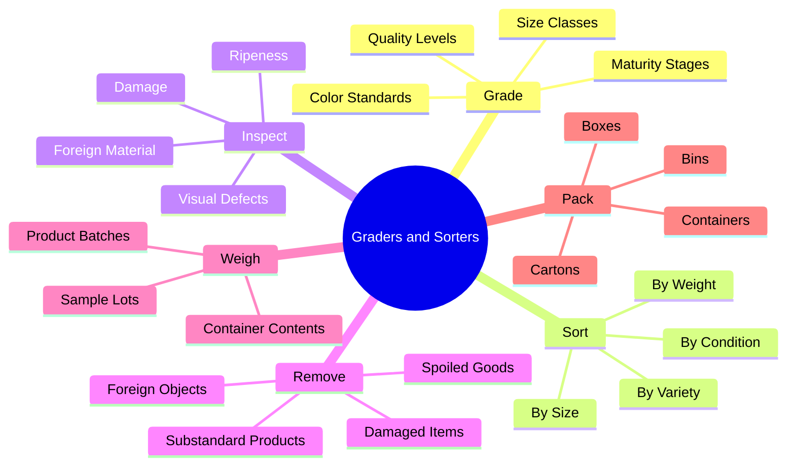
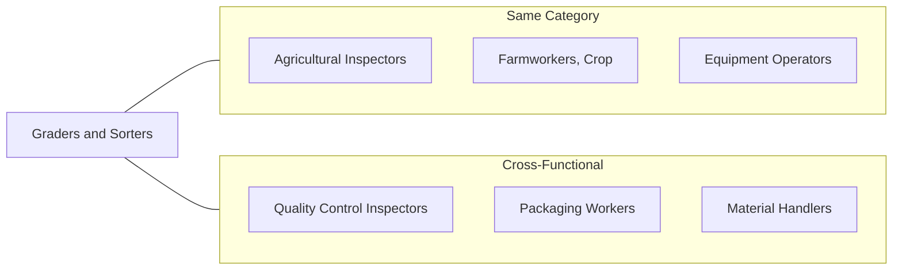
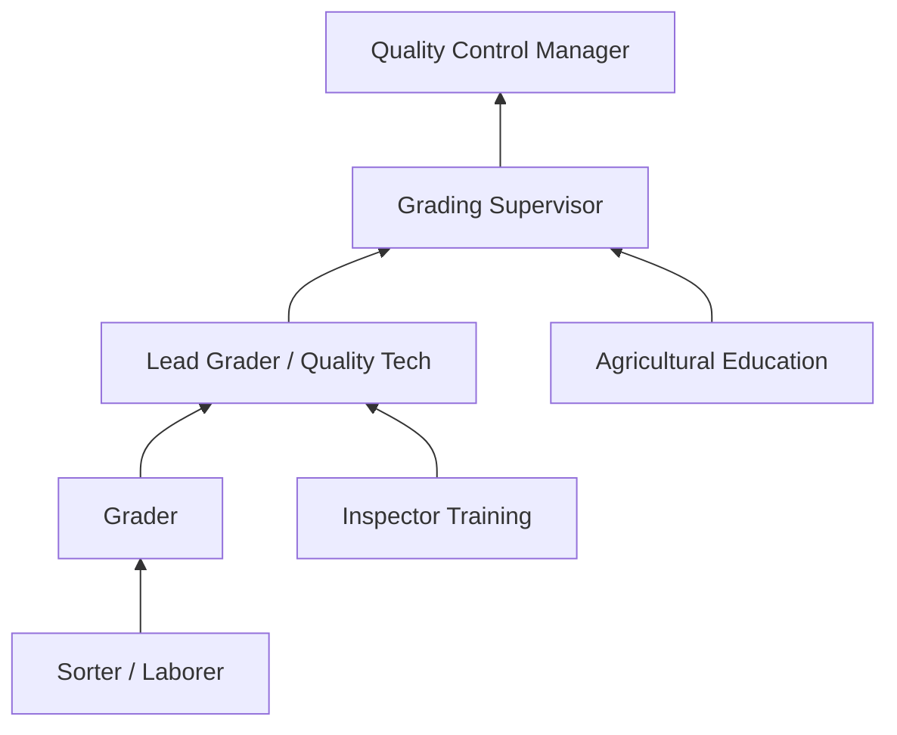

# Graders and Sorters, Agricultural Products

> Grade, sort, or classify unprocessed food and other agricultural products by size, weight, color, or condition.

## Overview

Graders and Sorters of Agricultural Products are essential quality control professionals who evaluate and categorize raw agricultural products to meet market standards and consumer expectations. They work in fields, packing houses, warehouses, and processing facilities, inspecting products such as fruits, vegetables, nuts, grains, and tobacco. Using visual assessment, hand tools, and automated equipment, they separate products by size, color, ripeness, quality grade, and freedom from defects. Their work directly impacts product pricing, marketability, and food safety, making them critical to the agricultural supply chain.

## Classification Hierarchy

## Key Statistics

| Metric | Value |
|--------|-------|
| SOC Code | 45-2041.00 |
| Job Zone | 1 (Little or No Preparation) |
| Category | [Farming, Fishing, and Forestry](/occupations/Agriculture/index) |
| Core Tasks | 10+ |
| Source | O*NET |

## Core Tasks

### grade.AgriculturalProducts

Graders evaluate products against established quality standards to assign appropriate grades.

**Actions:**
- `grade.Products.by.QualityLevel.to.determine.MarketValue` - Assess products against USDA or industry grade standards
- `grade.Products.by.Size.to.meet.PackingRequirements` - Categorize items into standard size classes
- `grade.Products.by.Color.to.ensure.Consistency` - Sort by color uniformity and ripeness indicators
- `grade.Products.by.Maturity.to.optimize.Timing` - Evaluate ripeness for immediate or delayed market

### sort.ProductsByCriteria

Graders separate products into distinct categories based on multiple attributes.

**Actions:**
- `sort.Products.by.Size.using.SortingEquipment` - Run products through sizing machinery
- `sort.Products.by.Weight.using.Scales` - Weigh items for weight-based grading
- `sort.Products.by.Condition.through.Inspection` - Separate based on physical condition
- `sort.Products.by.Variety.to.maintain.Separation` - Keep different varieties distinct

### inspect.ProductQuality

Graders examine products visually and physically to identify defects and issues.

**Actions:**
- `inspect.Products.for.VisualDefects.to.ensure.Quality` - Check for spots, bruises, or discoloration
- `inspect.Products.for.Damage.to.remove.Unsaleable` - Identify mechanical or pest damage
- `inspect.Products.for.ForeignMaterial.to.ensure.Safety` - Look for debris or contamination
- `inspect.Products.for.Ripeness.to.sort.Appropriately` - Assess maturity level

### remove.SubstandardItems

Graders separate defective or unsaleable products from the supply stream.

**Actions:**
- `remove.DamagedItems.from.ProductionLine.to.maintain.Quality` - Pull out bruised or broken products
- `remove.SubstandardProducts.from.Supply.to.meet.Grades` - Eliminate items below grade requirements
- `remove.ForeignObjects.from.Products.to.ensure.Safety` - Extract debris and contaminants
- `remove.SpoiledGoods.from.Lots.to.prevent.Contamination` - Discard rotted or moldy items

### pack.SortedProducts

Graders arrange sorted products into appropriate containers for storage or shipment.

**Actions:**
- `pack.Products.into.Containers.to.prepare.Shipment` - Fill boxes, bags, or bins with graded products
- `pack.Products.by.Grade.to.maintain.Separation` - Keep different quality levels distinct
- `pack.Products.by.Count.to.meet.Specifications` - Arrange specific quantities per container
- `pack.Products.carefully.to.prevent.Damage` - Handle products to minimize bruising

## Skills & Competencies

### Technical Skills
- **Quality Assessment** - Advanced
- **Visual Inspection** - Advanced
- **Grading Standards** - Proficient
- **Equipment Operation** - Proficient
- **Hand-Eye Coordination** - Proficient
- **Speed and Accuracy** - Proficient

### Soft Skills
- **Attention to Detail** - Critical
- **Consistency** - Critical
- **Physical Stamina** - Essential
- **Teamwork** - Important
- **Reliability** - Important

## Related Occupations

## Industries

- Fruit and Vegetable Packing - Highest Employment
- [Food Manufacturing](/industries/Manufacturing/FoodManufacturing/index) - High Employment
- [Crop Production](/industries/Agriculture/CropProduction/index) - High Employment
- Tobacco Processing - Moderate Employment
- Nut Processing - Moderate Employment

## Industry Variations

### Fresh Produce Grading
Focus on fruits and vegetables for fresh market, emphasizing appearance, size, and freedom from defects. Work is often seasonal with long hours during harvest periods. May work on packing lines or in fields.

### Grain Grading
Specialization in evaluating grain quality based on moisture content, test weight, damaged kernels, and foreign material. Often works at elevators or terminals with samples from loads.

### Tobacco Grading
Evaluation of tobacco leaves based on color, body, and texture. Requires extensive training to recognize subtle quality differences that affect value.

### Nut Grading
Focus on shell quality, kernel condition, and size. May involve cracking samples to assess internal quality and using electronic sorting equipment.

### Egg Grading
Inspection of eggs for shell quality, interior condition using candling, and size classification. Works in processing facilities with high-speed grading equipment.

### Seafood Grading
Evaluation of fish and shellfish for freshness, size, and quality. Requires knowledge of species-specific quality indicators and handling requirements.

## Career Progression

## Education & Training

| Requirement | Details |
|-------------|---------|
| Typical Education | No formal education required; high school diploma or GED preferred |
| Work Experience | Little to no prior experience required |
| On-the-Job Training | Short-term - learn grading standards and equipment operation |
| Common Certifications | USDA Grading Certificate (for federal graders) |

## Departments

This occupation typically works in:
- Quality Control
- Packing Operations
- Production
- Receiving

## Work Environment

- **Physical Demands**: Light to moderate; standing for long periods, repetitive motions
- **Work Setting**: Packing houses, warehouses, processing plants, fields
- **Schedule**: Variable hours; often seasonal with extended hours during harvest
- **Conditions**: May be exposed to cold storage, dust, or outdoor weather

## Grading Standards

Graders work with various standardization systems:

- **USDA Grades**: Federal quality standards for most agricultural products
- **State Standards**: State-specific grading requirements
- **Industry Standards**: Buyer or market-specific specifications
- **International Standards**: Export grade requirements (Codex Alimentarius)

## Technology & Tools

- Electronic sorting and grading equipment
- Sizing rings and templates
- Scales and weighing equipment
- Color charts and reference materials
- Conveyor systems
- Automated optical sorters
- Moisture meters (for grains)
- Candling equipment (for eggs)

## Seasonal Patterns

Employment in this occupation is highly seasonal:

| Season | Activity Level | Products |
|--------|---------------|----------|
| Spring | Moderate | Early vegetables, citrus |
| Summer | High | Stone fruits, berries, vegetables |
| Fall | Peak | Apples, pumpkins, late harvest |
| Winter | Low | Citrus, storage crops, greenhouse |

---

*Source: O*NET 45-2041.00 - ONETOccupation*
