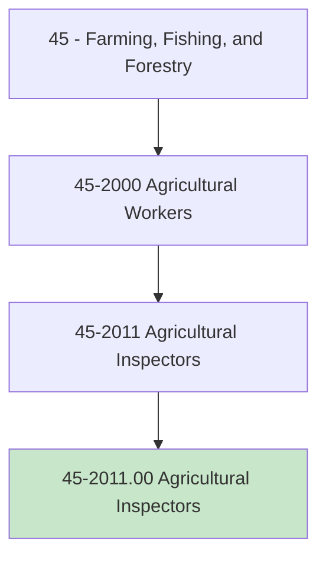
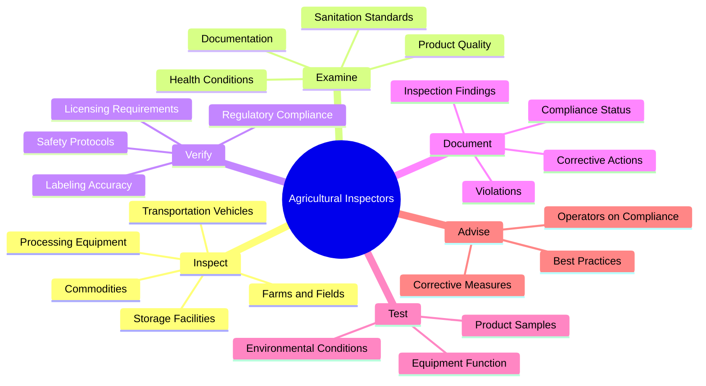
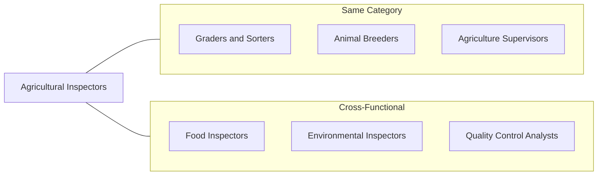
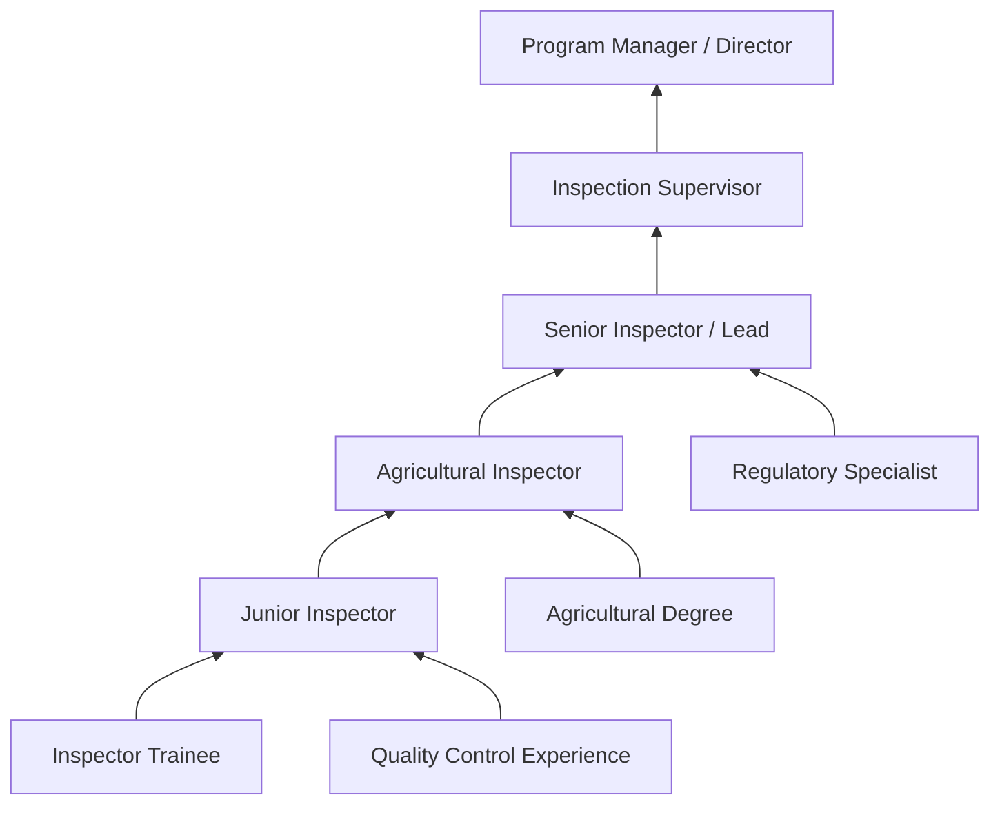

# Agricultural Inspectors

> Inspect agricultural commodities, processing equipment, and facilities, and fish and logging operations, to ensure compliance with regulations and laws governing health, quality, and safety.

## Overview

Agricultural Inspectors serve as the critical link between agricultural production and public safety, ensuring that food products, agricultural commodities, and related facilities meet established health, quality, and safety standards. They inspect farms, processing plants, warehouses, and transportation systems to verify compliance with federal, state, and local regulations. Their work protects consumers from contaminated or substandard products while helping agricultural operations maintain compliance with complex regulatory requirements. This role requires keen attention to detail, strong analytical skills, and comprehensive knowledge of agricultural practices and regulations.

## Classification Hierarchy

## Key Statistics

| Metric | Value |
|--------|-------|
| SOC Code | 45-2011.00 |
| Job Zone | 3 (Medium Preparation) |
| Category | [Farming, Fishing, and Forestry](/occupations/Agriculture/index) |
| Core Tasks | 15+ |
| Source | O*NET |

## Core Tasks

### inspect.AgriculturalCommodities

Agricultural Inspectors examine agricultural products to verify quality, safety, and regulatory compliance.

**Actions:**
- `inspect.AgriculturalCommodities.for.Quality.to.ensure.ConsumerSafety` - Evaluate products for defects and contamination
- `inspect.ProcessingEquipment.for.Sanitation.to.prevent.Contamination` - Verify cleanliness of food processing machinery
- `inspect.StorageFacilities.for.Compliance.to.maintain.ProductIntegrity` - Check warehouses and silos for proper conditions
- `inspect.TransportationVehicles.for.Safety.to.ensure.ProductProtection` - Examine trucks and containers for cleanliness

### examine.ProductQuality

Agricultural Inspectors assess product characteristics against established standards.

**Actions:**
- `examine.ProductQuality.against.Standards.to.verify.Compliance` - Compare products to regulatory specifications
- `examine.SanitationConditions.in.Facilities.to.identify.Hazards` - Evaluate cleanliness and hygiene practices
- `examine.HealthConditions.of.Animals.to.prevent.DiseaseSpread` - Check livestock for signs of illness
- `examine.Documentation.for.Accuracy.to.verify.Traceability` - Review records and certificates

### verify.RegulatoryCompliance

Agricultural Inspectors confirm adherence to federal, state, and local regulations.

**Actions:**
- `verify.RegulatoryCompliance.with.FederalStandards.to.ensure.Legality` - Check conformance with USDA, FDA, EPA requirements
- `verify.LicensingRequirements.of.Operators.to.confirm.Authorization` - Validate permits and certifications
- `verify.LabelingAccuracy.on.Products.to.protect.Consumers` - Ensure truthful product labeling
- `verify.SafetyProtocols.in.Operations.to.prevent.Accidents` - Confirm workplace safety measures

### document.InspectionFindings

Agricultural Inspectors create detailed records of inspection results and required actions.

**Actions:**
- `document.InspectionFindings.in.Reports.to.maintain.Records` - Prepare comprehensive inspection reports
- `document.Violations.with.Evidence.to.support.Enforcement` - Record non-compliance with supporting documentation
- `document.CorrectiveActions.required.to.guide.Remediation` - Specify steps to achieve compliance
- `document.ComplianceStatus.for.Tracking.to.monitor.Progress` - Update compliance databases and tracking systems

### test.ProductSamples

Agricultural Inspectors collect and analyze samples to verify product safety and quality.

**Actions:**
- `test.ProductSamples.for.Contamination.to.ensure.Safety` - Collect samples for laboratory analysis
- `test.EnvironmentalConditions.for.Compliance.to.verify.Standards` - Measure temperature, humidity, and other conditions
- `test.EquipmentFunction.for.Accuracy.to.ensure.ReliableOperation` - Verify calibration of scales and measuring devices
- `test.WaterQuality.in.Facilities.to.prevent.Contamination` - Sample water sources for processing operations

## Skills & Competencies

### Technical Skills
- **Regulatory Knowledge** - Expert
- **Inspection Techniques** - Expert
- **Quality Assessment** - Advanced
- **Sampling Methods** - Advanced
- **Documentation** - Advanced
- **Food Safety Standards** - Proficient

### Soft Skills
- **Attention to Detail** - Critical
- **Analytical Thinking** - Critical
- **Communication** - Essential
- **Integrity** - Essential
- **Independence** - Important

## Related Occupations

## Industries

- [Government - Federal](/industries/FederalGovernment) - Highest Employment (USDA, FDA)
- [Government - State and Local](/industries/StateLocalGovernment) - High Employment
- [Food Manufacturing](/industries/Manufacturing/FoodManufacturing/index) - Moderate Employment
- [Crop Production](/industries/Agriculture/CropProduction/index) - Moderate Employment
- [Animal Production](/industries/Agriculture/AnimalProduction/index) - Moderate Employment

## Industry Variations

### Food Safety Inspection
Focus on food processing facilities, examining products for contamination, verifying sanitation practices, and ensuring compliance with FDA and USDA food safety regulations. Inspectors may specialize in meat, poultry, dairy, or produce.

### Plant Health Inspection
Specialization in detecting plant pests and diseases, enforcing quarantine regulations, and certifying products for interstate or international shipment. Works closely with USDA APHIS programs.

### Animal Health Inspection
Focus on livestock health, disease surveillance, and humane treatment standards. Inspectors examine animals at farms, auctions, and slaughter facilities for signs of illness and verify vaccination records.

### Grain and Commodity Inspection
Specialization in grading and inspecting grain, cotton, and other commodities for quality, moisture content, and foreign material. Often works at elevators, terminals, and export facilities.

### Organic Certification Inspection
Verification that farms and processing facilities comply with USDA National Organic Program standards. Inspectors review practices, inputs, and documentation to maintain organic certification.

## Career Progression

## Education & Training

| Requirement | Details |
|-------------|---------|
| Typical Education | Bachelor's degree in agriculture, food science, biology, or related field |
| Work Experience | 0-2 years; entry-level positions available with proper education |
| On-the-Job Training | Moderate to extensive - regulatory training and certification required |
| Common Certifications | USDA Food Safety Inspection, HACCP Certification, Organic Inspector Certification |

## Departments

This occupation typically works in:
- [Quality Assurance](/departments/QualityAssurance)
- [Regulatory Affairs](/departments/RegulatoryAffairs)
- [Food Safety](/departments/FoodSafety)
- [Compliance](/departments/Compliance)

## Work Environment

- **Physical Demands**: Light to moderate physical activity; standing, walking, bending
- **Work Setting**: Varies - farms, processing plants, warehouses, offices, outdoors
- **Schedule**: Generally regular hours; some inspections may require early mornings or evenings
- **Travel**: Moderate to extensive travel to inspection sites

## Regulatory Framework

Agricultural Inspectors work within a complex regulatory environment:

- **Federal**: USDA, FDA, EPA, and CBP regulations
- **State**: Department of Agriculture rules and standards
- **Local**: County health department requirements
- **International**: Import/export standards and certifications

## Technology & Tools

- Inspection checklists and mobile applications
- Temperature and humidity monitoring devices
- Sampling equipment and containers
- Cameras and documentation tools
- Database and reporting systems
- Laboratory testing equipment

---

*Source: O*NET 45-2011.00 - ONETOccupation*
