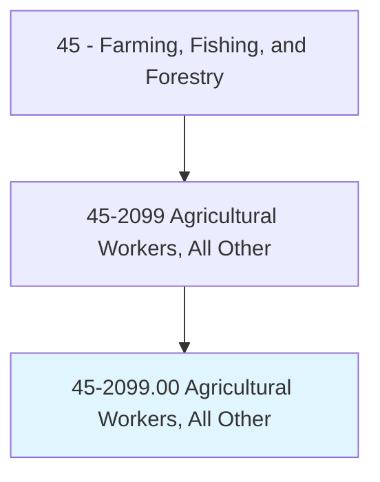
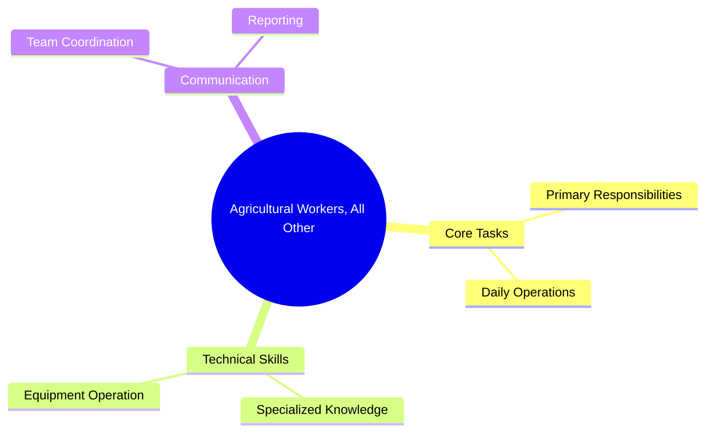
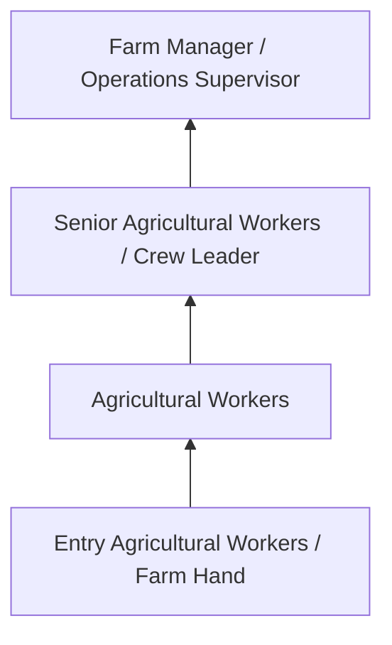
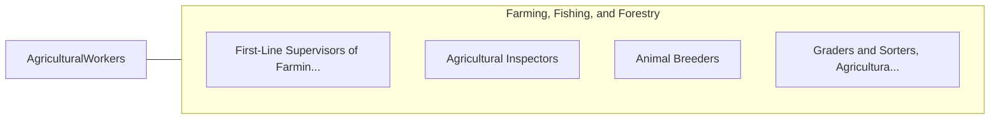

# Agricultural Workers, All Other

> All agricultural workers not listed separately.

## Overview

Agricultural Workers professionals serve a vital function within the Farming, Fishing, and Forestry field. They bring specialized skills and knowledge to their roles, contributing to organizational objectives and societal needs.

These practitioners work in varied environments, adapting their expertise to meet specific requirements of their industry and employer. The role requires ongoing professional development to maintain competency and respond to changing demands.

Career paths in this field offer opportunities for advancement through experience, additional education, and specialized certifications. Employment prospects are influenced by industry trends, technological change, and workforce demographics.

## Classification Hierarchy



## Key Statistics

| Metric | Value |
|--------|-------|
| SOC Code | 45-2099.00 |
| Job Zone | N/A |
| Category | [Farming, Fishing, and Forestry](/occupations/Agriculture/index) |
| Core Tasks | N/A+ |
| Salary Range | $28,000 - $60,000 |
| Median Salary | $38,000 |
| Growth Outlook | -2% (Decline) |
| Source | O*NET |

## Core Tasks



### Technical Skills
- **Agricultural Operations** - Advanced
- **Equipment Operation** - Advanced
- **Resource Management** - Advanced

### Soft Skills
- **Communication** - Essential
- **Problem Solving** - Essential
- **Critical Thinking** - Important
- **Teamwork** - Important
- **Adaptability** - Important


## Skills & Competencies

### Technical Skills
- **Agricultural Operations** - Advanced
- **Equipment Operation** - Advanced
- **Crop/Animal Management** - Advanced
- **Safety Procedures** - Advanced
- **Pest Management** - Proficient
- **Soil/Resource Management** - Proficient

### Soft Skills
- **Physical Stamina** - Critical
- **Problem Solving** - Essential
- **Adaptability** - Essential
- **Reliability** - Essential
- **Teamwork** - Important

## Education & Certifications

| Requirement | Details |
|-------------|---------|
| Typical Education | High school diploma; some positions require agricultural training |
| Work Experience | 0-2 years farming or forestry experience |
| On-the-Job Training | Moderate - equipment and safety training |
| Certifications | Pesticide applicator license, equipment operation certifications |

## Career Progression



## Industry Variations

### Crop Production
Field crop and specialty crop cultivation. Agricultural Workers professionals manage planting, cultivation, and harvesting operations.

### Livestock and Dairy
Animal husbandry and production management. Focus on animal health, breeding, and production efficiency.

### Forestry and Logging
Timber management and harvesting operations. Emphasis on sustainability, safety, and environmental compliance.

### Nursery and Greenhouse
Controlled environment production of ornamental plants and seedlings. Focus on plant health and customer specifications.

## Technology & Tools

- **GPS-guided equipment**
- **Precision agriculture software**
- **Irrigation control systems**
- **Soil testing equipment**
- **Farm management information systems**

## Related Occupations



## Industries

- [Crop Production](/industries/CropProduction) - High Employment
- [Animal Production](/industries/AnimalProduction) - High Employment
- [Forestry and Logging](/industries/Forestry) - Moderate Employment
- [Support Activities for Agriculture](/industries/AgricultureSupport) - Moderate Employment

## Departments

This occupation typically works in:
- [Farm Operations](/departments/FarmOperations)
- [Crop Management](/departments/CropManagement)
- [Equipment Operations](/departments/EquipmentOps)

## GraphDL Semantic Structure

```
Agricultural Workers, All Other perform:
- operate.Equipment.for.FarmOperations
- maintain.Crops.for.OptimalGrowth
- inspect.Fields.for.PestAndDisease
- harvest.Products.using.ProperTechniques
- follow.Procedures.for.SafetyCompliance
```

---

*Source: O*NET 45-2099.00 - ONETOccupation*
