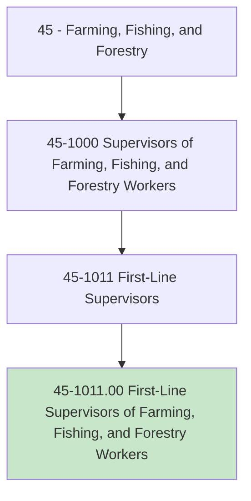
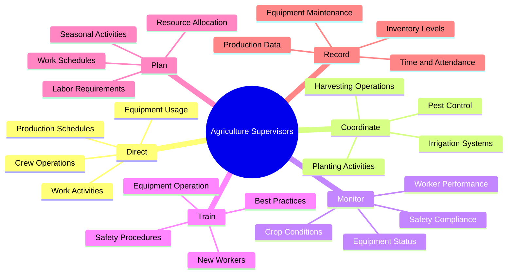
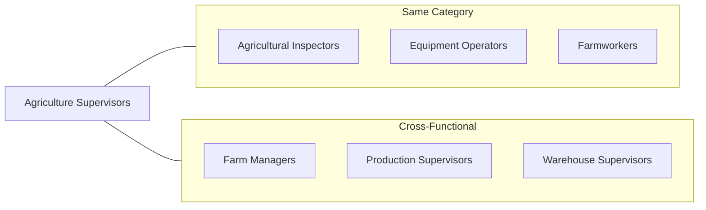
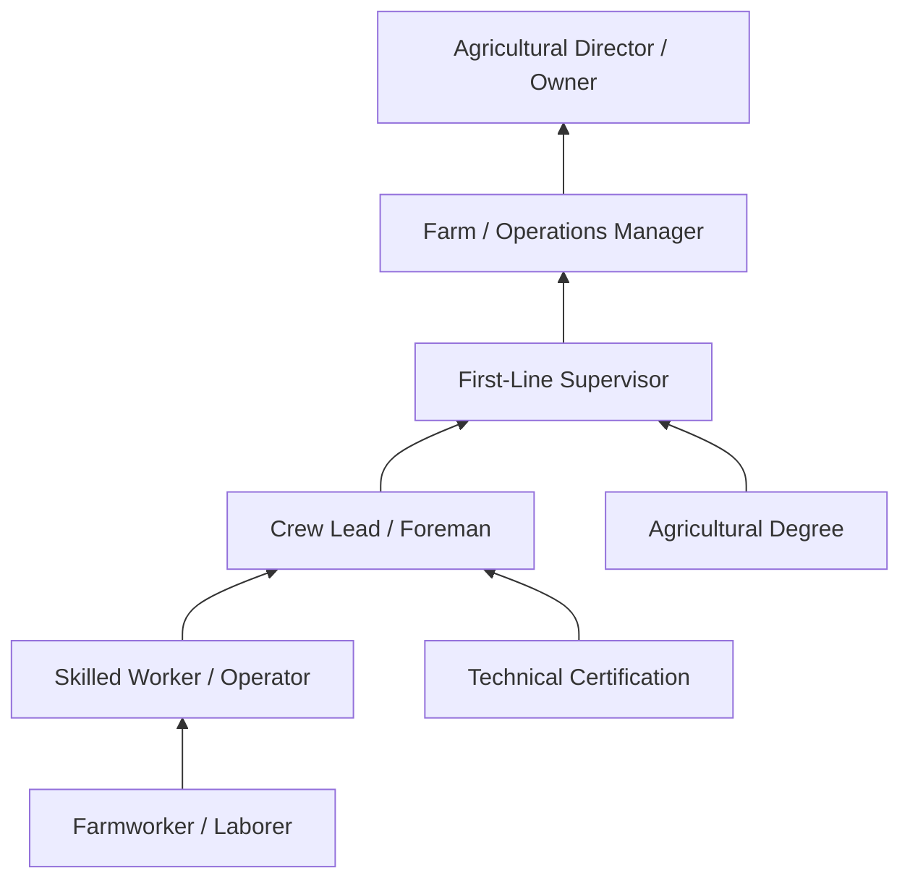

# First-Line Supervisors of Farming, Fishing, and Forestry Workers

> Directly supervise and coordinate the activities of agricultural, forestry, aquacultural, and related workers.

## Overview

First-Line Supervisors of Farming, Fishing, and Forestry Workers are the operational leaders who manage day-to-day activities in agricultural settings. They coordinate crews, assign tasks, ensure work quality, and maintain safety standards across farms, ranches, fisheries, and forestry operations. These supervisors bridge the gap between farm owners/managers and field workers, requiring both technical agricultural expertise and strong leadership skills. They must balance production goals with worker safety, environmental compliance, and resource management.

## Classification Hierarchy

## Key Statistics

| Metric | Value |
|--------|-------|
| SOC Code | 45-1011.00 |
| Job Zone | 3 (Medium Preparation) |
| Category | [Farming, Fishing, and Forestry](/occupations/Agriculture) |
| Core Tasks | 20+ |
| Source | O*NET |

## Core Tasks

### direct.WorkActivities

Agriculture Supervisors direct the daily work activities of farm, ranch, and forestry crews to meet production goals.

**Actions:**
- `direct.WorkActivities.of.AgriculturalWorkers.to.achieve.ProductionGoals` - Coordinate daily crew assignments and priorities
- `direct.Crews.to.complete.PlantingTasks` - Oversee planting operations across fields
- `direct.Crews.to.complete.HarvestingOperations` - Manage timely crop harvesting
- `direct.Equipment.to.optimize.FieldOperations` - Allocate machinery for maximum efficiency

### coordinate.ProductionActivities

Agriculture Supervisors coordinate production activities to ensure smooth operations throughout growing seasons.

**Actions:**
- `coordinate.ProductionActivities.with.FarmManagement.to.meet.Deadlines` - Align field work with management expectations
- `coordinate.IrrigationSchedules.to.maintain.CropHealth` - Manage water resources effectively
- `coordinate.PestControl.to.protect.Crops` - Time and oversee pest management activities
- `coordinate.Harvesting.with.Processing.to.maintain.ProductQuality` - Ensure harvested products reach processing promptly

### monitor.WorkerPerformance

Agriculture Supervisors evaluate and ensure quality of work performed by agricultural workers.

**Actions:**
- `monitor.WorkerPerformance.to.ensure.QualityStandards` - Assess individual and crew productivity
- `monitor.SafetyCompliance.to.prevent.Accidents` - Ensure workers follow safety protocols
- `monitor.CropConditions.to.identify.Problems` - Observe fields for issues requiring attention
- `monitor.EquipmentStatus.to.prevent.Breakdowns` - Track machinery condition and maintenance needs

### train.Workers

Agriculture Supervisors train new and existing workers on procedures, equipment, and safety.

**Actions:**
- `train.Workers.on.SafetyProcedures.to.prevent.Injuries` - Conduct safety orientations and refreshers
- `train.Workers.on.EquipmentOperation.to.ensure.ProperUse` - Demonstrate correct machinery handling
- `train.Workers.on.HarvestingTechniques.to.maintain.Quality` - Teach proper crop handling methods
- `train.Workers.on.ChemicalHandling.to.ensure.Compliance` - Instruct on pesticide and fertilizer safety

### plan.Operations

Agriculture Supervisors plan work schedules, resource allocation, and seasonal activities.

**Actions:**
- `plan.WorkSchedules.to.meet.ProductionTargets` - Create daily and weekly task assignments
- `plan.LaborRequirements.for.SeasonalPeaks` - Anticipate and prepare for high-demand periods
- `plan.ResourceAllocation.to.optimize.Efficiency` - Distribute equipment and supplies effectively
- `plan.MaintenanceSchedules.to.minimize.Downtime` - Schedule equipment upkeep during low-activity periods

## Skills & Competencies

### Technical Skills
- **Crop Production** - Expert
- **Livestock Management** - Advanced
- **Equipment Operation** - Advanced
- **Irrigation Systems** - Proficient
- **Pest Management** - Proficient
- **Record Keeping** - Proficient

### Soft Skills
- **Leadership** - Critical
- **Communication** - Critical
- **Problem Solving** - Essential
- **Time Management** - Essential
- **Conflict Resolution** - Important

## Related Occupations

## Industries

- [Crop Production](/industries/CropProduction) - Highest Employment
- [Animal Production and Aquaculture](/industries/AnimalProduction) - High Employment
- [Support Activities for Agriculture](/industries/AgricultureSupport) - Moderate Employment
- [Forestry and Logging](/industries/ForestryLogging) - Moderate Employment
- [Fishing](/industries/Fishing) - Lower Employment

## Industry Variations

### Crop Farming
Focus on planting schedules, irrigation management, pest control, and harvest coordination. Supervisors work closely with agronomists and manage seasonal labor fluctuations.

### Livestock Operations
Emphasis on animal care schedules, feeding programs, breeding coordination, and facility maintenance. Requires knowledge of animal health and behavior.

### Aquaculture
Specialization in water quality management, feeding schedules, fish health monitoring, and harvesting operations. Often involves year-round operations.

### Forestry
Focus on timber harvesting, reforestation activities, fire prevention, and conservation practices. Typically involves remote work locations and heavy equipment.

## Career Progression

## Education & Training

| Requirement | Details |
|-------------|---------|
| Typical Education | High school diploma or equivalent; some postsecondary preferred |
| Work Experience | 2-5 years in agricultural work, often with progressive responsibility |
| On-the-Job Training | Moderate - learn specific operation procedures and management systems |
| Common Certifications | Pesticide Applicator License, CDL, Equipment Certifications |

## Departments

This occupation typically works in:
- [Farm Operations](/departments/FarmOperations)
- [Production](/departments/Production)
- [Field Operations](/departments/FieldOperations)

## Work Environment

- **Physical Demands**: Moderate to heavy physical activity
- **Work Setting**: Primarily outdoors; exposure to weather, dust, and chemicals
- **Schedule**: Variable hours; often early mornings, weekends, and long hours during peak seasons
- **Travel**: Generally limited to farm/operation grounds

## Technology & Tools

- Farm management software
- GPS and precision agriculture technology
- Two-way radios and communication devices
- Time and attendance systems
- Weather monitoring equipment

---

*Source: O*NET 45-1011.00 - ONETOccupation*
