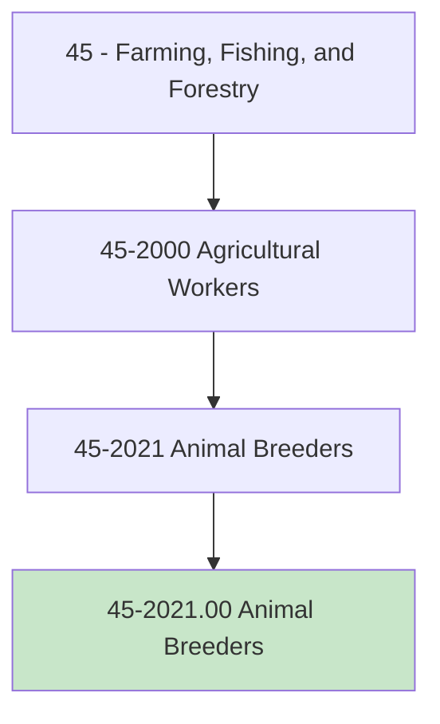
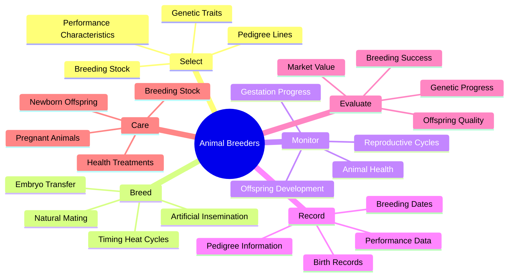
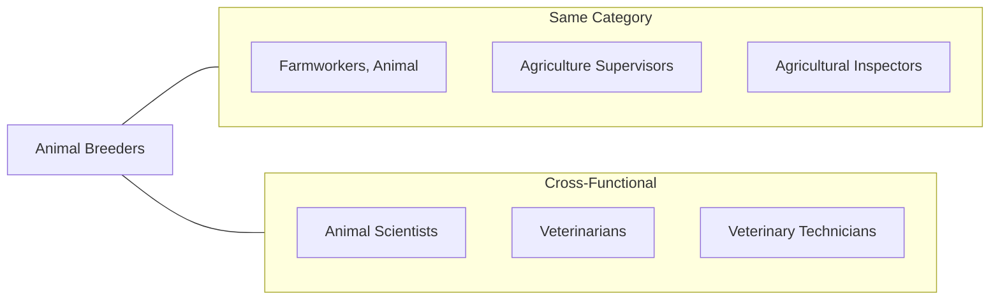
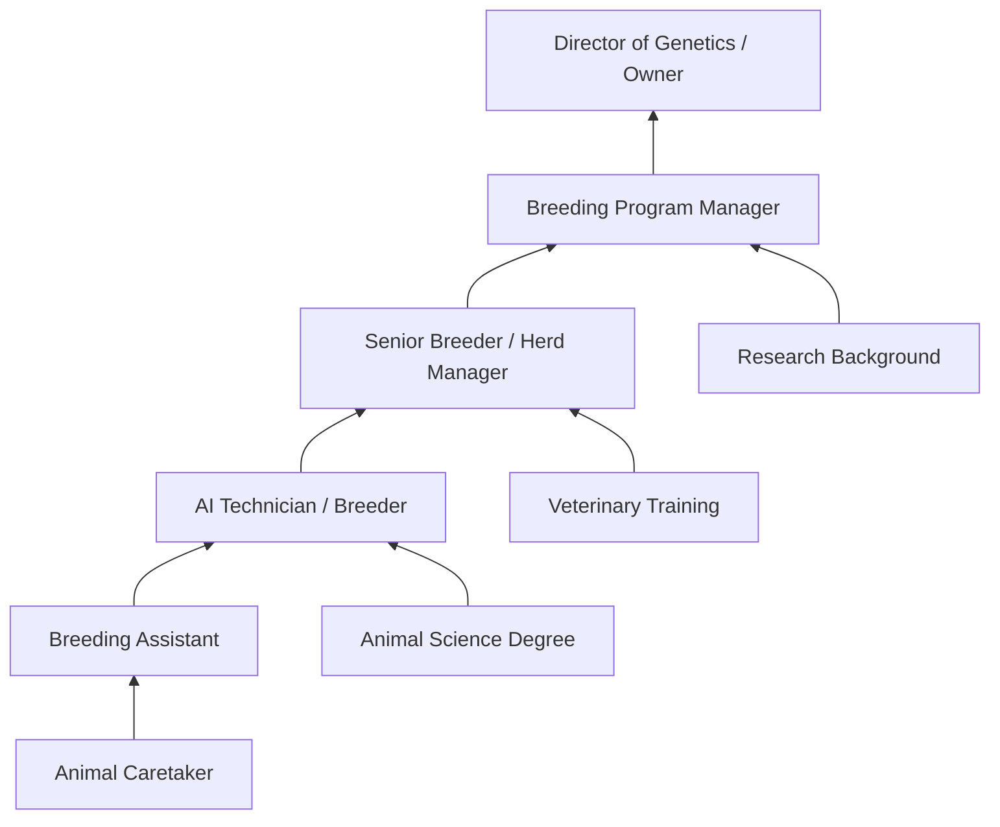

# Animal Breeders

> Select and breed animals according to their genealogy, characteristics, and offspring. May require knowledge of artificial insemination techniques and equipment use. May involve keeping records on heats, birth intervals, or pedigree.

## Overview

Animal Breeders are specialized agricultural professionals who select, mate, and manage animals to produce offspring with desired traits. They work with various species including cattle, horses, pigs, sheep, dogs, and poultry, using both traditional breeding methods and modern reproductive technologies such as artificial insemination. This occupation requires deep knowledge of genetics, animal behavior, reproductive physiology, and record-keeping practices. Animal Breeders play a crucial role in improving livestock quality, preserving rare breeds, and meeting market demands for specific animal characteristics.

## Classification Hierarchy

## Key Statistics

| Metric | Value |
|--------|-------|
| SOC Code | 45-2021.00 |
| Job Zone | 3 (Medium Preparation) |
| Category | [Farming, Fishing, and Forestry](/occupations/Agriculture) |
| Core Tasks | 15+ |
| Source | O*NET |

## Core Tasks

### select.BreedingStock

Animal Breeders evaluate and choose animals with desired genetic traits for breeding programs.

**Actions:**
- `select.BreedingStock.based.on.Genealogy.to.improve.Traits` - Choose animals with superior pedigree lines
- `select.Animals.for.Characteristics.to.meet.BreedingGoals` - Evaluate physical and performance traits
- `select.Pairs.for.Mating.to.maximize.GeneticPotential` - Match complementary breeding animals
- `select.Offspring.for.Retention.to.strengthen.Herd` - Identify promising young animals to keep

### breed.Animals

Animal Breeders manage the mating process using various techniques to achieve successful reproduction.

**Actions:**
- `breed.Animals.using.NaturalMating.to.produce.Offspring` - Facilitate direct mating between selected animals
- `breed.Animals.using.ArtificialInsemination.to.maximize.Genetics` - Apply AI techniques for superior sire access
- `breed.Animals.using.EmbryoTransfer.to.increase.Production` - Utilize advanced reproductive technologies
- `breed.Animals.at.OptimalTiming.to.ensure.Conception` - Monitor heat cycles and schedule breeding

### monitor.ReproductiveCycles

Animal Breeders track reproductive status and health of breeding animals.

**Actions:**
- `monitor.ReproductiveCycles.of.Animals.to.optimize.Breeding` - Track estrus and ovulation timing
- `monitor.GestationProgress.in.Females.to.ensure.Health` - Observe pregnant animals for complications
- `monitor.AnimalHealth.during.Breeding.to.prevent.Problems` - Watch for signs of illness or stress
- `monitor.OffspringDevelopment.to.assess.Quality` - Track growth and development of young animals

### record.BreedingData

Animal Breeders maintain detailed records of pedigrees, breeding activities, and outcomes.

**Actions:**
- `record.PedigreeInformation.for.Animals.to.document.Lineage` - Maintain genealogical databases
- `record.BreedingDates.and.Results.to.track.Performance` - Log mating events and conception rates
- `record.BirthRecords.with.Details.to.maintain.Accuracy` - Document deliveries and offspring characteristics
- `record.PerformanceData.of.Animals.to.evaluate.Progress` - Track production metrics and show results

### evaluate.BreedingOutcomes

Animal Breeders assess the success of breeding programs and offspring quality.

**Actions:**
- `evaluate.OffspringQuality.against.Standards.to.measure.Success` - Compare young animals to breed standards
- `evaluate.BreedingSuccess.rates.to.improve.Programs` - Analyze conception and birth rates
- `evaluate.GeneticProgress.over.Time.to.guide.Decisions` - Track trait improvement across generations
- `evaluate.MarketValue.of.Animals.to.optimize.Returns` - Assess commercial potential of offspring

## Skills & Competencies

### Technical Skills
- **Animal Genetics** - Expert
- **Reproductive Physiology** - Expert
- **Artificial Insemination** - Advanced
- **Animal Husbandry** - Advanced
- **Record Keeping** - Advanced
- **Health Assessment** - Proficient

### Soft Skills
- **Attention to Detail** - Critical
- **Patience** - Critical
- **Observation** - Essential
- **Problem Solving** - Essential
- **Physical Stamina** - Important

## Related Occupations

## Industries

- [Animal Production](/industries/AnimalProduction) - Highest Employment
- [Dairy Cattle and Milk Production](/industries/DairyProduction) - High Employment
- [Beef Cattle Ranching](/industries/BeefCattle) - High Employment
- [Horse and Equine Production](/industries/EquineProduction) - Moderate Employment
- [Hog and Pig Farming](/industries/HogFarming) - Moderate Employment

## Industry Variations

### Cattle Breeding
Focus on beef or dairy genetics, managing large herds with emphasis on production traits, calving ease, growth rates, and milk production. Often involves extensive AI programs and genetic testing.

### Horse Breeding
Specialization in specific breeds for racing, showing, or working purposes. Requires knowledge of bloodlines, conformation standards, and often advanced reproductive techniques including embryo transfer.

### Swine Breeding
Emphasis on lean meat production, litter size, and feed efficiency. Modern programs rely heavily on genetic indexing and AI, with strict biosecurity protocols.

### Poultry Breeding
Large-scale operations focused on egg production or meat bird genetics. Highly specialized with corporate breeding programs controlling most commercial stock.

### Companion Animal Breeding
Focus on dogs, cats, or other pets, emphasizing breed standards, health testing, and temperament. May involve showing animals and maintaining breed registrations.

### Rare Breed Conservation
Preservation of heritage or endangered breeds through careful genetic management. Requires balancing genetic diversity with breed purity.

## Career Progression

## Education & Training

| Requirement | Details |
|-------------|---------|
| Typical Education | High school diploma; some positions prefer associate's or bachelor's in animal science |
| Work Experience | 1-3 years working with animals, often starting as a farmworker |
| On-the-Job Training | Moderate to extensive - AI certification and breed-specific training |
| Common Certifications | AI Certification, Breed Registry Certifications, Embryo Transfer Training |

## Departments

This occupation typically works in:
- [Animal Production](/departments/AnimalProduction)
- [Breeding Operations](/departments/BreedingOperations)
- [Herd Management](/departments/HerdManagement)
- [Research and Development](/departments/ResearchDevelopment)

## Work Environment

- **Physical Demands**: Moderate to heavy physical activity; working with large animals
- **Work Setting**: Primarily outdoors or in barns; exposure to animals, weather, and odors
- **Schedule**: Variable hours including early mornings, evenings, and on-call for births
- **Safety Considerations**: Working with large animals poses injury risks

## Breeding Technologies

Modern Animal Breeders may utilize:

- **Artificial Insemination (AI)**: Depositing semen from selected sires
- **Embryo Transfer**: Flushing and transplanting embryos from superior dams
- **Genomic Testing**: DNA analysis to predict genetic merit
- **Estrus Synchronization**: Hormonal protocols to time breeding
- **Sexed Semen**: Sorting sperm to produce desired sex offspring
- **In Vitro Fertilization (IVF)**: Laboratory conception techniques

## Technology & Tools

- AI equipment (insemination guns, tanks, warmers)
- Ultrasound equipment for pregnancy detection
- Genetic testing kits and services
- Breeding management software
- Record keeping databases
- Heat detection devices and monitors

---

*Source: O*NET 45-2021.00 - ONETOccupation*
