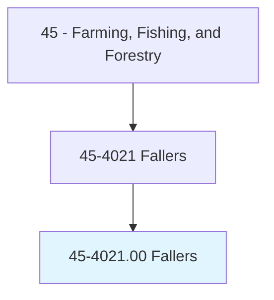
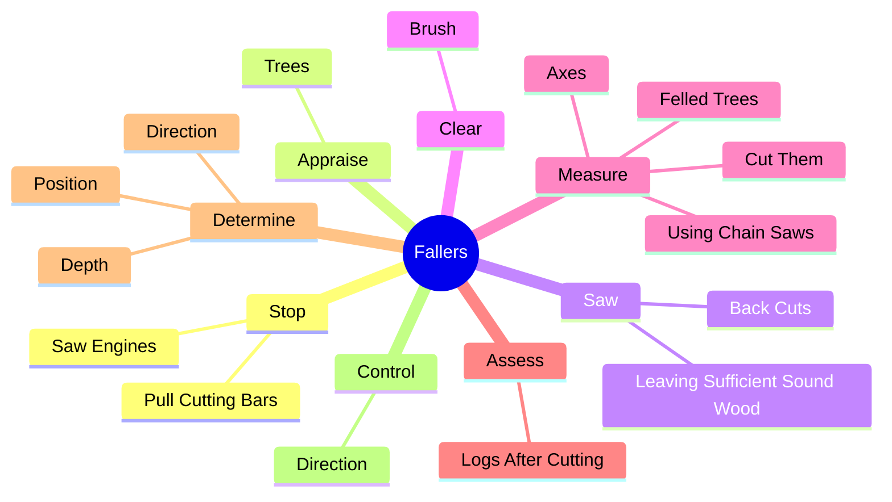
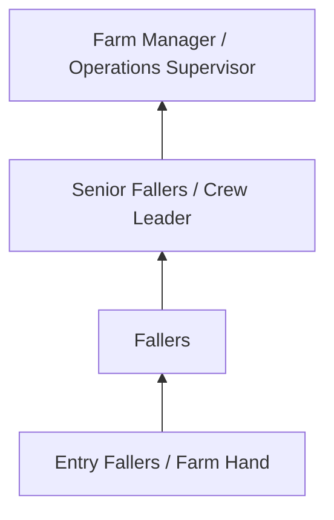
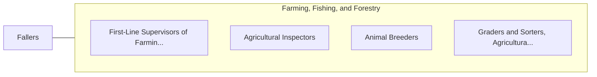

# Fallers

> Use axes or chainsaws to fell trees using knowledge of tree characteristics and cutting techniques to control direction of fall and minimize tree damage.

## Overview

Fallers professionals use axes or chainsaws to fell trees using knowledge of tree characteristics and cutting techniques to control direction of fall and minimize tree damage.. This occupation falls within the Farming, Fishing, and Forestry category and requires a combination of specialized knowledge, technical skills, and practical experience.

These professionals work across diverse settings and organizational contexts, applying their expertise to meet the demands of their field. They must stay current with industry standards, emerging practices, and regulatory requirements that affect their work. The role demands both independent judgment and collaborative skills, as practitioners regularly interact with colleagues, stakeholders, and the public.

As the field continues to evolve, Fallers professionals increasingly leverage technology and data-driven approaches to enhance their effectiveness. Career opportunities span the public and private sectors, with demand influenced by economic conditions, demographic shifts, and technological advancement.

## Classification Hierarchy



## Key Statistics

| Metric | Value |
|--------|-------|
| SOC Code | 45-4021.00 |
| Job Zone | N/A |
| Category | [Farming, Fishing, and Forestry](/occupations/Agriculture/index) |
| Core Tasks | 85+ |
| Salary Range | $28,000 - $60,000 |
| Median Salary | $38,000 |
| Growth Outlook | -2% (Decline) |
| Source | O*NET |

## Core Tasks



### determine.Position

Fallers determine position as part of their core responsibilities.

**Actions:**
- `determine.Position.of.CutsToBeMade` - Determine position, direction, and depth of cuts to be made, and placement of...
- `determine.Position.of.Placement.of.Wedges` - Determine position, direction, and depth of cuts to be made, and placement of...
- `determine.Position.of.Jacks` - Determine position, direction, and depth of cuts to be made, and placement of...
- `determine.Direction.of.CutsToBeMade` - Determine position, direction, and depth of cuts to be made, and placement of...
- `determine.Direction.of.Placement.of.Wedges` - Determine position, direction, and depth of cuts to be made, and placement of...

### load.Logs

Fallers load logs as part of their core responsibilities.

**Actions:**
- `load.Logs.onto.Trucks.by.HandLoadersWinches` - Load logs or wood onto trucks, trailers, or railroad cars, by hand or using l...
- `load.Logs.onto.Trucks.by.UsingLoadersWinches` - Load logs or wood onto trucks, trailers, or railroad cars, by hand or using l...
- `load.Wood.onto.Trucks.by.HandLoadersWinches` - Load logs or wood onto trucks, trailers, or railroad cars, by hand or using l...
- `load.Wood.onto.Trucks.by.UsingLoadersWinches` - Load logs or wood onto trucks, trailers, or railroad cars, by hand or using l...
- `load.Trailers.by.HandLoadersWinches` - Load logs or wood onto trucks, trailers, or railroad cars, by hand or using l...

### appraise.Trees

Fallers appraise trees as part of their core responsibilities.

**Actions:**
- `appraise.Trees.for.CertainCharacteristics` - Appraise trees for certain characteristics, such as twist, rot, and heavy lim...
- `appraise.Trees.for.Twist` - Appraise trees for certain characteristics, such as twist, rot, and heavy lim...
- `appraise.Trees.for.Rot` - Appraise trees for certain characteristics, such as twist, rot, and heavy lim...
- `appraise.Trees.for.HeavyLimbGrowth` - Appraise trees for certain characteristics, such as twist, rot, and heavy lim...
- `appraise.Trees.for.GaugeAmount` - Appraise trees for certain characteristics, such as twist, rot, and heavy lim...

### clear.Brush

Fallers clear brush as part of their core responsibilities.

**Actions:**
- `clear.Brush.from.WorkAreasRoutes` - Clear brush from work areas and escape routes, and cut saplings and other tre...
- `clear.Brush.from.EscapeRoutes` - Clear brush from work areas and escape routes, and cut saplings and other tre...
- `clear.Brush.from.CutSaplings` - Clear brush from work areas and escape routes, and cut saplings and other tre...
- `clear.Brush.from.OtherTrees.from.DirectionOfFalls` - Clear brush from work areas and escape routes, and cut saplings and other tre...
- `clear.Brush.from.UsingAxes` - Clear brush from work areas and escape routes, and cut saplings and other tre...


## Skills & Competencies

### Technical Skills
- **Agricultural Operations** - Advanced
- **Equipment Operation** - Advanced
- **Crop/Animal Management** - Advanced
- **Safety Procedures** - Advanced
- **Pest Management** - Proficient
- **Soil/Resource Management** - Proficient

### Soft Skills
- **Physical Stamina** - Critical
- **Problem Solving** - Essential
- **Adaptability** - Essential
- **Reliability** - Essential
- **Teamwork** - Important

## Education & Certifications

| Requirement | Details |
|-------------|---------|
| Typical Education | High school diploma; some positions require agricultural training |
| Work Experience | 0-2 years farming or forestry experience |
| On-the-Job Training | Moderate - equipment and safety training |
| Certifications | Pesticide applicator license, equipment operation certifications |

## Career Progression



## Industry Variations

### Crop Production
Field crop and specialty crop cultivation. Fallers professionals manage planting, cultivation, and harvesting operations.

### Livestock and Dairy
Animal husbandry and production management. Focus on animal health, breeding, and production efficiency.

### Forestry and Logging
Timber management and harvesting operations. Emphasis on sustainability, safety, and environmental compliance.

### Nursery and Greenhouse
Controlled environment production of ornamental plants and seedlings. Focus on plant health and customer specifications.

## Technology & Tools

- **GPS-guided equipment**
- **Precision agriculture software**
- **Irrigation control systems**
- **Soil testing equipment**
- **Farm management information systems**

## Related Occupations



## Industries

- [Crop Production](/industries/CropProduction) - High Employment
- [Animal Production](/industries/AnimalProduction) - High Employment
- [Forestry and Logging](/industries/Forestry) - Moderate Employment
- [Support Activities for Agriculture](/industries/AgricultureSupport) - Moderate Employment

## Departments

This occupation typically works in:
- [Farm Operations](/departments/FarmOperations)
- [Crop Management](/departments/CropManagement)
- [Equipment Operations](/departments/EquipmentOps)

## GraphDL Semantic Structure

```
Fallers perform:
- stop.SawEngines.from.Cuts
- stop.SawEngines.from.RunToSafetyAsTreeFalls
- stop.PullCuttingBars.from.Cuts
- stop.PullCuttingBars.from.RunToSafetyAsTreeFalls
- appraise.Trees.for.CertainCharacteristics
- appraise.Trees.for.Twist
```

---

*Source: O*NET 45-4021.00 - ONETOccupation*
