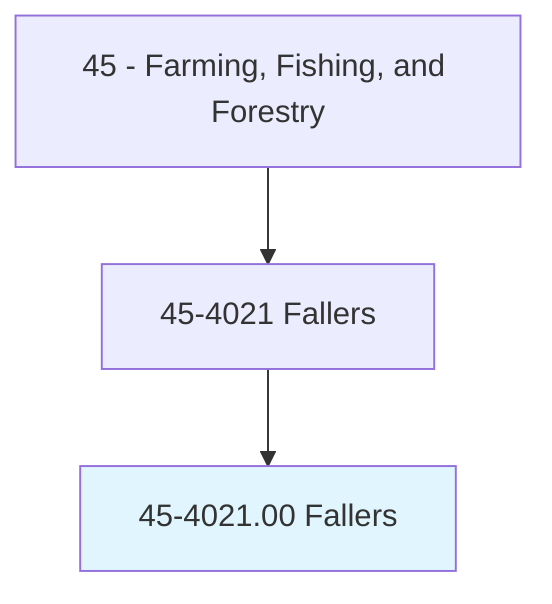
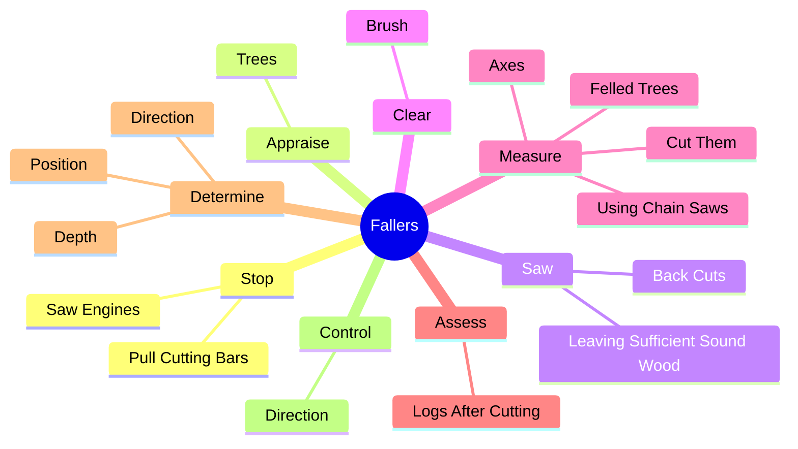
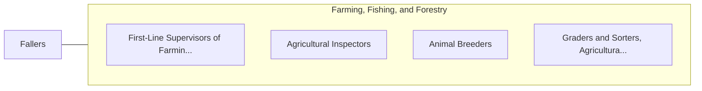

# Fallers

> Use axes or chainsaws to fell trees using knowledge of tree characteristics and cutting techniques to control direction of fall and minimize tree damage.

## Overview

Fallers is classified under Farming, Fishing, and Forestry (SOC 45). Use axes or chainsaws to fell trees using knowledge of tree characteristics and cutting techniques to control direction of fall and minimize tree damage.

## Classification Hierarchy

## Key Statistics

| Metric | Value |
|--------|-------|
| SOC Code | 45-4021.00 |
| Category | [Farming, Fishing, and Forestry](/occupations/Agriculture) |
| Task Count | 85 |
| Source | O*NET |

## Core Tasks

### stop.SawEngines

Fallers stop saw engines as part of their core responsibilities.

**Actions:**
- `stop.SawEngines.from.Cuts`
- `stop.SawEngines.from.RunToSafetyAsTreeFalls`
- `stop.PullCuttingBars.from.Cuts`
- `stop.PullCuttingBars.from.RunToSafetyAsTreeFalls`

### appraise.Trees

Fallers appraise trees as part of their core responsibilities.

**Actions:**
- `appraise.Trees.for.CertainCharacteristics`
- `appraise.Trees.for.Twist`
- `appraise.Trees.for.Rot`
- `appraise.Trees.for.HeavyLimbGrowth`

### saw.BackCuts

Fallers saw back cuts as part of their core responsibilities.

**Actions:**
- `saw.BackCuts.to.control.DirectionOfFall`
- `saw.LeavingSufficientSoundWood.to.control.DirectionOfFall`

## Skills & Competencies

### Technical Skills
- **Agricultural Operations** - Advanced
- **Equipment Operation** - Advanced
- **Resource Management** - Advanced

### Soft Skills
- **Communication** - Essential
- **Problem Solving** - Essential
- **Critical Thinking** - Important
- **Teamwork** - Important
- **Adaptability** - Important

## Related Occupations

## Industries

This occupation is found across multiple industries. See [Industries](/industries) for sector-specific employment data.

## Career Progression

---

*Source: O*NET 45-4021.00 - ONETOccupation*
